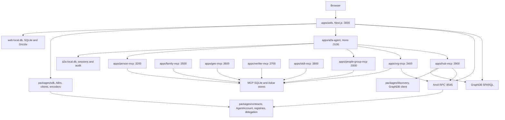
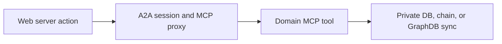

# System Map

This document is the high-level map for the services, libraries, data stores, and infrastructure used by the Smart Agent web app and backend services.

Use it as the entry point before opening the deeper architecture documents in this folder.

## Runtime Topology

## Service Responsibilities

| Area | Responsibility | Main code |
| --- | --- | --- |
| Web app | UI, server actions, API routes, auth, orchestration | `apps/web` |
| A2A agent | Agent-scoped routing, sessions, delegation package storage, MCP proxy | `apps/a2a-agent` |
| Person MCP | Private person data, SSI holder wallet, person-scoped tools | `apps/person-mcp` |
| Org MCP | Org-private data, rounds, proposals, pledge and org tools | `apps/org-mcp` |
| Hub MCP | Discovery reads, GraphDB sync, system-level knowledge tools | `apps/hub-mcp` |
| Other MCPs | Family, geo, verifier, skill, people group domain tools | `apps/*-mcp` |
| Contracts | ERC-4337 accounts, registries, delegation, caveat enforcers | `packages/contracts` |
| SDK | Contract ABIs, viem helpers, delegation encoders, predicate helpers | `packages/sdk` |
| Discovery | GraphDB client and SPARQL discovery service | `packages/discovery` |

## Canonical Runtime Ports

The local development topology is orchestrated by `scripts/fresh-start.sh`.

| Process | Port |
| --- | --- |
| Web | `3000` |
| A2A agent | `3100` |
| Person MCP | `3200` |
| People Group MCP | `3300` |
| Org MCP | `3400` |
| Family MCP | `3500` |
| Geo MCP | `3600` |
| Verifier MCP | `3700` |
| Skill MCP | `3800` |
| Hub MCP | `3900` |
| Anvil RPC | `8545` |

## Core Documents

| Document | What it covers |
| --- | --- |
| [Web, A2A, and MCP Flows](./01-web-a2a-mcp-flows.md) | How the web app reaches MCP tools through A2A |
| [Auth, Sessions, and Delegation](./02-auth-session-delegation.md) | Login, agent sessions, delegation packages, revocation |
| [On-Chain and Anvil Architecture](./03-onchain-anvil-contracts.md) | Local chain, contract suite, viem interaction paths |
| [Knowledge Graph and GraphDB](./04-graphdb-knowledge-sync.md) | Discovery reads, RDF projection, sync paths |
| [Persistence and Data Stores](./05-persistence-data-stores.md) | SQLite, Askar, GraphDB, chain state, source of truth |
| [Marketplace and Funding Architecture](./06-marketplace-funding-flow.md) | Intents, pools, rounds, proposals, votes, commitments, transfers |
| [Local Development Orchestration](./07-local-dev-orchestration.md) | Fresh start, deploy, seed, readiness, process topology |

## Guiding Rule

Prefer this path for user-authorized service work:

Direct web-to-chain and web-to-GraphDB paths still exist, but new person/org-specific interactions should move toward A2A-mediated MCP tools.
