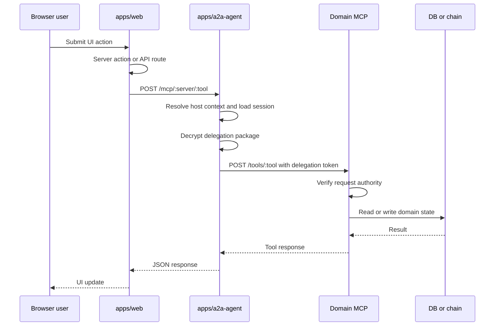
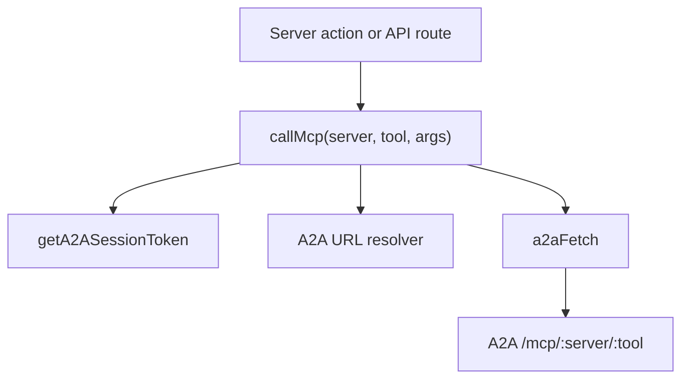
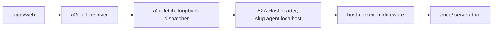
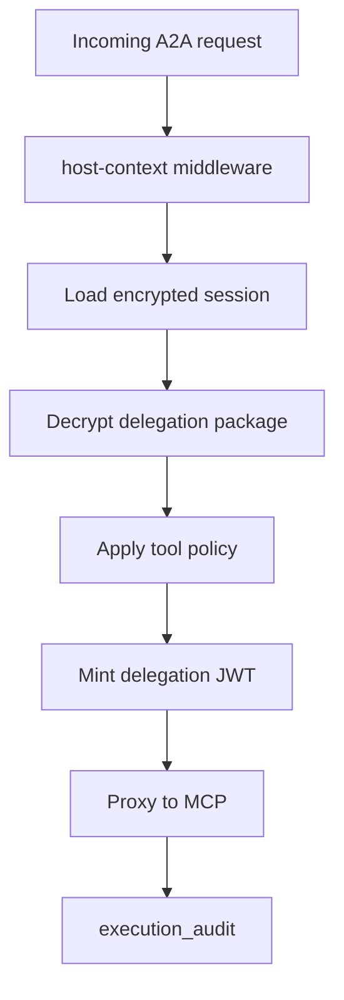
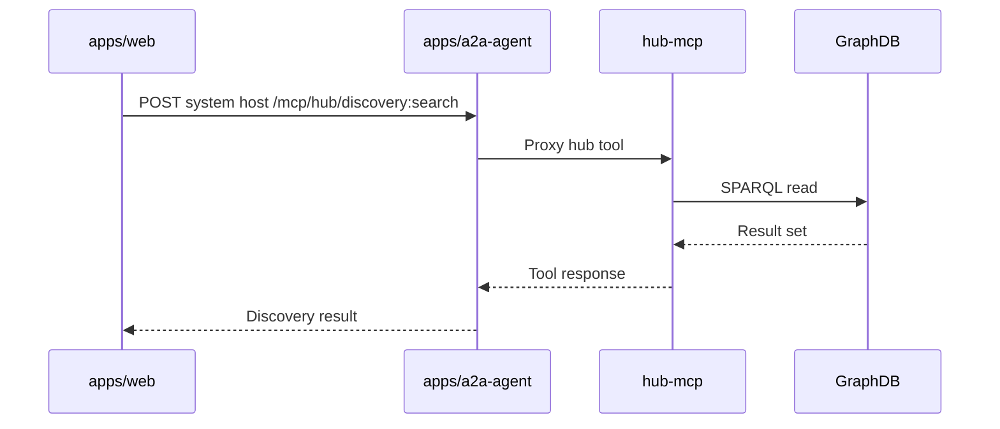
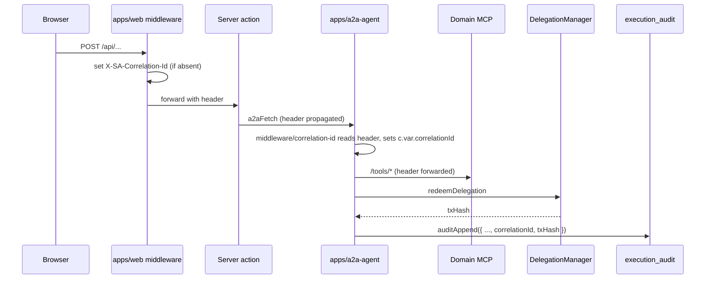

# Web, A2A, and MCP Flows

This document describes how the web app reaches backend tools. The preferred model is:

`Web server action -> A2A agent -> MCP tool -> domain store or chain`.

## Main Flow



## Web Side

Key files:

- `apps/web/src/lib/clients/mcp-client.ts`
- `apps/web/src/lib/clients/a2a-fetch.ts`
- `apps/web/src/lib/clients/a2a-url-resolver.ts`
- `apps/web/src/lib/clients/hub-client.ts`
- `apps/web/src/lib/actions/a2a-session.action.ts`

`callMcp` is the main application helper for user-authorized MCP calls.



## Agent-Scoped Host Routing

The web app can construct agent-scoped A2A hosts such as:

- `rich-pedersen.agent.localhost:3100`
- `system.agent.localhost:3100`

The local fetch layer resolves wildcard hostnames to loopback while preserving the `Host` header for the A2A service.



## A2A Side

Key files:

- `apps/a2a-agent/src/index.ts`
- `apps/a2a-agent/src/routes/mcp-proxy.ts`
- `apps/a2a-agent/src/routes/session.ts`
- `apps/a2a-agent/src/routes/auth.ts`
- `apps/a2a-agent/src/routes/delegation.ts`
- `apps/a2a-agent/src/routes/onchain-redeem.ts`
- `apps/a2a-agent/src/middleware/host-context.ts`
- `apps/a2a-agent/src/db/schema.ts`

The A2A agent is the session broker and MCP proxy. It stores encrypted session packages, mints or forwards delegation material, and routes to the correct MCP.



## MCP Target Map

| `callMcp` server | Target service | Typical responsibility |
| --- | --- | --- |
| `person` | `apps/person-mcp` | Private person data, credentials, wallet actions |
| `org` | `apps/org-mcp` | Org data, rounds, proposals, pledges |
| `people-group` | `apps/people-group-mcp` | Group membership and people group tools |
| `hub` | `apps/hub-mcp` | System discovery and GraphDB sync |

## Hub-MCP Exception

Hub MCP tools are often system-level reads or sync tools and may not require a user session in the same way person/org tools do.



## Known Direct Bypasses

Some flows still bypass A2A and should be treated as migration candidates unless they are explicitly system-level:

- Direct GraphDB and discovery reads from web code.
- Direct person-mcp session-store calls in `apps/web/src/lib/auth/person-mcp-session-client.ts`.
- Direct wallet-action dispatch calls in `apps/web/src/lib/wallet-action/dispatch.ts`.
- Direct chain writes and reads through `apps/web/src/lib/contracts.ts`.
- Readiness and boot scripts that intentionally call service health endpoints.

## Development Guidance

For new user-initiated person or organization work:

1. Add or reuse an MCP tool in the domain service.
2. Call it through `callMcp` from the web server action.
3. Let A2A handle session, host context, and delegation.
4. Keep direct web-to-service calls for bootstrapping, health checks, or explicit system-level exceptions only.

## KMS Substrate Allowlist

The app depends on the `A2AKeyProvider` interface in `packages/sdk/src/key-custody/types.ts`, not on any specific KMS backend. The substrate decision is contained to one provider file per backend.

Only these files may import a KMS-class cloud SDK:

- `packages/sdk/src/key-custody/aws-kms-provider.ts` — allowed to import `@aws-sdk/client-kms` and `@vercel/oidc-aws-credentials-provider`. K2 v1 envelope-encryption provider (symmetric `kms:GenerateDataKey` / `kms:Decrypt`) per `KMS-IMPLEMENTATION-PLAN.md` §3.2a.
- `packages/sdk/src/key-custody/aws-kms-signer.ts` — allowed to import `@aws-sdk/client-kms` and `@vercel/oidc-aws-credentials-provider`. K4 PR-2 asymmetric secp256k1 master-EOA signer (`kms:Sign` + `kms:GetPublicKey` against an `ECC_SECG_P256K1` CMK). SEPARATE KMS key + IAM permissions from the K2 envelope provider; same role / OIDC trust binding.
- `packages/sdk/src/key-custody/vault-transit-provider.ts` — the only file allowed to talk to Vault Transit (currently via plain `fetch()`; would be the only place a `node-vault` import could land if ever needed). K2-alt sibling per `KMS-IMPLEMENTATION-PLAN.md` §3.2b.
- `apps/a2a-agent/src/auth/vault-oidc-token-exchange.ts` — the only file in a2a-agent allowed to read `VERCEL_OIDC_TOKEN` directly for the Vault sibling path.

Route handlers under `apps/a2a-agent/src/routes/` MUST NOT import any KMS SDK directly. They go through `apps/a2a-agent/src/auth/encryption.ts` (envelope encrypt/decrypt) and `apps/a2a-agent/src/auth/a2a-signer.ts` (asymmetric sign), each of which holds the `A2AKeyProvider` / `KmsAccountBackend` reference. The invariant is enforced by `scripts/check-no-bypass.sh` — every backend SDK (AWS KMS, Vault, GCP KMS, Azure Key Vault) is equally forbidden in routes.

## Master EOA Signer (K4)

The production master EOA — the on-chain account that signs and pays gas for `EntryPoint.handleOps` — is backed by an AWS KMS asymmetric `ECC_SECG_P256K1` key in prod and by a hex-encoded private key in `A2A_MASTER_PRIVATE_KEY` in dev. Both surfaces ride the same `KmsAccountBackend` interface, exposed to viem call sites as a `LocalAccount` via `getMasterSigner()` in `apps/a2a-agent/src/auth/a2a-signer.ts`. On first call per process, that wrapper logs `[kms-signer] address=0x... keyId=...` so operators can verify against the address recorded at setup. The only `apps/a2a-agent` consumer is `routes/onchain-redeem.ts:1247`; downstream call sites get the master EOA exclusively through `getMasterSigner()`.

Setting up the production signer is a one-time AWS provisioning task: create the asymmetric CMK, configure the IAM role and key policy, derive the EVM address from the KMS public key via `scripts/kms-signer-address.ts`, pre-fund the address, then set `AWS_KMS_SIGNER_KEY_ID` in Vercel. Rotation is on-chain — `addOwner(new)` from the old key, soak, `removeOwner(old)` from the new key. Full operator runbook: [`docs/operations/kms-signer-setup.md`](../operations/kms-signer-setup.md).

## Deployer Key (K6 — CI/CD only)

The deployer private key — the EOA that runs `forge script Deploy.s.sol` to deploy every Smart Agent contract — is **CI/CD only**. In production it MUST NOT be present in the runtime environment of any service (web, a2a-agent, MCPs). The runbook in [`docs/operations/kms-signer-setup.md` § "Deployer key (K6 — CI/CD only)"](../operations/kms-signer-setup.md#deployer-key-k6--cicd-only) documents the recommended GitHub Actions OIDC → AWS Secrets Manager provisioning pattern; the runtime IAM role for K2/K4/K5 has no permission on the deployer-key Secret.

Two enforcement points keep this invariant honest:

1. **Runtime startup warning.** Both `apps/web/instrumentation.ts` and `apps/a2a-agent/src/index.ts` log `[K6 WARNING] DEPLOYER_PRIVATE_KEY is set in a production environment` at boot if the key is present under `NODE_ENV=production`. The warning does not throw — an operator who has not finished migration can still ship — but the log line surfaces unambiguously in deploy logs.

2. **CI invariant in `scripts/check-no-bypass.sh`.** A new check fails the build if any file under `apps/web/src/app/api/**/route.ts` or `apps/a2a-agent/src/routes/**` references `DEPLOYER_PRIVATE_KEY`, outside the explicit `K6_ROUTE_HANDLER_ALLOWLIST`. Allowlist entries carry a `TODO(K6-...)` comment naming the migration target (Category C user-session signer, or Category D `auth-bootstrap` tool-executor signer). Removing an allowlist entry requires migrating the call site.

The allowed contexts for `DEPLOYER_PRIVATE_KEY` references at this phase of migration are: `apps/web/src/lib/demo-seed/**`, `apps/web/src/lib/boot-seed.ts`, `scripts/**`, `packages/contracts/**`, and the four explicitly-allowlisted bootstrap-auth routes (`/api/auth/{siwe-verify,passkey-signup,google-callback,check-agent-name}` — the last is allowlisted because of a deferred dev-fallback path; in production it reads `DEPLOYER_ADDRESS` only). Local dev retains the key in `apps/web/.env` for the dev-relayer fallback; `scripts/deploy-local.sh` writes both `DEPLOYER_PRIVATE_KEY` and the production-correct `DEPLOYER_ADDRESS` so address-only consumers can read the address without the key.

## Audit Correlation (Hardening Phase 1D)

Every user-initiated action is threaded with a **cross-service correlation id** so an investigator can join the full web → a2a → mcp → chain trail on a single value. The id rides outside the signed MAC envelope as observability metadata — it carries no authority and isn't bound to any signature (the HMAC envelopes still hash `${ts}|${nonce}|${path}|sha256(body)}`).



Code references:

- `apps/web/src/middleware.ts` sets `x-sa-correlation-id` on every request the Next.js middleware sees.
- `apps/web/src/lib/audit/correlation-id.ts` exports `getCorrelationId(headers)` and `propagateCorrelationId(headers, id?)` for server actions / route handlers that need to thread the id explicitly.
- `apps/web/src/lib/clients/a2a-fetch.ts` ensures every outbound `a2aFetch` carries the header — if the caller doesn't set it, the helper synthesizes one.
- `apps/a2a-agent/src/middleware/correlation-id.ts` reads the inbound header (or generates one), exposes it on `c.var.correlationId`, and echoes it back on the response so client libraries can correlate replies.
- `apps/a2a-agent/src/lib/audit.ts` `auditAppend()` / `auditDeny()` persist the id into `execution_audit.correlation_id` for every row (success OR denial).

Lookup patterns:

- **From a user-facing error** → grep the correlation id in `a2a-agent.log`, then `SELECT * FROM execution_audit WHERE correlation_id = '...'` for the per-row trail.
- **From a chain incident** → `SELECT correlation_id FROM execution_audit WHERE tx_hash = '0x...'`, then join back to web logs.

### Denial-path audit parity (Hardening Phase 1D #2)

Every authority-bearing middleware that returns 4xx (auth failure, replay, signature mismatch, missing headers, etc.) writes a `status: 'denied'` row to `execution_audit` BEFORE returning the error. Repeated probes by an attacker show up in the table even when they never reach a route handler — historically these were invisible.

Middleware that participates: `requireInterServiceAuth`, `requireServiceAuth('web')`. Each calls `auditDeny(c, { route, reason, mcpServer?, sessionId? })` from `apps/a2a-agent/src/lib/audit.ts`. Route handlers under `apps/a2a-agent/src/routes/onchain-redeem.ts` audit their own deep denial paths (target/selector/value-cap rejections) via the existing `writeReceipt({ status: 'denied' })` helper, which now also carries the correlation id.

The Phase 1D test suites that lock this in:

- `apps/a2a-agent/test/audit-correlation.test.ts` — middleware behavior, header echo, audit row contents.
- `apps/a2a-agent/test/audit-deny-parity.test.ts` — for each major denial branch (missing headers, unknown service, bad signature, timestamp out of window, missing nonce, replay), assert a `status: 'denied'` row exists with the matching correlation id.

### Append-only invariant (Hardening Phase 1D #3)

`execution_audit` is append-only at the application layer. Writes go through two helpers in `apps/a2a-agent/src/lib/audit.ts`:

- `auditAppend(row)` — INSERT only. Every code path that writes an audit row calls this directly OR routes through `auditDeny()` (denial-path wrapper).
- `auditFinalize(rowId, { status, txHash?, userOpHash?, errorReason? })` — the **only** sanctioned UPDATE site. Flips a `pending` row to `completed` / `reverted` after a chain tx settles.

`DELETE` against `execution_audit` is never allowed in code. The CI guard in `scripts/check-no-bypass.sh` greps `apps/a2a-agent/src/` for `.update(executionAudit)` / `.delete(executionAudit)` and fails the build if any call site outside `lib/audit.ts` matches. Adding a new audit signal means writing a new row, never mutating an existing one.

The append-only posture is enforced at the **application** layer because SQLite can't express table-level grants. The production target is Postgres with a least-privilege role that has `INSERT` + `SELECT` only on `execution_audit`; the application invariant survives that migration unchanged.

### Error response policy (Sprint 1 S1.8)

Every authority-bearing endpoint follows the same two-channel pattern when a request is rejected:

- **HTTP response (production)**: a generic operator-friendly error string and the HTTP status — nothing else. No `_debug`, no `detail`, no inlined `err.message`. The caller should not be able to learn anything about internal cryptographic state, contract revert reasons, upstream URLs, or upstream schema fragments from the response body.
- **Server-side log**: the FULL structured diagnostic — `correlationId`, `errorCode`, `sessionId`, hashed account address, delegation hash, passkey count, credential digest, raw upstream error message, etc. Operators get everything they need to investigate; attackers get nothing.
- **HTTP response (non-production)**: the response body additionally carries the same structured diagnostic under `_debug` so engineers see it in the network tab. The `_debug` key is unconditionally stripped when `NODE_ENV === 'production'`.

The correlation id joins the user-visible error to the server log to the `execution_audit` row, so an operator chasing a complaint can pivot from "user got a 401 at 14:32 UTC" → log line → audit row → chain tx without exposing any of those joins to the caller.

Implemented via two helpers — `apps/a2a-agent/src/lib/error-response.ts` (Hono) and `apps/web/src/lib/auth/error-response.ts` (Next.js). The leak surfaces refactored in this sprint were `/session/package` (ERC-1271 reject path), `/api/auth/session-grant/{start,finalize}`, `/api/auth/passkey-{verify,signup}`, `/api/auth/check-agent-name`, `/api/auth/google-{start,callback}`, `/api/a2a/{bootstrap/client,profile,delegated-profile}`, and `/api/messages/[id]`. New authority-bearing routes MUST use the helper rather than inlining `(err as Error).message` into the response body. Out of scope: `apps/a2a-agent/src/routes/onchain-redeem.ts` is reachable only by HMAC-signed inter-service auth from `apps/web`, not from the public internet — those error responses are not user-visible and stay as-is.

Tests: `apps/a2a-agent/test/error-response.test.ts` — asserts production responses strip `_debug`, dev responses include it, log lines are always emitted, correlation id flows through, status codes pass through, and a `/session/package`-shaped rejection body contains none of `clientDataJSON` / `credentialDigest` / `delegationHash` / `passkeyPath` / `passkeyCount`.

### Startup invariants (Sprint 1 W2.2)

Two new boot-time gates in `apps/a2a-agent/src/config.ts` and `apps/a2a-agent/src/middleware/require-session.ts` close a senior-review-flagged ambiguity in env-var ownership and a legacy auth fallback that survived the SessionGrant migration.

**S1.3 — `A2A_SESSION_SECRET` is now conditional on the KMS backend.** The env-resident master secret is the input keying material for the `local-aes` HKDF derivation; AWS KMS does not need it. Rules enforced at module-load:

- `A2A_KMS_BACKEND=local-aes` → `A2A_SESSION_SECRET` REQUIRED, ≥32 bytes hex (64 hex chars). Missing or short value throws with a clean operator-facing error.
- `A2A_KMS_BACKEND=aws-kms` + `NODE_ENV=production` → `A2A_SESSION_SECRET` MUST NOT be set. Process refuses to boot. The reasoning: an unused env-resident master secret in a prod environment adds a forensics liability ("could the env secret have leaked too?") with no operational value.
- `A2A_KMS_BACKEND=aws-kms` + non-prod → `A2A_SESSION_SECRET` tolerated but ignored; `config.ts` logs `[config] A2A_SESSION_SECRET is set but unused` so a developer who switched backends notices the leftover.

**S1.6 — `ALLOW_LEGACY_A2A_SESSIONS` controls the legacy session-table fallback (Path B — legacy decrypt-and-sign).** `apps/a2a-agent/src/middleware/require-session.ts` has two paths: Path A (SessionGrant.v1 lookup on person-mcp) and Path B (legacy a2a `sessions` table whose rows the agent decrypts and signs with the per-session key). Path B held rows from demo-login and other pre-migration paths that minted A2A sessions without going through the SessionGrant ceremony — those paths should not exist in production. The canonical posture is:

- **Env var**: `ALLOW_LEGACY_A2A_SESSIONS`.
- **Default in dev** (`NODE_ENV !== 'production'`): `true`. Path B fires for legacy session bearers — required for the demo-login + delegation-bootstrapped flow during migration.
- **Default in prod** (`NODE_ENV === 'production'`): `false`. Path B is rejected with a 401 and an `audit-deny` row tagged `legacy-session-fallback-disabled`. Path A is unaffected. Path B is *only* refused when BOTH `NODE_ENV === 'production'` AND `ALLOW_LEGACY_A2A_SESSIONS !== 'true'` — either condition alone is not sufficient.
- **Operator break-glass**: setting `ALLOW_LEGACY_A2A_SESSIONS=true` in production explicitly restores Path B for incident response or staged migration. The override surfaces in the boot-log "startup posture" line; it does NOT currently emit a startup audit row (unlike the deployer-key break-glass via `ALLOW_RUNTIME_DEPLOYER_KEY_UNTIL`, which writes `system:break-glass-deployer-key` via `assertDeployerKeyPolicy`). A symmetric `system:break-glass-legacy-a2a-sessions` startup audit row is planned (Sprint 5 W3 follow-up); until it ships, the only audit signal is the `audit-deny` row written when Path B is *refused*, not when it is permitted. Operators relying on the override must remove the env var before the next compliance window.
- **Garbage values** (`ALLOW_LEGACY_A2A_SESSIONS=maybe`) throw at startup rather than silently defaulting.

**Boot-log line.** `apps/a2a-agent/src/index.ts` prints one summary line per startup so an operator can confirm the posture at a glance:

```
  startup posture: NODE_ENV=production A2A_KMS_BACKEND=aws-kms ALLOW_LEGACY_A2A_SESSIONS=false
```

Tests: `apps/a2a-agent/test/config-invariants.test.ts` (11 cases covering every branch of `validateSessionSecret` + `validateAllowLegacySessions`) and `apps/a2a-agent/test/legacy-session-kill.test.ts` (4 cases — dev allows Path B, prod blocks + audits, prod explicit opt-in restores Path B, Path A always works regardless of the flag).

### Person-mcp inbound service-auth (Sprint 1 W2.1)

Before this sprint, only the **web → a2a-agent** edge was authenticated at the wire. The **a2a-agent → person-mcp** downstream hop was a plain HTTP passthrough — if person-mcp's port (3200) ever became reachable beyond localhost (misconfigured proxy, exposed dev box, ssh-tunneled debug session), a compromised peer could mint sessions, append fake audit entries, bump revocation epochs, or invoke `/wallet-action/dispatch` with a forged action. Person-mcp's own verifier (`verifyDelegatedWalletAction`) was the sole authority gate; the cryptographic WalletAction signature would still reject most attacks, but the `/session-store/insert` route was guarded only by the passkey re-verify (Stream B Task B3) — a probing attacker could still rate-limit-bomb / metadata-grep the surface.

The two-hop pattern now is:

```
Browser → web (Next.js)
   │  signed envelope: WEB_TO_A2A_HMAC_KEY (web-to-a2a MAC key id)
   ▼
web → a2a-agent  ◄── requireServiceAuth('web')      verifies inbound
   │
   │  a2a-agent re-signs OUTBOUND with A2A_INTERSERVICE_HMAC_KEY_PERSON
   │  (a2a-to-person MAC key id), same envelope shape, fresh nonce/ts
   ▼
a2a-agent → person-mcp  ◄── requireInboundServiceAuth(['a2a-agent'])
```

Both envelopes share the canonical format `${ts}|${nonce}|${path}|${sha256(body)}` — identical to web→a2a so the wire shape is uniform. The `a2a-to-person` MAC key was already provisioned in K3-ext for the *reverse* direction (person-mcp → a2a-agent on `/session/:id/redeem-tx`). HMAC is symmetric, so the same shared secret authenticates the new direction too — no new key material, no new env var, no new IAM resource.

**Files**:
- `apps/person-mcp/src/auth/require-inbound-service-auth.ts` — inbound verifier middleware. Reads `X-SA-Service` / `X-SA-Timestamp` / `X-SA-Nonce` / `X-SA-Signature`, enforces ±60s clock skew, verifies the MAC via `buildMcpMacProvider('person', env)`, records the nonce, and attaches `c.var.inboundService` on success.
- `apps/person-mcp/src/auth/replay-nonce.ts` — person-mcp-side replay-nonce cache (`inter_service_nonce` SQLite table). Same shape and 5-minute GC interval as a2a-agent's table.
- `apps/person-mcp/src/lib/audit.ts` — `auditDeny()` helper that writes a `decision: 'denied'` row to person-mcp's existing `audit_log` table (the prevEntryHash-chained ledger) for every reject path. Correlation id (`X-SA-Correlation-Id`) and caller service are packed into the reason string.
- `apps/a2a-agent/src/auth/sign-outbound.ts` — outbound signer. `buildOutboundAuthHeaders(macKeyId, path, bodyRaw)` returns the four envelope headers a2a-agent attaches to every forwarded request.
- `apps/a2a-agent/src/routes/session-store.ts` and `routes/wallet-action.ts` — passthroughs updated to re-sign every forwarded request (both reads and writes). `routes/mcp-proxy.ts` re-signs `/tools/:tool` calls to person-mcp; org-mcp / people-group-mcp continue unsigned until they adopt the same inbound verifier (`macKeyId: null` in `SERVERS`).

**Protected surfaces on person-mcp**:
- `POST /session-store/insert` — was 200 to anyone reaching the port; now 401 without envelope.
- `POST /session-store/revoke`, `POST /session-store/bump-epoch`
- `GET /session-store/epoch/:account`, `GET /session-store/by-cookie/:cookieValue`, `GET /session-store/active/:account` (read endpoints also gated — they leak session metadata).
- `POST /audit/append`, `GET /audit/log/:account`
- `POST /wallet-action/verify`, `POST /wallet-action/dispatch`
- `POST /tools/:toolName` (every MCP tool invocation; `GET /tools` listing and `/health` stay open as operator-debug surfaces).

**Out of scope**: SSI protocol routes (`/wallet/*`, `/credentials/*`, `/proofs/*`, `/oid4vp/*`, `/.well-known/ssi-wallet.json`) stay open by design — they implement open W3C standards (OID4VCI, OID4VP, AnonCreds) and must be reachable from external counterparties without prior key exchange. Operator rate-limits the public ingress for those.

**Phase 1D audit-deny parity**: every `DelegatedActionDenied` catch in `apps/person-mcp/src/auth/wallet-action-routes.ts::POST /wallet-action/verify` and `apps/person-mcp/src/auth/dispatch-routes.ts::POST /wallet-action/dispatch` now writes a `decision: 'denied'` row before returning 403, mirroring the parity sweep a2a-agent's middleware got in Phase 1D #2. A probing attacker hitting either route with a forged action leaves a trail.

**Sprint 2 S2.1 — action-counter + per-minute rate enforcement.** `SessionGrant.v1` has long declared `scope.maxActions` (total) and `scope.maxActionsPerMinute` (sliding 60-second window) but the WalletAction verifier ignored both fields — a compromised session could replay actions up to the TTL ceiling with no rate cap. After S2.1 the verifier enforces both inside `verifyDelegatedWalletAction` (step 11b, between replay-nonce burn and audit-allow write):

- Per-session row in `session_action_count` (`session_id` PK; `total_actions: INTEGER`; `recent_timestamps: TEXT` JSON array trimmed to the live window; `updated_at_ms`). Row is created lazily on the first consume — a missing row means count 0.
- Check-and-increment runs inside a `better-sqlite3` synchronous transaction (`consumeAction()` in `apps/person-mcp/src/session-store/index.ts`). Concurrent verifies for the same session serialize on the sqlite write lock so the second sees the first's increment before deciding; there is no TOCTOU window inside a single process.
- Denial path throws `DelegatedActionDenied` with code `action-cap-exceeded` (total tripped) or `rate-cap-exceeded` (window tripped). The same `auditDeny` plumbing introduced in Phase 1D writes a `decision: 'denied'` row to `audit_log` before the route returns 403.
- Defense-in-depth defaults (`config.sessionDefaultMaxActions` / `sessionDefaultMaxActionsPerMinute`) are applied when the minted grant omits either field. Defaults are 1000 total / 60 per minute, env-overridable via `SESSION_DEFAULT_MAX_ACTIONS` and `SESSION_DEFAULT_MAX_ACTIONS_PER_MINUTE` for operators who want a tighter posture per environment.
- Multi-instance state sharing (Sprint 3 SQLite → Postgres) is intentionally out of scope; the current implementation is correct within a single person-mcp process.

Tests: `apps/person-mcp/test/require-inbound-service-auth.test.ts` (7 cases — missing headers, unknown service, stale timestamp, bad signature, replay nonce, valid signature, canonical-string format lockdown), `apps/person-mcp/test/wallet-action-audit-deny.test.ts` (4 cases — `verify` deny path writes audit row, `dispatch` deny path writes audit row carrying actionId/actionType, unauthenticated `/wallet-action/dispatch` 401 at the wire, unauthenticated `/session-store/insert` 401 at the wire), and `apps/person-mcp/test/action-counter.test.ts` (9 cases — lazy-row first-action, missing-row idempotent read, `maxActions=2` deny, `maxActionsPerMinute=5` deny, 60s window reset while total persists, parallel-consume race, default-values applied when grant omits the fields, audit-deny row written on counter denial, per-grant cap wins over default). Manual smoke: `curl POST http://localhost:3200/session-store/insert` returns 401 (was 200 before W2.1).

### Route classification (Sprint 2 S2.7)

The Next.js middleware (`apps/web/src/middleware.ts`) explicitly **passes every `/api/*` path through** without checking auth — every API route handler is expected to mint or check its own auth. That makes route auth coverage per-handler with no single chokepoint a reviewer can read to answer "which routes need a session, which are dev-only, which are unauthenticated by design?".

S2.7 closes that gap by making the answer **executable** via three artifacts:

- **`docs/architecture/api-route-inventory.md`** — generated markdown table grouped by classification (public / web-auth / bootstrap / service-only / admin-only / dev-only). One row per exported HTTP method. Source links resolve to the handler file. Regenerated by `pnpm generate:route-inventory`.
- **`scripts/lib/route-classification-parser.ts`** — shared parser. Walks every `apps/web/src/app/api/**/route.ts`, finds each exported `GET`/`POST`/… handler, reads its preceding JSDoc, and validates the `@sa-*` tag set against the allowed enum. Returns either `{ ok, record }` or `{ ok: false, errors }`.
- **`scripts/check-route-classification.ts`** — CI lint. Exit 1 if any handler lacks a valid classification block. Wired as `pnpm check:route-classification` and into `pnpm check:all` alongside `check:bypass` and the drift-check (`pnpm check:route-inventory`).

#### Tag set (source of truth: `output/tester-guardrails-framework.md`)

```ts
/**
 * @sa-route        public | web-auth | service-only | admin-only |
 *                  dev-only | bootstrap                          REQUIRED
 * @sa-auth         none | session-cookie | grant-cookie |
 *                  service-hmac | kms-token | none-with-csrf     REQUIRED
 * @sa-rate-limit   <N>/<window>   e.g. "10/min"                  optional
 * @sa-audit-event  <event-name>                                  optional
 * @sa-risk-tier    low | medium | high | sensitive               optional
 * @sa-owner        <team-or-person>                              optional
 * @sa-prod-gate    <function-name>   REQUIRED when @sa-route=dev-only
 */
```

The block may sit either immediately above an exported handler or at the very top of the file (file-level block applies to every handler in the file that lacks its own).

#### How to add a new route

1. Create `apps/web/src/app/api/<name>/route.ts` with the handler(s) for the methods you need.
2. Add the JSDoc block. If unsure, use `@sa-route web-auth @sa-auth session-cookie` (the most common shape) — that means "this is reachable by browsers with a logged-in session cookie".
3. Run `pnpm check:route-classification` locally — it must pass.
4. Run `pnpm generate:route-inventory` and commit the resulting `docs/architecture/api-route-inventory.md` diff. CI fails (`pnpm check:route-inventory`) if the inventory drifts from what the parser would emit.

For `dev-only` routes, the JSDoc must include `@sa-prod-gate <fn>` naming the production-404 guard (canonical: `requireDev` from `@/lib/env-guard`). The lint enforces presence of the tag; the existing `apps/web/src/lib/__tests__/env-guard.test.ts` covers `requireDev()`'s behavior.

#### Initial inventory (S2.7 landed)

The first full sweep classified **79 route handlers across 67 files**:

- 3 public (system-readiness, naming check, agent-name check)
- 9 bootstrap (passkey + SIWE + grant + google OAuth challenge/verify endpoints — all rate-limited via middleware or per-route)
- 58 web-auth (everything browser-facing that requires a session cookie)
- 9 dev-only (boot-seed, demo-login, dev-membership-check, dev-patch-hannah, explorer/edit, ontology-sync/turtle, test/geo-trust-e2e — return 404 in prod via `requireDev()`)
- 0 service-only / admin-only — these classifications exist in the enum for future HMAC-envelope and operator-JWT routes; today no `/api/*` route is HMAC-gated (service auth lives on a2a-agent + person-mcp surfaces, not web).

Tests: `scripts/lib/__tests__/route-classification-parser.test.ts` (16 cases covering happy path, every error path, and the validator's enum exposure); `scripts/__tests__/check-route-classification.test.ts` (3 cases driving the lint against good/bad fixture trees under `scripts/__tests__/route-classification-fixtures/`).

#### Known follow-ups (not S2.7 scope)

- `apps/web/src/app/api/agents/governance/route.ts` — currently has **no caller auth** on its POST handler (it calls `walletClient.writeContract` with the server signer). Classified `web-auth session-cookie risk-tier:high` to flag the gap; needs a `canManageAgent()` check added before it can be considered safely authenticated. **Track as Sprint 3 follow-up.**
- `apps/web/src/app/api/test/geo-trust-e2e/route.ts` — gates prod via raw `process.env.NODE_ENV === 'production'` instead of `requireDev()`. Functionally equivalent in default config but does not honor the `SMART_AGENT_ENV=dev` override the way `requireDev()` does; sweep into the `requireDev()` helper in a follow-up.
- a2a-agent and MCP routes are out of S2.7 scope — they use a different classification model (host-context-exempt vs session-required). Sprint 3 should extend the parser to walk Hono route definitions in `apps/a2a-agent/src/routes/**.ts` and emit the same inventory rows.

### Cross-delegation binding (Sprint 2 S2.3)

Person-mcp's cross-delegation verifier
(`apps/person-mcp/src/auth/verify-delegation.ts::verifyCrossDelegation`)
previously had a binding gap: it did NOT assert that the caller's
session smart-account matched the cross-delegation's `delegate`. The
codebase comment explicitly said:

> The A2A agent ensures the correct cross-delegation is paired with
> the correct session.

The senior review asked: **where is that guaranteed?** A bug in A2A
pairing would have become a cross-principal data-access vulnerability.

#### What changed

The fix is **Option C — in-caveat dual-address binding**, layered with
**Option A — chain-side resolution sanity check** as defense in depth.
Both were on the table; Option C is cryptographic (the data owner's
EIP-712 signature commits to both addresses) while Option A doesn't
need any new sign-time wiring but is one chain read per verify.

**Option C is authoritative.** When a data owner signs a
cross-delegation, they include a new `DelegateBinding` caveat whose
terms commit to BOTH addresses of the recipient:

```
DelegateBinding.terms = abi.encode(
    address delegateSmartAccount,  // the signer the SESSION delegation uses (ERC-1271)
    address delegatePersonAgent    // the on-chain graph identity used in relationship edges
)
```

Because the caveat is part of the delegation's `caveatsHash`, the data
owner's signature covers both addresses. The recipient cannot rebind to
a different smart-account / person-agent without breaking ERC-1271.

**Option A is defense in depth.** After the binding caveat is decoded,
person-mcp also resolves `smart-account → person-agent` via the
on-chain `AgentAccountResolver` (caller's session smart-account →
PersonAgent registry) and asserts the chain-side answer equals the
in-caveat `delegatePersonAgent`. A divergence (registry corruption,
stale caveat) is a hard reject. When `AGENT_ACCOUNT_RESOLVER_ADDRESS`
is unset, the verifier logs and skips Option A — Option C remains
the authoritative gate.

#### What the verifier asserts

For every cross-delegation `verifyCrossDelegation()` now enforces, in
order, BEFORE any chain read:

1. `delegateSmartAccount === callerPrincipal`
   (the session token's recovered principal — i.e. the caller's
   smart-account). If they disagree the request is rejected with
   `Cross-delegation binding mismatch — caller smart-account is not
   the bound delegate` and an `action_type=cross-delegation:verify`
   audit-deny row is written.
2. `delegatePersonAgent === resolvePersonAgentForSmartAccount(callerPrincipal)`
   when the resolver is configured. Mismatch rejects with
   `Cross-delegation binding mismatch — chain-resolved person-agent
   disagrees with bound person-agent`.

Both checks run before the existing revocation + ERC-1271 +
caveat-enforcement steps. The legacy reject paths (revocation,
ERC-1271) are unchanged.

#### Files touched

- `packages/sdk/src/delegation.ts` — adds `DELEGATE_BINDING_ENFORCER`
  sentinel address, `encodeDelegateBindingTerms` /
  `decodeDelegateBindingTerms`, and `buildDelegateBindingCaveat()`.
- `packages/sdk/src/policy/caveat-evaluator.ts` — registers the new
  enforcer in the fail-closed dispatcher so the standard verifier
  recognizes it as a known caveat (the cross-delegation verifier owns
  the actual binding semantics).
- `packages/sdk/src/index.ts` — re-exports the new helpers + the
  `DelegateBindingTerms` type.
- `apps/person-mcp/src/auth/resolve-person-agent.ts` (new) — in-memory
  60s-TTL cache wrapping the `AgentAccountResolver` walk
  (`getCore` fast-path → `agentCount` + `getAgentAt` + `getCore` +
  `getMultiAddressProperty(ATL_CONTROLLER)` fallback). Exposes test
  helpers for cache reset + read-count stats.
- `apps/person-mcp/src/auth/verify-delegation.ts` — implements the
  binding check, removes the "A2A agent ensures the correct
  cross-delegation is paired with the correct session" comment, and
  writes audit-deny rows on every reject path.
- Seed flows in `apps/web/src/lib/demo-seed/seed-coaching-delegations.ts`,
  `apps/web/src/lib/demo-seed/seed-mcp-data.ts::seedPrivateCoaching`,
  `apps/web/src/lib/demo-seed/seed-org-delegations.ts`, and
  `apps/web/src/lib/demo-seed/seed-catalyst-onchain.ts::buildSignedDelegation`
  — emit the binding caveat on every new cross-delegation.

#### Migration / compatibility

The user has no production state. After `./scripts/fresh-start.sh`,
all cross-delegations carry the `DelegateBinding` caveat and the
verifier is in strict mode.

For dev environments that may have legacy `.env`-pinned cross-delegations
issued before this PR, the env flag `ACCEPT_LEGACY_CROSS_DELEGATIONS=true`
re-enables the pre-S2.3 behavior (no binding caveat required) with a
one-cycle compat warning. The flag is force-`false` when
`NODE_ENV=production`.

Tests: `apps/person-mcp/test/cross-delegation-binding.test.ts` (6 cases —
happy path, smart-account mismatch, legacy-missing-binding reject +
compat-flag accept, EIP-712 hash inclusion proof, audit-deny row
emission, resolver cache hit/miss behavior).

## Supply-chain CI (Sprint 3 S3.5)

The web/A2A/MCP flows are protected at the CI boundary by a set of
GitHub Actions workflows that gate every PR. These are operational
guardrails — they catch regressions in the supply chain without
relying on manual review.

| Workflow                | Purpose                                              |
|-------------------------|------------------------------------------------------|
| `.github/workflows/ci.yml`                 | typecheck + test + `check:all` + forge test |
| `.github/workflows/pnpm-audit.yml`         | npm advisory DB; fail on HIGH/CRITICAL      |
| `.github/workflows/codeql.yml`             | CodeQL TS+JS with security-extended         |
| `.github/workflows/secret-scan.yml`        | gitleaks on the PR diff                     |
| `.github/workflows/dependency-review.yml`  | new-dep license + vuln gate                 |
| `.github/workflows/contracts-static.yml`   | Slither against `packages/contracts`       |

Detector tuning for Slither: `packages/contracts/.slither.json`
(skipped detectors are inline-documented).

Local pre-commit hook: `.github/hooks/pre-commit` (opt-in via
`git config core.hooksPath .github/hooks`).

Full runbook with failure modes + branch-protection setup:
`docs/operations/ci-setup.md`.

The supply-chain workflows protect the boundary on the way *in* (PR
gate); the in-flow trust checks documented in the rest of this file
protect the boundary on the way *through* (delegation binding,
ERC-1271, caveat enforcement).

## Request validation (Sprint 3 S3.4)

Every state-changing API route under `apps/web/src/app/api/**` is
gated by a single chokepoint that enforces three invariants before
any handler logic runs:

1. **Body size limit.** Next.js's default request body cap (1 MiB) is
   too permissive for routes that accept a handful of fields. The
   helper `validateRequest()` reads up to `maxBytes` from the stream
   and rejects with **413 Request body too large** if the wire ever
   exceeds it. The cap is enforced against actually-streamed bytes,
   not the (untrusted) `Content-Length` header, so a malicious caller
   can't lie about size. Two sizes apply:
   - `DEFAULT_BODY_LIMIT_BYTES` = 64 KiB — every normal JSON form.
   - `DELEGATION_BODY_LIMIT_BYTES` = 1 MiB — routes that carry a
     `SessionGrant`, a WebAuthn assertion, or a delegation packet
     (`/api/auth/session-grant/finalize`, `/api/auth/passkey-verify`,
     `/api/a2a/bootstrap/complete`).
2. **Shape validation.** Every route declares a Zod schema and runs
   it via `validateRequest`. On rejection the helper returns a
   **generic 400 `Invalid request body`** — Zod issue paths/messages
   are logged server-side but **never** in the HTTP response. This
   is the S1.8 invariant (no schema/field leak in error bodies).
3. **Generic 400 for malformed JSON.** Bad UTF-8 or invalid JSON
   returns the same 400 body as a schema rejection, so probing for
   shape gives no signal.

The helper lives at
[`apps/web/src/lib/auth/validate-request.ts`](../../apps/web/src/lib/auth/validate-request.ts).
Its tests pin the three invariants:
[`src/lib/auth/__tests__/validate-request.test.ts`](../../apps/web/src/lib/auth/__tests__/validate-request.test.ts).

### Route-handler contract

Every route handler that exports `POST`, `PUT`, `PATCH`, or `DELETE`
MUST carry an `@sa-validation` JSDoc tag declaring one of:

- `zod` — handler imports `validateRequest` and runs a schema. This
  is the only acceptable strategy for any handler that reads a body.
- `none-no-body` — handler reads no body (e.g. `/api/auth/logout`,
  `/api/a2a/revoke`).
- `none-path-params` — handler only reads URL path / query params
  (e.g. `/api/a2a/session/[id]`).

The lint at `scripts/check-route-classification.ts` fails any
handler missing the tag, or any handler tagged `zod` that doesn't
actually import `validateRequest`. The generated route inventory
([`docs/architecture/api-route-inventory.md`](./api-route-inventory.md))
surfaces the value in a `Validated?` column so a reviewer can audit
the whole API surface at a glance.

### Governance route gap (S2.7 closure)

`/api/agents/governance` was flagged by the S2.7 inventory: the POST
handler had **no caller auth** — anyone who knew the URL could rotate
the owner set of any agent on chain, because the server signer was
the one issuing the transaction. S3.4 closes the gap with a four-
gate auth chain:

1. `requireOriginAllowed()` (CSRF — S2.2).
2. `getSession()` — must be present, else 401.
3. `validateRequest({ schema: GovernanceBodySchema })` — discriminated
   union over `initialize | addOwner | setQuorum`, body capped at
   4 KiB.
4. **Caller-must-be-able-to-govern.** Authorised iff the session's
   `smartAccountAddress` is the agent itself, or is recorded as an
   owner on the `AgentControl` contract for that agent, or the
   request is the initial `initialize` and the contract has no record
   yet (bootstrap exception — the contract itself enforces "creator
   becomes first owner").

Server still issues the transaction (no smart-account private key in
dev). The change moves the trust boundary from "anyone with the URL"
to "anyone with a valid session cookie for an account that owns this
agent." Tests cover the schema, the auth policy, and the body cap:
[`apps/web/src/app/api/agents/governance/__tests__/route.test.ts`](../../apps/web/src/app/api/agents/governance/__tests__/route.test.ts).

### Audit completeness + external anchor (Sprint 3 S3.1 + S3.2)

The Sprint 2 audit work landed denial-path parity and cross-service correlation ids, but the audit table itself still had two senior-review-flagged gaps:

- **S3.1**: the hash chain lived in the same SQLite DB an attacker or admin could mutate. No external witness existed.
- **S3.2**: coverage was uneven — `kms:Sign`, `kms:Decrypt`, and session-lifecycle events (create / revoke / epoch-bump / key-version reject) had no audit rows.

This section is the operator's contract for what is now covered and how the external anchor proves integrity.

#### Audit event-type matrix

Every authority-bearing decision now writes an `execution_audit` row with an `event_type` column. The matrix below maps event types to their producing call site:

| event_type                | Producer                                                                                                 | Status writes  |
|---------------------------|----------------------------------------------------------------------------------------------------------|----------------|
| `execution`               | `apps/a2a-agent/src/routes/onchain-redeem.ts` (Phase 0 — unchanged, default tag for legacy callers)      | completed/reverted/denied/pending |
| `kms-decrypt`             | `apps/a2a-agent/src/auth/encryption.ts::decryptSessionPackage` — every successful AES-GCM decrypt        | completed |
| `kms-decrypt-failed`      | `decryptSessionPackage` — every throw path (provider error, AAD mismatch, missing ciphertext/iv)         | denied |
| `kms-sign`                | `apps/a2a-agent/src/auth/a2a-signer.ts::makeSignerAudit` (wired into both master + tool-executor signers) | completed |
| `kms-mac-verify-failed`   | `requireInterServiceAuth` + `requireServiceAuth('web')` — MAC mismatch / bad base64url                   | denied |
| `session-create`          | `apps/a2a-agent/src/routes/session.ts` `/session/init`                                                   | completed |
| `session-package`         | `apps/a2a-agent/src/routes/session.ts` `/session/package` (after ERC-1271 verify)                        | completed |
| `session-revoke`          | `apps/a2a-agent/src/routes/session-store.ts` `/revoke` passthrough (after person-mcp confirms)           | completed/denied |
| `session-epoch-bump`      | `apps/a2a-agent/src/routes/session-store.ts` `/bump-epoch` passthrough                                   | completed/denied |
| `key-version-rejected`    | `decryptSessionPackage` — when stored `keyVersion` not in `audit.expectedKeyVersions` allow-list         | denied |

Audit writes are best-effort. Every producer wraps the `auditAppend` call in a `try`/`catch` and logs to stderr on failure — a transient DB hiccup does not block the authority decision or the user-facing response.

#### Hash chain (S3.1)

`execution_audit` is now a tamper-evident chain:

```
entry_hash = sha256_hex(
  (prev_entry_hash ?? "") || "|" ||
  JSON.stringify({ <ENTRY_HASH_BINDING_FIELDS, sorted> })
)
```

The bound fields are the write-once request shape (`rootGrantHash`, `sessionId`, `sessionPrincipal`, `a2aTaskId`, `mcpServer`, `mcpTool`, `mcpCallId`, `eventType`, `executionPath`, `toolGrantHash`, `toolExecutor`, `target`, `selector`, `callDataHash`, `valueWei`, `receivedAt`, `correlationId`). Outcome fields (`status`, `txHash`, `userOpHash`, `finalizedAt`, `errorReason`) are EXCLUDED so the existing `auditFinalize` flow can flip `pending` → `completed`/`reverted` without breaking the chain. Outcome rewrites remain visible by joining `execution_audit.txHash` against the on-chain CloudTrail / receipt log.

The `auditAppend` helper runs SELECT-head + compute-hash + INSERT inside a `better-sqlite3` synchronous transaction so concurrent appends serialize on the write lock and the chain stays linear.

Mirrors the prevEntryHash pattern in `apps/person-mcp/src/session-store/index.ts::audit_log` (which has had the chain since Phase 0). Cross-instance differences:

- a2a-agent: write-once binding subset (so `auditFinalize` keeps working).
- person-mcp: every field is binding (`audit_log` is true append-only with no UPDATE path).

#### External anchor — `audit_checkpoint`

The chain alone proves no row has been retroactively edited — but an attacker with DB access can rewrite every row + its hash. The **external anchor** publishes a signed witness of the chain head at regular intervals so a divergence between the local chain and the external history is forensic evidence of tampering.

**Checkpoint shape:**

```
{
  "latestEntryId":   42,
  "latestEntryHash": "abcd...64hex",
  "timestamp":       "2026-05-17T14:32:00.123Z",
  "chainId":         31337,
  "signature":       "0x...65-byte EIP-191",
  "signerAddress":   "0x..."
}
```

The signature is `personalSign(keccak256("sa:audit-checkpoint:v1" || latestEntryHash || timestamp || chainId))` produced by the **a2a master signer** (`getMasterSigner()`). The signer backend is invoked DIRECTLY with `actionId: "checkpoint:<timestamp>"`, which the `kms-sign` audit hook in `a2a-signer.ts::makeSignerAudit` recognizes and skips — without this, every checkpoint would write a `kms-sign` row, which would in turn shift the chain head and force the next checkpoint to attest a different head than the one we just signed.

**Cadence + sink:**

- `apps/a2a-agent/src/lib/audit-checkpoint.ts::scheduleCheckpoints()` runs every **15 min in production / 1 min in dev**, bootstrapped from `apps/a2a-agent/src/index.ts`.
- Each checkpoint is INSERTed into `audit_checkpoint` (local archive — last 30 days, GC'd daily by `gcCheckpoints()`).
- If `AUDIT_CHECKPOINT_SINK_URL` is set, the same JSON payload is POSTed to that URL with a 5s timeout and 3 attempts (exponential backoff). The local INSERT happens regardless of sink success; the row's `sink_status` column records `ok` / `failed:<reason>` so operators can see the sync gap from the same archive.
- Optional `AUDIT_CHECKPOINT_SINK_AUTH` env var is attached as the `Authorization` header — pick whatever shape the sink expects (`Bearer <token>`, Azure DCR token, SAS query string already in the URL, ...).

**Empty-chain sentinel:** before any audit row is inserted (or after a fresh-start that wipes the DB), checkpoints emit `latestEntryId = 0` and `latestEntryHash = sha256("sa:audit-checkpoint:empty")`. The cadence runs from boot, so the sink sees the timeline gap if the DB is reset — an attacker who wipes the DB and re-deploys cannot rewind the externally-witnessed history.

#### Verification CLI

`scripts/verify-audit-chain.ts` is the operator's "is the audit chain intact?" tool. It:

1. Opens the SQLite DB **read-only** so it never collides with the live agent's writer.
2. Walks `execution_audit` from the oldest row with a non-null `entry_hash` forward, recomputing every `entry_hash` and asserting the stored `prev_entry_hash` chain links agree.
3. Walks `audit_checkpoint`, verifies every row's signature recovers to its recorded `signer_address`, and (optionally, with `--signer 0x...`) asserts the recovered address matches the operator-expected master-signer address.
4. Exits `0` on full integrity, `1` on any mismatch.

```
pnpm exec tsx scripts/verify-audit-chain.ts                  # uses apps/a2a-agent/local.db
pnpm exec tsx scripts/verify-audit-chain.ts --db /tmp/snap.db  # against a snapshot
pnpm exec tsx scripts/verify-audit-chain.ts --signer 0xMASTER…  # pin the expected signer
```

The CLI re-implements `computeEntryHash` + `buildCheckpointDigest` inline so it does NOT load the agent's `config.ts` — making it runnable against any DB snapshot without needing the agent's env. The unit tests in `apps/a2a-agent/test/audit-completeness.test.ts` + `audit-checkpoint.test.ts` drive both the agent's canonical helpers and the CLI's re-implementation, so any drift trips a test.

#### Operator runbook — sink setup

See `docs/operations/kms-signer-setup.md` § "Audit checkpoint sink (S3.1)" for the per-vendor recipes (Azure Log Analytics DCR, S3 immutable blob, generic JSON webhook). The dev / smoke-test path leaves `AUDIT_CHECKPOINT_SINK_URL` unset — the local archive is sufficient for the test suite.

#### Out of scope (deferred)

- **Per-checkpoint KMS signing key**: currently reuses the master signer (rotates with K4 rotation). A dedicated AWS KMS signing key for checkpoints is the natural next hardening step.
- **Multi-instance shared checkpoint queue**: current design is single-instance. Multi-instance deployments need a shared queue (Redis Streams / Postgres LISTEN/NOTIFY) so checkpoints don't race; deferred until the SQLite → Postgres migration.

Tests: `apps/a2a-agent/test/audit-completeness.test.ts` (10 cases, every event type) + `apps/a2a-agent/test/audit-checkpoint.test.ts` (9 cases — signature recovery, chain head binding, sentinel, GC, sink-failure isolation, listRecentCheckpoints ordering, idempotent shutdown).

#### Sprint 4 A.3 — person-mcp also emits signed checkpoints

After Sprint 3 S3.1 landed the chain anchor on `a2a-agent.execution_audit`, the analogous gap on `person-mcp.audit_log` was the remaining hole: person-mcp's hash chain (Phase 0) had no external witness. Sprint 4 A.3 closes that hole.

**Architecture:**

```
person-mcp (every 15 min)
  └─ build digest = keccak256("sa:audit-checkpoint:v1" || latestEntryHash || timestamp || chainId)
  └─ POST /auth/sign-checkpoint  (x-a2a-service: person-mcp HMAC envelope, `a2a-to-person` MAC key)
      → a2a-agent master signer EIP-191-signs the digest, returns { signature, signerAddress }
  └─ INSERT row into person-mcp's local `audit_checkpoint` table  (service='person-mcp')
  └─ (if AUDIT_CHECKPOINT_SINK_URL set) POST same JSON payload to external sink
```

**Why route signing back to a2a-agent?**

Person-mcp holds NO signing key. The key-custody posture keeps the master signer + per-tool executor keys behind a2a-agent's KMS plane; adding a dedicated person-mcp signing key would widen the key inventory (one more KMS key, one more IAM scope, one more rotation surface). Instead, person-mcp's checkpoint exporter calls the new `POST /auth/sign-checkpoint` endpoint on a2a-agent (gated by the existing inter-service HMAC envelope; explicit allow-list of one service: `person-mcp`). The returned signature carries `signerAddress` so the verify-CLI knows which key was used — exactly the same flow as a2a-agent's own checkpoints.

The signing endpoint reuses the `checkpoint:` `actionId` prefix that `a2a-signer.ts::makeSignerAudit` already recognizes and skips, so each remote checkpoint sign does NOT write a `kms-sign` audit row (which would shift the chain head and force the next checkpoint to attest a different head than the one we just signed).

**Local archive shape:**

Person-mcp's `audit_checkpoint` table mirrors a2a-agent's with one extra column:

```
service           TEXT NOT NULL DEFAULT 'person-mcp'
latest_entry_id   INTEGER NOT NULL   -- seq of the most-recent audit_log row, 0 = empty chain
latest_entry_hash TEXT NOT NULL      -- entry_hash of that row, sentinel if empty
timestamp         TEXT NOT NULL
chain_id          INTEGER NOT NULL
signature         TEXT NOT NULL      -- 0x-prefixed EIP-191 signature
signer_address    TEXT NOT NULL      -- a2a-agent master signer address
sink_status       TEXT NOT NULL DEFAULT 'not-configured'
sink_attempts     INTEGER NOT NULL DEFAULT 0
```

The `service` column distinguishes rows when multiple services share a sink. Operators can join `WHERE service = 'person-mcp'` to isolate one stream.

**Verification CLI:**

`scripts/verify-audit-chain.ts` now takes a `--service` flag:

```
pnpm exec tsx scripts/verify-audit-chain.ts                          # a2a-agent (default)
pnpm exec tsx scripts/verify-audit-chain.ts --service person-mcp
pnpm exec tsx scripts/verify-audit-chain.ts --service person-mcp --db /tmp/snap.db
```

For `--service person-mcp` the CLI:
1. Walks `audit_log` keyed by `smart_account_address` (each account has its own chain) and re-derives every `entry_hash` using the byte-identical `computePersonEntryHash` primitive.
2. Filters `audit_checkpoint` to `service = 'person-mcp'` (graceful fallback when the column is absent — the old shape) and verifies every signature.

The two services' chains stay independent: each anchors its own SQLite ledger; if multiple processes write to a shared sink, the operator can correlate by timestamp.

**Tests:** `apps/person-mcp/test/audit-checkpoint.test.ts` (8 cases — signature recovery, chain head binding, sentinel, GC, sink-failure isolation, verification end-to-end, listRecent ordering, idempotent shutdown). The a2a-side endpoint is covered by `apps/a2a-agent/test/sign-checkpoint-route.test.ts` (4 cases — missing envelope, wrong service, bad digest, valid round-trip).

## Sprint 4 A.1 — org-mcp inbound service-auth

Direct mirror of the W2.1 work landed on person-mcp. Before A.1, the a2a-agent → org-mcp downstream hop was a plain HTTP passthrough — if org-mcp's port (3400) ever became reachable beyond localhost, any peer could call `/tools/list_proposals`, `/tools/deploy_agent`, `/tools/disbursement_create`, etc. without authorization. The mcp-proxy entry for org explicitly set `macKeyId: null` in `apps/a2a-agent/src/routes/mcp-proxy.ts` (see W2.1 § "Files") because org-mcp wasn't yet a signed-envelope verifier. A.1 closes that gap.

The two-hop pattern (already drawn in W2.1 for person-mcp) now applies to org-mcp identically:

```
web → a2a-agent  (web-to-a2a MAC key — Stream B Task B1)
   │
   │  a2a-agent re-signs OUTBOUND with A2A_INTERSERVICE_HMAC_KEY_ORG
   │  (a2a-to-org MAC key id), same envelope shape, fresh nonce/ts
   ▼
a2a-agent → org-mcp  ◄── requireInboundServiceAuth(['a2a-agent'])
```

The canonical format `${ts}|${nonce}|${path}|${sha256(body)}` is identical to web→a2a and a2a→person — uniform wire shape across every signed hop. The `a2a-to-org` MAC key id is what was already provisioned by `scripts/deploy-local.sh` as `A2A_INTERSERVICE_HMAC_KEY_ORG` (and propagated to both `apps/org-mcp/.env` and `apps/a2a-agent/.env`); HMAC is symmetric so the same shared secret authenticates both directions.

**Files**:
- `apps/org-mcp/src/auth/require-inbound-service-auth.ts` (new) — inbound verifier middleware. Reads `X-SA-Service` / `X-SA-Timestamp` / `X-SA-Nonce` / `X-SA-Signature`, enforces ±60s clock skew, verifies the MAC via `buildMcpMacProvider('org', env)`, records the nonce, and attaches `c.var.inboundService` on success.
- `apps/org-mcp/src/auth/replay-nonce.ts` (new) — org-mcp-side replay-nonce cache (`inter_service_nonce` SQLite table). Same shape and 5-minute GC interval as person-mcp's table.
- `apps/org-mcp/src/lib/audit.ts` (new) — org-mcp had no `audit_log` table before A.1; this module both bootstraps the `audit_log` schema (identical layout to person-mcp's: append-only, hash-chained via `prev_entry_hash` → `entry_hash`) and provides `appendAuditEntry()` + `auditDeny()` helpers. Defensive `ALTER TABLE … ADD COLUMN` calls cover any pre-A.1 partial schema.
- `apps/a2a-agent/src/routes/mcp-proxy.ts` — org `macKeyId` flipped from `null` to `'a2a-to-org'`. The `callMcpTool` passthrough now signs every forwarded `/tools/:tool` call with `buildOutboundAuthHeaders('a2a-to-org', …)`.

**Protected surfaces on org-mcp**:
- `POST /tools/:toolName` — every MCP tool invocation. Was 200 to any caller; now 401 without a valid envelope.

`GET /tools` (operator-debug listing) and `GET /health` stay open. Open OID4VCI / credential issuance routes (`POST /credential/*`, `POST /oid4vci/*`, `GET /.well-known/agent.json`, `GET /.well-known/openid-credential-issuer`) stay open by design — they implement open protocols and must be reachable from external counterparties without prior key exchange.

**Replay-nonce GC**: `apps/org-mcp/src/index.ts::main()` schedules `cleanupOldNonces(120)` on a 5-minute `setInterval`. `.unref()` so the timer never holds the process open. Nonces older than 2× MAX_CLOCK_SKEW (120s) are evicted — the ±60s timestamp check would already reject any envelope that old, so the table stays bounded under load.

**Env**: `A2A_INTERSERVICE_HMAC_KEY_ORG` (local-aes) / `AWS_KMS_MAC_KEY_ID_A2A_TO_ORG` (aws-kms) — both already provisioned by `scripts/deploy-local.sh` since K3-ext. `apps/org-mcp/.env.example` enumerates the full required surface.

Tests: `apps/org-mcp/test/require-inbound-service-auth.test.ts` (7 cases — missing headers, unknown service, stale timestamp, bad signature, replay nonce, valid signature, canonical-string format lockdown). Manual smoke: `curl POST http://localhost:3400/tools/list_proposals` returns 401 (was 200 before A.1).

## Sprint 4 A.2 — org-mcp cross-delegation binding

Direct mirror of S2.3 for org-mcp's cross-delegation verifier. Before A.2, `apps/org-mcp/src/auth/verify-delegation.ts::verifyCrossDelegation` had the same binding gap S2.3 closed on person-mcp: the caller's session smart-account was never asserted to match the cross-delegation's `delegate`, on the (now-rejected) reasoning that "the A2A agent ensures the correct cross-delegation is paired with the correct session". The same senior-review question applies here — a bug in A2A pairing would become a cross-principal data-access vulnerability on org data (member rosters, internal contacts, revenue reports, governance state).

A.2 ports the S2.3 fix verbatim to org-mcp: **Option C — in-caveat dual-address binding** (authoritative) layered with **Option A — chain-side resolution sanity check** (defense in depth). The architectural argument is identical to S2.3 (see § "Cross-delegation binding (Sprint 2 S2.3)" above); only the call sites change.

**What the verifier now asserts** (before any chain read, in order):

1. `DelegateBinding` caveat present (else reject unless `ACCEPT_LEGACY_CROSS_DELEGATIONS=true` in dev).
2. `delegateSmartAccount === callerPrincipal`. Mismatch rejects with `Cross-delegation binding mismatch — caller smart-account is not the bound delegate` and writes an `action_type=cross-delegation:verify` audit-deny row.
3. `delegatePersonAgent === resolvePersonAgentForSmartAccount(callerPrincipal)` when the resolver is configured. Mismatch rejects with `Cross-delegation binding mismatch — chain-resolved person-agent disagrees with bound person-agent`.

The legacy revocation + ERC-1271 + caveat-enforcement steps are unchanged.

**Files touched**:
- `apps/org-mcp/src/auth/resolve-person-agent.ts` (new) — 60s-TTL in-memory cache wrapping the `AgentAccountResolver` walk. Mirror of person-mcp's helper; same fast-path / fallback / negative-cache semantics.
- `apps/org-mcp/src/auth/verify-delegation.ts` — implements the binding check, writes audit-deny rows on every reject path. The stale "A2A agent ensures the correct cross-delegation is paired with the correct session" comment was removed (it never existed on org-mcp's path; the parallel inference still applied).
- `apps/org-mcp/src/lib/audit.ts` (created in A.1) — `appendAuditEntry` is reused by the cross-delegation verifier's audit-deny rows so they share the same hash chain as the inbound-service-auth denials.

**Cross-delegation issuance**: the seed flows in `apps/web/src/lib/demo-seed/seed-*` already emit the `DelegateBinding` caveat on every new cross-delegation (landed in S2.3). Org-mcp inherits this for free — no demo-seed code changes were required for A.2.

**Migration / compatibility**: same as S2.3 — no production state. After `./scripts/fresh-start.sh` every cross-delegation carries the binding caveat and the verifier is in strict mode. Dev environments can set `ACCEPT_LEGACY_CROSS_DELEGATIONS=true` to accept pre-A.2 cross-delegations with a compat warning; the flag is force-`false` under `NODE_ENV=production`.

Tests: `apps/org-mcp/test/cross-delegation-binding.test.ts` (6 cases — happy path, smart-account mismatch, legacy-missing-binding reject + compat-flag accept, EIP-712 hash inclusion proof, audit-deny row emission, resolver cache hit/miss behavior).
