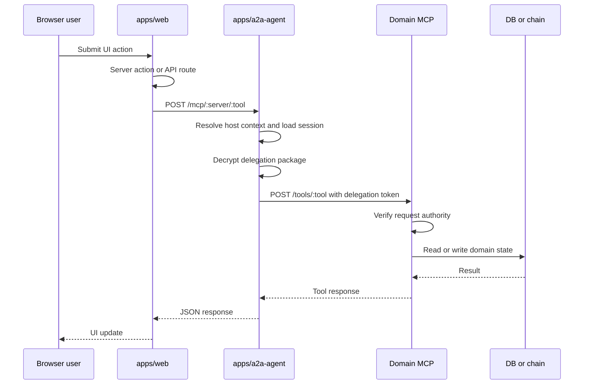
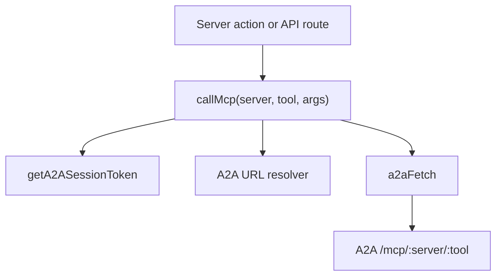
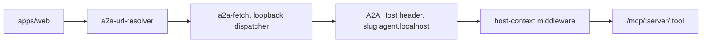
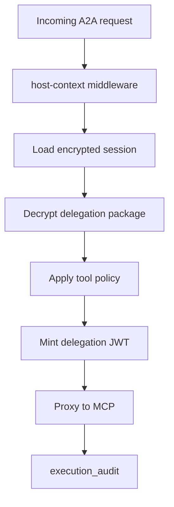
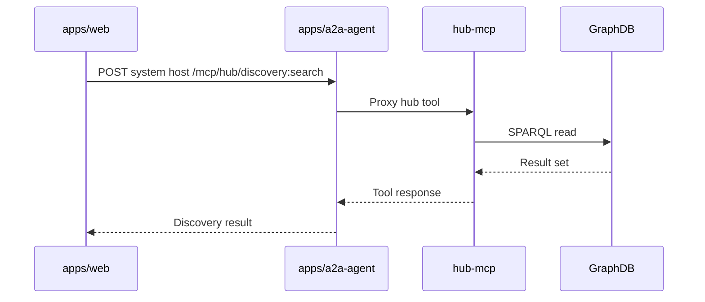
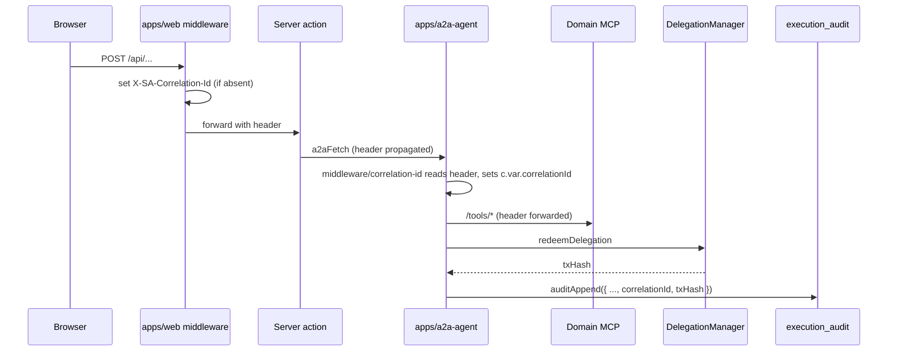

# Web, A2A, and MCP Flows

This document describes how the web app reaches backend tools. The preferred model is:

`Web server action -> A2A agent -> MCP tool -> domain store or chain`.

## Main Flow

## Web Side

Key files:

- `apps/web/src/lib/clients/mcp-client.ts`
- `apps/web/src/lib/clients/a2a-fetch.ts`
- `apps/web/src/lib/clients/a2a-url-resolver.ts`
- `apps/web/src/lib/clients/hub-client.ts`
- `apps/web/src/lib/actions/a2a-session.action.ts`

`callMcp` is the main application helper for user-authorized MCP calls.

## Agent-Scoped Host Routing

The web app can construct agent-scoped A2A hosts such as:

- `rich-pedersen.agent.localhost:3100`
- `system.agent.localhost:3100`

The local fetch layer resolves wildcard hostnames to loopback while preserving the `Host` header for the A2A service.

## A2A Side

Key files:

- `apps/a2a-agent/src/index.ts`
- `apps/a2a-agent/src/routes/mcp-proxy.ts`
- `apps/a2a-agent/src/routes/session.ts`
- `apps/a2a-agent/src/routes/auth.ts`
- `apps/a2a-agent/src/routes/delegation.ts`
- `apps/a2a-agent/src/routes/onchain-redeem.ts`
- `apps/a2a-agent/src/middleware/host-context.ts`
- `apps/a2a-agent/src/db/schema.ts`

The A2A agent is the session broker and MCP proxy. It stores encrypted session packages, mints or forwards delegation material, and routes to the correct MCP.

## MCP Target Map

| `callMcp` server | Target service | Typical responsibility |
| --- | --- | --- |
| `person` | `apps/person-mcp` | Private person data, credentials, wallet actions |
| `org` | `apps/org-mcp` | Org data, rounds, proposals, pledges |
| `people-group` | `apps/people-group-mcp` | Group membership and people group tools |
| `hub` | `apps/hub-mcp` | System discovery and GraphDB sync |

## Hub-MCP Exception

Hub MCP tools are often system-level reads or sync tools and may not require a user session in the same way person/org tools do.

## Known Direct Bypasses

Some flows still bypass A2A and should be treated as migration candidates unless they are explicitly system-level:

- Direct GraphDB and discovery reads from web code.
- Direct person-mcp session-store calls in `apps/web/src/lib/auth/person-mcp-session-client.ts`.
- Direct wallet-action dispatch calls in `apps/web/src/lib/wallet-action/dispatch.ts`.
- Direct chain writes and reads through `apps/web/src/lib/contracts.ts`.
- Readiness and boot scripts that intentionally call service health endpoints.

## Development Guidance

For new user-initiated person or organization work:

1. Add or reuse an MCP tool in the domain service.
2. Call it through `callMcp` from the web server action.
3. Let A2A handle session, host context, and delegation.
4. Keep direct web-to-service calls for bootstrapping, health checks, or explicit system-level exceptions only.

## KMS Substrate Allowlist

The app depends on the `A2AKeyProvider` interface in `packages/sdk/src/key-custody/types.ts`, not on any specific KMS backend. The substrate decision is contained to one provider file per backend.

Only these files may import a KMS-class cloud SDK:

- `packages/sdk/src/key-custody/aws-kms-provider.ts` — allowed to import `@aws-sdk/client-kms` and `@vercel/oidc-aws-credentials-provider`. K2 v1 envelope-encryption provider (symmetric `kms:GenerateDataKey` / `kms:Decrypt`) per `KMS-IMPLEMENTATION-PLAN.md` §3.2a.
- `packages/sdk/src/key-custody/aws-kms-signer.ts` — allowed to import `@aws-sdk/client-kms` and `@vercel/oidc-aws-credentials-provider`. K4 PR-2 asymmetric secp256k1 master-EOA signer (`kms:Sign` + `kms:GetPublicKey` against an `ECC_SECG_P256K1` CMK). SEPARATE KMS key + IAM permissions from the K2 envelope provider; same role / OIDC trust binding.
- `packages/sdk/src/key-custody/vault-transit-provider.ts` — the only file allowed to talk to Vault Transit (currently via plain `fetch()`; would be the only place a `node-vault` import could land if ever needed). K2-alt sibling per `KMS-IMPLEMENTATION-PLAN.md` §3.2b.
- `apps/a2a-agent/src/auth/vault-oidc-token-exchange.ts` — the only file in a2a-agent allowed to read `VERCEL_OIDC_TOKEN` directly for the Vault sibling path.

Route handlers under `apps/a2a-agent/src/routes/` MUST NOT import any KMS SDK directly. They go through `apps/a2a-agent/src/auth/encryption.ts` (envelope encrypt/decrypt) and `apps/a2a-agent/src/auth/a2a-signer.ts` (asymmetric sign), each of which holds the `A2AKeyProvider` / `KmsAccountBackend` reference. The invariant is enforced by `scripts/check-no-bypass.sh` — every backend SDK (AWS KMS, Vault, GCP KMS, Azure Key Vault) is equally forbidden in routes.

## Master EOA Signer (K4)

The production master EOA — the on-chain account that signs and pays gas for `EntryPoint.handleOps` — is backed by an AWS KMS asymmetric `ECC_SECG_P256K1` key in prod and by a hex-encoded private key in `A2A_MASTER_PRIVATE_KEY` in dev. Both surfaces ride the same `KmsAccountBackend` interface, exposed to viem call sites as a `LocalAccount` via `getMasterSigner()` in `apps/a2a-agent/src/auth/a2a-signer.ts`. On first call per process, that wrapper logs `[kms-signer] address=0x... keyId=...` so operators can verify against the address recorded at setup. The only `apps/a2a-agent` consumer is `routes/onchain-redeem.ts:1247`; downstream call sites get the master EOA exclusively through `getMasterSigner()`.

Setting up the production signer is a one-time AWS provisioning task: create the asymmetric CMK, configure the IAM role and key policy, derive the EVM address from the KMS public key via `scripts/kms-signer-address.ts`, pre-fund the address, then set `AWS_KMS_SIGNER_KEY_ID` in Vercel. Rotation is on-chain — `addOwner(new)` from the old key, soak, `removeOwner(old)` from the new key. Full operator runbook: [`docs/operations/kms-signer-setup.md`](../operations/kms-signer-setup.md).

## Deployer Key (K6 — CI/CD only)

The deployer private key — the EOA that runs `forge script Deploy.s.sol` to deploy every Smart Agent contract — is **CI/CD only**. In production it MUST NOT be present in the runtime environment of any service (web, a2a-agent, MCPs). The runbook in [`docs/operations/kms-signer-setup.md` § "Deployer key (K6 — CI/CD only)"](../operations/kms-signer-setup.md#deployer-key-k6--cicd-only) documents the recommended GitHub Actions OIDC → AWS Secrets Manager provisioning pattern; the runtime IAM role for K2/K4/K5 has no permission on the deployer-key Secret.

Two enforcement points keep this invariant honest:

1. **Runtime startup warning.** Both `apps/web/instrumentation.ts` and `apps/a2a-agent/src/index.ts` log `[K6 WARNING] DEPLOYER_PRIVATE_KEY is set in a production environment` at boot if the key is present under `NODE_ENV=production`. The warning does not throw — an operator who has not finished migration can still ship — but the log line surfaces unambiguously in deploy logs.

2. **CI invariant in `scripts/check-no-bypass.sh`.** A new check fails the build if any file under `apps/web/src/app/api/**/route.ts` or `apps/a2a-agent/src/routes/**` references `DEPLOYER_PRIVATE_KEY`, outside the explicit `K6_ROUTE_HANDLER_ALLOWLIST`. Allowlist entries carry a `TODO(K6-...)` comment naming the migration target (Category C user-session signer, or Category D `auth-bootstrap` tool-executor signer). Removing an allowlist entry requires migrating the call site.

The allowed contexts for `DEPLOYER_PRIVATE_KEY` references at this phase of migration are: `apps/web/src/lib/demo-seed/**`, `apps/web/src/lib/boot-seed.ts`, `scripts/**`, `packages/contracts/**`, and the four explicitly-allowlisted bootstrap-auth routes (`/api/auth/{siwe-verify,passkey-signup,google-callback,check-agent-name}` — the last is allowlisted because of a deferred dev-fallback path; in production it reads `DEPLOYER_ADDRESS` only). Local dev retains the key in `apps/web/.env` for the dev-relayer fallback; `scripts/deploy-local.sh` writes both `DEPLOYER_PRIVATE_KEY` and the production-correct `DEPLOYER_ADDRESS` so address-only consumers can read the address without the key.

## Audit Correlation (Hardening Phase 1D)

Every user-initiated action is threaded with a **cross-service correlation id** so an investigator can join the full web → a2a → mcp → chain trail on a single value. The id rides outside the signed MAC envelope as observability metadata — it carries no authority and isn't bound to any signature (the HMAC envelopes still hash `${ts}|${nonce}|${path}|sha256(body)}`).

Code references:

- `apps/web/src/middleware.ts` sets `x-sa-correlation-id` on every request the Next.js middleware sees.
- `apps/web/src/lib/audit/correlation-id.ts` exports `getCorrelationId(headers)` and `propagateCorrelationId(headers, id?)` for server actions / route handlers that need to thread the id explicitly.
- `apps/web/src/lib/clients/a2a-fetch.ts` ensures every outbound `a2aFetch` carries the header — if the caller doesn't set it, the helper synthesizes one.
- `apps/a2a-agent/src/middleware/correlation-id.ts` reads the inbound header (or generates one), exposes it on `c.var.correlationId`, and echoes it back on the response so client libraries can correlate replies.
- `apps/a2a-agent/src/lib/audit.ts` `auditAppend()` / `auditDeny()` persist the id into `execution_audit.correlation_id` for every row (success OR denial).

Lookup patterns:

- **From a user-facing error** → grep the correlation id in `a2a-agent.log`, then `SELECT * FROM execution_audit WHERE correlation_id = '...'` for the per-row trail.
- **From a chain incident** → `SELECT correlation_id FROM execution_audit WHERE tx_hash = '0x...'`, then join back to web logs.

### Denial-path audit parity (Hardening Phase 1D #2)

Every authority-bearing middleware that returns 4xx (auth failure, replay, signature mismatch, missing headers, etc.) writes a `status: 'denied'` row to `execution_audit` BEFORE returning the error. Repeated probes by an attacker show up in the table even when they never reach a route handler — historically these were invisible.

Middleware that participates: `requireInterServiceAuth`, `requireServiceAuth('web')`. Each calls `auditDeny(c, { route, reason, mcpServer?, sessionId? })` from `apps/a2a-agent/src/lib/audit.ts`. Route handlers under `apps/a2a-agent/src/routes/onchain-redeem.ts` audit their own deep denial paths (target/selector/value-cap rejections) via the existing `writeReceipt({ status: 'denied' })` helper, which now also carries the correlation id.

The Phase 1D test suites that lock this in:

- `apps/a2a-agent/test/audit-correlation.test.ts` — middleware behavior, header echo, audit row contents.
- `apps/a2a-agent/test/audit-deny-parity.test.ts` — for each major denial branch (missing headers, unknown service, bad signature, timestamp out of window, missing nonce, replay), assert a `status: 'denied'` row exists with the matching correlation id.

### Append-only invariant (Hardening Phase 1D #3)

`execution_audit` is append-only at the application layer. Writes go through two helpers in `apps/a2a-agent/src/lib/audit.ts`:

- `auditAppend(row)` — INSERT only. Every code path that writes an audit row calls this directly OR routes through `auditDeny()` (denial-path wrapper).
- `auditFinalize(rowId, { status, txHash?, userOpHash?, errorReason? })` — the **only** sanctioned UPDATE site. Flips a `pending` row to `completed` / `reverted` after a chain tx settles.

`DELETE` against `execution_audit` is never allowed in code. The CI guard in `scripts/check-no-bypass.sh` greps `apps/a2a-agent/src/` for `.update(executionAudit)` / `.delete(executionAudit)` and fails the build if any call site outside `lib/audit.ts` matches. Adding a new audit signal means writing a new row, never mutating an existing one.

The append-only posture is enforced at the **application** layer because SQLite can't express table-level grants. The production target is Postgres with a least-privilege role that has `INSERT` + `SELECT` only on `execution_audit`; the application invariant survives that migration unchanged.
