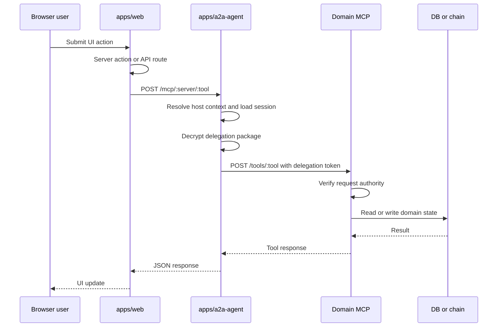
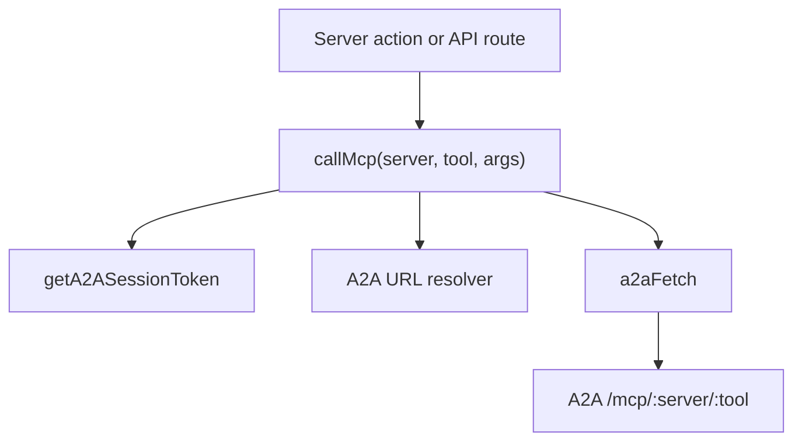
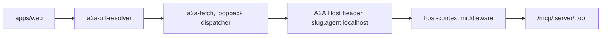
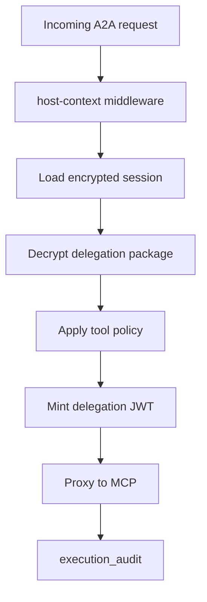
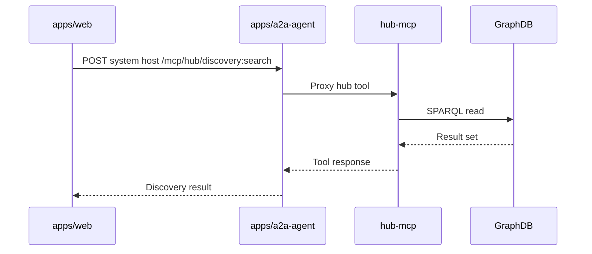

# Web, A2A, and MCP Flows

This document describes how the web app reaches backend tools. The preferred model is:

`Web server action -> A2A agent -> MCP tool -> domain store or chain`.

## Main Flow

## Web Side

Key files:

- `apps/web/src/lib/clients/mcp-client.ts`
- `apps/web/src/lib/clients/a2a-fetch.ts`
- `apps/web/src/lib/clients/a2a-url-resolver.ts`
- `apps/web/src/lib/clients/hub-client.ts`
- `apps/web/src/lib/actions/a2a-session.action.ts`

`callMcp` is the main application helper for user-authorized MCP calls.

## Agent-Scoped Host Routing

The web app can construct agent-scoped A2A hosts such as:

- `rich-pedersen.agent.localhost:3100`
- `system.agent.localhost:3100`

The local fetch layer resolves wildcard hostnames to loopback while preserving the `Host` header for the A2A service.

## A2A Side

Key files:

- `apps/a2a-agent/src/index.ts`
- `apps/a2a-agent/src/routes/mcp-proxy.ts`
- `apps/a2a-agent/src/routes/session.ts`
- `apps/a2a-agent/src/routes/auth.ts`
- `apps/a2a-agent/src/routes/delegation.ts`
- `apps/a2a-agent/src/routes/onchain-redeem.ts`
- `apps/a2a-agent/src/middleware/host-context.ts`
- `apps/a2a-agent/src/db/schema.ts`

The A2A agent is the session broker and MCP proxy. It stores encrypted session packages, mints or forwards delegation material, and routes to the correct MCP.

## MCP Target Map

| `callMcp` server | Target service | Typical responsibility |
| --- | --- | --- |
| `person` | `apps/person-mcp` | Private person data, credentials, wallet actions |
| `org` | `apps/org-mcp` | Org data, rounds, proposals, pledges |
| `people-group` | `apps/people-group-mcp` | Group membership and people group tools |
| `hub` | `apps/hub-mcp` | System discovery and GraphDB sync |

## Hub-MCP Exception

Hub MCP tools are often system-level reads or sync tools and may not require a user session in the same way person/org tools do.

## Known Direct Bypasses

Some flows still bypass A2A and should be treated as migration candidates unless they are explicitly system-level:

- Direct GraphDB and discovery reads from web code.
- Direct person-mcp session-store calls in `apps/web/src/lib/auth/person-mcp-session-client.ts`.
- Direct wallet-action dispatch calls in `apps/web/src/lib/wallet-action/dispatch.ts`.
- Direct chain writes and reads through `apps/web/src/lib/contracts.ts`.
- Readiness and boot scripts that intentionally call service health endpoints.

## Development Guidance

For new user-initiated person or organization work:

1. Add or reuse an MCP tool in the domain service.
2. Call it through `callMcp` from the web server action.
3. Let A2A handle session, host context, and delegation.
4. Keep direct web-to-service calls for bootstrapping, health checks, or explicit system-level exceptions only.
