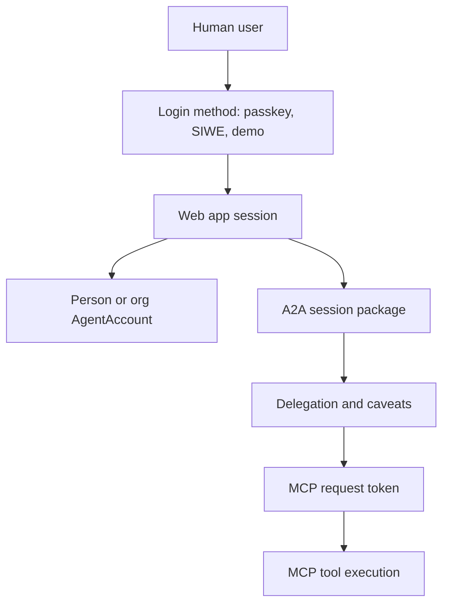
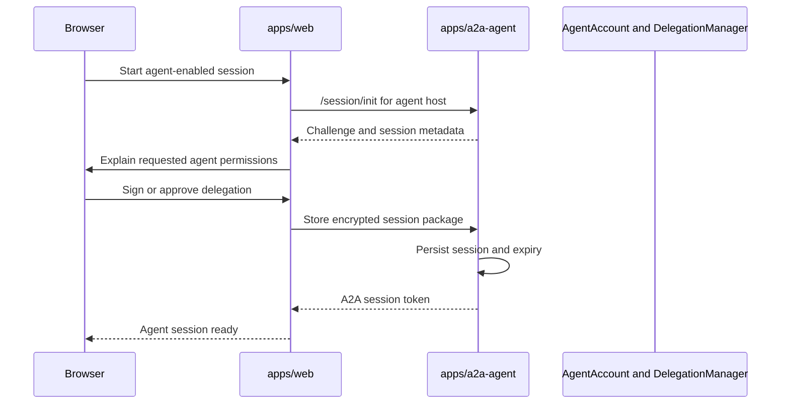
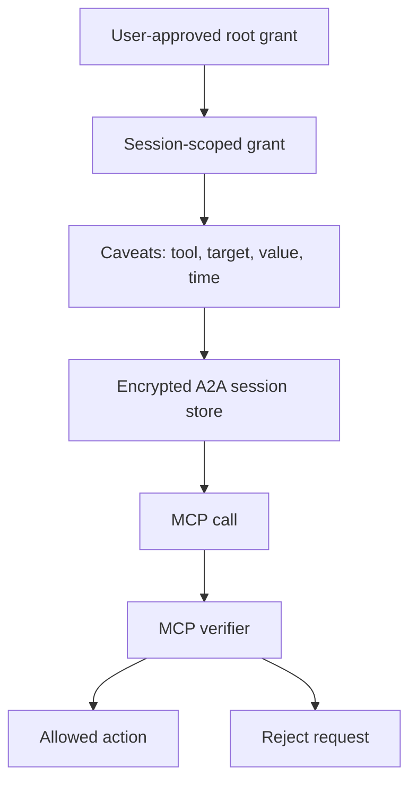
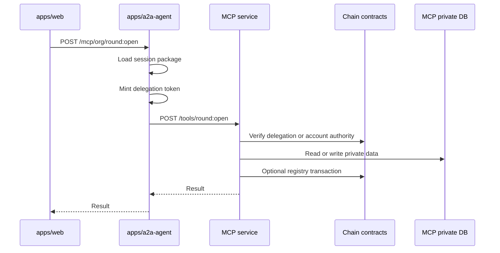
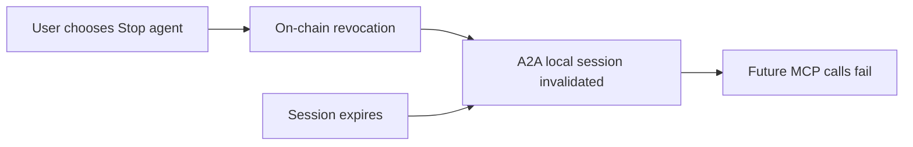

# Auth, Sessions, and Delegation

This document shows how browser authentication, agent sessions, A2A session packages, and MCP authorization fit together.

## Layers

## Login And Web Session

The web app establishes the user session through its auth routes and helpers.

Key files:

- `apps/web/src/app/api/auth/siwe-verify/route.ts`
- `apps/web/src/app/api/auth/passkey-*/`
- `apps/web/src/app/api/demo-login/route.ts`
- `apps/web/src/lib/auth/session.ts`
- `apps/web/src/lib/auth/get-current-user.ts`

The web session identifies the current user, selected org or hub context, wallet or passkey state, and the user's agent address where available.

## A2A Session Bootstrap

Key files:

- `apps/web/src/lib/actions/a2a-session.action.ts`
- `apps/a2a-agent/src/routes/session.ts`
- `apps/a2a-agent/src/routes/session-meta.ts`
- `apps/a2a-agent/src/db/schema.ts`

## Delegation Request Flow

The A2A session package gives the A2A service enough delegated authority to call approved tools for the current agent context. Tool-level authority should be narrow and caveated.

Relevant contract and SDK concepts:

- `DelegationManager`
- caveat enforcers such as timestamp, value, target, and method enforcers
- `hashDelegation`, caveat builders, and encoders from `@smart-agent/sdk`
- ERC-1271 validation on AgentAccount

## MCP Authorization Flow

## Session State

The A2A database stores:

- challenges
- sessions
- handles
- execution audit entries

File:

- `apps/a2a-agent/src/db/schema.ts`

The web database stores web-specific auth, local user account, invite, recovery, and bootstrap state.

Files:

- `apps/web/src/db/schema.ts`
- `apps/web/src/db/index.ts`

## Revocation And Expiry

Session authority should end through one of these paths:

Relevant routes and files:

- `apps/web/src/app/(authenticated)/sessions/permissions/page.tsx`
- `apps/web/src/app/api/a2a/revoke/route.ts`
- `apps/a2a-agent/src/routes/delegation.ts`
- `apps/a2a-agent/src/routes/onchain-redeem.ts`

## Development Guidance

- Do not put private keys in `NEXT_PUBLIC_*`.
- Treat AnonCreds as proof and eligibility material, not as transaction signatures.
- Use passkeys, EOAs, or AgentAccount validation for signing and account control.
- Keep delegation scopes narrow and time-bound.
- New MCP tools should define explicit tool policy and caveats before the web UI calls them.
