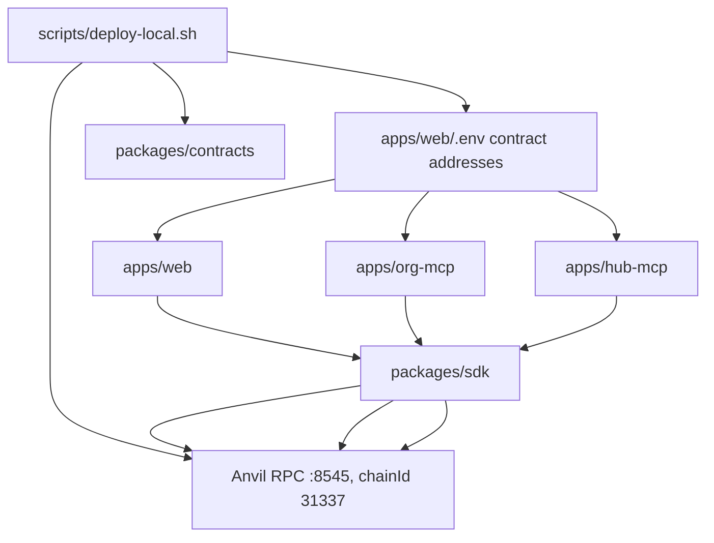
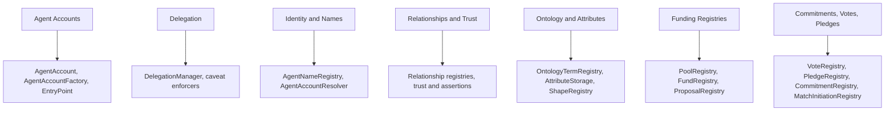
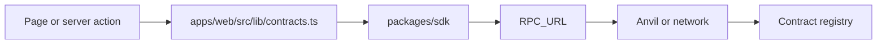
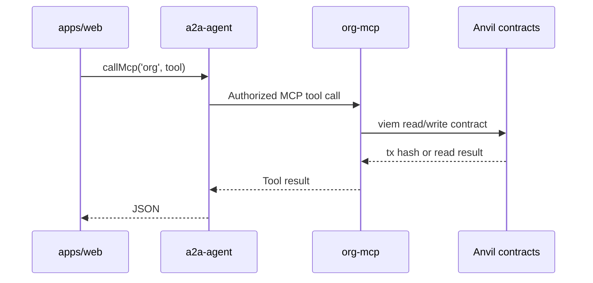
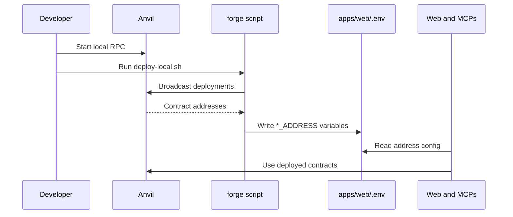

# On-Chain and Anvil Architecture

This document maps local Anvil, deployed contracts, SDK usage, and web/backend on-chain interaction paths.

## Local Chain Topology



## Contract Families



The exact deployed set is controlled by the Foundry deploy scripts and local env output.

Key paths:

- `packages/contracts`
- `packages/contracts/script/Deploy.s.sol`
- `scripts/deploy-local.sh`
- `apps/web/.env`
- `apps/web/src/lib/contracts.ts`
- `packages/sdk/src`

## Web On-Chain Access

The web app uses `viem` and SDK ABIs for direct reads/writes where functionality has not yet moved behind MCP tools.



Representative web paths:

- `apps/web/src/lib/contracts.ts`
- `apps/web/src/lib/clients/a2a-url-resolver.ts`
- `apps/web/src/app/api/graph/route.ts`
- `apps/web/src/app/api/system-readiness/route.ts`
- `apps/web/src/lib/actions/passkey/register.action.ts`
- `apps/web/src/lib/actions/commitments.action.ts`
- `apps/web/src/lib/actions/proposalVotes.action.ts`

## MCP On-Chain Access

Some domain tools execute chain reads/writes from MCP services, especially org and hub tools.



Key paths:

- `apps/org-mcp/src/tools`
- `apps/org-mcp/src/config.ts`
- `apps/hub-mcp/src/tools`
- `apps/hub-mcp/src/config.ts`

## Deployment And Address Propagation



## Source Of Truth Rule

On-chain state is the source of truth for:

- agent accounts and ownership
- delegation revocation and caveat enforcement
- registries for names, relationships, ontology terms, pools, rounds, proposals, votes, pledges, and commitments
- public attributes intended for GraphDB mirroring

Off-chain services may cache, index, or store private data, but should not become the source of truth for public on-chain facts.

## Current Migration Direction

New user-initiated person/org chain writes should increasingly flow through:

```mermaid
flowchart LR
  web["Web action"]
  a2a["A2A"]
  mcp["Person or org MCP"]
  chain["On-chain registry"]
  graph["Hub-MCP GraphDB sync"]

  web --> a2a --> mcp --> chain --> graph
```

Direct web-to-chain operations can remain for read-only, bootstrap, demo, health, or explicitly accepted exceptions.
