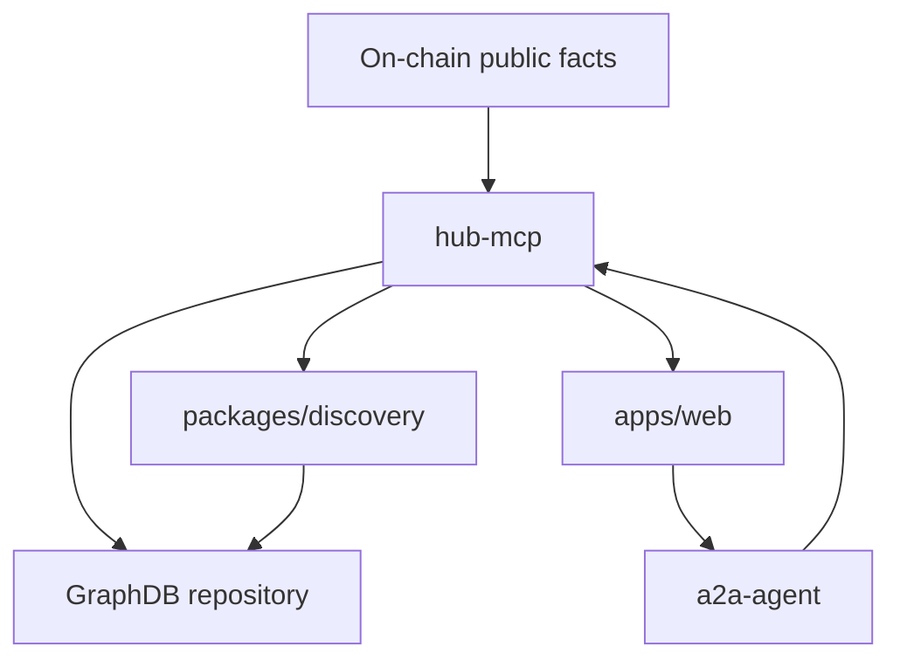
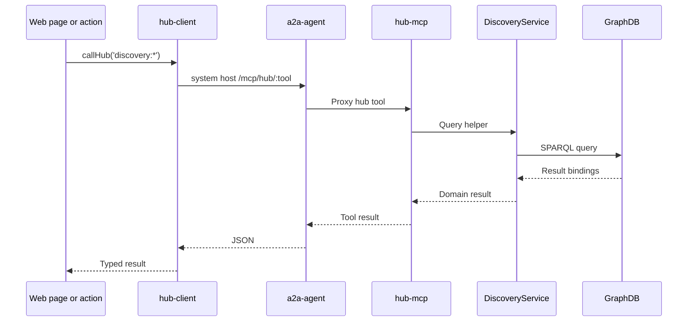
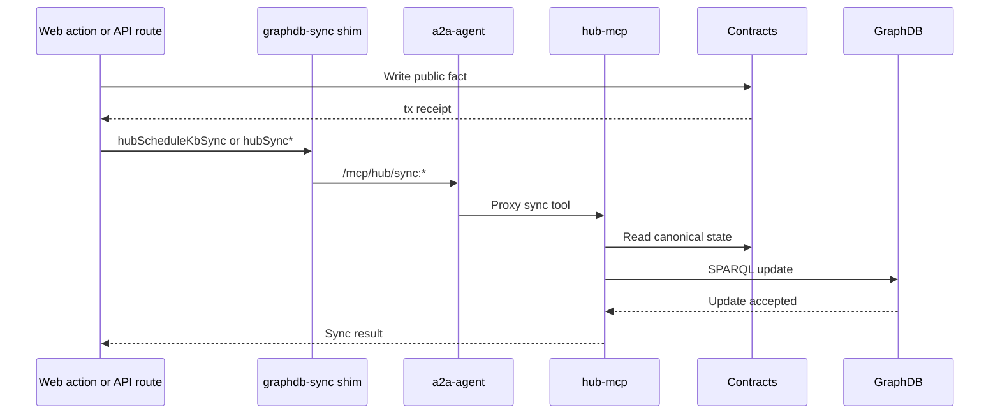
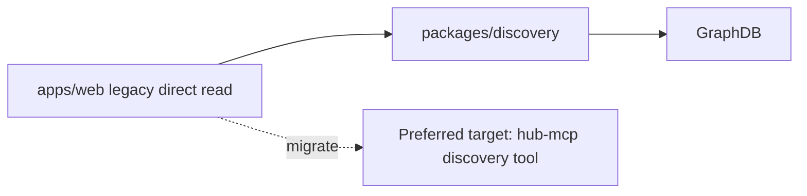

# GraphDB and Knowledge Sync

This document describes the public knowledge layer: GraphDB, discovery reads, RDF projection, and hub-mcp sync.

## Knowledge Layer Position

GraphDB is the public query/index layer. It should mirror public facts from chain and selected public projections, not replace the chain as source of truth.

## Preferred Discovery Read Path

Key files:

- `apps/web/src/lib/clients/hub-client.ts`
- `apps/a2a-agent/src/routes/mcp-proxy.ts`
- `apps/hub-mcp/src/tools/discovery.ts`
- `packages/discovery/src/index.ts`
- `packages/discovery/src/discovery-service.ts`

## Sync Path

GraphDB sync can be triggered by web routes or domain actions after chain writes.

Key files:

- `apps/web/src/lib/ontology/graphdb-sync.ts`
- `apps/web/src/lib/ontology/kb-write-through.ts`
- `apps/web/src/app/api/ontology-sync/route.ts`
- `apps/web/src/app/api/ontology-sync/turtle/route.ts`
- `apps/hub-mcp/src/tools/sync.ts`
- `apps/hub-mcp/src/lib/graphdb-sync.ts`
- `apps/hub-mcp/src/lib/kb-write-through.ts`

## Direct GraphDB Paths

Older or transitional web code may still import `@smart-agent/discovery` or call GraphDB-facing helpers directly. These paths should be documented as migration candidates when they are user-facing request paths.

## Source Of Truth Rules

| Fact type | Source of truth | GraphDB role |
| --- | --- | --- |
| Agent addresses and ownership | Chain | Query projection |
| Names and public metadata | Chain registries | Query projection |
| Relationships and public roles | Chain | Query projection |
| Pools, rounds, proposals | Chain registries | Query projection |
| Votes and pledge public records | Chain registries | Query projection |
| Private person/org details | MCP private DBs | Do not mirror unless explicitly public |
| Derived rankings and search | Discovery service | Query/index support |

## Environment

The discovery package reads GraphDB configuration from environment:

- `GRAPHDB_BASE_URL`
- `GRAPHDB_REPOSITORY`
- `GRAPHDB_USERNAME`
- `GRAPHDB_PASSWORD`

The hub-mcp should become the main holder of GraphDB access for runtime web flows.

## Development Guidance

- Do not add new web request paths that require GraphDB credentials in the web app.
- Put public discovery reads behind hub-mcp tools.
- Schedule sync after successful chain writes.
- Do not mirror private MCP data into GraphDB unless there is an explicit public assertion model.
- When in doubt, store a bounded public claim on-chain and mirror that claim, not the private evidence behind it.
