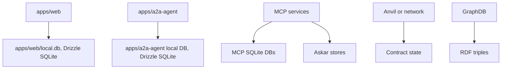
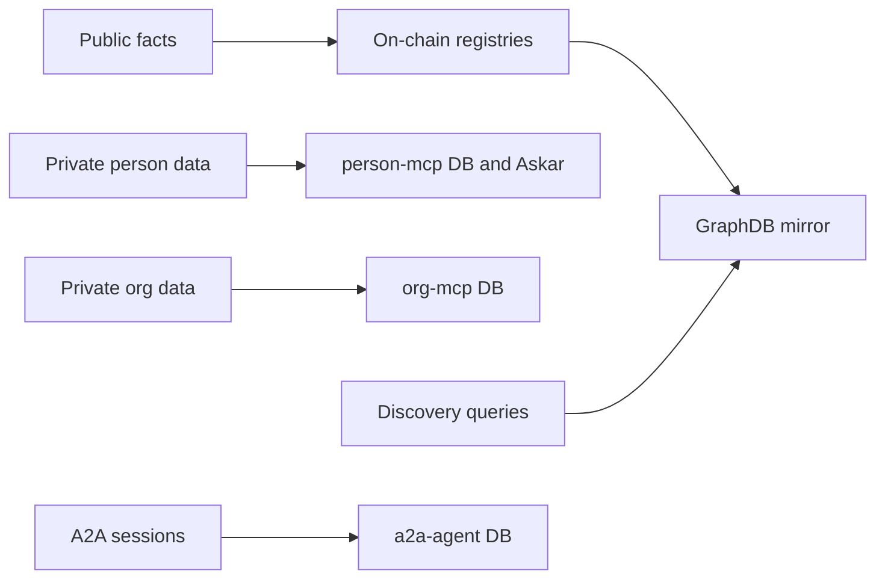
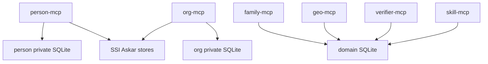
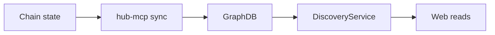

# Persistence and Data Stores

This document maps where state is stored and which system owns each type of data.

## Storage Overview

## Store Types

| Store | Owner | Purpose |
| --- | --- | --- |
| Web SQLite | `apps/web` | Local auth, recovery, invites, selected caches, demo/bootstrap state |
| A2A SQLite | `apps/a2a-agent` | Challenges, encrypted sessions, handles, execution audit |
| Person MCP SQLite | `apps/person-mcp` | Person-private profile, credentials metadata, messages, notifications |
| Org MCP SQLite | `apps/org-mcp` | Org-private operational data, issuer data, private workflow records |
| Other MCP SQLite | `apps/*-mcp` | Domain-specific private state |
| Askar stores | MCPs | SSI wallet and credential material |
| Chain state | Contracts | Public canonical agent, registry, delegation, funding, relationship facts |
| GraphDB | Hub MCP and discovery | Public query projection and derived discovery view |

## Source Of Truth Map

## Web Database

Key files:

- `apps/web/src/db/schema.ts`
- `apps/web/src/db/index.ts`
- `apps/web/drizzle.config.ts`

The web database is not the long-term home for public agent or organization facts. Many older tables are transitional or dropped at runtime as ownership shifts toward chain and MCP services.

Use web SQLite for:

- web-local auth and session support
- recovery and invite state
- local user account mapping
- demo and bootstrap convenience where appropriate

Avoid adding new durable domain truth to the web DB when it belongs in chain or MCP.

## A2A Database

Key files:

- `apps/a2a-agent/src/db/schema.ts`
- `apps/a2a-agent/src/db/index.ts`

The A2A database stores operational session state:

- challenges
- encrypted delegation packages
- expiry metadata
- handles
- execution audit

It should not become a domain data store for person or org content.

## MCP Storage

MCP services own private domain state.

Examples:

- Person MCP stores private person profile, notifications, messages, SSI holder data.
- Org MCP stores org-private issuer and workflow data.
- Verifier MCP verifies AnonCreds proofs.
- Hub MCP should hold discovery/sync behavior, not private user state.

## Chain Storage

The chain owns public canonical state:

- AgentAccount addresses and ownership
- delegation issuance/revocation and caveat enforcement
- names and resolver records
- relationship edges and public role assertions
- ontology terms and public attributes
- pool, round, proposal, vote, pledge, and commitment registry facts

## GraphDB Storage

GraphDB stores public RDF projection and supports SPARQL discovery. It should be reproducible from chain plus explicitly public sync sources.

## Local Reset And Wipe

`scripts/fresh-start.sh` wipes local SQLite files and Askar stores for a clean local environment. Treat local DBs as disposable in dev unless a script explicitly preserves them.

## Development Guidance

- Ask “who owns this data?” before adding a table.
- Public canonical facts should go on-chain, then mirror to GraphDB.
- Private person data should live in person-mcp.
- Private org data should live in org-mcp.
- Session packages should live in a2a-agent.
- Web DB should coordinate web UX, not become a shadow domain database.
