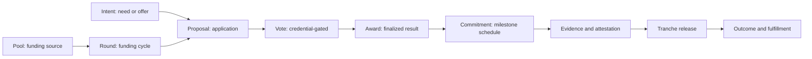
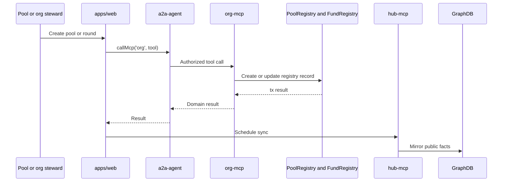
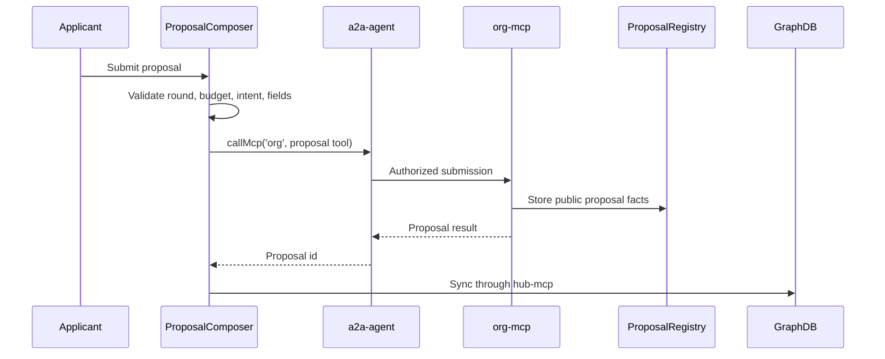
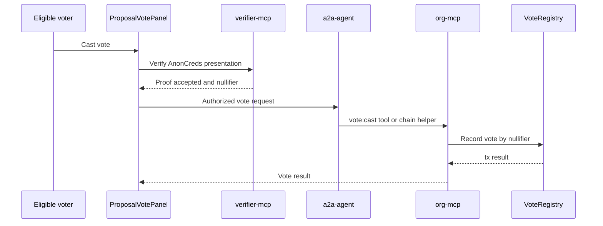
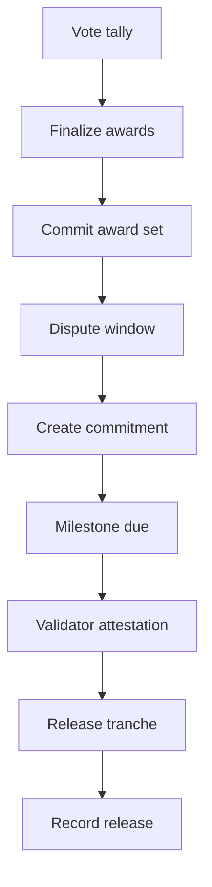
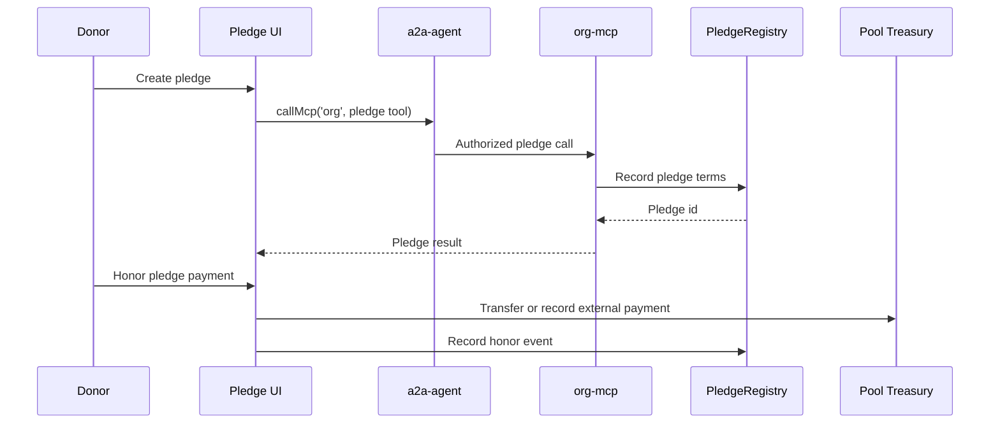
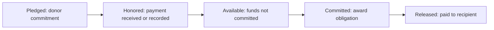

# Marketplace and Funding Architecture

This document maps the architecture behind intents, pools, rounds, proposals, voting, commitments, pledges, and fund transfer flows.

## Domain Lifecycle

## Main Components

| Area | Web routes/actions | Backend/chain |
| --- | --- | --- |
| Intents | `apps/web/src/app/h/[hubId]/(hub)/intents` | ontology, GraphDB, MCP/domain tools |
| Pools | `apps/web/src/app/h/[hubId]/(hub)/pools` | `PoolRegistry`, org-mcp |
| Rounds | `apps/web/src/app/h/[hubId]/(hub)/rounds` | `FundRegistry`, org-mcp |
| Proposals | `apps/web/src/app/h/[hubId]/(hub)/proposals` | `ProposalRegistry`, org-mcp |
| Voting | `apps/web/src/components/voting` | `VoteRegistry`, verifier-mcp, AnonCreds |
| Pledges | `apps/web/src/app/h/[hubId]/(hub)/pledges` | `PledgeRegistry`, org-mcp |
| Commitments | `apps/web/src/lib/actions/commitments.action.ts` | commitment registry, on-chain release records |
| Treasury | `apps/web/src/app/(authenticated)/treasury` | AgentAccount treasuries, USDC, chain reads |

## Pool And Round Creation

Key files:

- `apps/web/src/app/h/[hubId]/(hub)/pools/new/PoolCreateForm.tsx`
- `apps/web/src/lib/actions/poolCreate.action.ts`
- `apps/web/src/app/h/[hubId]/(hub)/rounds/new/RoundCreateForm.tsx`
- `apps/web/src/lib/actions/roundOpen.action.ts`
- `apps/org-mcp/src/tools`

## Proposal Submission

Key files:

- `apps/web/src/app/h/[hubId]/(hub)/rounds/[roundId]/apply/ProposalComposer.tsx`
- `apps/web/src/app/h/[hubId]/(hub)/rounds/[roundId]/apply/submit/route.ts`
- `apps/web/src/lib/actions/grantProposals.action.ts`

## Voting And Eligibility

Votes should be described as credential-gated eligible-voter actions, not steward-only actions unless the configured credential actually represents steward eligibility.

Key files:

- `apps/web/src/components/voting/ProposalVotePanel.tsx`
- `apps/web/src/components/voting/StewardTallySummary.tsx`
- `apps/web/src/lib/actions/proposalVotes.action.ts`
- `apps/web/src/app/api/votes/cast/route.ts`
- `apps/verifier-mcp`

## Award, Commitment, And Release

Key files:

- `apps/web/src/app/h/[hubId]/(hub)/rounds/[roundId]/admin/RoundAdminClient.tsx`
- `apps/web/src/app/h/[hubId]/(hub)/rounds/[roundId]/close/route.ts`
- `apps/web/src/lib/actions/finalizeRound.action.ts`
- `apps/web/src/lib/actions/commitments.action.ts`
- `apps/web/src/app/h/[hubId]/(hub)/proposals/[proposalId]/CommitmentTimelinePanel.tsx`
- `apps/web/src/app/h/[hubId]/(hub)/tasks/page.tsx`

## Pledge Flow

Key files:

- `apps/web/src/app/h/[hubId]/(hub)/pools/[poolId]/pledge/PledgeComposer.tsx`
- `apps/web/src/app/h/[hubId]/(hub)/pledges/[pledgeId]/PledgeHonorForm.tsx`
- `apps/web/src/app/h/[hubId]/(hub)/pledges/[pledgeId]/PledgeAmendForm.tsx`
- `apps/web/src/lib/actions/pledgeHonor.action.ts`
- `apps/web/src/lib/actions/pledgeMarkPaid.action.ts`

## Treasury State Model

Funding UI should distinguish:

## Development Guidance

- Treat “approved proposal” and “funds moved” as separate states.
- Show names, pool labels, and org labels instead of raw addresses.
- Keep the `fundAgentId` and pool AgentAccount resolvable; unresolved operator/pool labels indicate a data integrity issue.
- Make every money-moving action reviewable before signing.
- Use GraphDB as a read projection, not as the source of truth for awards or payments.
