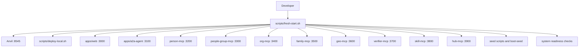
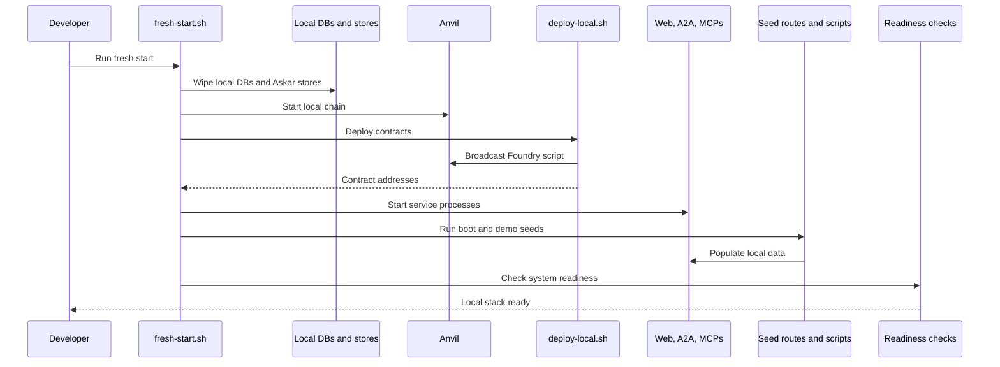
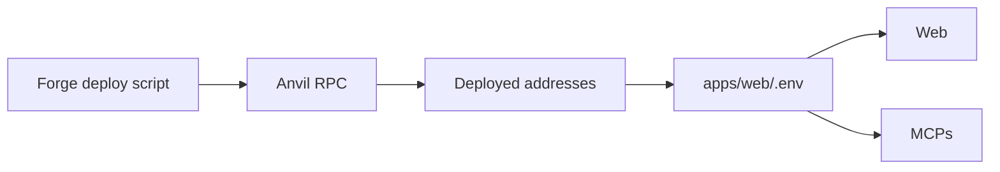

# Local Development Orchestration

This document describes the local development process topology, fresh-start flow, deployment, seeding, and readiness checks.

## Local Process Topology



## Fresh Start Lifecycle



Key files:

- `scripts/fresh-start.sh`
- `scripts/deploy-local.sh`
- `scripts/seed-*.sh`
- `scripts/seed-*.ts`
- `apps/web/src/app/api/boot-seed/route.ts`
- `apps/web/src/app/api/system-readiness/route.ts`
- `apps/web/src/app/api/ontology-sync/route.ts`

## Deploy Flow



Deployment writes contract addresses into local env so the web app and services can read:

- account factory address
- delegation manager address
- caveat enforcer addresses
- registry addresses
- token and treasury-related addresses

## Local State Wipe

The fresh-start flow wipes local state including:

- `apps/web/local.db`
- MCP local SQLite databases
- A2A local SQLite database
- Askar stores
- generated local bootstrap state

This is expected in dev. Do not rely on local DB persistence across fresh starts unless the script is changed.

## Service Startup Model

The root `package.json` includes:

- `pnpm dev` for web plus A2A
- `pnpm dev:web`
- `pnpm dev:a2a`
- `pnpm dev:mcp` for person MCP

`fresh-start.sh` starts the full multi-service stack, including all MCP services.

## Readiness Model

```mermaid
flowchart TD
  readiness["/api/system-readiness"]
  webEnv["Web env and DB"]
  chain["RPC and deployed contracts"]
  a2a["A2A service"]
  mcpHealth["MCP health endpoints"]
  graph["GraphDB and ontology sync"]

  readiness --> webEnv
  readiness --> chain
  readiness --> a2a
  readiness --> mcpHealth
  readiness --> graph
```

Readiness checks intentionally use direct health endpoints. This is an allowed bypass because it is operational, not user-authorized domain work.

## Logs And PIDs

The orchestration scripts write process state and logs under local temp paths such as:

- `tmp/pids`
- `tmp/logs`

Use these for debugging long-running local services.

## Development Guidance

- Use `fresh-start.sh` for a clean full-stack local reset.
- Use `deploy-local.sh` after contract changes.
- Re-run seed scripts when demo data or registry shape changes.
- If a service appears healthy but the UI is stale, check GraphDB sync and local web caches.
- Treat direct health checks as operational exceptions to the A2A-first architecture.
