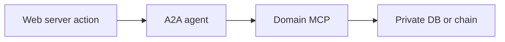
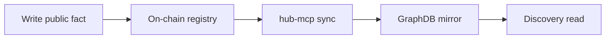
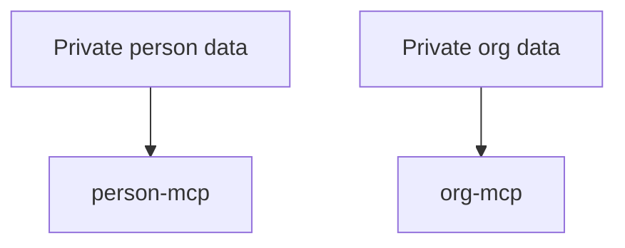

# Agent Handoff Guide

This document tells development and architecture agents which architecture file to open first for common tasks.

## Fast Routing

| Task | Start here | Then read |
| --- | --- | --- |
| Understand the whole runtime | [System Map](./00-system-map.md) | [Local Development Orchestration](./07-local-dev-orchestration.md) |
| Add a web action that calls an MCP | [Web, A2A, and MCP Flows](./01-web-a2a-mcp-flows.md) | [Auth, Sessions, and Delegation](./02-auth-session-delegation.md) |
| Add or change a session/delegation flow | [Auth, Sessions, and Delegation](./02-auth-session-delegation.md) | [On-Chain and Anvil Architecture](./03-onchain-anvil-contracts.md) |
| Add a chain registry read/write | [On-Chain and Anvil Architecture](./03-onchain-anvil-contracts.md) | [Persistence and Data Stores](./05-persistence-data-stores.md) |
| Add discovery/search/GraphDB behavior | [GraphDB and Knowledge Sync](./04-graphdb-knowledge-sync.md) | [Persistence and Data Stores](./05-persistence-data-stores.md) |
| Decide where data belongs | [Persistence and Data Stores](./05-persistence-data-stores.md) | [GraphDB and Knowledge Sync](./04-graphdb-knowledge-sync.md) |
| Work on pools, rounds, proposals, votes, commitments, pledges | [Marketplace and Funding Architecture](./06-marketplace-funding-flow.md) | [Web, A2A, and MCP Flows](./01-web-a2a-mcp-flows.md) |
| Debug local stack startup | [Local Development Orchestration](./07-local-dev-orchestration.md) | [System Map](./00-system-map.md) |

## Architecture Rules For Agents

### User-Initiated Person/Org Work

Prefer:

Avoid adding new direct web-to-MCP or web-to-private-DB calls.

### Public Facts

Prefer:

Do not use GraphDB as the source of truth for public facts.

### Private Facts

Private person and org data belongs in MCP-owned storage, not the web DB and not GraphDB.

### Session And Authority

Authority should be:

- explicit
- time-bound
- caveated
- revocable
- stored in A2A session state where appropriate

Do not create broad or indefinite tool authority for convenience.

### UI Labels

For user-facing architecture, use plain terms:

| Technical term | User-facing label |
| --- | --- |
| AgentAccount | agent account or digital identity |
| Delegation | permission |
| Caveat | limit |
| AnonCreds | credential |
| Tranche | milestone payment |
| Round | funding round |
| Pool | giving pool or funding pool |
| FundAgent | pool or funding account, depending context |
| GraphDB | public knowledge graph |

## Common Anti-Patterns

- Adding a new web SQLite table for public data that already has an on-chain registry.
- Showing raw addresses, URNs, credential IDs, hashes, or ontology CURIEs in primary UI.
- Calling person-mcp or org-mcp directly from a web request path instead of through A2A.
- Writing private MCP data to GraphDB.
- Treating an approved proposal as if funds have moved.
- Treating GraphDB search results as canonical when chain state disagrees.
- Adding browser-native `confirm()` for irreversible financial or session actions.

## Minimum Context Before Editing

Before changing architecture-sensitive code, inspect:

- The relevant diagram document in this folder.
- The exact web action or API route.
- The A2A route, if the flow crosses services.
- The MCP tool implementation, if one exists.
- The contract or registry address source, if the flow touches chain.
- The sync path, if the change creates or updates public facts.
