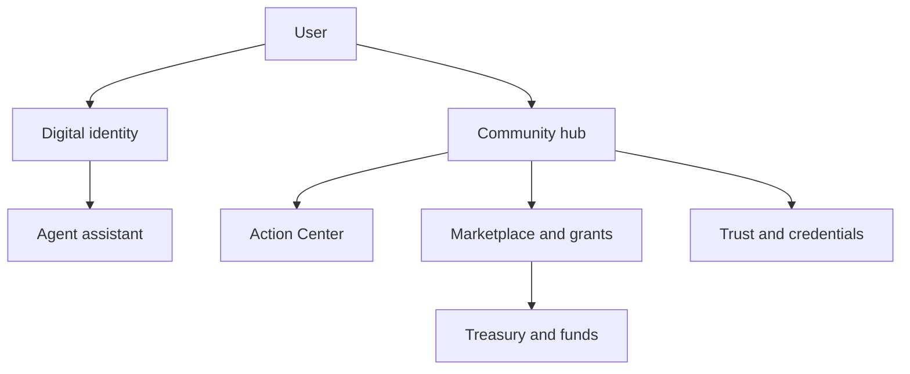
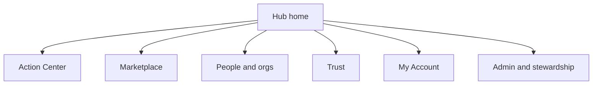
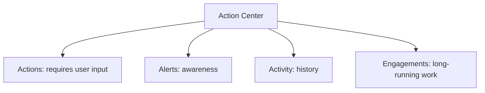
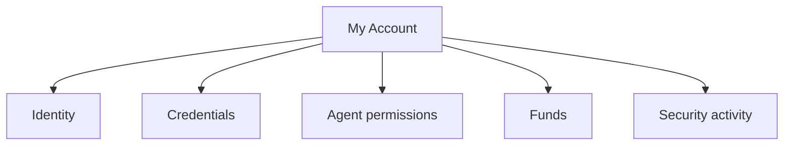
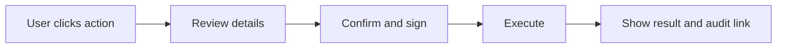

# User Experience Architecture

This document defines the product-facing architecture of the Smart Agent web app: navigation, user mental models, action surfaces, funding workflows, trust/identity concepts, and reusable UI patterns.

## UX Architecture Goals

- Make complex agent, credential, delegation, funding, and trust concepts understandable to non-technical users.
- Keep one user-facing name per concept.
- Separate action, alert, activity, engagement, and history.
- Make irreversible or money-moving actions reviewable before execution.
- Hide technical identifiers unless the user explicitly opens technical details.

## Product Mental Models

## Navigation Model

The app currently has global authenticated routes, hub routes, Catalyst rewrites, and dropdown-only account routes. The target UX should make these feel like one product.

## Action Center Model

Use Action Center as the umbrella for “things that need my attention.”

User-facing terms:

| Term | Meaning |
| --- | --- |
| Action | Something the user must do: vote, sign, attest, release, approve |
| Alert | Something the user should know |
| Activity | What happened in the past |
| Engagement | A long-running relationship or commitment |
| Next step | A single recommended step inside an engagement |

Avoid using `work item`, `inbox task`, or implementation type names in primary UI.

## Funding UX Lifecycle

```mermaid
flowchart LR
  intent["Need or offer"]
  funding["Funding round or pool"]
  apply["Apply or pledge"]
  review["Review and vote"]
  award["Award"]
  commitment["Commitment"]
  milestone["Milestone evidence"]
  payment["Milestone payment"]
  outcome["Outcome"]

  intent --> funding --> apply --> review --> award --> commitment --> milestone --> payment --> outcome
```

Recommended user-facing labels:

| Technical term | Preferred UI label |
| --- | --- |
| Round | Funding round |
| Pool | Giving pool or funding pool |
| Mandate | Fund focus |
| Proposal | Grant application |
| VoteRegistry ballot | Vote |
| Commitment | Commitment or award schedule |
| Tranche | Milestone payment |
| Attestation | Confirm milestone |
| Honor pledge | Release payment or confirm payment |

## Identity, Agent, Credential, And Treasury UX

Use plain language:

| Technical term | UI label |
| --- | --- |
| AgentAccount | Digital identity or agent account |
| Delegation | Permission |
| Caveat | Limit |
| AnonCreds | Credential |
| Holder wallet | Credential wallet |
| Link secret | Hide unless technical details |
| GraphDB | Public knowledge graph |

## Confirmation Pattern

All irreversible, permission-changing, or money-moving actions should use an explicit review screen or modal.

Review screens should show:

- action name,
- amount if money moves,
- source and recipient,
- authority or permission used,
- expiry or limits,
- consequence,
- cancel path.

## UX Source Files

Primary areas:

- `apps/web/src/components/hub/HubLayout.tsx`
- `apps/web/src/components/dashboard/HubDashboard.tsx`
- `apps/web/src/components/work-queue/MyWorkPanel.tsx`
- `apps/web/src/app/h/[hubId]/(hub)/tasks/page.tsx`
- `apps/web/src/app/h/[hubId]/(hub)/rounds`
- `apps/web/src/app/h/[hubId]/(hub)/pools`
- `apps/web/src/app/h/[hubId]/(hub)/proposals`
- `apps/web/src/app/(authenticated)/wallet/page.tsx`
- `apps/web/src/app/(authenticated)/treasury/page.tsx`
- `apps/web/src/app/(authenticated)/sessions/permissions/page.tsx`

Related docs:

- `docs/specs/ux-component-specs.md`
- `docs/product/hub-site-redesign.md`
- [Marketplace and Funding Architecture](./06-marketplace-funding-flow.md)
- [Persistence and Data Stores](./05-persistence-data-stores.md)

## UX Architecture Rules

- Prefer progressive disclosure over dense technical panels.
- Never use raw enum values as labels.
- Resolve names before showing addresses.
- Use empty states with a useful next action.
- Keep technical details behind `Show technical details`.
- Make role and permission context visible: “You can do this because...”
- Treat accessibility as architecture: focus, labels, contrast, keyboard flow, and mobile layout are part of the system design.
