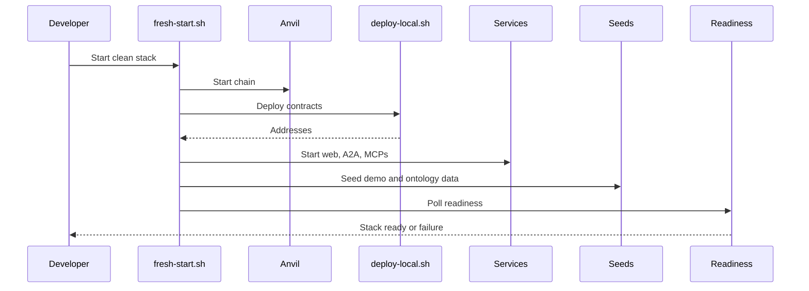
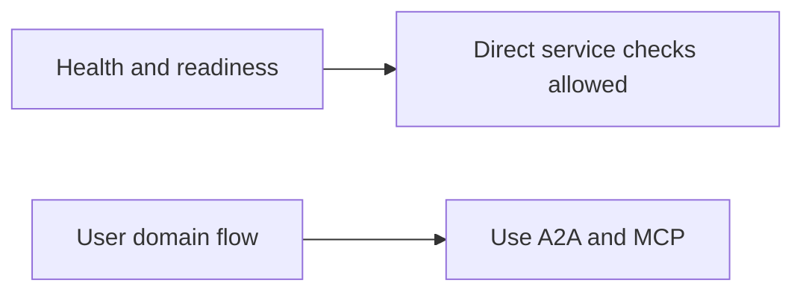

# Operational Architecture

This document covers operating the Smart Agent stack: environments, service startup, readiness, logging, reset, recovery, and operational boundaries.

## Operational Topology

```mermaid
flowchart TB
  operator["Developer or operator"]
  scripts["scripts"]
  services["Runtime services"]
  stores["Local stores"]
  chain["Anvil or network"]
  graph["GraphDB"]
  checks["Readiness checks"]

  operator --> scripts
  scripts --> services
  scripts --> stores
  scripts --> chain
  services --> graph
  services --> checks
```

## Environment Classes

| Environment | Purpose | Notes |
| --- | --- | --- |
| Local fresh start | Full clean demo/dev reset | `scripts/fresh-start.sh` wipes and reseeds |
| Local incremental dev | Run selected apps | root `pnpm dev`, `dev:web`, `dev:a2a`, service-specific scripts |
| Test/CI | Typecheck, lint, tests | no persistent local service assumptions |
| Hosted/staging | Future persistent service deployment | should not rely on fresh-start wipe behavior |

## Local Operations Flow



## Operational Sources

Key files:

- `scripts/fresh-start.sh`
- `scripts/deploy-local.sh`
- `scripts/seed-*.sh`
- `scripts/seed-*.ts`
- `apps/web/src/app/api/system-readiness/route.ts`
- `apps/web/src/app/api/boot-seed/route.ts`
- `apps/web/src/app/api/ontology-sync/route.ts`
- `apps/a2a-agent/src/index.ts`
- `apps/*-mcp/src/index.ts`

## Readiness Model

```mermaid
flowchart TD
  readiness["System readiness"]
  web["Web env and DB"]
  rpc["RPC and contract addresses"]
  a2a["A2A health"]
  mcps["MCP health"]
  graph["GraphDB access"]
  seed["Seed state"]

  readiness --> web
  readiness --> rpc
  readiness --> a2a
  readiness --> mcps
  readiness --> graph
  readiness --> seed
```

Readiness checks are allowed to call service health endpoints directly. They are operational checks, not user-authorized domain workflows.

## Logs And Runtime State

Local orchestration writes process state and logs under:

- `tmp/logs`
- `tmp/pids`

Local data stores include:

- `apps/web/local.db`
- A2A local database
- MCP local databases
- Askar stores
- generated env and deployment address files

## Reset And Recovery

Use `scripts/fresh-start.sh` when:

- contract addresses are stale,
- local DBs are inconsistent,
- demo seed data is broken,
- GraphDB mirror is stale and reseeding is easier,
- service startup order caused partial state.

Use `scripts/deploy-local.sh` when only contract deployment needs refreshing.

## Operational Boundaries



Allowed direct calls:

- health checks,
- readiness probes,
- bootstrapping,
- local seed scripts,
- explicit operator maintenance endpoints.

Avoid direct calls for:

- user-authorized person/org data access,
- new domain writes,
- private data reads,
- permissioned workflow actions.

## Operational Risks

| Risk | Mitigation |
| --- | --- |
| Stale contract addresses | Run deploy or fresh-start, verify env |
| Stale GraphDB mirror | Run ontology or hub sync |
| Local DB drift | Fresh-start reset |
| A2A session mismatch | Recreate session, clear local auth if needed |
| MCP unavailable | Check service process and health endpoint |
| Anvil reset without redeploy | Redeploy and reseed |

## Agent Guidance

Infra and QA agents should read this file before changing:

- startup scripts,
- service ports,
- env names,
- readiness checks,
- health endpoints,
- seed flows,
- logging or process supervision,
- CI or deployment behavior.

Developers should read this file when a feature requires a new service, store, seed step, or operational dependency.
