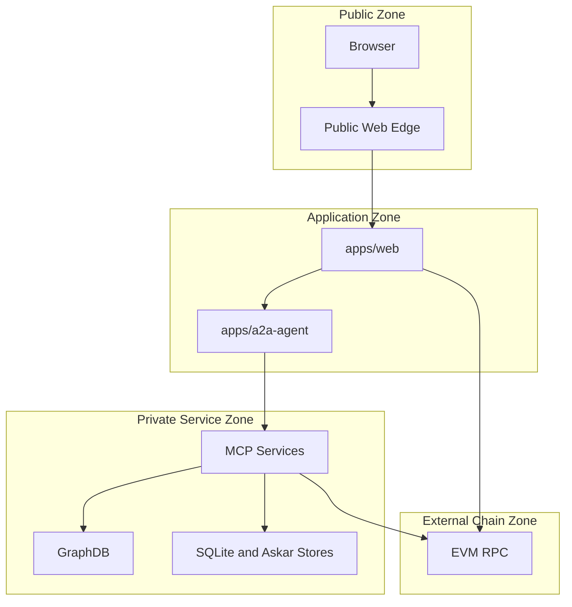

# Production Threat Model And Boundary Rules

This document defines the production threat model for Smart Agent's web app, A2A agent, MCP services, GraphDB, chain access, and local/dev exceptions.

It is Phase 1 of the connection/delegation hardening work. It should be read with:

- [Architecture Index](./INDEX.md)
- [Web, A2A, and MCP Flows](./01-web-a2a-mcp-flows.md)
- [Auth, Sessions, and Delegation](./02-auth-session-delegation.md)
- [Operational Architecture](./10-operational-architecture.md)

## Scope

In scope:

- `apps/web`
- `apps/a2a-agent`
- `apps/person-mcp`
- `apps/org-mcp`
- `apps/people-group-mcp`
- `apps/hub-mcp`
- GraphDB
- Anvil or production EVM RPC
- MCP-owned SQLite and Askar stores
- A2A session database
- local/dev seed and readiness exceptions

Out of scope for this document:

- full Solidity audit,
- credential cryptography proof soundness,
- GraphDB infrastructure hardening beyond network and route exposure,
- complete UX copy review.

## Security Objectives

Smart Agent must defend these invariants in production:

1. User login does not imply broad authority. Tool authority is separately scoped and revocable.
2. User-initiated person/org actions flow through `web -> A2A -> MCP`.
3. Private person/org data is only accessed through the owning MCP.
4. MCPs do not trust request bodies for principal identity; they verify delegation/session authority.
5. GraphDB is a public projection, not a source of truth.
6. On-chain public facts are canonical and mirrored outward.
7. Internal service ports are not public internet surfaces.
8. Debug, seed, and local-only routes are disabled or inaccessible in production.
9. Every privileged route has one declared exposure class and one declared authority mechanism.
10. Unknown or unsupported authority restrictions should fail closed.

## Assets

| Asset | Why it matters |
| --- | --- |
| Web auth cookies and session state | User identity and UI access |
| A2A session packages | Delegated authority and session private key material |
| `A2A_SESSION_SECRET` | Can decrypt stored A2A session packages if DB also leaks |
| SessionGrant records | Passkey-rooted delegated wallet-action authority |
| MCP delegation tokens | Per-tool authorization to private services |
| MCP SQLite databases | Private person/org/domain data |
| Askar stores | Credential holder/issuer state |
| GraphDB repository | Public knowledge graph and discovery results |
| EVM private keys and passkeys | Account control and signing authority |
| Contract registry addresses | Chain source-of-truth targets |
| Inter-service secrets | A2A/MCP redeem and service-auth trust |
| Audit logs | Investigation, accountability, replay detection |

## Threat Actors

| Actor | Capabilities |
| --- | --- |
| Internet attacker | Sends requests to public web endpoints |
| Authenticated user | Has a valid web session and may attempt privilege escalation |
| Malicious MCP caller | Can hit an exposed MCP/A2A port if network policy fails |
| Compromised web server | Can call internal services and read web env |
| Compromised A2A service | Can decrypt session packages if secrets are present |
| Compromised MCP service | Can read owned private store and call configured downstream services |
| Malicious insider/operator | May access env, local DBs, logs, or service ports |
| Supply-chain attacker | May alter package or runtime code |

## Trust Boundaries

Production rule: only the web edge and approved public protocol endpoints are internet reachable. A2A and MCP service ports must be private unless an explicit public route class says otherwise.

## Route Exposure Classes

| Class | Meaning | Required controls |
| --- | --- | --- |
| Public | Internet reachable by browsers or external clients | Input validation, rate limit, no private data without auth |
| Web-authenticated | Requires web session | CSRF protection where applicable, authorization check |
| A2A-only | Only web/A2A clients should call | Bearer/session validation, host-context where applicable |
| MCP-tool via A2A | MCP `/tools` called only by A2A | Delegation token verification, tool scope, principal check |
| Service-auth-only | Internal service call only | mTLS or signed service identity/HMAC, network ACL |
| Internal private | Not externally reachable | private listener/network policy |
| Dev-only | Local development only | disabled in production or bound to localhost |
| Open protocol | Public standards-like protocol endpoint | protocol validation, rate limit, no internal authority assumption |

## Network Exposure Rules By Port

| Service | Default port | Production exposure | Rule |
| --- | ---: | --- | --- |
| Web app | `3000` | Public via web edge | Only public internet entry point for app UI and API |
| A2A agent | `3100` | Private or controlled edge | Not directly public unless behind A2A edge controls and rate limits |
| person-mcp | `3200` | Private service zone | No public ingress; `/tools`, session-store, wallet-action are not internet routes |
| people-group-mcp | `3300` | Private service zone | No public ingress unless specific public read API is approved |
| org-mcp | `3400` | Private plus selected open protocol endpoints | `/tools` private; credential issuer endpoints may be open protocol |
| family-mcp | `3500` | Private plus selected open protocol endpoints | verifier/issuer protocol endpoints only if intentionally public |
| geo-mcp | `3600` | Private plus selected open protocol endpoints | issuer/verifier protocol endpoints only if intentionally public |
| verifier-mcp | `3700` | Public or private depending verifier role | `/verify/*` may be open protocol; admin/tools private |
| skill-mcp | `3800` | Private plus selected open protocol endpoints | issuer protocol endpoints only if intentionally public |
| hub-mcp | `3900` | Private service zone | `/tools`, `/admin`, `/debug` must not be public |
| EVM RPC | `8545` local | Private or managed provider | local Anvil never public; production RPC via provider/auth |
| GraphDB | provider/internal | Private service zone | Not directly reachable by browser/web users |

## Service Route Classification

### Web App

| Route family | Exposure | Authority |
| --- | --- | --- |
| `/` and public marketing/demo pages | Public | none, read-only |
| `/api/auth/*` | Public or web-authenticated by flow stage | passkey/SIWE/OAuth/session checks |
| `/api/a2a/*` | Web-authenticated or bootstrap-specific public | web session, challenge, A2A session semantics |
| `/api/system-readiness` | Dev/local or operator-only in production | service-auth or admin guard if production exposed |
| `/api/boot-seed` | Dev-only | disabled in production |
| `/api/ontology-sync*` | Operator-only or dev-only | service-auth/admin guard |
| Hub UI server actions | Web-authenticated | should route domain work through A2A/MCP |

### A2A Agent

| Route family | Exposure | Authority |
| --- | --- | --- |
| `/.well-known/agent.json` | Public if A2A edge is public | no private data |
| `/health` | Internal or operator health | no secrets |
| `/auth/*` | Web-to-A2A only | challenge and signature verification |
| `/session/*` | Web-to-A2A only | A2A session bearer, HMAC for redeem routes where used |
| `/delegation/*` | Web-to-A2A only | active session and account validation |
| `/profile/*` | Web-to-A2A only | session or configured profile auth |
| `/mcp/:server/:tool` | A2A-only data plane | `requireSession`, delegation token minting |
| `/mcp/hub/:tool` | A2A system path | service-auth recommended for sync/write tools |
| `/session-store/*` | Service-auth-only passthrough | should not be public; cookie/session semantics alone are insufficient if exposed |
| `/wallet-action/*` | Service-auth-only passthrough | WalletAction signature plus service-auth defense in depth |

### Person MCP

| Route family | Exposure | Authority |
| --- | --- | --- |
| `/tools/:toolName` | MCP-tool via A2A | delegation token, audience, tool scope, principal check |
| `/wallet/*`, `/credentials/*`, `/proofs/*`, `/oid4vp/*` | Internal private unless intentionally exposed | WalletAction/session grant or SSI protocol rules |
| `/session-store/*` | Internal private/service-auth-only | service identity plus cookie/session semantics |
| `/wallet-action/*` | Internal private/service-auth-only | WalletAction signature, replay checks, service identity |
| `/audit/*` | Internal private/service-auth-only | append-only service identity; never public |
| `/health` | Internal health | no secrets |
| `/.well-known/*` | Public only if intentionally advertised | metadata only |

### Org MCP

| Route family | Exposure | Authority |
| --- | --- | --- |
| `/tools/:toolName` | MCP-tool via A2A | org delegation token, `requireOrgPrincipal`, tool scope |
| `/credential/*`, `/oid4vci/*`, `/.well-known/openid-credential-issuer` | Open protocol if issuer public | issuer protocol validation and rate limits |
| `/health` | Internal health | no secrets |
| `/.well-known/agent.json` | Public metadata if needed | metadata only |

### People-Group MCP

| Route family | Exposure | Authority |
| --- | --- | --- |
| `/tools/:toolName` | MCP-tool via A2A or private internal | tool-level principal/curator checks |
| `/tools` | Internal private | tool metadata only; do not expose broadly |
| `/health` | Internal health | no secrets |
| `/.well-known/agent.json` | Public metadata if needed | metadata only |

### Credential Issuer And Verifier MCPs

This covers `family-mcp`, `geo-mcp`, `skill-mcp`, and `verifier-mcp`.

| Route family | Exposure | Authority |
| --- | --- | --- |
| `/credential/offer`, `/credential/issue` | Open protocol if issuer public | issuer protocol validation, anti-abuse limits |
| `/verify/*/request`, `/verify/*/check`, `/verify/specs` | Open protocol if verifier public | verifier policy, challenge binding, replay controls |
| `/tools/:toolName` if added later | MCP-tool via A2A | delegation token, audience, tool scope |
| `/health` | Internal health | no secrets |
| `/.well-known/agent.json` | Public metadata if needed | metadata only |

### Hub MCP

| Route family | Exposure | Authority |
| --- | --- | --- |
| `/tools/discovery:*` | A2A system path or private internal | read-only public KB semantics, rate limit |
| `/tools/sync:*` | Service-auth-only | system principal or service identity required |
| `/admin/*` | Dev-only or operator-only | service-auth/admin guard |
| `/debug/*` | Dev-only | disabled in production |
| `/health` | Internal health | no secrets |

### GraphDB

GraphDB must not be directly reachable by browsers or untrusted clients.

| Access | Exposure | Authority |
| --- | --- | --- |
| SPARQL reads | hub-mcp only | GraphDB credentials in hub-mcp environment |
| SPARQL writes | hub-mcp sync only | service-auth/system path |
| Admin console | operator-only | provider/admin controls |

### Chain RPC

| Environment | Exposure | Rule |
| --- | --- | --- |
| Local Anvil | localhost only | never bind publicly |
| Test/staging RPC | private or provider-authenticated | restrict write keys |
| Production RPC | managed provider or private node | no browser private keys, no broad server hot keys |

## Local And Dev Exceptions

These are allowed in local development but must be disabled, guarded, or isolated in production:

- `scripts/fresh-start.sh`
- `scripts/deploy-local.sh`
- seed scripts and boot-seed routes
- demo login routes that provision or use local private keys
- `dev-*` API routes
- GraphDB turtle/debug routes
- direct service health probes
- local Anvil mining or balance manipulation
- local direct MCP HTTP used by scripts

Production rule: every dev-only exception must have one of:

- build-time exclusion,
- environment guard,
- localhost-only binding,
- private network ACL,
- admin/service authentication.

## Primary Threats And Mitigations

| Threat | Impact | Required mitigation |
| --- | --- | --- |
| Exposed person-mcp session-store | session poisoning, forced revocation, audit forgery | private network plus service-auth; route through A2A |
| Exposed hub-mcp sync | GraphDB corruption, cache poisoning, DoS | service-auth/system principal for sync; disable public port |
| Unknown caveat ignored by MCP | overbroad authority | fail-closed caveat matrix |
| A2A session DB plus secret leak | bulk session compromise | KMS/envelope encryption, AAD, rotation, emergency revoke |
| Host header spoofing | wrong routing or phishing confusion | host is routing only; auth from delegation/principal checks |
| Direct web-to-MCP bypass | missing A2A audit/tool policy | bypass lint, allowlist only documented exceptions |
| Direct GraphDB writes | public projection corruption | GraphDB credentials only in hub-mcp |
| Demo key path in production | account compromise | production guardrails for demo routes |
| Replay of wallet or MCP token | repeated action | JTI, nonce uniqueness, per-tool usage limits |
| Audit endpoint exposed | forged or deleted accountability | service-auth, append-only storage, retention policy |

## Required Production Controls

### Network

- Web edge is public.
- A2A is private unless intentionally exposed behind a hardened A2A edge.
- MCP service ports are private.
- GraphDB is private.
- Chain RPC is private/provider-authenticated.
- Health endpoints are not public unless behind operator auth.

### Service Identity

Before production, add one of:

- mTLS between services,
- signed service JWTs,
- HMAC with rotation and narrow route allowlist.

Minimum service-auth coverage:

- A2A to MCP `/tools`.
- A2A passthrough to person-mcp `/session-store`.
- A2A passthrough to person-mcp `/wallet-action`.
- A2A or operator to hub-mcp `sync:*`, `/admin/*`, `/debug/*`.
- MCP to A2A on-chain redeem routes.

### Authorization

- MCP tools must verify audience.
- MCP tools must verify tool scope.
- MCP tools must derive principal from proof, not body args.
- Org tools must verify org principal and role/capability.
- Person tools must verify person principal or documented cross-principal delegation.
- Hub sync tools must verify service/system authority.

### Route Hardening

- Disable debug/admin/seed routes in production.
- Rate-limit public and open protocol endpoints.
- Validate input schemas on every route.
- Log denied auth attempts without leaking secrets.
- Avoid raw internal errors in public responses.

## Production Readiness Checklist

- [ ] Every service port has an ingress policy.
- [ ] Every route family has an exposure class.
- [ ] Every exposure class has a required authority mechanism.
- [ ] Person-mcp session-store and wallet-action routes are not publicly reachable.
- [ ] Hub-mcp sync/debug/admin routes are not publicly reachable.
- [ ] GraphDB credentials exist only in hub-mcp or controlled operator tooling.
- [ ] Demo/private-key routes are disabled outside local/demo.
- [ ] Unknown caveats fail closed.
- [ ] A2A session package encryption has rotation and emergency revoke documentation.
- [ ] Audit routes are service-auth-only and append-only.
- [ ] Bypass checks enforce the documented exceptions.

## Open Decisions

1. Should production A2A be public behind wildcard domains, or only reachable through the web/backend edge?
2. Which service-auth mechanism will be standard: mTLS, HMAC, signed service JWT, or service mesh identity?
3. Should hub-mcp split read and write services, or keep one service with route-level auth?
4. Should person-mcp session-store become MCP tools only, A2A passthrough only, or both?
5. Which open SSI issuer/verifier endpoints are intentionally public in production?
6. What is the retention and tamper-resistance requirement for audit logs?

## Review Cadence

Re-review this threat model whenever:

- a new service or MCP is added,
- a new public route is added,
- a route moves from internal to public,
- new credential or delegation semantics are introduced,
- GraphDB write paths change,
- production deployment topology changes,
- a direct bypass is added or removed.
