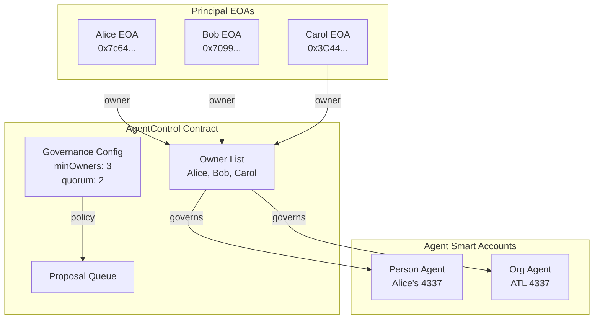
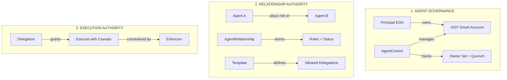
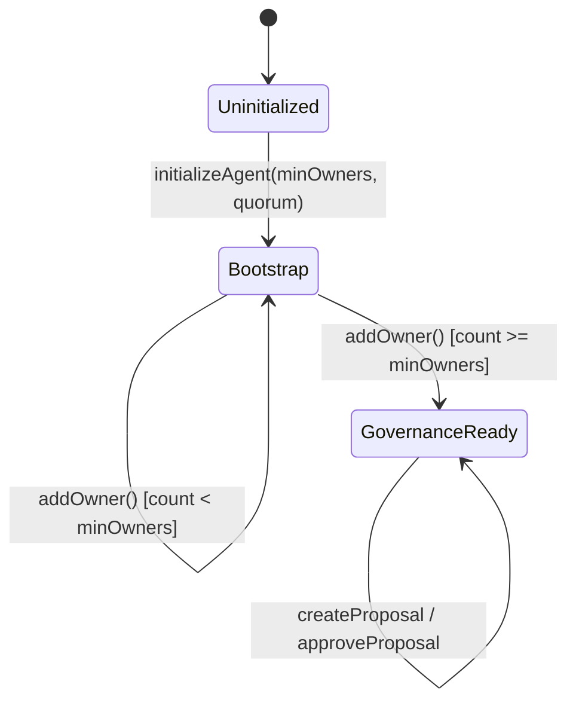
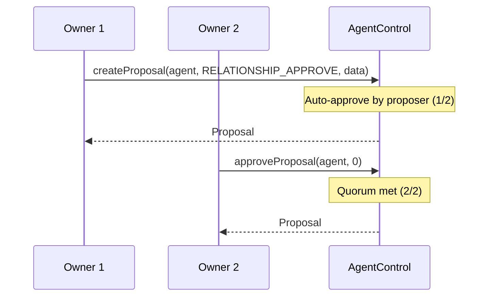
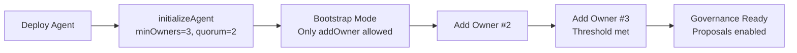
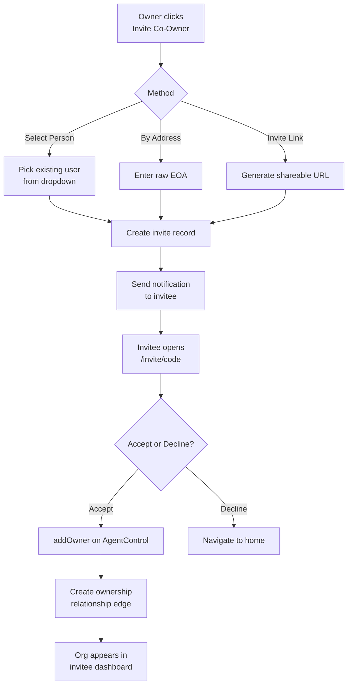

# Agent Control — EOA to Agent Governance

## Overview

Agent Control manages the relationship between **principal EOAs** (human wallets) and **agent smart accounts** (4337 accounts). This is the governance/control plane — separate from the trust graph.

## Architecture



## Three Authority Domains



## AgentControl Contract

### State Machine



### Functions

| Function | Who can call | What it does |
|----------|-------------|--------------|
| `initializeAgent(agent, minOwners, quorum)` | Anyone (once) | Set up governance, caller = first owner |
| `addOwner(agent, newOwner)` | Any owner | Add co-owner. Completes bootstrap when threshold met |
| `removeOwner(agent, owner)` | Any owner | Remove owner. Auto-adjusts quorum if needed |
| `setQuorum(agent, newQuorum)` | Any owner | Change approval threshold |
| `createProposal(agent, class, data)` | Any owner (post-bootstrap) | Create proposal, auto-approve by proposer |
| `approveProposal(agent, id)` | Any owner | Vote yes. Executes when quorum met |
| `canAct(agent, caller)` | View | Check if caller can act for agent |
| `isGovernanceReady(agent)` | View | True when bootstrap complete |

### Proposal Flow



### Action Classes

| Class | Enum | Typical Policy |
|-------|------|---------------|
| `OWNER_CHANGE` | 0 | Requires quorum |
| `RELATIONSHIP_APPROVE` | 1 | Configurable per type |
| `TEMPLATE_ACTIVATE` | 2 | Requires quorum |
| `DELEGATION_GRANT` | 3 | Quorum for high-value |
| `EMERGENCY_PAUSE` | 4 | Any single owner |
| `METADATA_UPDATE` | 5 | Any single owner |

## Bootstrap Flow



## Invite Flow for Co-Owners



## Permission Model

```
owner (EOA)
  └── Can: manage owners, approve all, grant delegations, pause
  └── Via: AgentControl.addOwner / createProposal / approveProposal

admin (relationship role)
  └── Can: approve non-owner relationships, manage members
  └── Via: Relationship edge with admin role + confirmed status

member (relationship role)
  └── Can: propose relationships for themselves
  └── Cannot: approve for others, grant delegations
```
