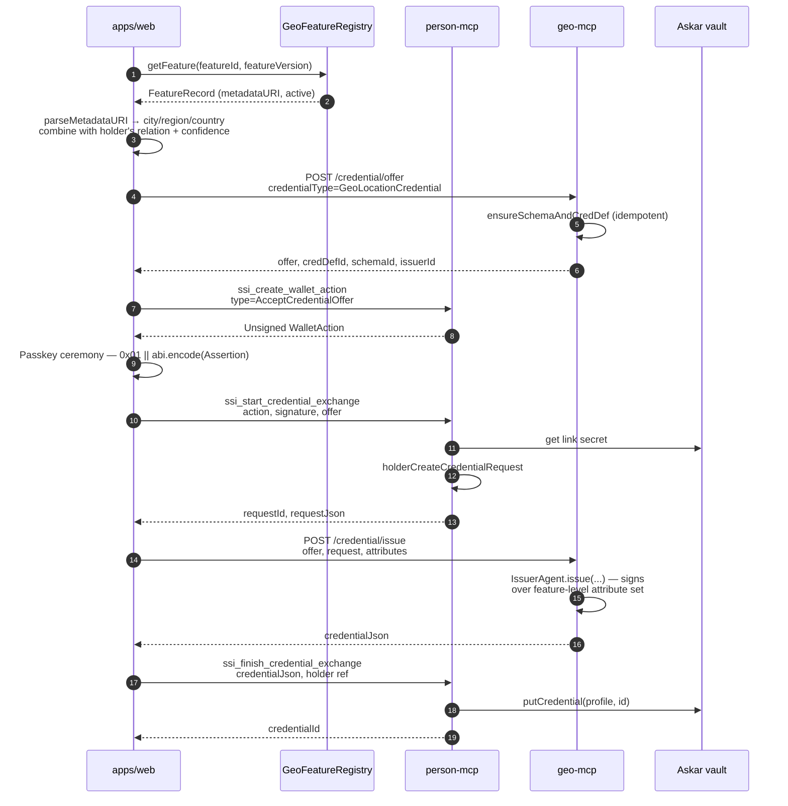
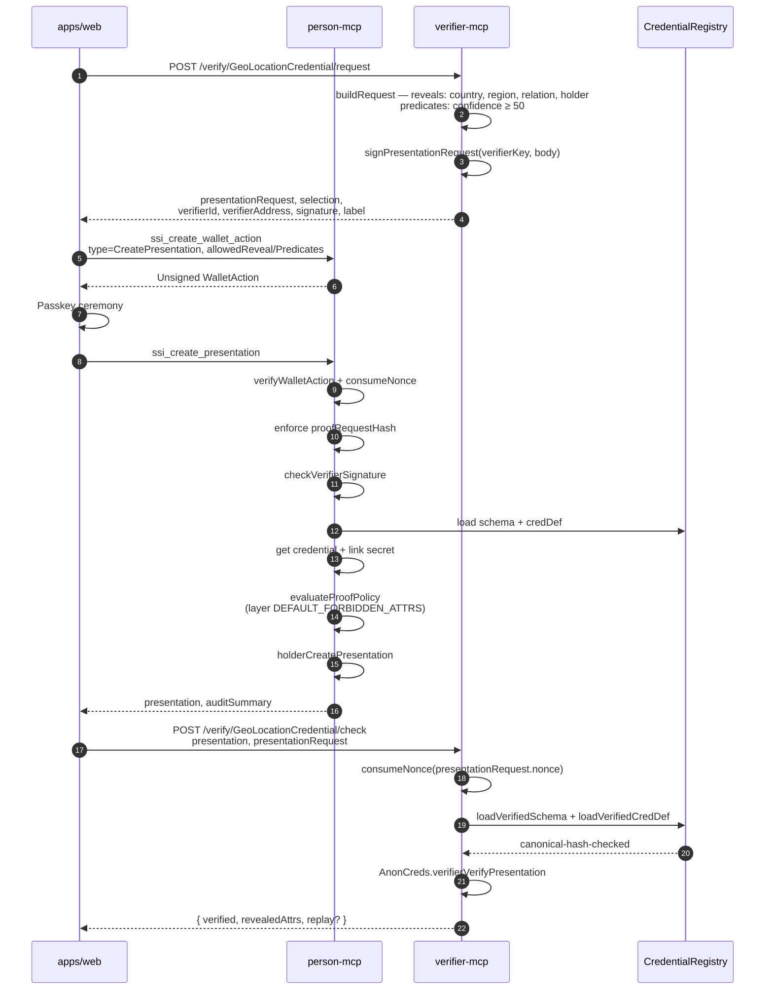

# Geo Location Credential

This document defines `GeoLocationCredential` (AnonCreds schema name
`GeoLocation/1.0`) and how Smart Agent uses it with `.geo`,
`GeoFeatureRegistry`, the optional `GeoClaimRegistry`, and the
third-party `verifier-mcp`.

`GeoLocationCredential` is intentionally **feature-level**, not
address-level. It proves an agent has a verified relationship to a named,
versioned geographic feature such as `erie.colorado.us.geo`; it does not
put exact addresses, raw coordinates, private H3 cells, or evidence
documents into SQL or onto chain.

The credential is **vault-only** — its existence and content are
invisible to anyone but the holder until they choose to present it.
Attribute values come from the public `GeoFeatureRegistry` row (which
already lives on chain and reveals nothing holder-specific) plus the
holder's chosen `relation` and `confidence`. **No on-chain `GeoClaim`
is read or written during issuance**, so the holder ↔ feature binding
never appears in chain state.

Vocabulary used across the UI for this credential and its on-chain
siblings:

- **Geo claim** — public on-chain assertion (`GeoClaimRegistry`).
- **Credential** — vault-held AnonCred (this document).
- **Relationship** — public on-chain agent ↔ agent link (`AgentRelationship`).

The verbs are uniform: **publish** to chain, **get** to vault,
**present** / **verify** by submitting a vault credential to a verifier.

---

## 1. Architecture fit

The geo stack has three layers:

- **`.geo` namespace** — names resolve human-readable feature handles such
  as `erie.colorado.us.geo`. `AgentNameRegistry` is the multi-root
  substrate.
- **`GeoFeatureRegistry`** — versioned source of truth for a feature:
  `featureId`, `featureVersion`, `geometryHash`, `h3CoverageRoot`,
  `metadataURI`, steward account, bbox, centroid.
- **`GeoClaimRegistry`** — public or commitment-only claims that an
  agent has a relationship to a feature: `residentOf`, `operatesIn`,
  `servesWithin`, `completedTaskIn`, `validatedPresenceIn`, `stewardOf`,
  `originIn`.

Issuance lives in **`apps/geo-mcp`** (port 3600). It is a single steward
across every feature. Holder authorisation is implicit: the holder's
on-chain claim mint is the consent signal, so geo-mcp has no per-feature
approval queue and never inspects the caller. Its issuer DID is
`did:ethr:<chainId>:<addr(0xeee…e)>`.

Verification lives in **`apps/verifier-mcp`** (port 3700). It is a
read-only third-party verifier that resolves schemas/credDefs through
the same on-chain `CredentialRegistry` and verifies AnonCreds proofs
off-chain.

The current architecture does **not** require an on-chain AnonCreds
verifier. AnonCreds proofs and (when Phase 6 ZK is involved) H3
inclusion proofs are verified by the agent runtime. The chain anchors
the feature, claim, and (optionally) verifier-receipt commitments only
when a public audit trail is needed.

---

## 2. Credential definition

The credential's AnonCreds schema is locked to:

```
schemaId  = https://smartagent.io/schemas/GeoLocation/1.0
credDefId = https://smartagent.io/creddefs/GeoLocation/1.0/v1
issuerDID = did:ethr:<chainId>:<addr(0xeee…e)>     // geo-mcp
```

Attribute set (all stringified, per AnonCreds requirement):

| Attribute      | Source                                                 | Reveal guidance                                                                                  |
| -------------- | ------------------------------------------------------ | ------------------------------------------------------------------------------------------------ |
| `featureId`    | On-chain `GeoFeatureRegistry.featureId` (bytes32 hex)  | Reveal when the verifier needs the canonical key; predicate-only for private overlap scoring     |
| `featureName`  | Parsed from feature `metadataURI` — e.g. `erie.colorado.us.geo` | Display convenience; reveals locality precisely                                          |
| `city`         | Parsed from `metadataURI`                              | Reveal when the policy is "same city"                                                            |
| `region`       | Parsed from `metadataURI`                              | Reveal when the policy is "same region/state"                                                    |
| `country`      | Parsed from `metadataURI`                              | Reveal almost always — coarsest jurisdictional dial                                              |
| `relation`     | Holder-supplied at issuance (e.g. `residentOf`)        | Usually reveal — relation kind drives policy                                                     |
| `confidence`   | Holder-supplied at issuance (0..100)                   | Predicate-only by default (`confidence ≥ 50` etc.) so the exact score isn't disclosed            |
| `validFrom`    | Defaults to `0` (open-ended); evidence pipeline can pin it | Predicate-only (`validFrom ≤ now`)                                                            |
| `validUntil`   | Defaults to `0` (open-ended); evidence pipeline can pin it | Predicate-only (`now ≤ validUntil`) when the credential has an expiry                          |
| `attestedAt`   | Issuance timestamp (unix seconds, set by geo-mcp)      | Predicate-only when recency matters                                                              |

Example credential values for an Erie, CO `residentOf` claim:

```json
{
  "featureId":   "0x8f...erie",
  "featureName": "erie.colorado.us.geo",
  "city":        "erie",
  "region":      "co",
  "country":     "us",
  "relation":    "residentOf",
  "confidence":  "85",
  "validFrom":   "0",
  "validUntil":  "0",
  "attestedAt":  "1777228800"
}
```

There is **no** `subjectAgent`, `evidenceCommit`, `h3CoverageRoot`,
`assuranceLevel`, or `issuerAgent` slot in the credential. The holder is
identified through the AnonCreds link-secret binding (the `holder` slot
fills in via `pairwiseHandle`), and the issuer is identified through the
proof's `issuerId` field plus the on-chain credDef provenance. Adding any
of these to the credential body would defeat unlinkability with no gain.

For policies that need a **private** point-in-feature proof, the holder
attaches a separate H3-inclusion ZK witness (`GeoH3Inclusion`) alongside
the presentation. The private H3 cell and Merkle path are not credential
attributes — they are verifier-side proof witnesses and never appear in
SQL or on chain.

---

## 3. Issuance flow (vault-only, no on-chain leak)

The web action pair `prepareCredentialIssuance` + `completeCredentialIssuance`
drives this end to end. Two UI entry points trigger it:

- The **"Get credential"** button on the `AddGeoClaimPanel` form.
- The **"+ Get geo credential"** entry in the dropdown header menu,
  which opens `IssueCredentialDialog`.

Both surfaces collect the same three inputs — feature, relation,
confidence — and run the same flow. **Nothing is written to
`GeoClaimRegistry`.** The credential is born vault-only.



The credential lands in the holder's Askar vault under
`credential/<credentialId>`, alongside `OrgMembership` and
`GuardianOfMinor` blobs. Its `credential_metadata` row carries the
public surface (id, type, issuerDID, schemaId, credDefId) but never
the attribute values.

The `validFrom`/`validUntil` slots default to `0` (open-ended) for
direct-issuance credentials; `attestedAt` is the issuance timestamp.
A `mintPublicGeoClaimAction` path (the "Mint" button on `AddGeoClaimPanel`)
remains available for users who *want* a public on-chain anchor, but
the AnonCreds-vault path is independent of it.

> **Trust note.** geo-mcp does not verify evidence today — the
> credential attests "this holder claims this relationship" with the
> same trust weight as a self-asserted email. The
> `confidence`/`assuranceLevel` slots are reserved for a future
> verifier-receipt or H3-inclusion ZK-witness path; until that lands,
> policy consumers should rate assurance accordingly.

---

## 4. Verification flow

There are two ways for a counterparty to verify a holder's geo
relationship:

1. **Read the chain directly.** Counterparties that already index
   `GeoClaimRegistry` can resolve the claim by its on-chain `claimId` and
   walk the visibility/validity rules from there. No AnonCreds involved.

2. **Request a presentation through `verifier-mcp`.** Counterparties
   that prefer offline / portable evidence ask the holder for an
   AnonCreds proof. This is what the dashboard's **"Test verification"**
   button on each row of `HeldCredentialsPanel` exercises end-to-end.

The presentation path:



Default verifier-mcp spec for geo (`apps/verifier-mcp/src/verifiers/specs.ts`):

```ts
{
  credentialType: 'GeoLocationCredential',
  schemaId:       'https://smartagent.io/schemas/GeoLocation/1.0',
  credDefId:      'https://smartagent.io/creddefs/GeoLocation/1.0/v1',
  buildRequest: () => ({
    name: 'GeoLocation audit', version: '1.0', nonce: ...,
    requested_attributes: {
      attr_holder:   { name: 'holder' },
      attr_country:  { name: 'country',  restrictions: [{ cred_def_id: <geo> }] },
      attr_region:   { name: 'region',   restrictions: [{ cred_def_id: <geo> }] },
      attr_relation: { name: 'relation', restrictions: [{ cred_def_id: <geo> }] },
    },
    requested_predicates: {
      pred_confidence: {
        name: 'confidence', p_type: '>=', p_value: 50,
        restrictions: [{ cred_def_id: <geo> }],
      },
    },
  }),
}
```

Note what is **not** revealed by the default spec: `featureId`,
`featureName`, `city`, `validFrom`, `validUntil`, `attestedAt`. Those
remain hidden inside the proof, exactly the win an AnonCreds-backed geo
credential gives over reading the chain directly.

For an **on-chain audit trail**, a verifier can additionally mint into
`GeoClaimRegistry` after a successful check:

- `Visibility.Public` if feature, relation, subject, and evidence are
  safe to expose.
- `Visibility.PublicCoarse` if only a broad feature should be public.
- `Visibility.PrivateCommitment` if the chain should store only an
  `evidenceCommit`.
- `Visibility.PrivateZk` if the verifier receipt references a ZK/H3
  inclusion proof, while the verifier still runs off-chain.

---

## 5. Verification boundaries

| Check                                     | Runs where                       | Why                                                                                                |
| ----------------------------------------- | -------------------------------- | -------------------------------------------------------------------------------------------------- |
| AnonCreds proof verification              | `verifier-mcp` (or any verifier) | CL proofs are not EVM-friendly; need schema/credDef/revocation resolution                          |
| H3 inclusion / point-in-feature           | `verifier-mcp` (or any verifier) | Agent policy consumes the result; no contract needs to enforce it directly                          |
| `GeoFeatureRegistry` lookup               | Chain / GraphDB                  | Public feature version, geometry hash, coverage-root provenance                                    |
| `GeoClaimRegistry` lookup                 | Chain                            | Public claim record; basis for the attestation                                                     |
| Schema + credDef provenance               | Chain (`CredentialRegistry`)     | `loadVerifiedSchema` / `loadVerifiedCredDef` re-hash canonical JSON before trusting it             |
| Replay protection (presentation)          | `verifier-mcp` consumed-nonces   | Same `presentation_request.nonce` cannot be redeemed twice                                         |
| Replay protection (wallet action)         | `person-mcp` `action_nonces`     | Same `WalletAction` cannot be re-submitted                                                         |
| Optional public audit trail               | Chain (`GeoClaimRegistry.mint`)  | Verifier or holder anchors a receipt commitment when off-chain trust isn't enough                  |

Use on-chain verifier contracts only when another contract must consume
the proof directly (on-chain access control, payout, minting, slashing).
For agent trust/routing decisions, keep verification in the verifier
runtime and anchor only commitments or receipts.

---

## 6. File reference

| File                                                      | Role                                                                              |
| --------------------------------------------------------- | --------------------------------------------------------------------------------- |
| `packages/sdk/src/credential-types.ts`                    | `GeoLocationCredential` descriptor in the shared `CREDENTIAL_KINDS` registry      |
| `apps/geo-mcp/src/issuers/location.ts`                    | `IssuerAgent` wiring, schema/credDef ids, `ensureLocationRegistered`              |
| `apps/geo-mcp/src/api/credential.ts`                      | `/credential/offer`, `/credential/issue`                                          |
| `apps/web/src/lib/credentials/forms/GeoLocationForm.tsx`  | Feature/relation/confidence form rendered by the generic dialog                   |
| `apps/web/src/lib/credentials/IssueCredentialDialog.tsx`  | Generic issuance dialog — drives every credential kind through the same flow     |
| `apps/web/src/lib/actions/ssi/request-credential.action.ts` | `prepareCredentialIssuance` + `completeCredentialIssuance` — generic, kind-dispatched via descriptor |
| `apps/web/src/lib/actions/ssi/wallet-provision.action.ts` | Shared provision primitives (passkey + EOA paths)                                 |
| `apps/web/src/components/profile/AddGeoClaimPanel.tsx`    | "Publish claim" + "Get credential" buttons on the claim form                      |
| `apps/web/src/components/hub/HubLayout.tsx`               | Auto-renders "+ Get {noun} credential" entries from `CREDENTIAL_KINDS`            |
| `apps/web/src/components/org/HeldCredentialsPanel.tsx`    | Held-credentials list + "Test verification" trigger                               |
| `apps/web/src/lib/actions/ssi/verify-held.action.ts`      | `prepareVerifyHeldCredential` + `completeVerifyHeldCredential`                    |
| `apps/verifier-mcp/src/verifiers/specs.ts`                | Geo entry imports descriptor from sdk; defines `buildRequest` + reveal selection  |
| `apps/verifier-mcp/src/api/verify.ts`                     | `/verify/GeoLocationCredential/{request,check}`                                   |
| `packages/contracts/src/GeoFeatureRegistry.sol`           | On-chain feature provenance                                                       |
| `packages/contracts/src/GeoClaimRegistry.sol`             | On-chain claim records (used only by the "Publish claim" path, not by issuance)   |
| `docs/architecture/anoncreds-ssi-flow.md`                 | Full AnonCreds + person-mcp + verifier-mcp pipeline (this doc's parent)           |
