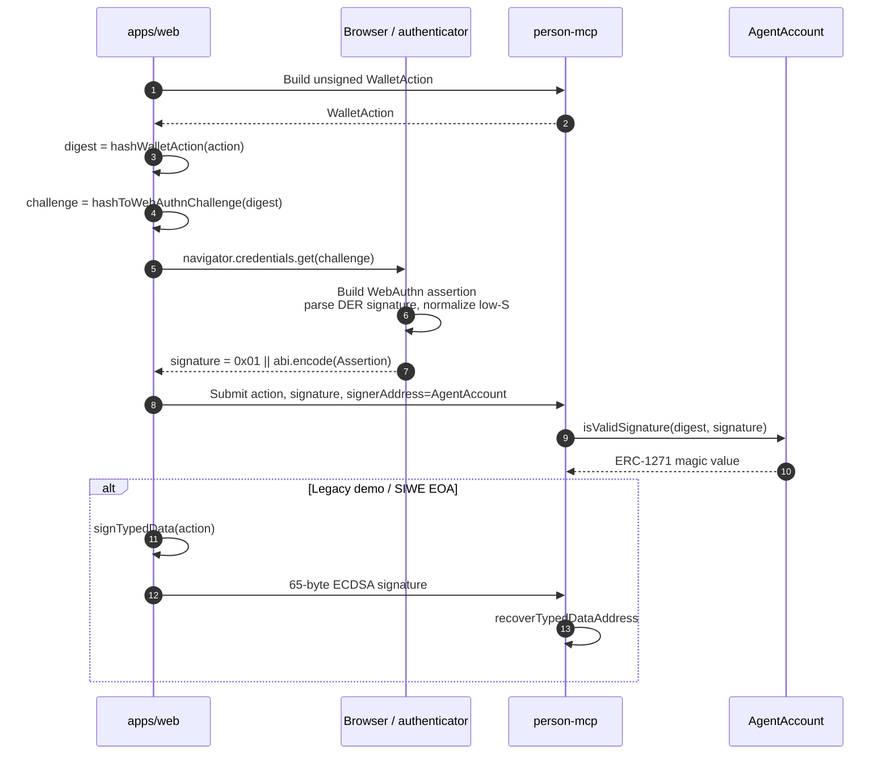
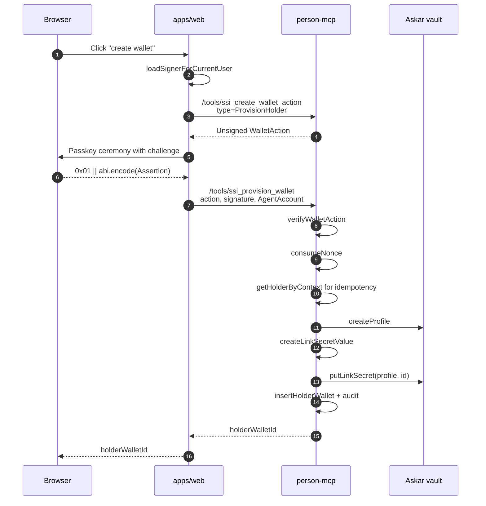
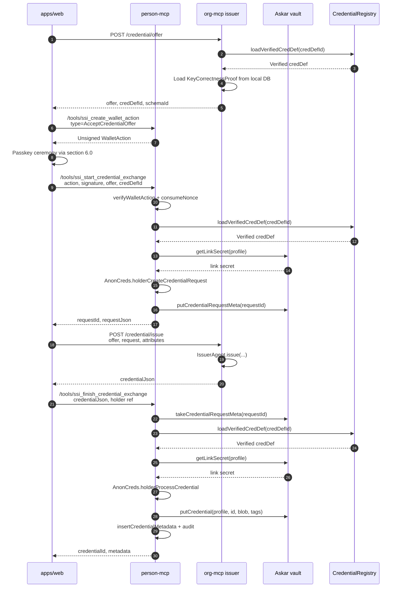
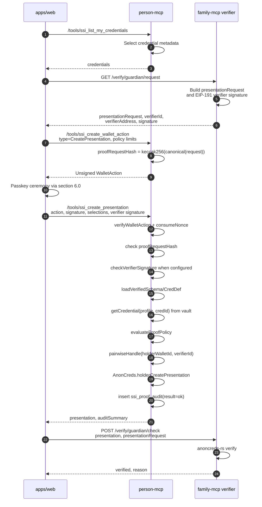
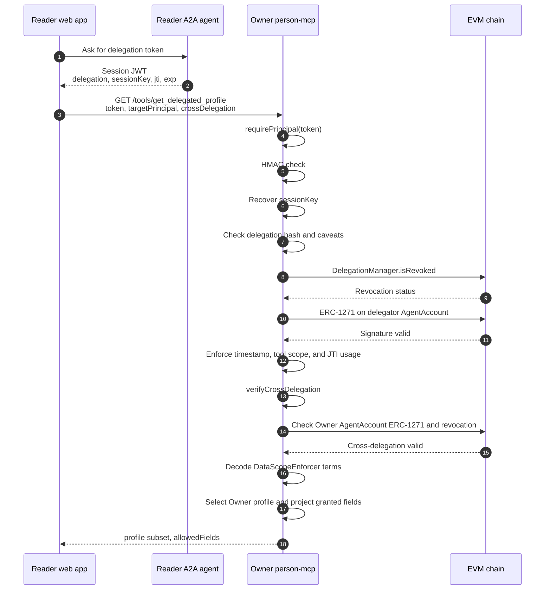
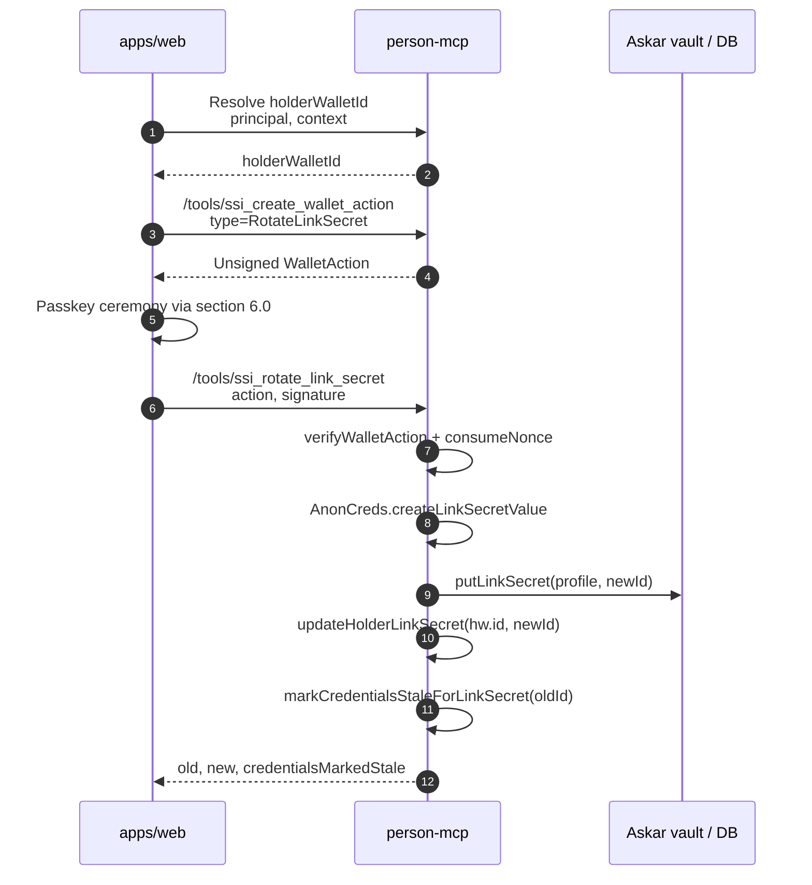

# AnonCreds and `person-mcp`

End-to-end documentation of how Smart Agent issues, stores, and presents
AnonCreds credentials. The system splits authority across `apps/web`
(UI + signer), `apps/person-mcp` (consent gateway, PII gateway, and
cryptographic holder vault), and an on-chain `CredentialRegistry` for
schema/credDef provenance.

This document covers:

- the conceptual model and trust split
- service topology + component layout
- storage layout per service
- object-interaction (sequence) diagrams for each privileged flow
- anti-correlation properties and policy layers
- a file-reference index

---

## 1. Conceptual model

### 1.1 What is AnonCreds here

AnonCreds-v1 (Hyperledger) gives us **selective disclosure**, **predicate
proofs** (e.g. "minorBirthYear ≥ 2006"), and **link secrets** (per-holder
secrets that bind every credential the holder owns and let them prove "all
these credentials are mine" without ever revealing the link secret itself).

The native `anoncreds-rs` binding is loaded once in the MCP process via
`AnonCreds.registerNativeBinding`. All holder-side cryptography (link secret
creation, credential request build, credential processing, presentation
creation) runs **inside `apps/person-mcp`** — never in the web app.

### 1.2 Runtime split


| Layer            | Process               | What it owns                                                                                             | What it never sees                                            |
| ---------------- | --------------------- | -------------------------------------------------------------------------------------------------------- | ------------------------------------------------------------- |
| UI + holder signer | `apps/web` (Next.js)  | User session, browser-side passkey ceremony for `WalletAction` envelopes (EIP-712 hash → WebAuthn assertion) | Link secrets, raw credentials, attribute values, passkey private key |
| Combined MCP     | `apps/person-mcp`     | Builds unsigned `WalletAction`s, re-verifies signatures, writes audit/metadata, gates PII via delegation, manages the encrypted holder vault, link secrets, credentials, and AnonCreds operations | The user's passkey private key or browser authenticator secret |


The split means a compromise of `apps/web` cannot reveal credentials or link
secrets. `apps/person-mcp` holds the vault, but it still cannot spend or sign
as the user: every privileged SSI action requires a signed, replay-protected
`WalletAction` whose passkey signature is verified through the user's
`AgentAccount`.

### 1.3 Trust roots


| Trust root                  | Source of truth                                                                                                                                                       | Verified by                                                                                                                                            |
| --------------------------- | --------------------------------------------------------------------------------------------------------------------------------------------------------------------- | ------------------------------------------------------------------------------------------------------------------------------------------------------ |
| Holder identity             | **Passkey (primary)** — `AgentAccount` ERC-1271; signature is `0x01 ‖ abi.encode(WebAuthnLib.Assertion)` validated on-chain by `_verifyWebAuthn` → `P256Verifier`. Legacy EOA fallback (demo / SIWE only) — 65-byte secp256k1 ECDSA against `users.walletAddress`. | `verifyWalletAction` in `packages/privacy-creds/src/wallet-actions/verify.ts` — routes by signature shape: ERC-1271 `readContract.isValidSignature` for passkeys, `recoverTypedDataAddress` for EOA. |
| Schema / CredDef provenance | `CredentialRegistry.sol` events on-chain                                                                                                                              | `loadVerifiedSchema` / `loadVerifiedCredDef` (in `packages/credential-registry`)                                                                       |
| Issuer identity             | `did:ethr:<chainId>:<address>` matched against `msg.sender` of publish tx                                                                                             | Resolver + `IssuerAgent.ensureIssuerRegistered`                                                                                                        |
| Verifier identity           | EIP-191 signature over the presentation request                                                                                                                       | `apps/person-mcp` verifier registry logic (only enforced when `SSI_KNOWN_VERIFIERS` is set)                                                            |

Location-specific credential semantics, `.geo` feature binding, and
third-party verifier receipts are documented separately in
`docs/architecture/agent-location-credential.md`.

## 2. Service topology

### 2.1 Arch diagram — running processes

```
Browser
   │
   │ HTTPS (cookies, server-actions)
   ▼
┌──────────────────────────────────────────┐         ┌──────────────────────┐
│ apps/web                  :3000          │  HTTP   │ apps/a2a-agent :3100 │
│  - Next.js App Router                    ├────────►│  (mints delegation   │
│  - SignInClient / SignUpClient           │         │   tokens for PII)    │
│  - server actions in lib/actions/ssi/    │         └──────────┬───────────┘
│  - lib/ssi/signer.ts (passkey primary,   │                    │
│    EOA fallback for demo/SIWE)           │                    │ delegation
│  - lib/ssi/clients.ts (HTTP clients)     │                    │ tokens
└────┬──────────────────────┬──────────────┘                    │
     │ /tools/*             │ /credential/* /verify/*           │
     ▼                      │ (issuer/verifier)                 │
┌──────────────────────┐    │       ┌───────────────────────────┴─────┐
│ apps/person-mcp :3200│    │       │ apps/org-mcp / apps/family-mcp  │
│  - HTTP + MCP stdio  │    │       │  (Issuer + Verifier)             │
│  - SSI tools         │    │       └──────────────┬──────────────────┘
│  - PII tools         │    │                      │ publishSchema /
│  - audit sqlite      │    │                      │ publishCredDef
│  - holder_wallets    │    │                      │
│  - action_nonces     │    │                      │
│  - credential_meta   │    │                      │
│  - Askar vault       │    │                      │
│  - native anoncreds  │    │                      │
└──────────┬───────────┘    │                      │
           │ readContract   │                      │
           ▼                ▼                      ▼
┌──────────────────────────────────────────────────────────────┐
│ EVM chain  (Anvil :8545)                                     │
│  - CredentialRegistry.sol                                    │
│  - AgentAccount (ERC-1271 verify)                            │
│  - AgentNameRegistry (.agent/.geo)                           │
│  - GeoFeatureRegistry / GeoClaimReg                          │
│  - DelegationManager                                         │
└──────────────────────────────────────────────────────────────┘
```

Default ports come from `apps/web/src/lib/ssi/config.ts`.

### 2.2 Public surface per service


| Service                          | Routes                                                                                                                                                                                                                                                                                                                              |
| -------------------------------- | ----------------------------------------------------------------------------------------------------------------------------------------------------------------------------------------------------------------------------------------------------------------------------------------------------------------------------------- |
| `person-mcp`                     | `POST /tools/<toolName>` for `ssi_create_wallet_action`, `ssi_provision_wallet`, `ssi_start_credential_exchange`, `ssi_finish_credential_exchange`, `ssi_create_presentation`, `ssi_list_my_credentials`, `ssi_list_wallets`, `ssi_list_proof_audit`, `ssi_rotate_link_secret`, plus profile/identity/chat tools (delegation-gated). Internally owns holder-wallet, credential, proof, nonce, and vault modules. |
| `org-mcp` (issuer)               | `POST /credential/offer`, `POST /credential/issue`, OID4VCI endpoints                                                                                                                                                                                                                                                               |
| `family-mcp` (issuer + verifier) | `POST /credential/offer`, `POST /credential/issue`, `GET /verify/guardian/request`, `POST /verify/guardian/check`                                                                                                                                                                                                                   |
| Third-party verifier agents       | Build signed presentation requests, verify AnonCreds presentations off-chain, optionally verify H3 inclusion / GeoSPARQL policy inputs, and issue signed verifier receipts or `GeoClaimRegistry` commitments                                                                                                                        |


---

## 3. Authority and signing model

The holder's signing key is a **WebAuthn passkey** bound to their
`AgentAccount`. The browser runs the WebAuthn ceremony; the resulting
P-256 assertion is validated on-chain via ERC-1271. EOA signing exists only
as a fallback for demo / SIWE users who happen to already control a server-
or wallet-held secp256k1 key.

```
┌──────────────────────────────────────────────────────────────────────────┐
│                      Smart Agent SSI authority graph                     │
└──────────────────────────────────────────────────────────────────────────┘

  ┌────────────────────────────────────┐                   ┌──────────────┐
  │  Holder signer (one-of)            │                   │              │
  │                                    │                   │              │
  │  ▶ Passkey (primary)               │                   │              │
  │    P-256 / ES256 / RP-bound        │                   │              │
  │    navigator.credentials.get(      │                   │              │
  │      challenge = EIP-712 hash)     │                   │              │
  │    → 0x01 ‖ abi.encode(Assertion)  │                   │              │
  │                                    │ EIP-712 typed     │ WalletAction │
  │  · EOA fallback (demo / SIWE only) │ data signed ────► │ envelope     │
  │    secp256k1 65-byte ECDSA         │                   │              │
  │    privateKeyToAccount             │                   │              │
  │      .signTypedData()              │                   │              │
  └────────────────────────────────────┘                   └──────┬───────┘
                                                                  │
                                       submitted via              │
                                       person-mcp tools           │
                                                                  ▼
              ┌──────────────────────┐               ┌──────────────────────┐
              │ AgentAccount.sol     │               │ person-mcp           │
              │  isValidSignature?   │◄──────────────┤  SSI tools + vault   │
              │  ─ 0x00 ‖ ecdsa →    │  readContract │  verifyWalletAction  │
              │     owner check      │               │   ▸ shape-routes:    │
              │  ─ 0x01 ‖ Assertion →│               │     65 bytes  → ECDSA│
              │    _verifyWebAuthn → │               │     0x01 ‖ … → 1271  │
              │    WebAuthnLib       │               │     0x00 ‖ … → 1271  │
              │    → P256Verifier    │               │  runs anoncreds-rs   │
              └──────────────────────┘               └──────────┬───────────┘
                                                                │
                                                                │ unwraps DEK,
                                                                │ runs anoncreds-rs
                                                                ▼
                                                  ┌───────────────────────────┐
                                                  │ Askar vault (per profile) │
                                                  │  - link_secret/<id>       │
                                                  │  - credential/<id>        │
                                                  │  - credential_request/    │
                                                  └───────────────────────────┘
```

Three invariants live in this picture:

1. **Passkey signing is a client-side ceremony.** `apps/web` only computes
   the EIP-712 hash via `prepareWalletActionForPasskey` (in
   `apps/web/src/lib/ssi/signer.ts`); the browser runs
   `navigator.credentials.get({ challenge: hashToWebAuthnChallenge(hash) })`
   and `packWebAuthnSignature` packages the assertion as
   `0x01 ‖ abi.encode(WebAuthnLib.Assertion)`. The passkey private key
   never reaches Node — it lives in the platform authenticator
   (Secure Enclave / TPM / hybrid phone). Server-side flows that *require*
   a signature for an OAuth / passkey-only user always do a
   server → browser → server round trip.
2. **Link secrets never leave the vault module.** `person-mcp` has no tool
   for "give me the link secret" — it only exposes operations performed *with*
   the link secret.
3. **The same envelope, two signature shapes.** `person-mcp` does not
   care which signer produced the `WalletAction`; `verifyWalletAction`
   first asks `AgentAccount.isValidSignature` (covering both passkey and
   ECDSA owner shapes via the on-chain router) and falls back to
   `recoverTypedDataAddress` for the legacy demo/SIWE EOA-direct path.

> **EOA fallback in passing.** Demo users have a server-stored
> `users.privateKey` (only used for scripted seeds and tests). SIWE users
> hold their secp256k1 key in MetaMask. Both paths produce a plain 65-byte
> ECDSA signature against `users.walletAddress`. They exist because they
> existed before passkey was wired in; the production sign-in flow on
> Google / Passkey / OAuth does **not** use them.

### 3.1 The `WalletAction` envelope

EIP-712 typed data, defined in
`packages/privacy-creds/src/wallet-actions/types.ts`. Every privileged route
on `person-mcp`'s SSI tools requires a fresh, signed action with:


| Field                                                    | Purpose                                                                                                               |
| -------------------------------------------------------- | --------------------------------------------------------------------------------------------------------------------- |
| `type`                                                   | One of `ProvisionHolderWallet`, `AcceptCredentialOffer`, `CreatePresentation`, `RevokeCredential`, `RotateLinkSecret` |
| `personPrincipal`                                        | Bound to `holder_wallets.person_principal`; mismatched principal = 400                                                |
| `walletContext`                                          | `default                                                                                                              |
| `holderWalletId`                                         | Bound to `holder_wallets.id` (or `pending` for provision)                                                             |
| `counterpartyId`                                         | DID of issuer or verifier, or `self` for provision                                                                    |
| `purpose`                                                | Free-text label rendered in audit                                                                                     |
| `proofRequestHash`                                       | `keccak256(canonicalJson(presentationRequest))`; tamper-evidence                                                      |
| `allowedReveal` / `allowedPredicates` / `forbiddenAttrs` | Outer policy declared by the signer                                                                                   |
| `nonce`                                                  | 32-byte random; consumed once in `action_nonces`                                                                      |
| `expiresAt`                                              | uint64 seconds; outer TTL                                                                                             |


`DEFAULT_FORBIDDEN_ATTRS` (also in `types.ts`) is a hard server-side block
list — `legalName`, `email`, `phone`, `dob`, `dateOfBirth`, `address`, `ssn`,
`globalPersonId`, `privyWalletAddress` — that `person-mcp` refuses to
disclose **even if the signed action allows them**.

### 3.2 Signature shapes and on-chain validator

The same `WalletAction` digest is signed by exactly one of two shapes,
both exposed to `person-mcp` as an opaque `bytes signature`:

| Shape (first byte) | Body                                                                                                                                          | Produced by                                                                                            | Verified by                                                          |
| ------------------ | --------------------------------------------------------------------------------------------------------------------------------------------- | ------------------------------------------------------------------------------------------------------ | -------------------------------------------------------------------- |
| **`0x01` ‖ enc**   | `abi.encode(WebAuthnLib.Assertion { authenticatorData, clientDataJSON, challengeIndex, typeIndex, r, s, x, y })` — produced from a P-256 passkey assertion | Browser passkey ceremony, packaged in `packWebAuthnSignature` (`packages/sdk/src/passkey.ts`)         | `AgentAccount._verifyWebAuthn` → `WebAuthnLib.verify` → `P256Verifier.verifySignature` (RIP-7212 precompile when present, else pure-Solidity) |
| **`0x00` ‖ ecdsa** | 65-byte secp256k1 signature, recipient is an `_owners` member                                                                                 | `AgentAccount` owner key (rare in production; mostly tests)                                            | `AgentAccount._verifyEcdsa` (`ECDSA.recover` against `_owners`)      |
| **65-byte ecdsa**  | Plain `r ‖ s ‖ v` — *not* prefixed                                                                                                            | `users.privateKey` (demo) or MetaMask (SIWE), via `signWalletAction` direct path (`signer.ts`)         | `verifyWalletAction` calls `recoverTypedDataAddress` and matches against `users.walletAddress` |

The first two shapes are validated through the smart account; the third
exists only for legacy-EOA holders. The on-chain router lives at the
top of `AgentAccount.isValidSignature`:

```
if signature.length >= 1 && signature[0] == 0x01:
    return _verifyWebAuthn(hash, signature[1:])  // passkey path
if signature.length >= 1 && signature[0] == 0x00:
    return _verifyEcdsa(hash, signature[1:])     // owner-EOA over wrapper
return _verifyEcdsa(hash, signature)             // legacy 65-byte ECDSA
```

`WebAuthnLib.verify` reconstructs the WebAuthn `signedHash` =
`sha256(authenticatorData ‖ sha256(clientDataJSON))`, asserts the embedded
`challenge` (base64url) equals
`hashToWebAuthnChallenge(WalletAction digest)`, then delegates to
`P256Verifier.verifySignature`. That function dispatches to the
RIP-7212 precompile at `0x100` when available (Anvil with the right flag,
mainnet post-Pectra) and otherwise runs a pure-Solidity `ecrecover`-style
P-256 check.

The SDK helpers that drive this end-to-end:

| Helper                       | File                                | Role                                                                          |
| ---------------------------- | ----------------------------------- | ----------------------------------------------------------------------------- |
| `prepareWalletActionForPasskey` | `apps/web/src/lib/ssi/signer.ts` | Builds the EIP-712 hash on the server, returns `{ digest, challenge }`        |
| `hashToWebAuthnChallenge`    | `packages/sdk/src/passkey.ts`       | EIP-712 hash → base64url challenge accepted by `navigator.credentials.get`    |
| `buildPasskeyAssertion`      | `packages/sdk/src/passkey.ts`       | Browser-side: parse `AuthenticatorAssertionResponse` into the struct shape    |
| `parseDerSignature` / `normaliseLowS` | `packages/sdk/src/passkey.ts` | Convert WebAuthn DER signature to `(r,s)` and enforce low-S                    |
| `packWebAuthnSignature`      | `packages/sdk/src/passkey.ts`       | Produces `0x01 ‖ abi.encode(Assertion)` to hand back to server                 |
| `signWalletAction`           | `apps/web/src/lib/ssi/signer.ts`    | Demo / SIWE EOA fallback only — direct EIP-712 sign with secp256k1            |

---

## 4. Storage layout

### 4.1 `person-mcp` SSI vault — operational SQLite + Askar vault

Operational SQLite inside `apps/person-mcp`:

```
holder_wallets
  id              TEXT PK
  person_principal TEXT   -- e.g. "person_<userId>" or smart-account address
  wallet_context  TEXT   -- 'default' | 'professional' | 'personal' | …
  signer_eoa      TEXT   -- address that signed the provision action
  askar_profile   TEXT   -- name of the Askar profile holding this wallet's secrets
  link_secret_id  TEXT   -- pointer into Askar
  status          TEXT   -- active | rotating | revoked
  created_at      TEXT
  UNIQUE (person_principal, wallet_context)

action_nonces                     -- replay protection for WalletActions
  nonce            TEXT PK
  action_type      TEXT
  holder_wallet_id TEXT
  expires_at       INTEGER
  used_at          TEXT

credential_metadata               -- public, no attribute values, no blobs
  id              TEXT PK
  holder_wallet_id TEXT
  issuer_id        TEXT
  schema_id        TEXT
  cred_def_id      TEXT
  credential_type  TEXT
  received_at      TEXT
  status           TEXT
  link_secret_id   TEXT             -- which secret this cred is bound to
```

Askar-style vault inside `apps/person-mcp` — pure-JS,
SQLite-backed, AES-256-GCM at the library layer:

```
profiles                          -- one per (principal, walletContext) pair
  name           TEXT PK            -- e.g. "wallet:<sha256(principal|context)>"
  wrapped_dek    BLOB              -- DEK encrypted under KEK = scrypt(SSI_ASKAR_KEY)
  dek_iv, dek_tag BLOB
  created_at     TEXT

vault_kv                          -- generic (profile, category, name) → ciphertext
  profile, category, name PK
  iv, ciphertext, tag    BLOB     -- AES-256-GCM under that profile's DEK; AAD = profile|category|name
  tags                   JSON
```

Categories used:


| Category             | Name pattern     | Value                                                                 |
| -------------------- | ---------------- | --------------------------------------------------------------------- |
| `link_secret`        | `<linkSecretId>` | random 32-byte AnonCreds link secret                                  |
| `credential`         | `<credentialId>` | full processed AnonCreds credential JSON                              |
| `credential_request` | `<requestId>`    | one-shot blinding metadata + offer (consumed by `/credentials/store`) |


Per-profile DEKs mean compromise of one profile doesn't leak others; each
encryption commits to its own AAD so a row can't be silently moved between
profiles or categories.

### 4.2 `person-mcp` audit, metadata, identities, profile

`apps/person-mcp/src/db/schema.ts` — the SSI-relevant tables:

```
ssi_holder_wallets        -- local holder-wallet index
  principal, walletContext, walletContext, privyEoa,
  holderWalletRef → holder_wallets.id
  linkSecretRef   → Askar link_secret id
  status, createdAt

ssi_credential_metadata   -- mirror of credential_metadata (no values, no blobs)
  principal, walletContext, holderWalletRef,
  issuerId, schemaId, credDefId, credentialType,
  receivedAt, status

ssi_proof_audit           -- one row per /proofs/present attempt
  principal, walletContext, holderWalletRef,
  verifierId, purpose, revealedAttrs (JSON),
  predicates (JSON), actionNonce, pairwiseHandle,
  holderBindingIncluded, result ('ok' | 'denied' | 'error'),
  createdAt
```

Note the profile / address / chat tables already documented elsewhere are
**not** SSI tables — they're delegation-gated PII unrelated to AnonCreds.

### 4.3 On-chain — `CredentialRegistry`

```
Issuer registration: registerIssuer(did, addr)
  → IssuerRegistered event
  → resolver.resolveIssuer(addr) returns { did, address, registeredAt }

Schema publication:   publishSchema(schemaId, hexJson)
  → SchemaPublished event  (canonical JSON in event data)
  → on-chain: schemaJsonHash[schemaId] = keccak256(canonicalJson)

CredDef publication:  publishCredDef(credDefId, schemaId, hexJson)
  → CredDefPublished event
  → on-chain: credDefJsonHash[credDefId] = keccak256(canonicalJson)
```

`packages/credential-registry/src/types.ts` carries the typed views; the
on-chain hash is the only authority — `loadVerifiedSchema` /
`loadVerifiedCredDef` rebuild the JSON from event data and re-hash it before
returning.

Issuer-private material (`CredentialDefinitionPrivate`,
`KeyCorrectnessProof`) lives **only** in the issuer's local SQLite
(`packages/privacy-creds/src/issuer/index.ts`). It's never on chain and is
not recoverable from the public record — wipe-and-re-publish if lost.

### 4.4 On-chain — `.geo`, feature records, and claim anchors

Location credentials do not put exact location evidence on chain. The public
chain stores only feature provenance and optional claim anchors:

```
AgentNameRegistry
  root "geo" → namehash(".geo")
  erie.colorado.us.geo → nameNode

GeoFeatureRegistry
  featureId
  version
  stewardAccount
  featureKind
  geometryHash       -- hash of canonical GeoJSON/WKT payload
  h3CoverageRoot     -- Merkle root over public H3 coverage cells
  sourceSetRoot      -- provenance dataset commitment
  metadataURI        -- full public feature document
  centroid / bbox    -- map and pre-filter only, not spatial truth

GeoClaimRegistry
  claimId
  subjectAgent
  issuer
  featureId / featureVersion
  relation
  visibility         -- Public | PublicCoarse | PrivateCommitment | PrivateZk | OffchainOnly
  evidenceCommit     -- hash of verifier receipt / proof transcript / evidence bundle
  edgeId / assertionId
  confidence
  policyId
  validAfter / validUntil
```

`geometryHash` and `h3CoverageRoot` are public commitments. They make a
third-party verifier's work reproducible, but they do not verify a private
location by themselves. A verifier still checks the holder's AnonCreds proof
and any H3 inclusion proof off-chain, then signs or publishes a receipt.

---

## 5. Component model

```
                                           ┌────────────────────────────┐
                                           │ packages/privacy-creds     │
                                           │  - WalletAction types      │
                                           │  - hash / verify helpers   │
                                           │  - evaluateProofPolicy     │
                                           │  - AnonCreds.* (anoncreds-rs│
                                           │    facade; node binding   ) │
                                           │  - IssuerAgent class       │
                                           └────────────┬───────────────┘
                                                        │
                                                        │ imported by
                                                        ▼
       ┌─────────────────────────────────────────────────────────────────┐
       │                                                                 │
       │  apps/web/src/lib/ssi/*  (signer, clients, config)              │
       │  apps/web/src/lib/actions/ssi/*  (provision, accept, present,   │
       │                                   rotate, oid4vci-redeem)       │
       │                                                                 │
       └─┬──────────────────────────────────────────────┬────────────────┘
         │                                              │
        │  HTTP /tools/<name>                          │ HTTP /credential/* /verify/*
         ▼                                              ▼
  ┌──────────────────────────┐                 ┌──────────────────────────┐
  │ apps/person-mcp          │                 │ apps/{org,family}-mcp    │
  │ src/tools/ssi-wallet.ts  │                 │ src/issuers/*            │
  │  - ssi_create_wallet_act │                 │ src/api/credential.ts    │
  │  - ssi_provision_wallet  │                 │ src/api/oid4vci.ts       │
  │  - ssi_start_…/finish_…  │                 │ src/registry/mock-*      │
  │  - ssi_create_presentat. │                 │  uses IssuerAgent +      │
  │  - ssi_list_…            │                 │  CredentialRegistry      │
  │  - ssi_rotate_link_secret│                 └──────────────────────────┘
  │ src/auth/verify-deleg.ts │                              │
  │ src/db/schema.ts         │                              │ writeContract
  │   ssi_holder_wallets,    │                              ▼
  │   ssi_credential_metadata│                     ┌─────────────────────┐
  │   ssi_proof_audit        │                     │ CredentialRegistry  │
  │ src/auth/verify-wallet-action.ts           │   .sol (on-chain)   │
  │ src/auth/verifier-registry.ts              └─────────────────────┘
  │ src/storage/askar.ts
  │ src/storage/wallets.ts
  │ src/storage/cred-metadata.ts
  │ src/storage/nonces.ts
  └──────────────────────────┘
```

---

## 6. Object-interaction diagrams (sequence)

The diagrams below use these participants consistently:

- `B`  = Browser (also runs the WebAuthn passkey ceremony)
- `Web` = `apps/web` server actions
- `MCP` = `apps/person-mcp` (combined consent gateway, SSI vault, and PII gateway)
- `Issuer` = `apps/org-mcp` or `apps/family-mcp`
- `Reg` = `CredentialRegistry.sol` on-chain
- `AA` = `AgentAccount.sol` (the smart account; ERC-1271 verifier for passkeys)

### 6.0 The standard "sign a `WalletAction`" sub-flow

Every privileged sequence below ends up in the same three-step pattern:



The legacy EOA fallback collapses the middle step — `signer.ts`'s
`signWalletAction` calls `account.signTypedData(...)` directly — but every
production-shaped flow assumes the passkey round-trip above.

### 6.1 Provision a holder wallet (first time per `(principal, context)`)

`provisionHolderWalletAction` (`apps/web/src/lib/actions/ssi/provision.action.ts`).



Idempotency: a second provision for the same `(principal, walletContext)`
short-circuits with the existing wallet without consuming a new nonce.

### 6.2 Issue a credential (org membership)

`acceptCredentialAction(... 'org', 'OrgMembershipCredential' …)`.
`apps/web/src/lib/actions/ssi/accept.action.ts`.



Note the **two-leg** request/store split. The blinding metadata generated
during `holderCreateCredentialRequest` must survive the round-trip to the
issuer; it lives in Askar under `category=credential_request, name=requestId`
and is consumed once when the issued credential comes back. That category is
the only place Askar stores something time-bounded — every other secret is
long-lived.

### 6.3 Present a credential (guardian-of-minor → coach)

`presentGuardianToCoachAction`
(`apps/web/src/lib/actions/ssi/present.action.ts`).



Three independent layers reject a bad presentation request:

1. **Outer signed policy**: the user's `WalletAction` declared the universe
  of allowed reveals/predicates. Anything not listed is rejected.
2. **Inner default forbidden list**: `person-mcp`'s
  `evaluateProofPolicy` always layers `DEFAULT_FORBIDDEN_ATTRS` on top.
3. `**proofRequestHash` tamper-evidence**: the full request body must hash to
  exactly the value the user signed. A man-in-the-middle changing
   `requested_attributes` between sign and submit invalidates the action.

If `SSI_KNOWN_VERIFIERS` is set, a fourth layer rejects requests whose
verifier-signed envelope doesn't match the registry.

### 6.4 Cross-principal PII access (delegation chain)

This is the path person-mcp's `get_delegated_profile` uses (referenced from
`apps/web/src/app/(authenticated)/catalyst/me/ProfileClient.tsx` and the A2A
agent). It is **not** an AnonCreds flow — it's how PII (email, DOB, address)
is shared between two principals — but the diagram completes the picture
because person-mcp is the gateway to *both* SSI tools and PII tools.



The two delegations (session and cross) are independent. The session proves
*the caller is who they say they are*; the cross-delegation proves *the
owner authorised the caller to read these specific fields*. Person-mcp
verifies both.

### 6.5 Rotate a link secret

`rotateLinkSecretAction` (`apps/web/src/lib/actions/ssi/rotate.action.ts`).



Rotation invalidates every credential previously bound to the old link
secret — those rows are flagged `stale` in `credential_metadata` and the
holder must re-issue. The **old link secret stays in Askar** so a forensic
operator can reproduce historical proofs if needed; new presentations cannot
be created against it because the live `holder_wallets.link_secret_id` no
longer points at it.

---

## 7. Anti-correlation and policy properties


| Property                     | Mechanism                                                                                                                                                                                                    | Where it lives                                                                                   |
| ---------------------------- | ------------------------------------------------------------------------------------------------------------------------------------------------------------------------------------------------------------ | ------------------------------------------------------------------------------------------------ |
| Per-context unlinkability    | One Askar profile + one link secret per `(principal, walletContext)`. Two contexts can never produce a "same-holder" proof across each other.                                                                | `apps/person-mcp` SSI vault provision flow                                                       |
| Pairwise verifier handle     | `pairwiseHandle(holderWalletId, verifierId)` deterministically produces a per-verifier opaque ID; presented as self-attested `holder` slot. Different verifiers cannot collude to correlate the same holder. | `packages/privacy-creds` (`pairwiseHandle`); `apps/person-mcp` presentation flow                 |
| Hard-forbidden attrs         | `DEFAULT_FORBIDDEN_ATTRS` enforced at the `evaluateProofPolicy` layer regardless of signed action.                                                                                                           | `packages/privacy-creds/src/wallet-actions/types.ts`, `policy/proof-policy.ts`                   |
| Presentation minimisation    | Reveals dominated by predicates on the same attribute are dropped before calling anoncreds-rs.                                                                                                               | `evaluateProofPolicy` step 4                                                                     |
| Replay protection            | `action_nonces` table is INSERT-only; double-use is `409 Conflict`. Nonces have explicit expiry.                                                                                                             | `apps/person-mcp` nonce storage                                                                  |
| Tamper evidence              | `proofRequestHash = keccak256(canonical(body))` is part of the signed envelope. Any change to the request body invalidates the signature.                                                                    | `hashProofRequest` in `packages/privacy-creds`; check in `apps/person-mcp` presentation flow     |
| Verifier registry (optional) | When `SSI_KNOWN_VERIFIERS` is set, `person-mcp` requires verifier to sign their request, registry maps DID→address, presentation refused otherwise.                                                          | `apps/person-mcp` verifier registry logic                                                        |
| Schema/credDef provenance    | All resolutions go through `loadVerifiedSchema` / `loadVerifiedCredDef`, which check `keccak256(canonicalJson)` against the on-chain hash before returning.                                                  | `packages/credential-registry`                                                                   |
| Issuer-private isolation     | `CredentialDefinitionPrivate` and `KeyCorrectnessProof` never leave the issuer's local SQLite. The on-chain record contains only public material.                                                            | `packages/privacy-creds/src/issuer/index.ts`                                                     |
| Location minimisation        | `AgentLocationCredential` stores feature-level claims and commitments, not exact addresses, raw coordinates, private H3 cells, Merkle paths, or evidence documents.                                           | Credential schema, verifier policy, `GeoFeatureRegistry`, `GeoClaimRegistry`                     |
| Off-chain verifier receipts  | Third-party verifiers check AnonCreds and H3 inclusion off-chain, then return a signed receipt / `evidenceCommit`; on-chain anchoring is optional and commitment-only.                                       | Third-party verifier agent / MCP, optional `GeoClaimRegistry`                                    |
| Vault-at-rest                | Per-profile DEK wrapped by KEK = `scrypt(SSI_ASKAR_KEY)`. AES-256-GCM with per-row AAD bound to profile, category, and row name.                                                                              | `apps/person-mcp` Askar-style vault storage                                                      |


---

## 8. Operational notes

- **Bring-up order**: Anvil → deploy contracts → issuer/verifier MCPs
(`org-mcp` 3400, `family-mcp` 3500) → `person-mcp` (3200) → `apps/web`
(3000). The web app's `ssiConfig` reads ports from env; defaults in
`apps/web/src/lib/ssi/config.ts`.
- **Native binding**: `@hyperledger/anoncreds-nodejs` is registered exactly
once in the MCP process. Re-registering in another process (e.g. an issuer
MCP) is fine; re-registering twice in the same process throws.
- **KEK rotation** is a destructive global action — see
`docs/ops/ssi-wallet-kek-rotation.md`. Do not change `SSI_ASKAR_KEY`
without running the rotation procedure or every profile becomes
undecryptable.
- **Demo seeds**: `scripts/seed-*.sh` calls `apps/web` server actions to
walk new users through provision + accept + present without manual UI
interaction. Inspect `apps/web/src/lib/demo-seed/*` for the canonical
end-to-end shape.
- **Phase markers** (`Phase 4` etc. in code comments) are historical: in
the current code path *every* WalletAction is verified via the gate; the
Phase-4 phrasing in `apps/person-mcp/src/tools/ssi-wallet.ts` refers to
the eventual move to delegation-token gating for SSI tools (today they
take an explicit `principal` arg).

---

## 9. File reference index

### Web app (`apps/web`)


| File                                           | Role                                                                                  |
| ---------------------------------------------- | ------------------------------------------------------------------------------------- |
| `src/lib/ssi/config.ts`                        | Service URLs, chain config                                                            |
| `src/lib/ssi/clients.ts`                       | HTTP clients for `person`, `org`, `family` MCPs                                       |
| `src/lib/ssi/signer.ts`                        | `prepareWalletActionForPasskey` (primary); `signWalletAction` direct EOA fallback     |
| `src/lib/actions/ssi/provision.action.ts`      | First-time wallet creation                                                            |
| `src/lib/actions/ssi/accept.action.ts`         | Membership / guardian credential issuance                                             |
| `src/lib/actions/ssi/oid4vci-redeem.action.ts` | OID4VCI variant of `accept`                                                           |
| `src/lib/actions/ssi/present.action.ts`        | Build + submit a presentation                                                         |
| `src/lib/actions/ssi/rotate.action.ts`         | Rotate the link secret                                                                |
| `src/lib/actions/geo-claim.action.ts`          | Mint public `GeoClaimRegistry` rows and list `GeoFeatureRegistry` records             |
| `src/lib/actions/trust-search.action.ts`       | Combines org-overlap and geo-overlap inputs for discovery/trust search                |
| `src/app/(authenticated)/settings/passkeys/PasskeysClient.tsx` | Browser-side passkey enrolment / ceremony entry point                  |


### `packages/privacy-creds`


| File                                | Role                                                   |
| ----------------------------------- | ------------------------------------------------------ |
| `src/wallet-actions/types.ts`       | EIP-712 `WalletAction` type, `DEFAULT_FORBIDDEN_ATTRS` |
| `src/wallet-actions/hash.ts`        | `hashProofRequest`, canonical JSON                     |
| `src/wallet-actions/verify.ts`      | `verifyWalletAction` (ECDSA + ERC-1271)                |
| `src/policy/proof-policy.ts`        | `evaluateProofPolicy`                                  |
| `src/policy/anti-correlation.ts`    | `pairwiseHandle`                                       |
| `src/formats/anoncreds-v1/index.ts` | `AnonCreds.*` facade over `anoncreds-rs`               |
| `src/issuer/index.ts`               | `IssuerAgent` (publish, offer, issue)                  |
| `src/verifier-signing.ts`           | EIP-191 verifier-request signature helpers             |
| `src/geo-overlap.ts`                | Versioned geo-overlap scoring helpers and evidence commitments |


### `packages/sdk` (passkey helpers)

| File                       | Role                                                                                          |
| -------------------------- | --------------------------------------------------------------------------------------------- |
| `src/passkey.ts`           | `buildPasskeyAssertion`, `parseDerSignature`, `normaliseLowS`, `packWebAuthnSignature`, `hashToWebAuthnChallenge` |
| `src/cose-parse.ts`        | Parse COSE public keys out of WebAuthn attestation objects (registration time)                |

### `packages/contracts` (on-chain validator chain)

| File                                  | Role                                                                                  |
| ------------------------------------- | ------------------------------------------------------------------------------------- |
| `src/AgentAccount.sol`                | `isValidSignature` shape-router; passkey storage; `_verifyWebAuthn` / `_verifyEcdsa`  |
| `src/libraries/WebAuthnLib.sol`       | Parse `clientDataJSON` + `authenticatorData`, recompute signed hash, call P-256 verifier |
| `src/libraries/P256Verifier.sol`      | RIP-7212 precompile dispatch with pure-Solidity fallback                              |
| `src/AgentNameRegistry.sol`           | Multi-root naming substrate for `.agent`, `.geo`, `.pg`                               |
| `src/GeoFeatureRegistry.sol`          | Versioned `.geo` feature records: geometry hash, H3 coverage root, source root        |
| `src/GeoClaimRegistry.sol`            | Geo claim anchors: relation, visibility, confidence, evidence commitment              |

### `packages/discovery` / GraphDB

| File                | Role                                                                 |
| ------------------- | -------------------------------------------------------------------- |
| `src/geo-sparql.ts` | GeoSPARQL queries for feature containment, intersections, and claims |
| `src/sparql.ts`     | General KB query builders                                            |

### `circuits`

| File                         | Role                                                                                         |
| ---------------------------- | -------------------------------------------------------------------------------------------- |
| `src/h3-membership.circom`   | Current H3 inclusion circuit scaffold; used as an off-chain verifier/prover path, not required for on-chain AnonCreds verification |

### `apps/person-mcp`


| File                            | Role                                                                           |
| ------------------------------- | ------------------------------------------------------------------------------ |
| `src/index.ts`                  | MCP stdio + Hono `/tools/<name>` HTTP; native binding registration             |
| `src/tools/ssi-wallet.ts`       | `ssi_*` tools — consent gateway for SSI wallet actions                         |
| `src/tools/profile.ts`          | PII tools (delegation-gated)                                                   |
| `src/tools/identities.ts`       | OAuth/social link tools                                                        |
| `src/auth/verify-delegation.ts` | Full chain verifier (HMAC + ECDSA + ERC-1271 + caveats + JTI)                  |
| `src/auth/principal-context.ts` | `requirePrincipal` helper                                                      |
| `src/db/schema.ts`              | PII, audit, holder-wallet, credential metadata, proof audit, and mirror tables  |
| SSI vault module                | Holder wallets, credentials, proofs, verifier registry, nonces, and Askar vault |


### Issuer / verifier (examples)


| File                                     | Role                                                               |
| ---------------------------------------- | ------------------------------------------------------------------ |
| `apps/org-mcp/src/issuers/membership.ts` | `OrgMembershipCredential` issuer wiring                            |
| `apps/org-mcp/src/api/credential.ts`     | `/credential/offer`, `/credential/issue`                           |
| `apps/org-mcp/src/api/oid4vci.ts`        | OID4VCI pre-authorised flow                                        |
| `apps/family-mcp/...`                    | `GuardianOfMinorCredential` issuer + `/verify/guardian/*` verifier |


---

## 10. TL;DR

- **Two-runtime split** keeps the browser/web signer separate from the MCP
  holder vault. `apps/person-mcp` now owns consent tools, PII tools, and SSI
  vault operations in one service.
- **`WalletAction` is the single capability token.** The holder signs it
  in the **browser via a WebAuthn passkey** (`navigator.credentials.get`
  with the EIP-712 hash as the WebAuthn challenge); the resulting
  P-256 assertion is wrapped as `0x01 ‖ abi.encode(Assertion)` and
  validated on-chain by `AgentAccount` → `WebAuthnLib` → `P256Verifier`
  via ERC-1271. Demo / SIWE EOA signing exists only as a legacy fallback.
- **AnonCreds operations** (link secret, credential request, processing,
  presentation) all happen inside `person-mcp` using the native
  `anoncreds-rs` binding. Link secrets are per-`(principal, context)` and
  never leave the vault module.
- **CredentialRegistry** on-chain is the source of truth for
  schema/credDef. Resolvers re-hash the canonical JSON before trusting it.
- **AgentLocationCredential** is feature-level, not address-level. It carries
  `featureId`, `featureVersion`, relation, issuer, confidence, validity, and
  `evidenceCommit`; exact addresses, coordinates, private H3 cells, and
  evidence documents stay outside SQL and outside chain state.
- **Third-party verifiers run proofs off-chain.** They verify AnonCreds
  presentations and any H3/GeoSPARQL policy inputs in their agent/MCP runtime,
  then issue a signed receipt or optional `GeoClaimRegistry` commitment. Use
  on-chain verifier contracts only when another contract must consume the
  proof directly.
- **Person-mcp** is both the SSI consent/vault gateway and the PII gateway
  (delegation-chain-verified profile reads). SSI actions still require signed
  `WalletAction`s before the vault is used.
- **Anti-correlation** is enforced in three layers: per-context link
  secrets, pairwise handles per verifier, and the hard-forbidden attribute
  list inside `evaluateProofPolicy`.

