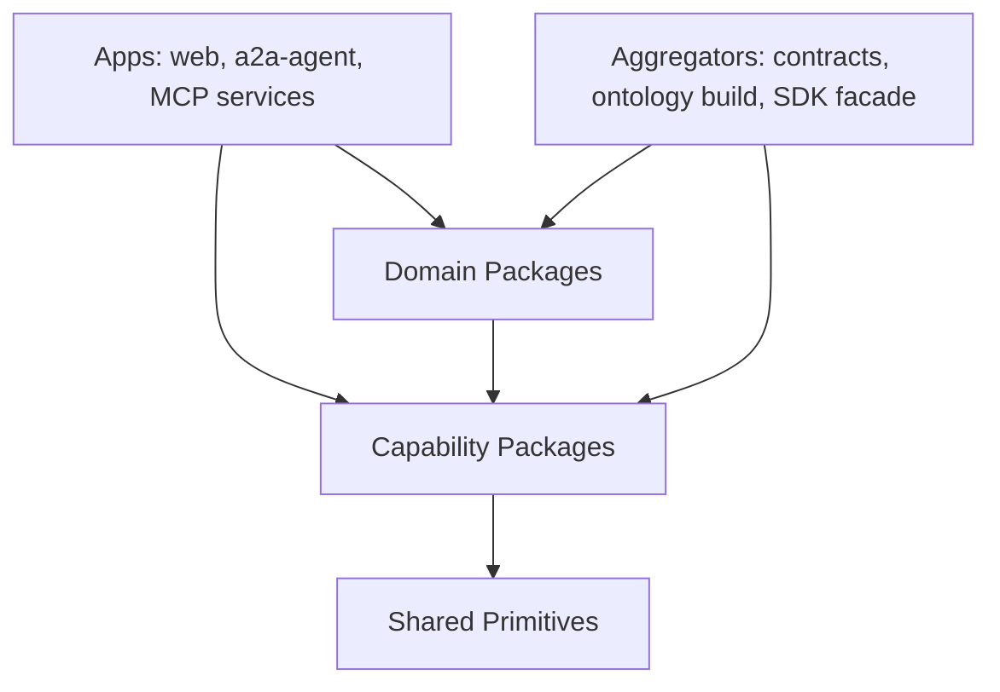

# Capability Package Structure

## Purpose

Smart Agent should move from a repo organized around implementation layers (`apps`, `sdk`, `contracts`, `ontology`) toward reusable capability packages. Each capability is a product boundary that owns its TypeScript API, Solidity contracts, ontology terms, MCP tools, GraphDB projections, policies, tests, docs, examples, and local agent context.

This structure has three goals:

- make Smart Agent reusable across Catalyst, retail, travel, health, enterprise, and custom domains,
- make contract and ontology ownership explicit,
- make Claude and other coding agents faster by giving them small, local package contexts instead of one large repo context.

## Target Shape



Apps are deployable shells. Capabilities own reusable product logic. Domains own vertical vocabulary, copy, adapters, seed data, and domain-specific workflows. Aggregators compile and publish generated outputs, but they are not the semantic owners.

## Repository Layout

```text
packages/
  shared/
    types/
    test-fixtures/
    build-config/

  capabilities/
    experience-adapters/
    agent-account/
    agent-naming/
    identity-profile/
    relationship-graph/
    trust-reputation/
    delegation/
    identity-auth/
    key-custody/
    credential-proof/
    mcp-runtime/
    a2a-runtime/
    agent-orchestration/
    tool-policy/
    graph-discovery/
    registry-assertions/
    governance-controls/
    ontology-core/
    observability/
    work-intents/
    treasury-controls/
    wallet-actions/
    agentic-payments/
    payments-settlement/
    funding-marketplace/
    geo/
    skills/
    people-groups/
    family/
    test-support/

  domains/
    catalyst/
    global-church/
    retail/
    travel/
    health/
    enterprise/
    custom/

  contracts/
    foundry.toml
    remappings.txt
    script/
    generated/

docs/
  ontology/
    build/
```

`packages/contracts` remains the Foundry build and artifact aggregator. It should compile capability-owned contracts and emit ABI bundles. It should not be the long-term owner of all contract semantics.

`docs/ontology/build` contains generated ontology bundles only. Source ontology belongs inside capability and domain packages.

## Capability Package Contract

Every capability should be an agent-loadable unit.

```text
packages/capabilities/<name>/
  package.json
  README.md
  CLAUDE.md
  capability.manifest.json

  src/
    index.ts

  contracts/
    README.md

  ontology/
    manifest.json
    README.md
    tbox.ttl
    cbox.ttl
    shapes.shacl.ttl

  mcp/
    README.md

  graphdb/
    README.md

  docs/
    architecture.md
    api.md
    contracts.md
    ontology.md
    mcp.md
    graphdb.md
    security.md
    testing.md
    migration.md

  test/
    unit/
    contracts/
    ontology/
    integration/
```

Not every package needs every folder. If a capability does not own contracts, ontology, MCP tools, or GraphDB projections yet, the manifest should say so.

## Capability Manifest

Each capability should have `capability.manifest.json` so agents and CI can identify ownership without guessing.

```json
{
  "name": "@smart-agent/funding-marketplace",
  "kind": "capability",
  "stability": "experimental",
  "agentEntry": "CLAUDE.md",
  "publicEntry": "src/index.ts",
  "docs": {
    "architecture": "docs/architecture.md",
    "api": "docs/api.md",
    "contracts": "docs/contracts.md",
    "ontology": "docs/ontology.md",
    "mcp": "docs/mcp.md",
    "graphdb": "docs/graphdb.md",
    "security": "docs/security.md",
    "testing": "docs/testing.md",
    "migration": "docs/migration.md"
  },
  "imports": [
    "@smart-agent/agent-account",
    "@smart-agent/delegation",
    "@smart-agent/work-intents",
    "@smart-agent/credential-proof",
    "@smart-agent/graph-discovery",
    "@smart-agent/mcp-runtime"
  ],
  "owns": {
    "contracts": ["contracts/**"],
    "source": ["src/**"],
    "ontology": ["ontology/**"],
    "mcpTools": ["mcp/**"],
    "graphdbProjections": ["graphdb/**"],
    "tests": ["test/**"]
  },
  "ontologyNamespaces": [
    "https://smartagent.io/ontology/funding#"
  ],
  "delegationScopes": [
    "grant_proposal:*",
    "proposal:read_for_review",
    "round:increment_proposals_received"
  ],
  "publicExports": [
    "RoundClient",
    "GrantProposalClient",
    "FundClient",
    "PoolClient",
    "PledgeClient"
  ],
  "allowedImports": [
    "@smart-agent/types",
    "@smart-agent/agent-account",
    "@smart-agent/delegation",
    "@smart-agent/work-intents",
    "@smart-agent/credential-proof",
    "@smart-agent/graph-discovery",
    "@smart-agent/mcp-runtime"
  ],
  "forbiddenImports": [
    "apps/*",
    "@smart-agent/domain-*"
  ],
  "forbiddenTerms": [
    "church",
    "ministry",
    "pastor",
    "missionary"
  ],
  "ignoreForAgentContext": [
    "dist/**",
    "coverage/**",
    "generated/**",
    "*.db",
    "*.db-shm",
    "*.db-wal",
    "tmp/**"
  ],
  "contextBudget": {
    "claudeMdMaxWords": 900,
    "readmeMaxWords": 1800,
    "architectureMaxWords": 3000
  }
}
```

## Shared Packages

### `@smart-agent/types`

Owns primitive shared types that are stable across capabilities. This package should avoid domain vocabulary and should not become a dumping ground for every interface. Use it for cross-cutting primitives such as chain identifiers, address-like types, common result envelopes, and branded IDs.

### `@smart-agent/test-fixtures`

Owns reusable test fixtures, mock users, deterministic addresses, mock credentials, local-chain constants, and common data builders. It should be safe for tests and demos, but it must not be imported by production code.

### `@smart-agent/build-config`

Owns shared TypeScript, ESLint, Prettier, Foundry, package export, and build helper configuration. It should reduce duplicated config without owning runtime code.

## Foundational Capabilities

### `@smart-agent/experience-adapters`

Owns reusable app/channel adapters that translate web, CLI, or future mobile interaction patterns into capability calls. It should contain thin controller glue, UI-facing DTOs, and adapter helpers. It must not own business logic, contracts, or domain rules.

Use this when app code needs reusable translation between a route/action/component and a capability API.

### `@smart-agent/agent-account`

Owns the smart-account substrate: `AgentAccount`, account factories, ERC-4337 helpers, ERC-1271 signature validation, ERC-7579 modules, passkey validators, paymaster integration points, account deployment clients, and account resolution clients.

This package decides whether an operation is valid, authorized at the account layer, funded, and executable. It must not know about Catalyst, church, retail, travel, grant proposals, or domain language.

Contract examples:

- `AgentAccount.sol`
- `AgentAccountFactory.sol`
- `SessionAgentAccountFactory.sol`
- `SmartAgentPaymaster.sol`
- `PasskeyValidator.sol`
- `UniversalSignatureValidator.sol`

Ontology examples:

- `AgentAccount`
- `AccountFactory`
- `SmartAccountOwner`
- `SessionAccount`
- `UserOperation`
- `Paymaster`
- `Module`
- `Validator`
- `Passkey`

### `@smart-agent/agent-naming`

Owns agent naming, namespaces, on-chain and off-chain resolver records, reverse resolution, endpoint discovery records, and name resolver clients.

This package separates naming from account execution. It should support on-chain names and future off-chain naming services without forcing all naming logic into `agent-account`.

Contract examples:

- `AgentNameRegistry.sol`
- `AgentNameResolver.sol`
- `AgentNameUniversalResolver.sol`
- `AgentNameAttributeResolver.sol`

Ontology examples:

- `AgentName`
- `NameRecord`
- `NameResolver`
- `Namespace`
- `ReverseName`
- `AgentEndpoint`
- `ResolverAttribute`

### `@smart-agent/identity-profile`

Owns public identity and profile metadata for people, organizations, agents, issuers, and validators. It should own account binding records and profile resolvers, but private PII must remain in the owning MCP service.

Contract examples:

- `AgentAccountResolver.sol`
- `AgentIssuerProfile.sol`
- `AgentValidationProfile.sol`
- public profile portions of `AgentUniversalResolver.sol`
- possibly `AgentControl.sol` if it controls profile metadata

Ontology examples:

- `AgentProfile`
- `IssuerProfile`
- `ValidationProfile`
- `ControlAuthority`
- `AccountBinding`
- `PublicMetadata`

### `@smart-agent/relationship-graph`

Owns generic relationship edges, relationship types, roles, relationship templates, graph traversal, and relationship query clients. Domain packages may define domain-specific relationship roles, but the relationship graph package owns the generic edge mechanics.

Contract examples:

- `AgentRelationship.sol`
- `AgentRelationshipQuery.sol`
- `AgentRelationshipResolver.sol`
- `RelationshipTypeRegistry.sol`
- `AgentRelationshipTemplate.sol`

Ontology examples:

- `RelationshipEdge`
- `RelationshipType`
- `Role`
- `Membership`
- `Governance`
- `RelationshipTemplate`
- `RelationshipQuery`

### `@smart-agent/trust-reputation`

Owns public trust profiles, reviews, disputes, reputation-like signals, trust assertions, and evidence references. It should provide neutral trust primitives that domain packages can extend.

Contract examples:

- `AgentTrustProfile.sol`
- `AgentReviewRecord.sol`
- `AgentDisputeRecord.sol`
- trust-specific parts of `AgentAssertion.sol`
- trust-specific predicates from `AgentPredicates.sol`

Ontology examples:

- `TrustProfile`
- `ReviewRecord`
- `DisputeRecord`
- `TrustAssertion`
- `Predicate`
- `EvidenceRef`
- `ReputationSignal`

### `@smart-agent/delegation`

Owns delegated authority, caveats, session authority, scopes, enforcers, delegation hashing, signing, redemption, revocation, and MCP delegation middleware.

Other packages may declare scopes, but they should not implement delegation mechanics.

Contract examples:

- `DelegationManager.sol`
- `IDelegationManager.sol`
- `ICaveatEnforcer.sol`
- `CaveatEnforcerBase.sol`
- `TimestampEnforcer.sol`
- `ValueEnforcer.sol`
- `AllowedTargetsEnforcer.sol`
- `AllowedMethodsEnforcer.sol`
- `CallDataHashEnforcer.sol`
- `TaskBindingEnforcer.sol`
- `NameScopeEnforcer.sol`
- `DataScopeEnforcer.sol`
- `McpToolScopeEnforcer.sol`
- `RateLimitEnforcer.sol`

Ontology examples:

- `Delegation`
- `Caveat`
- `Scope`
- `SessionAuthority`
- `ToolScope`
- `DataScope`
- `TargetAllowlist`
- `MethodAllowlist`
- `ValueLimit`
- `TimeWindow`
- `RateLimit`

### `@smart-agent/identity-auth`

Owns authentication and session bootstrap primitives: passkeys, SIWE, wallet-action signatures, session grant models, challenge verification, session JWT shape, and auth error models.

Next.js route handlers should stay in apps. This package should own reusable auth primitives and middleware adapters.

Ontology examples:

- `AuthenticationChallenge`
- `SessionGrant`
- `WalletAction`
- `AuthMethod`
- `PasskeyCredential`
- `AuthenticatedPrincipal`

### `@smart-agent/key-custody`

Owns local and cloud KMS providers, envelope encryption, MAC providers, signing providers, replay nonce handling, key rotation abstractions, custody audit hooks, and request signing.

App-specific environment parsing remains in apps. This package owns the reusable custody mechanics.

Ontology examples:

- `KeyProvider`
- `SigningAuthority`
- `KmsKey`
- `KeyVersion`
- `EnvelopeEncryption`
- `ReplayNonce`
- `KeyRotation`

### `@smart-agent/credential-proof`

Owns credential registries, credential type metadata, issuer and verifier abstractions, AnonCreds/OID4VCI/OID4VP adapters, presentation validation, credential MCP tools, and credential proof contracts.

It should own proof mechanics, not domain membership semantics.

Contract examples:

- `CredentialRegistry.sol`
- `MembershipProofEnforcer.sol`
- credential-oriented issuer/type registries if separated later

Ontology examples:

- `CredentialType`
- `Issuer`
- `Presentation`
- `MembershipProof`
- `Nullifier`
- `HolderPseudonym`
- `VerificationResult`

### `@smart-agent/mcp-runtime`

Owns MCP server mechanics: tool definition, tool registry, dispatcher, input validation, service-auth middleware, delegation middleware, audit hooks, rate limit adapters, error responses, and route/tool classification metadata.

It should not own domain tools. Each capability owns its own tools and imports this runtime.

Ontology examples:

- `McpTool`
- `ToolInputSchema`
- `ToolPolicy`
- `ToolInvocation`
- `ToolAuditEvent`
- `ToolClassification`

### `@smart-agent/a2a-runtime`

Owns A2A protocol machinery: agent card types, task and message envelopes, session-init envelopes, MCP proxy request envelopes, signed outbound request model, host context, and A2A error model.

It should not own business meaning. Capabilities and domains own task semantics.

Ontology examples:

- `AgentCard`
- `A2ATask`
- `A2AMessage`
- `TaskArtifact`
- `AgentEndpoint`
- `InterAgentMessage`

### `@smart-agent/agent-orchestration`

Owns generic task and workflow orchestration for agents: retries, handoffs, task state, orchestration telemetry, background job coordination, and capability-call sequencing.

It should call capabilities through public APIs and should not deep-import implementation files.

Ontology examples:

- `AgentTask`
- `TaskState`
- `Handoff`
- `RetryPolicy`
- `WorkflowRun`
- `OrchestrationEvent`

### `@smart-agent/tool-policy`

Owns risk tiers, policy gates, exact-call policy, startup policy checks, deny reasons, TTL policy, target/method/calldata requirements, and audit checkpoint metadata.

This package works closely with `delegation`, `mcp-runtime`, `wallet-actions`, and `treasury-controls`.

Ontology examples:

- `RiskTier`
- `AuthorizationDecision`
- `PolicyGate`
- `ExactCallPolicy`
- `PolicyDenial`
- `AuditCheckpoint`

### `@smart-agent/graph-discovery`

Owns public discovery reads, GraphDB client, SPARQL builders, projection registry, upload manifests, validation queries, and public read models.

GraphDB is a projection, not the source of truth. Capability packages own their projection definitions; this package composes them.

Ontology examples:

- `PublicProjection`
- `NamedGraph`
- `VisibilityTier`
- `ProjectionManifest`
- `DiscoveryQuery`

### `@smart-agent/registry-assertions`

Owns reusable assertion publication and registry mechanics, ontology term registration, shape registration, attribute storage patterns, class assertions, evidence references, and public assertion lifecycle.

Contract examples:

- `OntologyTermRegistry.sol`
- `ShapeRegistry.sol`
- `AttributeStorage.sol`
- `ClassAssertion.sol`
- neutral parts of `AgentAssertion.sol`

Ontology examples:

- `OntologyTerm`
- `Shape`
- `Attribute`
- `ClassAssertion`
- `AssertionSubject`
- `AssertionEvidence`
- `VisibilityTier`

### `@smart-agent/governance-controls`

Owns generic governance and administrative control: quorum checks, approved hash registry, recovery and revocation, governance-managed contracts, steward eligibility primitives, and governance-control ontology.

Domain-specific stewardship vocabulary extends this package through domain ontology.

Contract examples:

- `governance/Governance.sol`
- `governance/GovernanceManaged.sol`
- `governance/IGovernance.sol`
- `ApprovedHashRegistry.sol`
- `QuorumEnforcer.sol`
- `StewardEligibilityRegistry.sol`
- `StewardEligibilityEnforcer.sol`
- `RecoveryEnforcer.sol`
- `RevocationModule.sol`

Ontology examples:

- `GovernancePolicy`
- `ProposalApproval`
- `ApprovedHash`
- `Quorum`
- `StewardEligibility`
- `RecoveryPolicy`
- `Revocation`

### `@smart-agent/ontology-core`

Owns ontology build tooling, base namespaces, shared import conventions, common SHACL conventions, manifest validation, generated term constants, and ontology aggregation rules.

It should not own domain terms or business semantics.

### `@smart-agent/observability`

Owns audit event schemas, traces, metrics, evidence bundles, incident hooks, operational evidence, and observability ontology.

This package supports security review, runtime debugging, production operations, and replayable incident analysis.

Ontology examples:

- `AuditEvent`
- `TraceSpan`
- `Metric`
- `EvidenceBundle`
- `Incident`
- `OperationalCheckpoint`

### `@smart-agent/work-intents`

Owns generic intent, need, offer, match, acknowledgement, work item, resource, and entitlement primitives. It should model "what work is needed or offered" without funding-specific or faith-specific semantics.

Contract examples:

- `MandateRegistry.sol`
- neutral `MatchInitiationRegistry.sol` if kept generic

Ontology examples:

- `Intent`
- `NeedIntent`
- `OfferIntent`
- `MatchInitiation`
- `WorkItem`
- `Acknowledgement`
- `Resource`
- `Entitlement`
- `Mandate`

## Value And Vertical Capabilities

### `@smart-agent/treasury-controls`

Owns safe movement of value: disbursement approvals, spend caps, target allowlists, allocation limits, spending windows, treasury roles, exact-call disbursement policy, and fund-movement safety tests.

Contract examples:

- `SpendCapHookModule.sol`
- `TargetSelectorAllowlistHookModule.sol`
- `AllocationLimitEnforcer.sol`
- reusable fund-movement guards

Ontology examples:

- `TreasuryPolicy`
- `TreasuryRole`
- `SpendCap`
- `AllowedTarget`
- `AllocationLimit`
- `DisbursementGuard`
- `ExactCallApproval`

### `@smart-agent/wallet-actions`

Owns a safe catalog of on-chain action types, including transfer, deploy, assert, revoke, and future swap or bridge operations. It should describe what an agent wants to do on-chain and hand execution to `agent-account` with policy from `tool-policy`.

Ontology examples:

- `WalletAction`
- `ActionCatalog`
- `TransferAction`
- `DeployAction`
- `RevokeAction`
- `ActionRiskMetadata`

### `@smart-agent/agentic-payments`

Owns mandates, payment intents, receipts, user authorization, refunds, disputes, AP2-style auditability, and payment ontology.

It should model "the agent is authorized to pay for something" without owning the settlement rail.

Ontology examples:

- `PaymentMandate`
- `PaymentIntent`
- `Receipt`
- `Refund`
- `Dispute`
- `PaymentAuthorization`

### `@smart-agent/payments-settlement`

Owns stablecoin rails, x402-style HTTP payment flows, settlement adapters, transfer confirmation, reconciliation, and settlement receipts.

It should confirm money movement and produce evidence, not decide business eligibility.

Ontology examples:

- `SettlementRail`
- `SettlementReceipt`
- `TransferConfirmation`
- `ReconciliationRecord`
- `PaymentRequirement`

### `@smart-agent/funding-marketplace`

Owns generic funding marketplace semantics: funds, pools, rounds, pledges, grant proposals, voting, allocation, disbursement, commitments, reporting, outcome attestations, funding contracts, funding MCP tools, clients, ranking signals, and public GraphDB projections.

It must stay reusable beyond Catalyst. It should not contain church, ministry, pastor, missionary, or faith-specific vocabulary.

Contract examples:

- `FundRegistry.sol`
- `PoolRegistry.sol`
- `ProposalRegistry.sol`
- `GrantProposalRegistry.sol`
- `PledgeRegistry.sol`
- `VoteRegistry.sol`
- `CommitmentRegistry.sol`
- funding-specific `MatchInitiationRegistry.sol`
- `PoolMandateEnforcer.sol`
- `RoundDecisionWindowEnforcer.sol`

Ontology examples:

- `Fund`
- `Pool`
- `Round`
- `Proposal`
- `GrantProposal`
- `Pledge`
- `Vote`
- `Commitment`
- `Allocation`
- `Disbursement`
- `Reporting`
- `OutcomeAttestation`

### `@smart-agent/geo`

Owns geo claims, H3 proofs, geo feature registries, location evidence, regions, and geo ontology.

Contract examples:

- `GeoFeatureRegistry.sol`
- `GeoClaimRegistry.sol`
- `GeoH3InclusionVerifier.sol`

Ontology examples:

- `GeoFeature`
- `GeoClaim`
- `H3Cell`
- `InclusionProof`
- `Region`
- `LocationEvidence`

### `@smart-agent/skills`

Owns skill definitions, skill issuer registries, agent skill claims, skill credentials, skill ontology, skill MCP tools, and skill discovery projections.

Contract examples:

- `SkillDefinitionRegistry.sol`
- `SkillIssuerRegistry.sol`
- `AgentSkillRegistry.sol`

Ontology examples:

- `Skill`
- `SkillDefinition`
- `SkillIssuer`
- `SkillCredential`
- `AgentSkill`

### `@smart-agent/people-groups`

Owns reusable people-group concepts, population groups, reachedness artifacts, demographics, segmentation, people-group ontology, MCP tools, and GraphDB projections.

Global.Church people-group terms can align here when they are reusable beyond Catalyst.

Ontology examples:

- `PeopleGroup`
- `PeopleGroupCommunity`
- `DiasporaCommunity`
- `PopulationSegment`
- `ReachednessAssessment`
- `PeopleGroupClassification`

### `@smart-agent/family`

Owns guardian/minor credential verification, family relationship proofs, family ontology, family MCP tools, and related proof contracts if needed.

Ontology examples:

- `Guardian`
- `Minor`
- `FamilyRelationship`
- `GuardianCredential`
- `ConsentProof`

### `@smart-agent/test-support`

Owns mock contracts, harness contracts, mock verifiers, test tokens, local-only fixtures, and development-only helpers.

Contract examples:

- `MockUSDC.sol`
- `MockTeeVerifier.sol`
- test harnesses

This package must never appear in production deployment manifests.

## Domain Packages

### `@smart-agent/domain-catalyst`

Owns Catalyst and faith/nonprofit-specific language, church/ministry/member vocabulary, Catalyst seed data, demo flows, UI copy, faith-specific funding categories, Catalyst MCP wrappers, ranking adapters, and Catalyst ontology.

It imports generic capabilities such as `funding-marketplace`, `work-intents`, `credential-proof`, `relationship-graph`, and `people-groups`. Generic capabilities must not import Catalyst.

Ontology examples:

- `CatalystNetwork`
- `Ministry`
- `Church`
- `Stewardship`
- `FaithFundingCategory`
- `CatalystRound`

### `@smart-agent/domain-global-church`

Optional later split if Global.Church ontology becomes reusable beyond Catalyst. Until then, Global.Church alignment can live under `domain-catalyst/ontology/external/global-church`.

This package would own church/ecclesial vocabulary, ministry activity vocabularies, Global.Church alignment files, and version-pinned imports from `https://ontology.global.church/core`.

Example Global.Church areas:

- `Ekklesia`
- `AgentiveEkklesia`
- `EkklesiaCommunity`
- `ChurchFormation`
- `MinistryActivity`
- `OrganizationMembership`
- `EngagementAttestation`
- `FulfillmentCommitment`
- `PeopleGroupAssessmentResult`

### `@smart-agent/domain-retail`

Future retail overlay. Owns retail vocabulary, shopping workflows, supplier/product/order adapters, retail UI copy, retail seed data, and retail ontology extensions.

It should reuse `agentic-payments`, `payments-settlement`, `work-intents`, `agent-account`, `delegation`, `credential-proof`, and `graph-discovery`.

### `@smart-agent/domain-travel`

Future travel overlay. Owns travel vocabulary, itinerary, booking, supplier, loyalty, traveler preference, and travel-specific policy adapters.

It should reuse `agentic-payments`, `payments-settlement`, `work-intents`, `geo`, `identity-auth`, and `credential-proof`.

### `@smart-agent/domain-health`

Future health overlay. Owns health vocabulary, consent workflows, provider/service adapters, health-specific credential and privacy policies, and health ontology extensions.

This domain will require stricter privacy and compliance boundaries than Catalyst.

### `@smart-agent/domain-enterprise`

Future enterprise overlay. Owns enterprise workflow vocabulary, procurement, approvals, org policy adapters, enterprise identity integration, and enterprise reporting.

### `@smart-agent/domain-custom`

Template package for customer-specific overlays. It should demonstrate how to import capabilities without modifying them.

## Aggregators

### `@smart-agent/sdk`

Temporary compatibility facade. It should re-export stable public APIs from capability packages while existing apps migrate.

Example:

```text
@smart-agent/sdk
  re-exports from:
    @smart-agent/agent-account
    @smart-agent/delegation
    @smart-agent/tool-policy
    @smart-agent/key-custody
    @smart-agent/funding-marketplace
```

The facade should shrink over time. New code should prefer direct capability imports.

### `packages/contracts`

Foundry build and deployment aggregator. It compiles capability-owned contracts, keeps remappings and scripts centralized during migration, and emits generated ABI bundles.

Generated ABI artifacts must include:

```text
GENERATED FILE - DO NOT EDIT
Source: <path>
Owner: <capability>
Regenerate: <command>
```

### `docs/ontology/build`

Generated ontology output only. Source ontology belongs inside packages.

Expected generated bundles:

```text
docs/ontology/build/
  smart-agent-platform.ttl
  smart-agent-funding-marketplace.ttl
  smart-agent-catalyst.ttl
  smart-agent-all.ttl
  graphdb-upload-manifest.json
```

## Contract And Ontology Ownership

If a contract emits an event or stores a public attribute, the owning capability must also own:

- the ontology class or predicate for the public fact,
- the GraphDB projection rule,
- the TypeScript constants or generated term exports,
- the tests validating the event-to-ontology mapping,
- the security notes for privacy and visibility.

This prevents orphan contracts and orphan ontology terms.

### Ambiguous Contracts

Some current contracts should be classified carefully during migration:

- `AgentUniversalResolver.sol`: likely a wrapper over `agent-naming`, `identity-profile`, and `relationship-graph`.
- `AgentAssertion.sol`: generic assertion pieces belong in `registry-assertions`; trust semantics belong in `trust-reputation`.
- `MatchInitiationRegistry.sol`: generic matching belongs in `work-intents`; funding-specific matching belongs in `funding-marketplace`.
- `AgentControl.sol`: belongs in `identity-profile` if it controls profile/account metadata, or `governance-controls` if it gates administrative authority.
- `SmartAgentPaymaster.sol`: belongs in `agent-account` initially; split later if paymaster policy grows into its own capability.

## Global.Church Ontology Integration

`https://ontology.global.church/core` is a domain ontology source and alignment target. It is PROV-O grounded and covers church/ecclesial communities, ministry activities, participation, attestations, needs, resources, people groups, assessments, endorsements, commitments, and organization membership.

Import strategy:

- Keep Global.Church terms in `domain-catalyst` first.
- Create local alignment files instead of renaming generic Smart Agent ontology.
- Use `skos:exactMatch`, `skos:closeMatch`, `rdfs:subClassOf`, and SHACL mapping shapes where appropriate.
- Version-pin imported metadata, including IRI `https://ontology.global.church/core` and version `0.40.3`.
- Move to `domain-global-church` only if reused beyond Catalyst.

Mapping:

| Global.Church area | Smart Agent owner |
| --- | --- |
| Ecclesial/community identity | `domain-catalyst` or future `domain-global-church` |
| Ministry activities and plans | `domain-catalyst`, with generic planning links to `work-intents` |
| Participation and membership | `relationship-graph` plus domain specialization |
| Attestations and endorsements | `registry-assertions`, `credential-proof`, domain specialization |
| Needs, commitments, resources | `work-intents`, `funding-marketplace`, domain specialization |
| People groups and communities | `people-groups`, `geo`, domain specialization |
| Assessment and evidence | `trust-reputation`, `registry-assertions`, domain specialization |
| State and lifecycle patterns | `observability`, `relationship-graph`, domain specialization |
| Agent and service concepts | `a2a-runtime`, `mcp-runtime`, `identity-profile`, domain specialization |

Boundary rule: terms such as church, ekklesia, ministry, baptism, discipleship, gospel, prayer, and missionary do not belong in generic capabilities.

## Claude Performance Model

Every package is an agent-loadable product boundary.

Claude should usually start with:

1. root `CLAUDE.md`,
2. `docs/architecture/INDEX.md`,
3. this document,
4. package `CLAUDE.md`,
5. package `capability.manifest.json`,
6. package public exports in `src/index.ts`.

Each `CLAUDE.md` should stay short and answer:

- what the package owns,
- what it does not own,
- which files to read first,
- which public exports are stable,
- which imports are allowed or forbidden,
- which generated files to ignore,
- which security invariants must not break,
- which commands validate the package.

Generated routing docs should be added:

```text
docs/architecture/capability-index.md
docs/architecture/capability-file-map.md
docs/architecture/capability-task-routing.md
```

## Dependency Rules

Hard rules:

- `packages/capabilities/*` cannot import `packages/domains/*`.
- `packages/domains/*` may import `packages/capabilities/*`.
- `apps/*` may import capabilities and domains.
- Capability contracts may import shared contract interfaces and explicitly allowed capability contracts only.
- Capability ontology may import lower-level ontology modules and explicitly allowed capability ontology modules only.
- Generic capabilities cannot contain Catalyst or Global.Church domain vocabulary.
- MCP tools must be declared in exactly one capability manifest.
- Delegation scopes must be declared in exactly one capability manifest.
- GraphDB projection classes must be owned by the same package that owns the ontology class.
- No package should deep-import another package outside public exports.
- `packages/contracts` is an aggregator only.
- `docs/ontology/build` is generated output only.

## CI Guardrails

Add these checks once package skeletons and manifests exist:

```json
{
  "check:capability-manifests": "tsx scripts/check-capability-manifests.ts",
  "check:package-docs": "tsx scripts/check-package-docs.ts",
  "check:package-boundaries": "tsx scripts/check-package-boundaries.ts",
  "check:ontology-boundaries": "tsx scripts/check-ontology-boundaries.ts",
  "check:contract-boundaries": "tsx scripts/check-contract-boundaries.ts",
  "check:mcp-tool-ownership": "tsx scripts/check-mcp-tool-ownership.ts",
  "check:graphdb-projections": "tsx scripts/check-graphdb-projections.ts",
  "check:generated-placement": "tsx scripts/check-generated-placement.ts",
  "check:claude-context-budget": "tsx scripts/check-claude-context-budget.ts",
  "generate:capability-index": "tsx scripts/generate-capability-index.ts",
  "generate:capability-file-map": "tsx scripts/generate-capability-file-map.ts",
  "generate:capability-task-routing": "tsx scripts/generate-capability-task-routing.ts"
}
```

## Migration Order

1. Create this package structure document and architecture routing entries.
2. Add `capability.manifest.json` and `CLAUDE.md` templates.
3. Create skeletons for the high-value packages.
4. Extract `key-custody` first because it is already library-shaped.
5. Extract `mcp-runtime` next to stop MCP services from duplicating tool mechanics.
6. Extract `delegation` and `agent-account` after tests and ABI exports are stable.
7. Split `work-intents`, `funding-marketplace`, and `domain-catalyst`.
8. Add `treasury-controls`, `wallet-actions`, `agentic-payments`, and `payments-settlement` before retail/travel/payment-heavy domains grow.
9. Move source ontology into capability and domain packages.
10. Turn `packages/contracts`, `docs/ontology/build`, and `@smart-agent/sdk` into aggregators/facades.

## Success Criteria

This effort is successful when:

- a new domain can be added without changing generic capabilities,
- every contract, ontology namespace, MCP tool, delegation scope, and GraphDB projection has one owning package,
- Claude can route most tasks to one or two packages without broad repo search,
- generic capabilities contain no Catalyst or Global.Church domain vocabulary,
- apps import public package APIs instead of deep internal helpers,
- `packages/contracts` and `docs/ontology/build` are aggregators, not semantic owners,
- `@smart-agent/sdk` is a compatibility facade, not the only reusable package.
