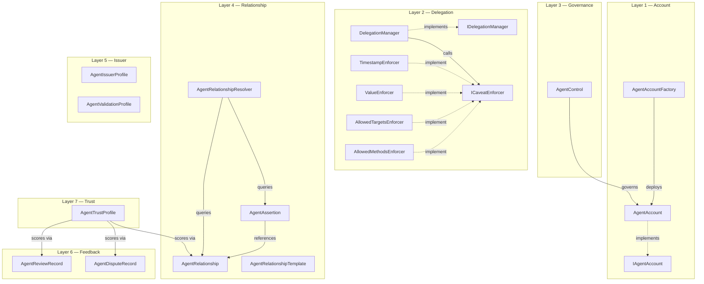
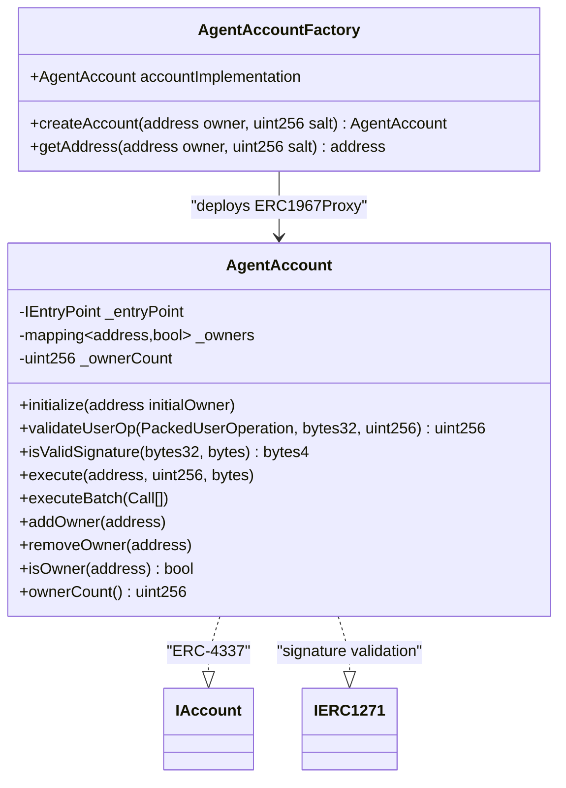
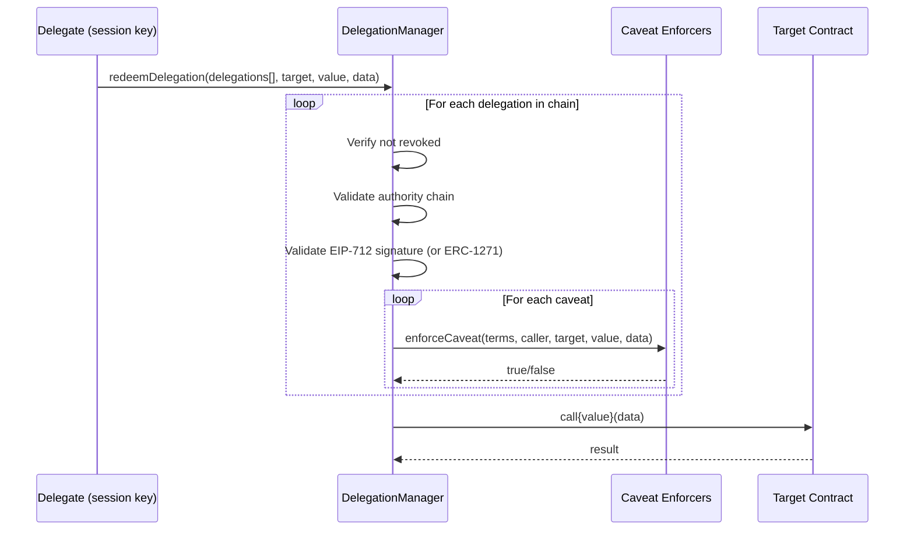
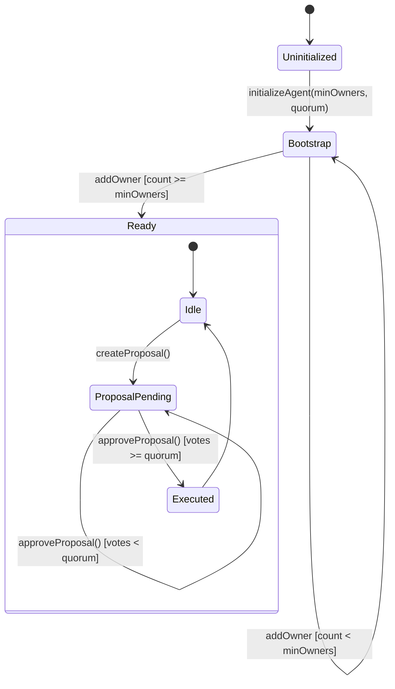
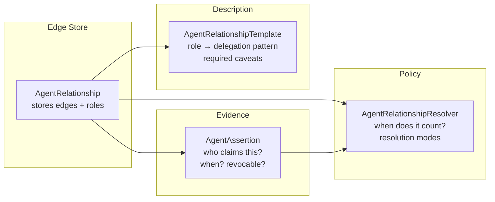
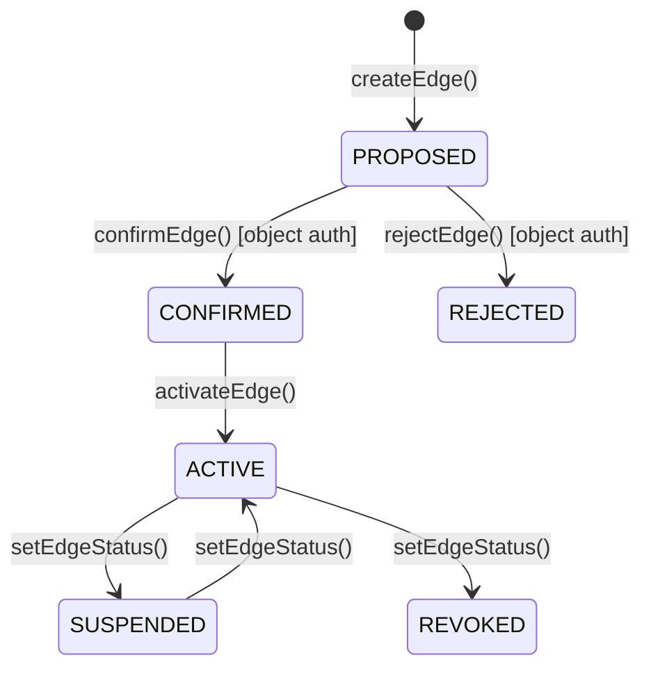
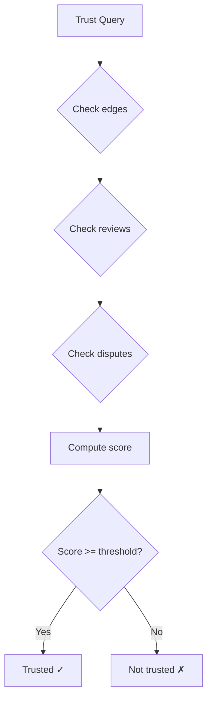
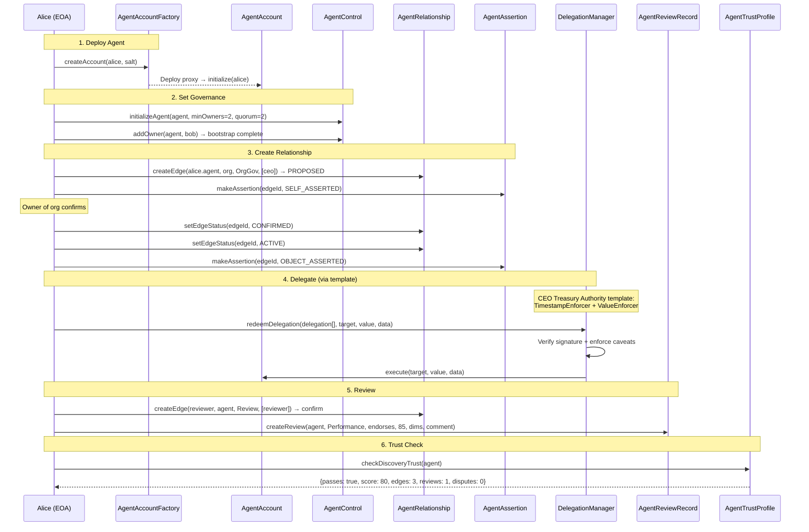

# Smart Agent — Ethereum Contract Documentation

## Overview

The Smart Agent protocol is implemented as 20 Solidity contracts (^0.8.28) organized into 7 layers. Each layer addresses a specific concern, and contracts compose together to form a complete agent trust fabric.

**Design principles:**
- **Separation of concerns** — edges, claims, templates, resolution, and governance are separate contracts
- **ERC-4337 native** — agents ARE smart accounts, not wrappers around EOAs
- **Caveat-based delegation** — authority is scoped via composable enforcer contracts
- **DOLCE+DnS ontology** — relationships are Situations, types are Descriptions, roles are parts played
- **Multi-sig governance** — agent control is separate from trust graph relationships

## Layer Architecture



---

## Layer 1 — Account (ERC-4337)

These contracts create and manage agent smart accounts on-chain.

### AgentAccount

The core identity primitive. Each agent (person, org, or AI) is represented by an AgentAccount.



**Key behaviors:**
- Factory deploys ERC1967Proxy → AgentAccount implementation (singleton pattern)
- `CREATE2` gives deterministic addresses: `getAddress(owner, salt)` returns the counterfactual address before deployment
- `validateUserOp` checks owner signature against `userOpHash` (ECDSA via `toEthSignedMessageHash`)
- `isValidSignature` (ERC-1271) allows off-chain signature verification against the owner set
- `addOwner` / `removeOwner` are `onlySelf` — must be called via UserOp execution through the account itself
- `execute` / `executeBatch` allow the EntryPoint (or the account itself) to make arbitrary calls

---

## Layer 2 — Delegation

The delegation system allows one agent to grant scoped authority to another.

### DelegationManager



**Delegation struct:**
```solidity
struct Delegation {
    address delegator;    // account granting authority
    address delegate;     // account receiving authority
    bytes32 authority;    // ROOT_AUTHORITY or parent delegation hash
    Caveat[] caveats;     // restrictions
    uint256 salt;         // replay protection
    bytes signature;      // EIP-712 signature from delegator
}
```

**EIP-712 signing:**
- Domain: `AgentDelegationManager` v1, chainId, verifyingContract
- Struct hash: `keccak256(DELEGATION_TYPEHASH, delegator, delegate, authority, caveatsHash, salt)`
- Signature validation: EOA via ECDSA, or smart account via ERC-1271

### Caveat Enforcers

Each enforcer implements `ICaveatEnforcer.enforceCaveat()` and checks one constraint:

| Enforcer | Terms encoding | What it checks |
|----------|---------------|----------------|
| `TimestampEnforcer` | `abi.encode(uint256 validAfter, uint256 validUntil)` | `block.timestamp` within window |
| `ValueEnforcer` | `abi.encode(uint256 maxValue)` | `value <= maxValue` |
| `AllowedTargetsEnforcer` | `abi.encode(address[] allowedTargets)` | `target` in list |
| `AllowedMethodsEnforcer` | `abi.encode(bytes4[] allowedSelectors)` | `data[:4]` in list |

Enforcers are stateless view functions — they cannot modify state, only validate.

---

## Layer 3 — Governance

### AgentControl

Manages the owner/multisig relationship between EOAs and agent smart accounts.



**Proposal flow:**
1. Any owner calls `createProposal(agent, actionClass, data)` — auto-approves for proposer
2. Other owners call `approveProposal(agent, proposalId)`
3. When `approvalCount >= quorum` → proposal status becomes EXECUTED

**Action classes:** `OWNER_CHANGE`, `RELATIONSHIP_APPROVE`, `TEMPLATE_ACTIVATE`, `DELEGATION_GRANT`, `EMERGENCY_PAUSE`, `METADATA_UPDATE`

---

## Layer 4 — Relationship Protocol

Four contracts that compose to form the agent trust graph.

### How they work together



### AgentRelationship — Edge Lifecycle



**Edge identity:** `edgeId = keccak256(subject, object, relationshipType)` — one edge per triple, multiple roles per edge.

**Authorization model:**
- `_requireAuth(e)` — subject, object, or createdBy
- `_requireObjectAuth(e)` — object agent, or EOA that is `isOwner()` of the object agent
- `confirmEdge` / `rejectEdge` — require object auth
- `setEdgeStatus` — requires general auth (used by server deployer as createdBy)

### AgentAssertion — Provenance

Assertions are speech acts: "asserter claims this edge is valid."

**Assertion types:**
| Type | Meaning |
|------|---------|
| `SELF_ASSERTED` | Subject claims the relationship |
| `OBJECT_ASSERTED` | Object (authority) confirms |
| `MUTUAL_CONFIRMATION` | Both sides confirmed |
| `VALIDATOR_ASSERTED` | Trusted validator verified |
| `ORG_ASSERTED` | Organization-level claim |
| `APP_ASSERTED` | App/runtime claim |

**Validity:** `validFrom` / `validUntil` (timestamps), `revoked` (bool). `isAssertionCurrentlyValid()` checks all three.

### AgentRelationshipResolver — Trust Qualification

Answers: "Does this edge count for trust purposes?"

**Resolution modes:**
| Mode | Requirement |
|------|-------------|
| `EDGE_ACTIVE_ONLY` | Edge status == ACTIVE |
| `REQUIRE_ANY_VALID_ASSERTION` | At least one non-revoked, in-window assertion |
| `REQUIRE_OBJECT_ASSERTION` | Object agent has asserted |
| `REQUIRE_MUTUAL_ASSERTION` | Both subject and object have asserted |
| `REQUIRE_VALIDATOR_ASSERTION` | Trusted validator has asserted (future) |

### AgentRelationshipTemplate — Role-to-Delegation Mapping

Bridges the semantic role to executable delegation patterns.

**Example:**
```
Template: "CEO Treasury Authority"
  relationshipType: OrganizationGovernance
  role: ceo
  caveats: [
    (TimestampEnforcer, required, empty),   // must be time-bounded
    (ValueEnforcer, required, empty),        // must have spend cap
    (AllowedTargetsEnforcer, optional, empty) // may restrict targets
  ]
```

When a CEO relationship edge becomes ACTIVE, this template defines what delegations can be instantiated.

---

## Layer 5 — Issuer & Validation

### AgentIssuerProfile

Registers entities that are authorized to make claims about agents.

**Issuer types:** self, counterparty, organization, validator, insurer, auditor, tee-verifier, staking-pool, governance, oracle

**What issuers declare:**
- Which claim types they can issue (`claimTypes[]`)
- Which validation methods they use (`validationMethods[]`)

### AgentValidationProfile

Records HOW a specific assertion was validated.

**Fields:**
- `validationMethod` — self-asserted, validator-verified, tee-onchain-verified, zk-verified, etc.
- `verifierContract` — on-chain verifier address (for TEE/ZK)
- `teeArch` — aws-nitro, intel-tdx, intel-sgx, amd-sev
- `codeMeasurement` — PCR/RTMR hash
- `evidenceURI` — link to full evidence bundle

---

## Layer 6 — Feedback

### AgentReviewRecord

Structured reviews with dimension scores.

**Review dimensions:** accuracy, reliability, responsiveness, compliance, safety, transparency, helpfulness (each scored 0-100)

**Review types:** PerformanceReview, TrustReview, QualityReview, ComplianceReview, SafetyReview

**Recommendations:** endorses, recommends, neutral, flags, disputes

`getAverageScore(subject)` returns the aggregate score across all non-revoked reviews.

### AgentDisputeRecord

Negative trust evidence.

**Dispute lifecycle:**
```
OPEN → UNDER_REVIEW → RESOLVED | DISMISSED | UPHELD
```

**Dispute types:** FLAG (soft), DISPUTE (formal), SANCTION, SUSPENSION, REVOCATION, BLACKLIST

---

## Layer 7 — Trust Profile

### AgentTrustProfile

Combines relationship edges, review scores, and dispute counts into context-specific trust decisions.



**Discovery Trust scoring:**
- Active relationship edges: +30
- 2+ reviews: +20
- Average score >= 60: +30
- No open disputes: +20
- **Passes at score >= 50**

**Execution Trust scoring:**
- 2+ active edges: +30
- Average review >= 70: +30
- No open disputes: +40
- **Passes at score >= 60**

---

## Contract Interactions — Full Flow Example

### Deploy Agent → Set Governance → Create Relationship → Delegate → Review



---

## Relationship Types & Roles — Complete Vocabulary

### 14 Relationship Types

| Category | Type | Purpose |
|----------|------|---------|
| **Governance** | `OrganizationGovernance` | Board, CEO, executive roles |
| **Control** | `OrganizationalControl` | Operated-by, administers |
| **Membership** | `OrganizationMembership` | Admin, member, operator |
| **Alliance** | `Alliance` | Strategic partner, affiliate |
| **Validation** | `ValidationTrust` | Validator, auditor |
| **Insurance** | `InsuranceCoverage` | Insurer, insured-party |
| **Compliance** | `Compliance` | Licensed, certified |
| **Economic** | `EconomicSecurity` | Staker, guarantor |
| **Service** | `ServiceAgreement` | Vendor, service provider |
| **Delegation** | `DelegationAuthority` | Delegated operator |
| **Runtime** | `RuntimeAttestation` | TEE, attested-by, verified |
| **Build** | `BuildProvenance` | Built-from, deployed-from |
| **Activity** | `ActivityValidation` | Activity validator |
| **Review** | `ReviewRelationship` | Reviewer |

### 47 Roles

| Category | Roles |
|----------|-------|
| **Governance** | owner, board-member, ceo, executive, treasurer, authorized-signer, officer, chair, advisor |
| **Control** | operated-agent, managed-agent, administers |
| **Membership** | admin, member, operator, employee, contractor |
| **Assurance** | auditor, validator, insurer, insured-party, underwriter, certified-by, licensed-by |
| **Economic** | staker, guarantor, backer, collateral-provider |
| **Alliance** | strategic-partner, affiliate, endorsed-by, subsidiary, parent-org |
| **Service** | vendor, service-provider, delegated-operator |
| **Runtime** | runs-in-tee, attested-by, verified-by, bound-to-kms, controls-runtime, built-from, deployed-from |
| **Activity** | activity-validator, validated-performer |
| **Review** | reviewer, reviewed-agent |

---

## Deployment

All contracts deploy from a single Foundry script (`script/Deploy.s.sol`).

**Deploy order matters** — contracts that reference others must deploy after their dependencies:

```
1. EntryPoint (canonical or deploy)
2. AgentAccountFactory (needs EntryPoint)
3. DelegationManager (standalone)
4. Caveat Enforcers (4, standalone)
5. AgentRelationship (standalone)
6. AgentAssertion (needs AgentRelationship)
7. AgentRelationshipResolver (needs AgentRelationship + AgentAssertion)
8. AgentRelationshipTemplate (standalone)
9. AgentIssuerProfile (standalone)
10. AgentValidationProfile (standalone)
11. AgentReviewRecord (standalone)
12. AgentDisputeRecord (standalone)
13. AgentTrustProfile (needs AgentRelationship + AgentReviewRecord + AgentDisputeRecord)
14. AgentControl (standalone)
```

**Local deployment:**
```bash
anvil                         # Start local chain
./scripts/deploy-local.sh     # Deploy all 15+ contracts
./scripts/seed-graph.sh       # Seed 16 agents, 28 edges, 7 templates, 6 issuers, 3 reviews
```
