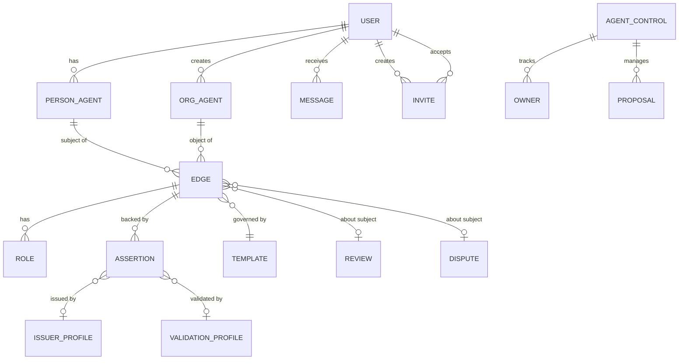
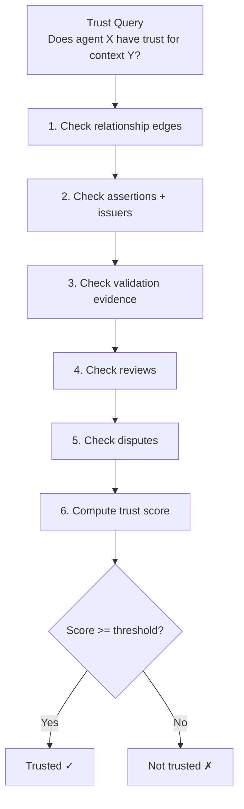

# Information Architecture

## Data Model Overview



## On-Chain Data (Smart Contracts)

### AgentRootAccount
```
address: 0x...          (the agent's identity)
owners: mapping         (EOA → bool)
ownerCount: uint256
entryPoint: IEntryPoint  (ERC-4337)
```

### AgentRelationship — Edge
```
edgeId: bytes32         = keccak256(subject, object, relationshipType)
subject: address        (agent the relationship is about)
object_: address        (authority agent)
relationshipType: bytes32
status: EdgeStatus      (PROPOSED → CONFIRMED → ACTIVE)
roles: bytes32[]        (multi-role set on the edge)
createdBy: address
metadataURI: string
```

### AgentAssertion — Claim
```
assertionId: uint256
edgeId: bytes32         (which edge this backs)
assertionType: enum     (SELF_ASSERTED, OBJECT_ASSERTED, VALIDATOR_ASSERTED, ...)
asserter: address
validFrom / validUntil: uint256
revoked: bool
evidenceURI: string
```

### AgentControl — Governance
```
agent: address          (which agent this governs)
owners: address[]       (principal EOAs)
minOwners: uint256      (bootstrap threshold)
quorum: uint256         (approval votes needed)
isBootstrap: bool       (true until minOwners met)
proposals: Proposal[]   (actionClass, data, approvals, status)
```

### AgentRelationshipTemplate — Description
```
templateId: uint256
relationshipType: bytes32
role: bytes32
name: string
description: string
caveats: CaveatRequirement[]  (enforcer, required, defaultTerms)
```

## Off-Chain Data (SQLite)

### users
```sql
id TEXT PRIMARY KEY
email TEXT
name TEXT NOT NULL
walletAddress TEXT UNIQUE
privyUserId TEXT UNIQUE
```

### person_agents
```sql
id TEXT PRIMARY KEY
name TEXT NOT NULL DEFAULT 'Person Agent'
userId TEXT REFERENCES users(id) UNIQUE
smartAccountAddress TEXT NOT NULL
chainId INTEGER
salt TEXT
status TEXT  -- pending | deployed | failed
```

### org_agents
```sql
id TEXT PRIMARY KEY
name TEXT NOT NULL
description TEXT
createdBy TEXT REFERENCES users(id)
smartAccountAddress TEXT NOT NULL
chainId INTEGER
salt TEXT
status TEXT
```

### invites
```sql
id TEXT PRIMARY KEY
code TEXT UNIQUE
agentAddress TEXT
agentName TEXT
role TEXT           -- owner | admin | member
createdBy TEXT REFERENCES users(id)
expiresAt TEXT
acceptedBy TEXT REFERENCES users(id)
status TEXT         -- pending | accepted | expired | revoked
```

### messages
```sql
id TEXT PRIMARY KEY
userId TEXT REFERENCES users(id)
type TEXT           -- ownership_offered | relationship_proposed | ...
title TEXT
body TEXT
link TEXT
read INTEGER DEFAULT 0
```

## DOLCE+DnS Ontology Mapping

| DOLCE Concept | Smart Agent Implementation |
|---------------|---------------------------|
| **Agent** | AgentRootAccount (4337 smart account) |
| **Social Agent** | Person or Org with did:ethr identity |
| **Description** | relationshipType (normative context) |
| **Situation** | Edge (concrete state satisfying a description) |
| **Role** | bytes32 role on edge (part played by subject) |
| **Speech Act** | Assertion (claim by an asserter) |
| **Qualification** | Resolver resolution mode |

## Identity: did:ethr

```
did:ethr:<chainId>:<smartAccountAddress>

Example: did:ethr:31337:0x9aebF60baa608CaB5814Cb95FAA357e7B2f9B4aA
```

The smart account address IS the DID. No separate identity registry needed. The DID resolves to the account's on-chain state.

## Trust Resolution Hierarchy


