# Smart Agent — Architecture Overview

A comprehensive architecture reference covering technical topology, information
architecture, object interactions between services, and the security model.

This document complements the deeper references in this folder:

- [technical-architecture.md](./technical-architecture.md) — monorepo + contract suite
- [system-architecture.md](./system-architecture.md) — runtime, environment, deploy flows
- [information-architecture.md](./information-architecture.md) — on-chain data model
- [contracts.md](./contracts.md) — per-contract deep dive
- [agent-control.md](./agent-control.md) — multi-sig governance
- [relationship-protocol.md](./relationship-protocol.md) — relationship lifecycle

---

## 1. Executive Summary

Smart Agent is an **Agent Smart Account Kit** built on ERC-4337. Agents (person,
organization, or AI) are first-class principals with their own on-chain smart
accounts. Authority flows through signed, scoped, revocable delegations enforced
by on-chain caveat enforcers and off-chain verifiers. A runtime fabric of three
services — **web**, **a2a-agent**, and **person-mcp** — together with a
**GraphDB** knowledge base and the **contract suite** implement the protocol.

Key properties:

- **Agent identity == smart account address** (`did:ethr:<chainId>:<addr>`)
- **All authority is delegated** — EOAs sign once, session keys act within caveats
- **Delegation is cryptographically and on-chain verifiable** (ERC-1271 + caveat enforcers + on-chain revocation)
- **Relationships are first-class** — trust, naming, and governance are edges in a graph
- **Machine-discoverable** — every agent exposes `/.well-known/agent.json`, an
  on-chain AgentNameRegistry record, and a GraphDB RDF projection

---

## 2. Technical Architecture

### 2.1 Service Topology

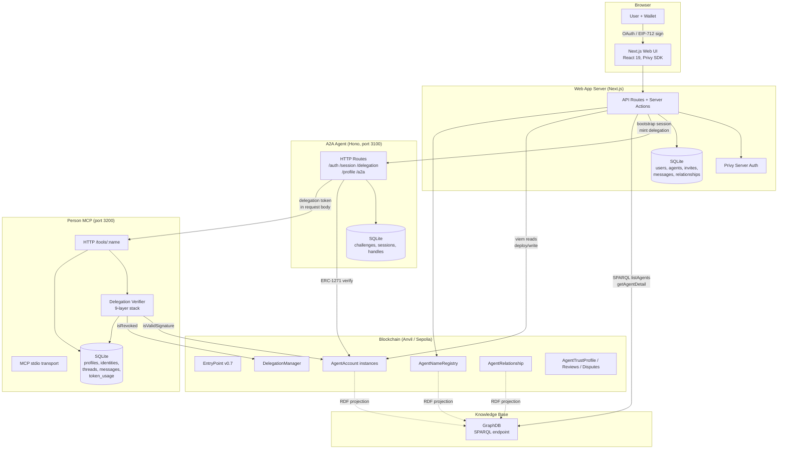

Each arrow represents a concrete wire call. Dashed arrows are asynchronous
RDF projection feeds (on-chain events → SPARQL UPDATE).

### 2.2 Monorepo Layout

```
smart-agent/
├── apps/
│   ├── web/                   Next.js 15 (App Router, Privy, Drizzle)
│   ├── a2a-agent/             Hono server — session broker, delegation minter
│   └── person-mcp/            MCP + HTTP — delegation-gated personal data
├── packages/
│   ├── contracts/             Foundry, Solidity ^0.8.28, ~20 contracts
│   ├── sdk/                   @smart-agent/sdk — viem clients + crypto + naming
│   ├── discovery/             @smart-agent/discovery — GraphDB/SPARQL
│   └── types/                 Shared TypeScript types
└── docs/
    ├── agents/                Role-specific agent guides
    ├── architecture/          This document + peers
    ├── ontology/              T-Box / C-Box / A-Box turtle files
    └── specs/                 Architecture specs and roadmap
```

### 2.3 Contract Suite (layered)

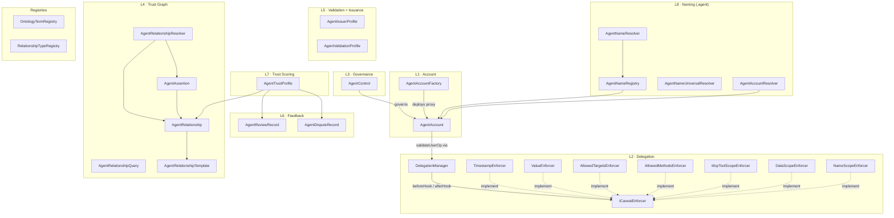

### 2.4 SDK Public Surface (`@smart-agent/sdk`)

| Module | Exports |
|--------|---------|
| Account | `AgentAccountClient` (deploy, isOwner, encodeExecute, encodeExecuteBatch) |
| Delegation | `DelegationClient` (issueDelegation, redeem, revoke, isRevoked) |
| Caveats | `encodeTimestampTerms`, `encodeValueTerms`, `encodeAllowedTargetsTerms`, `encodeAllowedMethodsTerms`, `buildCaveat`, `buildMcpToolScopeCaveat`, `buildDataScopeCaveat` |
| Session | `createAgentSession`, `isSessionValid` |
| Crypto | `encryptPayload`, `decryptPayload`, `randomHex`, `hmacSign`, `hmacVerify` |
| Challenge auth | `createChallenge`, `hashChallenge`, `isChallengeExpired` |
| Delegation tokens | `mintDelegationToken`, `verifyDelegationToken` |
| Naming | `namehash`, `labelhash`, `normalize`, `resolveName`, `reverseResolve`, `listSubnames`, `getNamePath`, `getNameTree` |
| Relationships | `RelationshipProtocolClient`, taxonomy constants, role constants |
| Identity | `toDidEthr` |

---

## 3. Information Architecture

### 3.1 Three Parallel Data Planes

Smart Agent keeps three coherent, mutually-consistent views of the same data:

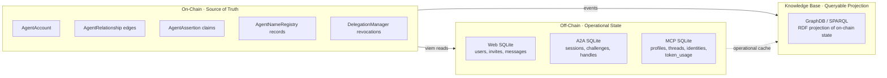

- **On-chain** — the *authoritative* trust graph (edges, assertions, delegations, names, governance).
- **Off-chain SQLite (per service)** — operational state each service owns: sessions, profiles, notifications, invites, token-usage counters.
- **GraphDB** — an ontology-aligned RDF projection used by the web app for rich discovery (`DiscoveryService.listAgents`, `.getAgentDetail`, `.getOutgoingEdges`).

### 3.2 On-Chain Entity–Relationship Model

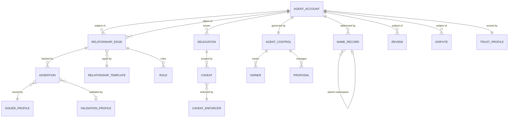

### 3.3 Off-Chain Schemas (highlights)

**apps/web (SQLite)** — user-facing state.

| Table | Key fields |
|-------|-----------|
| `users` | id, privyUserId, email, name, walletAddress, smartAccountAddress |
| `person_agents` | userId, smartAccountAddress, chainId, salt, status |
| `org_agents` | createdBy, smartAccountAddress, status |
| `invites` | code, agentAddress, role, expiresAt, acceptedBy, status |
| `messages` | userId, type, title, body, link, read |

**apps/a2a-agent (SQLite)** — session broker state.

| Table | Key fields |
|-------|-----------|
| `challenges` | id, accountAddress, nonce, typedDataJson, status, expiresAt |
| `sessions` | id, accountAddress, sessionKeyAddress, encryptedPackage, iv, status, expiresAt |
| `handles` | handle, accountAddress, agentType, endpointUrl |

**apps/person-mcp (SQLite)** — personal data vault.

| Table | Key fields |
|-------|-----------|
| `profiles` | principal (unique), displayName, email, phone, dateOfBirth, address fields |
| `externalIdentities` | principal, provider, identifier, verified |
| `chatThreads`, `chatMessages` | principal, threadId, role, content |
| `tokenUsage` | jti (unique), principal, usageCount, usageLimit |

### 3.4 Naming (.agent TLD)

Names are stored as `NAMESPACE_CONTAINS` relationship edges — they are not a
special-case subsystem; they are just another relationship role in the trust
graph.

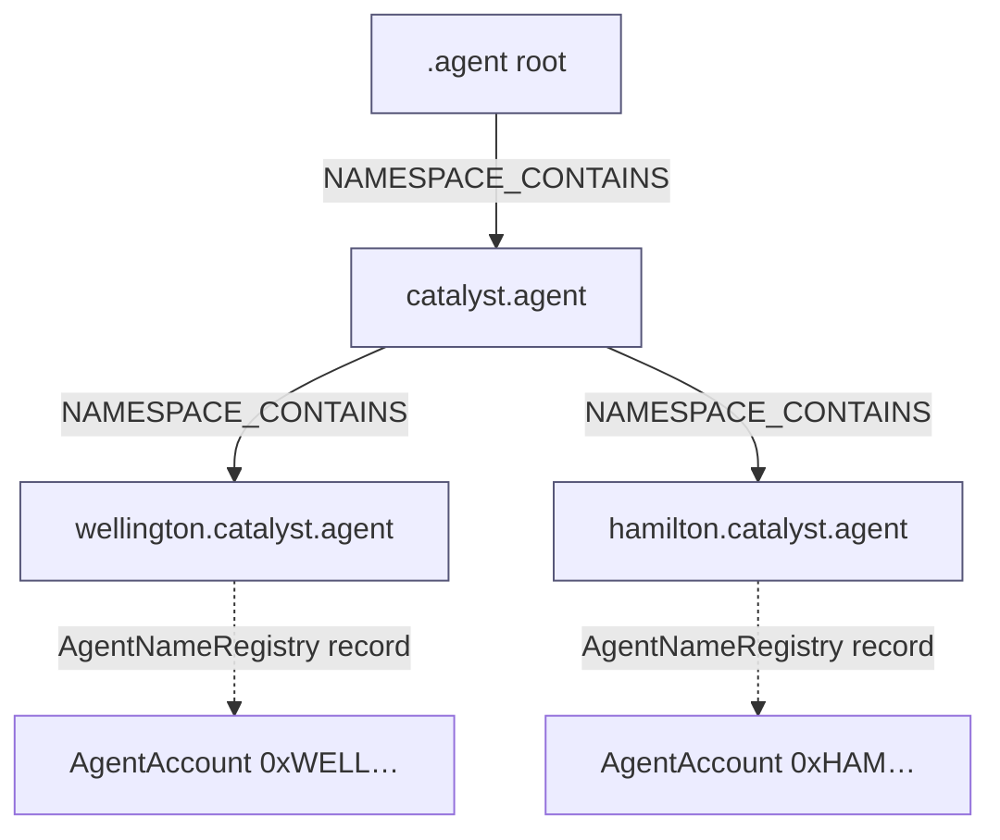

- Name resolution: `namehash(label)` → `AgentNameRegistry.recordExists()` / resolver lookup.
- Delegatable subtrees are scoped by `NameScopeEnforcer`: an org can delegate
  `*.catalyst.agent` to a sub-agent while retaining root ownership.
- Reverse resolution (`address → primaryName`) via `AgentAccountResolver`.

### 3.5 DOLCE+DnS Mapping

| DOLCE concept | Smart Agent realization |
|---|---|
| Agent | AgentAccount |
| Social Agent | person or org AgentAccount (with `did:ethr`) |
| Description | `relationshipType` (normative type IRI) |
| Situation | `RELATIONSHIP_EDGE` (concrete state realizing a description) |
| Role | `bytes32 role` on an edge |
| Speech Act | `AgentAssertion` |
| Qualification | resolver resolution mode |

---

## 4. Object Interaction Diagrams

The following sequences are the *canonical* service-to-service flows. Each
step is implemented in code and can be traced from the service reports
above.

### 4.1 Deploy a Person Agent (Web → Contracts)

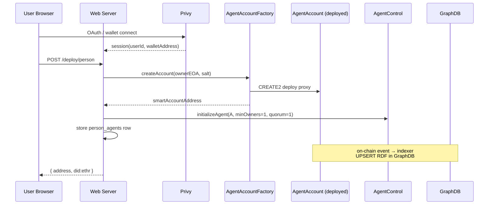

### 4.2 A2A Session Bootstrap (Web → A2A-Agent)

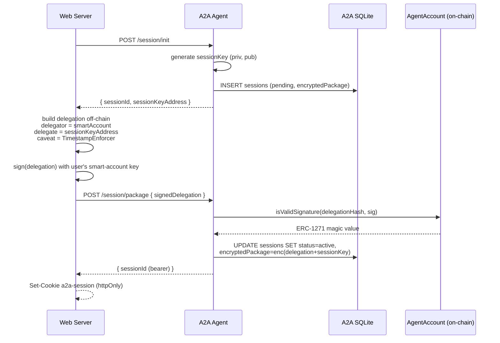

### 4.3 Minting a Delegation Token (A2A → caller)

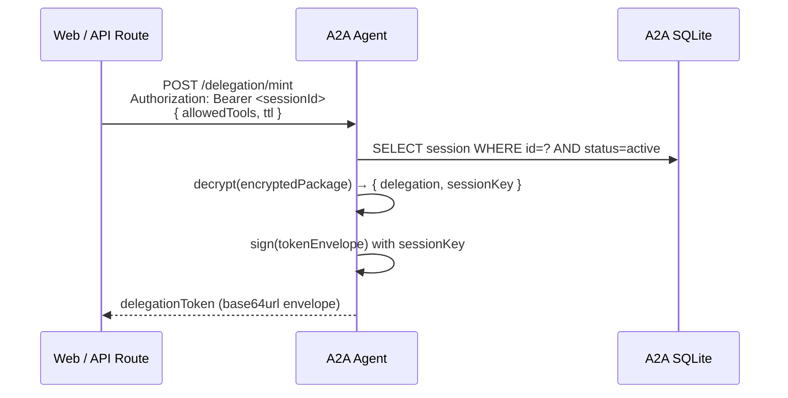

The minted token is the **only** credential person-mcp accepts. It binds:
nonce (`jti`), subject (`delegator`), session key (`delegate`), caveat set
(timestamp, tool scope, data scope, name scope), and a sessionKey signature.

### 4.4 MCP Tool Call — 9-Layer Delegation Verification

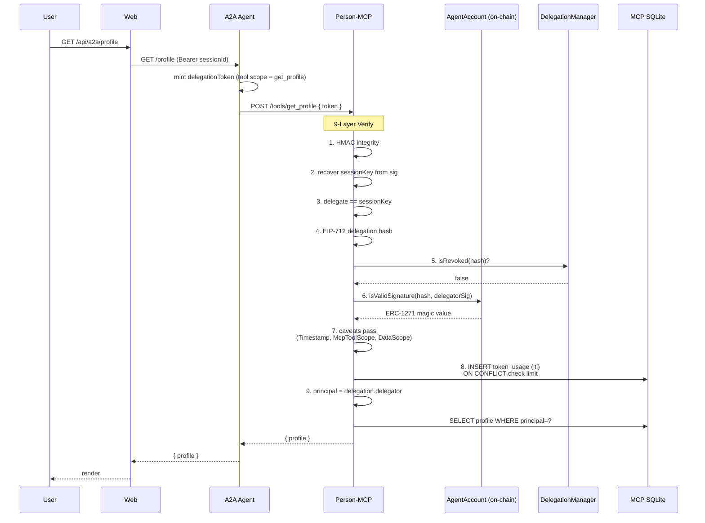

Any layer failing returns an opaque `401/403` — no information leak about
which check failed.

### 4.5 Cross-Principal Data Delegation (Owner grants Grantee)

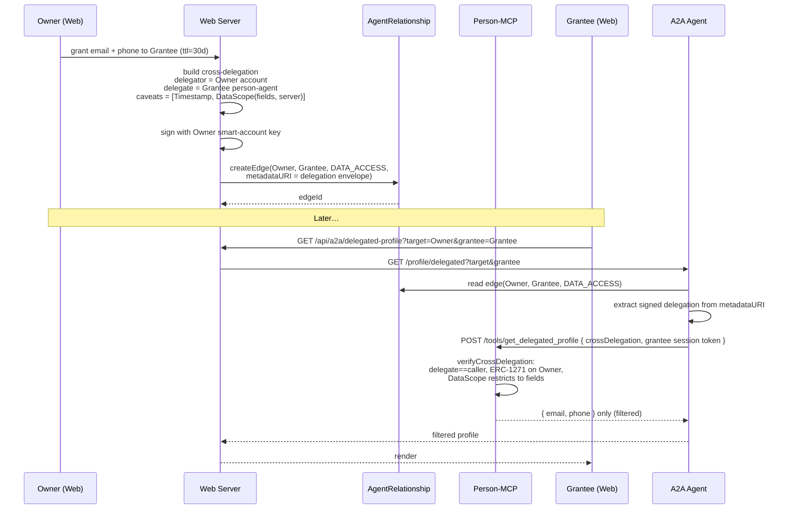

### 4.6 Agent Discovery via .agent Name

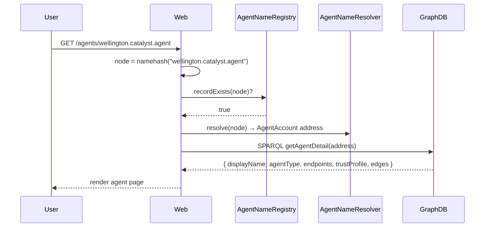

### 4.7 Relationship Creation with Multi-Sig Governance

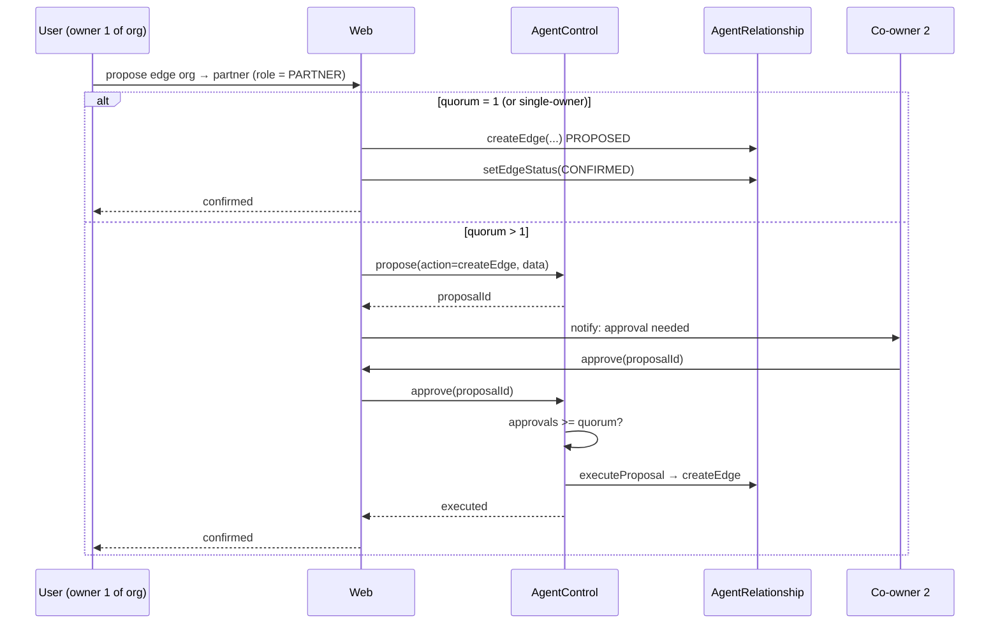

### 4.8 Trust Resolution

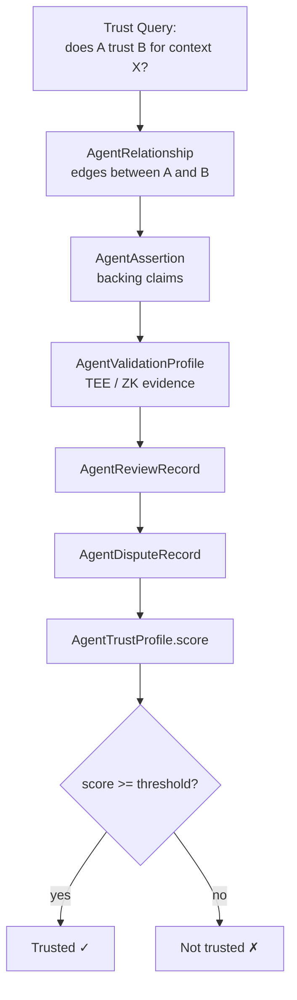

### 4.9 AnonCreds for a Person ↔ Org Relationship

This is a **conceptual extension** showing how an anoncreds credential could be
issued from an existing person-to-organization relationship edge, then later
proven without revealing the full relationship record.

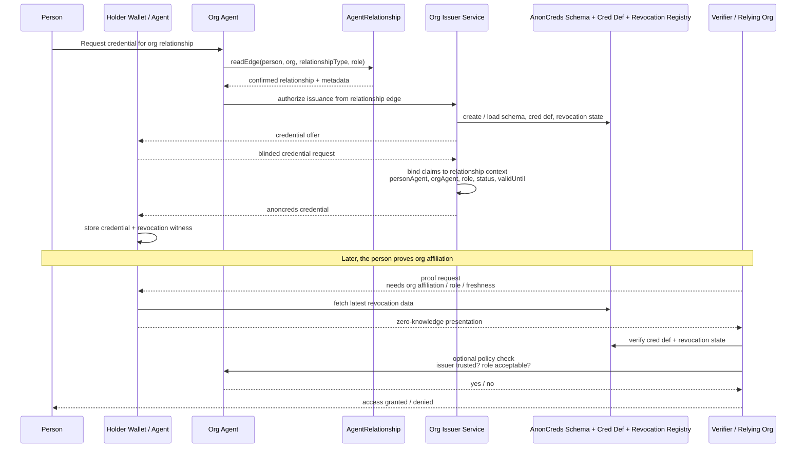

Typical claim set in the credential:

- `subjectAgent` — the person agent DID / account
- `orgAgent` — the organization agent DID / account
- `relationshipType` — e.g. membership, employment, governance
- `role` — e.g. member, employee, admin, officer
- `status` — active, suspended, pending
- `validUntil` or epoch-bound freshness marker
- optional `edgeId` or relationship reference as a non-disclosed linkage field

The important separation is:

- `AgentRelationship` remains the authoritative relationship graph
- anoncreds package a privacy-preserving proof of that relationship
- verifiers check the proof without needing the full edge record disclosed

---

## 5. Security Overview

### 5.1 Trust Boundaries

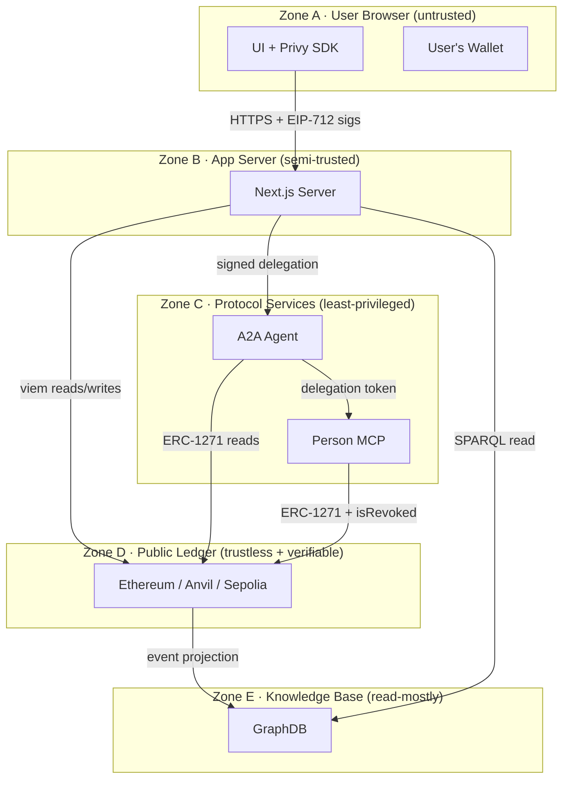

Every zone-crossing request must carry a credential verifiable without
trusting the preceding zone.

### 5.2 Authentication Stack

| Boundary | Mechanism | What it proves |
|---|---|---|
| User → Web | Privy OAuth / email | controller of an EOA + app identity |
| Wallet → AgentAccount | EIP-712 signature verified via ERC-1271 | controller of the smart account |
| Web → A2A (bootstrap) | Signed delegation packaged via `/session/package` | delegator authorized the session key |
| Caller → A2A (ongoing) | Bearer sessionId cookie/header | holder of the server-issued session handle |
| A2A → Person-MCP | Delegation token (9-layer verify) | minted by the *actual* session key, for *this* tool, *now*, subject not revoked |
| Grantee → Person-MCP (cross-principal) | Cross-delegation from data owner + grantee's own session token | owner authorized grantee for *these fields* |

### 5.3 Authorization Stack (Caveat Enforcement)

Authorization is *composable*. Each delegation carries an ordered caveat set,
and each caveat has an on-chain enforcer. The same enforcer can be invoked
by on-chain `redeemDelegation` or off-chain in the MCP 9-layer verifier.

| Enforcer | Guards |
|---|---|
| TimestampEnforcer | `validAfter` / `validUntil` — session lifetime |
| ValueEnforcer | Max ETH value per call |
| AllowedTargetsEnforcer | Whitelist of contract addresses callable |
| AllowedMethodsEnforcer | Whitelist of function selectors callable |
| McpToolScopeEnforcer | Which MCP tools the delegation may invoke |
| DataScopeEnforcer | Which fields/resources of which server are readable (cross-principal) |
| NameScopeEnforcer | Which subtree of the `.agent` namespace may be administered |

### 5.4 Delegation Lifecycle & Revocation

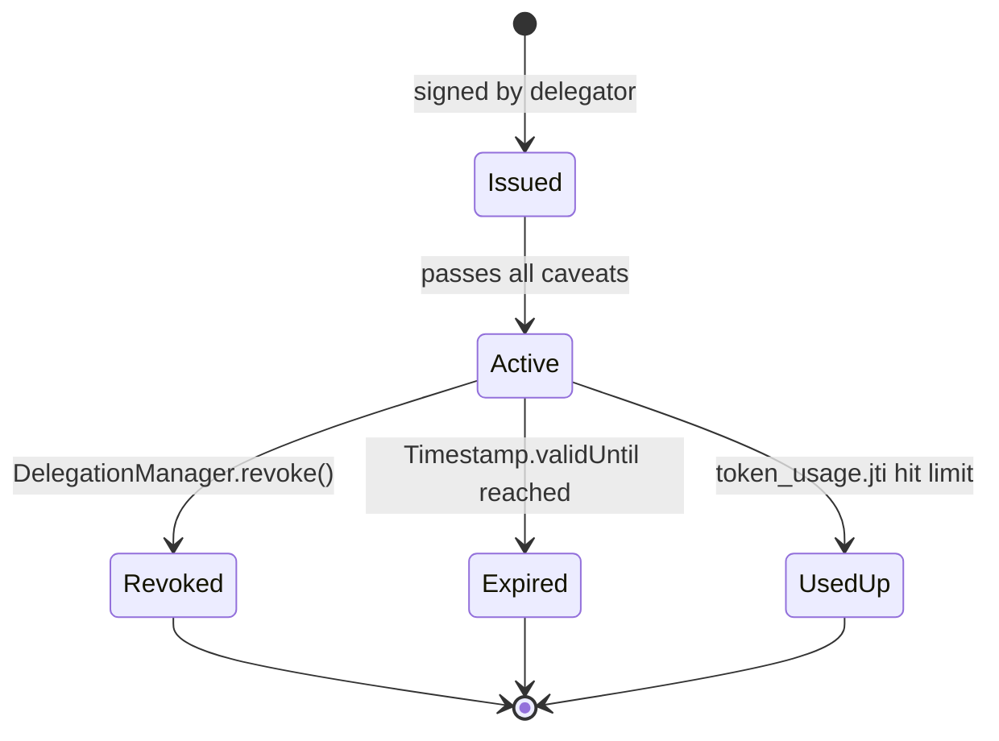

Three independent kill-switches:

1. **On-chain revocation** — `DelegationManager.revoke(hash)` is consulted
   at every MCP call. A single tx revokes a token across every verifier.
2. **Session revocation** — `DELETE /session/:id` on a2a-agent invalidates
   the session key; no more tokens can be minted.
3. **Owner-level emergency** — `AgentControl` emergency actions pause the
   agent account; downstream ERC-1271 verifications fail.

### 5.5 Key Management

| Key | Location | Rotation | Blast radius if leaked |
|---|---|---|---|
| User EOA | user's wallet (Privy custodial or self-custody) | user-driven | full account control (unless multi-sig org) |
| Smart-account "raw" private key (bootstrap) | Web server DB, encrypted column | rotate via AgentControl `addOwner`/`removeOwner` | same as above — considered a sensitive secret |
| Session key | A2A Agent DB, encrypted with `A2A_SESSION_SECRET` | TTL-capped (e.g. 24h), one-tap revoke | bounded by caveats; cannot exceed delegator authority |
| Delegation token `jti` | client-held, short-lived | single use or usage-limited | bounded by caveats + jti counter |
| Privy `PRIVY_APP_SECRET` | Web server env | vendor-managed | impersonation of web server to Privy |
| Deployer key | Web server env (`DEPLOYER_PRIVATE_KEY`) | manual | contract writes only; not authority over agents |
| `A2A_SESSION_SECRET` | A2A env only | manual; invalidates existing sessions | decrypt stored session packages |

Session packages in the A2A DB are **encrypted at rest** with
`A2A_SESSION_SECRET`; the session private key never leaves the A2A
process in cleartext and is never exposed to the Web server.

### 5.6 Anti-Replay & Usage Metering

- **Challenge nonces** (A2A `/auth/challenge`): per-account, one-use, TTL-bound.
- **JTI tracking** in person-mcp (`token_usage` table, atomic
  `INSERT … ON CONFLICT UPDATE`) — the same delegation token cannot be
  replayed past its declared usage limit, even under concurrent callers.
- **HMAC envelope integrity** prevents token tampering before the ECDSA
  signature is recovered (fast-fail).
- **EIP-712 domain separation** (`DelegationManager` domain) prevents a
  signature valid for one chain/contract from being replayed on another.

### 5.7 Data Protection

- **Personal data** (profiles, identities, chat threads) lives only in
  `person-mcp`. The web server never stores it. Even a full compromise of
  the web DB exposes no PII.
- **Cross-principal reads** return *field-filtered* responses — the MCP
  server applies `DataScopeEnforcer` grants as a hard projection, not a
  client-side filter.
- **No private keys in `NEXT_PUBLIC_*`** — enforced by convention and
  review; only PUBLIC configuration (chain id, factory address) is client-
  visible.
- **HttpOnly session cookie** (`a2a-session`) for the Web↔A2A bridge —
  not readable by page JS, reducing XSS blast radius.

### 5.8 Threat Model Summary

| Threat | Mitigation |
|---|---|
| Stolen session cookie | ERC-1271-checked delegation still needed; caveats limit scope; revoke via `/session/:id` |
| Stolen delegation token | `jti` usage cap + on-chain `isRevoked` + TTL; scoped by tool/data/name enforcer |
| Compromised Web server | Cannot mint new delegations without user re-signing (key never leaves A2A); PII untouched |
| Compromised A2A server | Cannot forge user signatures; all tokens are bounded by already-signed delegations; rotate `A2A_SESSION_SECRET` and revoke on-chain to cut over |
| Compromised Person-MCP | Reveals PII for that principal *only* — no authority over agents or funds |
| Replay across chains | EIP-712 domain separator includes `chainId`; wrong chain → signature invalid |
| Malicious agent impersonation | Names resolve via on-chain `AgentNameRegistry`; owner gated by `AgentAccount.isOwner` |
| Relationship forgery | Edges signed by creator; counter-party confirmation required before ACTIVE; multi-sig via `AgentControl` for org agents |

### 5.9 Observability & Audit

- **On-chain events** — every edge, assertion, delegation, revocation, and
  governance action emits an event. The GraphDB projection doubles as an
  audit log queryable by SPARQL.
- **Structured SQLite rows** — `challenges`, `sessions`, `token_usage`
  give per-principal forensic trails.
- **Trust profile** — `AgentTrustProfile` aggregates reviews and disputes;
  repeated violations depress an agent's score and flow into policy
  decisions.

---

## 6. Where to Read Next

- Concrete contract API: [contracts.md](./contracts.md)
- Deployment & environment: [system-architecture.md](./system-architecture.md)
- Governance proposal flow: [agent-control.md](./agent-control.md)
- Relationship lifecycle (propose → confirm → active → revoke): [relationship-protocol.md](./relationship-protocol.md)
- Roadmap: [../specs/roadmap.md](../specs/roadmap.md)
