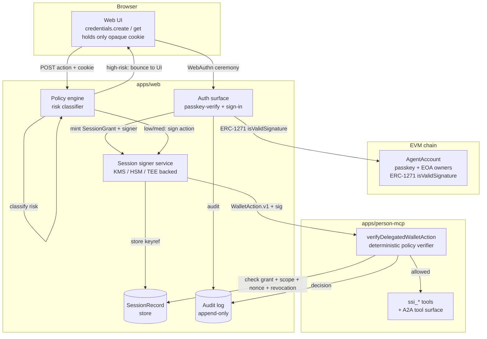
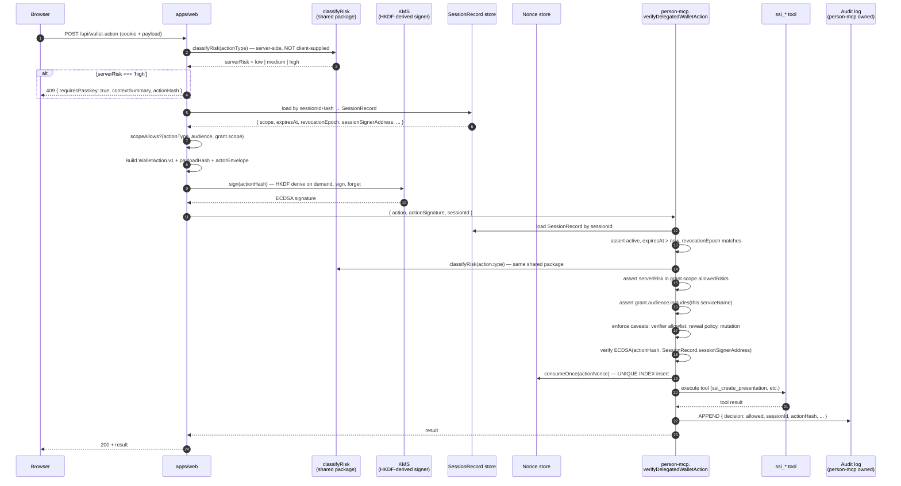
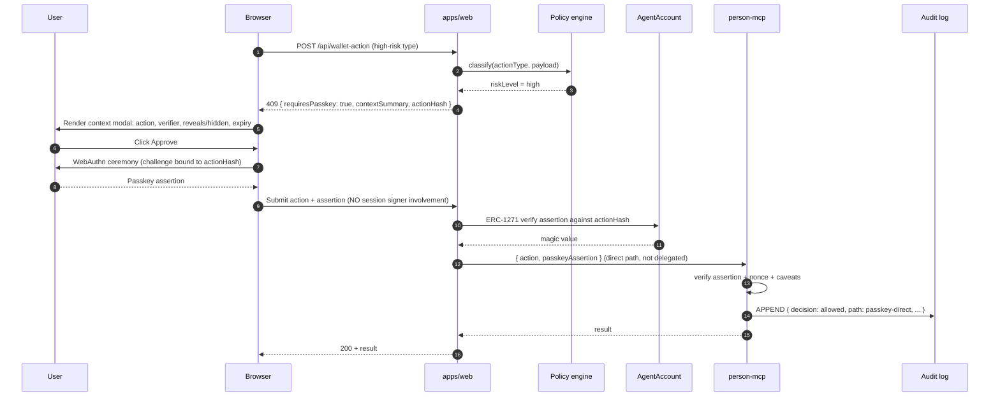
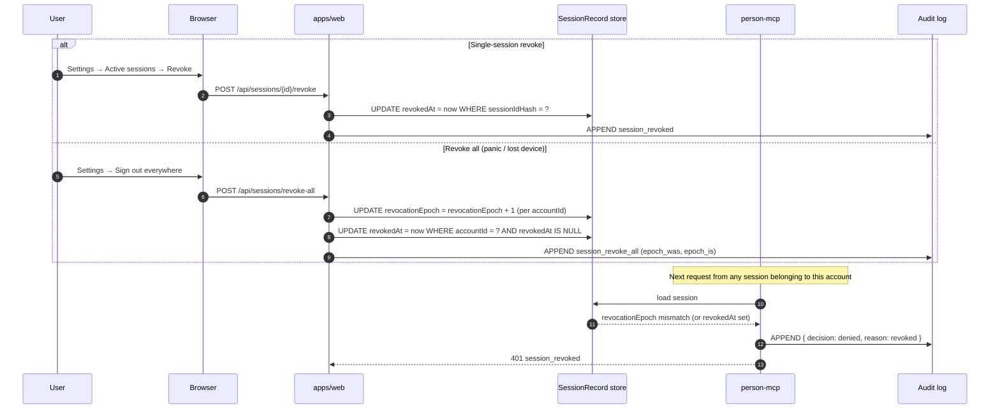
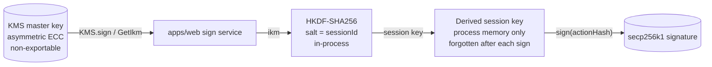

# Passkey-Rooted Delegated Session Signing

> **Status**: design — pre-implementation. Sister documents:
> [`anoncreds-ssi-flow.md`](./anoncreds-ssi-flow.md),
> [`auth-and-onboarding.md`](./auth-and-onboarding.md). Execution
> tracking lives in [`../specs/passkey-session-signing-plan.md`](../specs/passkey-session-signing-plan.md).

## 1. Problem

Today every privileged operation in the web app — credential issuance,
trust search, presentation creation, wallet provisioning — requires a
fresh WebAuthn ceremony. Inventoried touchpoints:

| Category | Sites | Prompts |
| --- | --- | --- |
| **Signup** | `credentials.create` + A2A delegation `get` + ProvisionHolderWallet `signWalletActionClient` | 3 |
| **Sign-in** | identity assertion + A2A delegation + (first-time wallet provision) | 2 (3 first-time) |
| **Normal app ops** | `IssueCredentialDialog` (×2 inside one flow), `AgentTrustSearch`, `HeldCredentialsPanel` Test verification | 1 per action |
| **Account control** | add/remove passkey, recovery device, delegation changes | 1 per action |

The **account-control** prompts are correct and stay. The pain is in
"Normal app ops": every Discover Agents run and every Test verification
costs a passkey ceremony, even though those actions don't change account
authority.

## 2. Goals & non-goals

**Goals**
- Zero passkey prompts for low/medium-risk operations during an active
  authenticated session.
- Single passkey ceremony at sign-in establishes a scoped, short-lived,
  revocable session capability.
- Account-control and privacy-sensitive actions still always require
  fresh passkey consent (with on-screen context).
- Verification logic is **deterministic policy code**, not LLM judgement.

**Non-goals**
- Replacing passkey for high-risk consent (presenting credentials to
  unknown verifiers, account-mutation, asset transfer).
- Enabling unattended automation by default. (A future "automation
  agent" feature could opt-in via separate UX with stronger consent.)
- Cross-device session continuation. A session is bound to one device's
  cookie + one server-held signing key.

## 3. Architecture

### 3.1 Components



The smart account is **not** modified. The session signer is **never**
added as an on-chain owner. ERC-1271 against the on-chain passkey is
verified **once at grant minting** by the auth surface, then the result
is cached in `SessionRecord.verifiedPasskeyPubkey`. Per-action
verification in `person-mcp` is purely off-chain — DB lookup of grant
liveness + ECDSA signature check + scope/caveat enforcement. **No
on-chain calls per action.** This is what makes the verifier fast and
chain-RPC-independent.

### 3.2 Sign-in flow (single passkey ceremony)

The single ceremony **does both jobs**: it proves possession of the
passkey bound to the AgentAccount (identity), and it signs the
SessionGrant (capability authorization). There is no separate
`passkey-verify` step — that route is folded into grant finalization.

```mermaid
sequenceDiagram
  autonumber
  participant U as User
  participant B as Browser
  participant W as apps/web
  participant K as KMS
  participant AA as AgentAccount
  participant L as Audit log

  U->>B: Type .agent name (or pick via conditional UI)
  B->>W: POST /api/auth/session-grant/start { agentName }
  W->>W: resolve smartAccountAddress
  W->>K: HKDF-derive session signer<br/>from master key + sessionId
  K-->>W: derivedSigner.address (private key in process memory only)
  W->>W: Build SessionGrant.v1 {scope, expiresAt, revocationEpoch, ...}
  W->>W: grantHash = sha256(canonical(grant))
  W->>W: challenge = sha256("SessionGrant:v1" || grantHash || serverNonce)
  W-->>B: { grant, challenge, sessionId }
  B->>U: Show approval banner: "Authorize 8h session for richp.agent"
  U->>B: Continue
  B->>U: WebAuthn ceremony (challenge, userVerification: required)
  U-->>B: Passkey assertion
  B->>W: POST /api/auth/session-grant/finalize<br/>{ assertion, grant, sessionId }
  W->>AA: isValidSignature(grantHash-derived digest, assertion)
  AA-->>W: magic value (ERC-1271 — runs ONCE per grant)
  W->>W: Extract verified passkey pubkey from assertion
  W->>W: Persist SessionRecord {<br/>  sessionIdHash, sessionSignerAddress,<br/>  verifiedPasskeyPubkey, grant, grantHash,<br/>  expiresAt, revocationEpoch }
  W-->>B: session cookie (production: __Host-session;<br/>dev: session — see §3.6)
  W->>L: APPEND grant_minted
```

1. User enters `.agent` name; conditional UI may surface saved passkey
   in autofill.
2. Server resolves `smartAccountAddress`, HKDF-derives a session
   signer (see §8.4 — single environment-wide KMS master key, no
   per-session KMS keys), constructs `SessionGrant.v1`.
3. Server returns `{ grant, challenge, sessionId }` to the browser.
   `challenge = sha256("SessionGrant:v1" || sha256(canonical(grant)) || serverNonce)`.
4. Browser shows the approval banner (see §10), then performs **one**
   WebAuthn assertion over the challenge with
   `userVerification: 'required'`.
5. Browser POSTs `{ assertion, grant, sessionId }` to finalize.
6. Server verifies the assertion via ERC-1271 on AgentAccount —
   **this is the only on-chain call in the whole session lifecycle.**
   The verified passkey pubkey is extracted and persisted in
   `SessionRecord.verifiedPasskeyPubkey`.
7. Server sets the session cookie. Browser holds only an opaque
   identifier; the session signer's private key never reaches the
   browser.

Identity-from-grant: the assertion was signed against a challenge
derived from `grantHash`, which itself contains
`subject.smartAccountAddress`. ERC-1271 on AgentAccount confirms the
passkey is bound to that account. So one signature proves both
identity and intent — no separate identity ceremony.

### 3.3 Normal-action flow (zero passkey prompts, zero on-chain calls)



1. Browser POSTs the action with its session cookie.
2. **Server-side** risk classifier (`classifyRisk` from
   `@smart-agent/privacy-creds/session-grant/risk-classifier`) returns
   the action's risk level keyed solely on `actionType`.
   Client-supplied risk fields are not consulted.
3. If high → 409 with context summary, browser runs the passkey
   ceremony per §3.4. If low/medium → continue.
4. Server loads the SessionRecord, checks scope, builds
   `WalletAction.v1` with `payloadHash` + `actorEnvelope` (the
   inter-service token; see §4.5).
5. KMS HKDF-derives the session signer in process, signs the action
   hash, then forgets the key. Master key never leaves KMS.
6. Server forwards `{ action, actionSignature, sessionId }` to
   `person-mcp`. The grant + WebAuthn assertion are **not** re-shipped
   per action — they live in the SessionRecord, which `person-mcp`
   reads.
7. `person-mcp.verifyDelegatedWalletAction` runs the deterministic
   verification chain (see §5). All checks are off-chain DB lookups
   + signature verification. **No `eth_call` per action.**
8. Audit log entry is appended on every decision (allowed and denied).
   `person-mcp` owns the audit log (see §4.4).

### 3.4 High-risk-action flow (fresh passkey ceremony)



1. Browser POSTs the action; `apps/web` classifies it as high-risk.
2. `apps/web` returns `{ requiresPasskey: true, contextSummary,
   actionHash }`.
3. Browser displays a context modal:
   *"Approve **Add new passkey** for richp.agent. Click Continue to
   confirm with your passkey."*
4. On Continue, browser performs WebAuthn ceremony with challenge
   bound to the action hash. Server verifies via direct ERC-1271
   (no session signer involved).

### 3.5 Revocation flow



The `revocationEpoch` is the panic button: bumping it for an account
invalidates every active session in that account in O(1), without
touching individual rows. Per-session `revokedAt` is the regular
"sign out" path.

**Recovery flow also bumps the epoch.** When a user goes through
device recovery and registers a new passkey on the AgentAccount,
the same transaction that mutates the on-chain passkey set also
calls `revocationStore.bumpEpoch(smartAccountAddress)`. Existing
sessions — authorized by the *old* passkey — are invalidated on
their next request. Implementation: `apps/web/src/lib/actions/recovery/`
calls the bump as part of the recovery commit. (See H7 in the audit
review.)

### 3.6 Cookie naming convention

Production: `__Host-session` (HTTPS-only per RFC 6265bis prefix
rule).
Dev / local (HTTP `localhost:3000`): `session` — `__Host-` prefix
silently fails on non-HTTPS, so we drop it.

The cookie name selector is in `apps/web/src/lib/auth/session-cookie.ts`:

```ts
export const SESSION_COOKIE_NAME =
  process.env.NODE_ENV === 'production' ? '__Host-session' : 'session'
```

Properties otherwise identical: `HttpOnly`, `Secure` (production
only), `SameSite=Lax` with strict server-side Origin/Referer checks
(downgraded from `Strict` so the Google OAuth callback still
delivers the cookie cross-site — see M7 in the audit review).

### 3.7 Session lifetime semantics

| Property | Value | Source of truth |
| --- | --- | --- |
| Hard TTL | 8 hours from `issuedAt` | `grant.session.expiresAt` (signed) and `SessionRecord.expiresAt` (mirrored) |
| Idle timeout | 30 minutes since last accepted action | `SessionRecord.idleExpiresAt` (server-managed, sliding) |
| Extension on activity | `idleExpiresAt` slides; `expiresAt` does not | per-action verifier bumps idle deadline |
| At hard expiry | User re-signs in (one ceremony, fresh grant) | — |
| At idle expiry | User re-signs in | — |
| At revocation | Immediate denial on next request | `revocationEpoch` mismatch OR `revokedAt` set |

**`idleTimeoutSeconds` is not in the signed grant** (would be
meaningless — the verifier can't enforce sliding deadlines with
just a signed integer). It's a server-managed value in
`SessionRecord.idleExpiresAt`. (See H4.)

## 4. Data structures

### 4.1 SessionGrant.v1

```ts
interface SessionGrantV1 {
  schema: 'SessionGrant.v1'
  policyVersion: string                 // e.g. 'v1.0' — bumped on schema change

  issuer: string                        // 'https://app.smartagent.io'
  rpId: string                          // WebAuthn RP id
  origin: string                        // WebAuthn origin

  subject: {
    /** Smart-account address is the authoritative user key. */
    smartAccountAddress: `0x${string}`
  }

  delegate: {
    type: 'session-eoa'
    address: `0x${string}`              // secp256k1, HKDF-derived (§8.4)
  }

  /** Services this grant authorizes. Verifier asserts
   *  `grant.audience.includes(this.serviceName)`. Adding a service
   *  to a grant is a policy decision; verifier rejects unknown
   *  service names. Today's full list:
   *  ['person-mcp', 'a2a-agent', 'verifier-mcp']. */
  audience: string[]

  session: {
    sessionId: string                   // also serves as grant id; one grant per session
    issuedAt: number
    notBefore: number
    expiresAt: number                   // hard TTL, server clock (§3.5)
    revocationEpoch: number             // per-account; bumped to invalidate all sessions
  }

  scope: {
    /** Hard ceiling — never 'high'. The verifier classifies the
     *  action's risk server-side (§5 / §6) and asserts ≤ this. */
    maxRisk: 'low' | 'medium'
    /** person-mcp tool names allowed (e.g. 'ssi_list_my_credentials'). */
    tools: string[]
    /** WalletAction.type values allowed (e.g. 'CreatePresentation'). */
    walletActions: string[]
    /** Verifier DIDs / domains / contract addresses / registered IDs. */
    verifiers?: string[]
    credentialTypes?: string[]
    presentationDefinitionIds?: string[]
    /** Optional rate limits — enforced by the verifier's actionCounter. */
    maxActions?: number
    maxActionsPerMinute?: number
  }

  constraints: {
    requireKnownVerifier: boolean       // default true
    allowAttributeReveal: boolean       // default false
    allowUnknownVerifier: boolean       // default false
    allowOnchainWrite: boolean          // default false
    allowAccountMutation: boolean       // hard false on this path
    allowDelegationMutation: boolean    // hard false on this path
  }

  nonce: string
}
```

**Rule**: `person-mcp` rejects any field it does not understand.
Unknown fields **must not expand authority**. Bumping `policyVersion`
is required for any schema change; the verifier reads the version and
applies the matching schema.

### 4.2 WalletAction.v1

```ts
interface WalletActionV1 {
  schema: 'WalletAction.v1'

  actionId: string
  sessionId: string                    // also identifies the grant (1:1)

  actor: {
    smartAccountAddress: `0x${string}`
    sessionSignerAddress: `0x${string}`
  }

  action: {
    type: string                       // 'CreatePresentation', etc.
    payloadHash: string                // sha256 of canonical payload
    payloadCanonicalization: 'json-c14n-v1'
  }

  /** Single target service for this action. Verifier asserts
   *  this matches its own `serviceName` AND that the calling
   *  service is in `grant.audience`. */
  audience: {
    service: string                    // 'person-mcp' / 'a2a-agent' / 'verifier-mcp'
    verifierDid?: string               // when action.type === 'CreatePresentation'
    verifierDomain?: string
    verifierAllowlistId?: string
  }

  timing: {
    createdAt: number                  // server clock
    expiresAt: number                  // hard cap: createdAt + 300 sec
  }

  replayProtection: {
    actionNonce: string                // 32-byte hex; consumed once
    sequence?: number                  // optional client sequence number
  }
}
```

**No client-supplied risk field.** The action's risk level is
determined server-side by `classifyRisk(action.type)` from the shared
`@smart-agent/privacy-creds/session-grant/risk-classifier` module.
The wire payload describes *what* is being requested; the verifier
decides *how risky it is* using the deterministic classifier.

The signed payload includes `payloadHash`, not just the action type.
Otherwise a buggy or malicious caller can swap parameters after
authorization.

### 4.3 Server SessionRecord

```ts
interface SessionRecord {
  sessionId: string                     // matches SessionGrant.session.sessionId
  sessionIdHash: string                 // sha256(cookie value); cookie != sessionId
  smartAccountAddress: `0x${string}`    // user key
  sessionSignerAddress: `0x${string}`   // delegate; HKDF salt is sessionId
  /** Passkey pubkey verified ONCE at grant minting via ERC-1271.
   *  Per-action verification reads this field; no on-chain calls
   *  per action. (See C1 in the audit review.) */
  verifiedPasskeyPubkey: { x: string; y: string }
  /** Persisted grant — the canonical, signed bytes used to derive
   *  the WebAuthn challenge. Required because the verifier
   *  re-canonicalizes for `enforceVerifierPolicy` etc. */
  grant: SessionGrantV1
  grantHash: string
  /** Sliding-window deadline; updated on every accepted action.
   *  Server-managed, not in the signed grant (H4). */
  idleExpiresAt: Date
  /** Hard deadline; mirrors grant.session.expiresAt. */
  expiresAt: Date
  createdAt: Date
  revokedAt?: Date
  revocationEpoch: number
}
```

### 4.4 AuditLogEntry

```ts
interface AuditLogEntry {
  ts: Date
  smartAccountAddress: `0x${string}`
  sessionId: string
  grantHash: string
  actionId: string
  actionType: string
  actionHash: string
  decision: 'allowed' | 'denied' | 'high-risk-passthrough' | 'session_revoked'
  reason?: string
  audience?: string
  verifier?: string
  /** Hash of the previous entry for this account — gives the log
   *  forward-only integrity. Compromised app can't rewrite without
   *  invalidating the chain. Periodic integrity check verifies. */
  prevEntryHash?: string
}
```

**Custody**: `person-mcp` is the system of record for the audit log.
It owns its own SQLite (or production-grade equivalent) database
with write-only IAM from the perspective of every other service.
The web app and A2A do **not** write to the audit log directly —
they POST events to `person-mcp`'s `/audit/append` endpoint, which
performs the chain-hash insert.

**Append-only enforcement**:
1. Database role used by `person-mcp` is `INSERT`-only on the audit
   table — `DELETE` and `UPDATE` revoked at the schema level.
2. Each entry's `prevEntryHash` references the previous entry's
   hash, scoped per account. A periodic integrity-check job
   recomputes the chain end-to-end. Mismatch → page on-call.
3. Production: ship rows to a separate cold-storage write-only sink
   (S3 with object-lock, or equivalent) for forensic retention
   beyond the hot DB.

User-visible "Active sessions" / "Recent activity" UI reads filter
against `smartAccountAddress` and pull the last N entries.

### 4.5 ActorEnvelope (inter-service propagation)

When a service-to-service call is made on behalf of a user (e.g.,
A2A calls `org-mcp` while servicing the user's session), the calling
service attaches an `ActorEnvelope` matching RFC 8693 token-exchange
shape. This is what prevents A2A from becoming a confused-deputy
privilege amplifier.

```ts
interface ActorEnvelope {
  /** The end user. Matches grant.subject.smartAccountAddress. */
  sub: `0x${string}`
  /** The calling service. e.g., 'a2a-agent' (when A2A calls org-mcp). */
  act: string
  /** The target service. The receiver asserts this matches itself. */
  aud: string
  /** Capability scope inherited from the original SessionGrant.
   *  The calling service may not expand scope. */
  scope: SessionGrantV1['scope']
  /** The originating session id; receiver loads SessionRecord
   *  to verify the scope is real and not forged. */
  sessionId: string
  /** Short-lived JWT signed by the calling service's identity key. */
  exp: number
}
```

Receivers always re-verify by loading the `SessionRecord` from
`person-mcp` (the authoritative store) and confirming the
envelope's `scope` is a subset of (or equal to) the SessionRecord's
scope. The calling service's signature alone is necessary but not
sufficient — same defense-in-depth pattern as user-action verification.

## 5. Verification semantics

The single function that gates every delegated action. Inputs are
**only the action + signature + sessionId** — the grant lives in
the SessionRecord, not on the wire.

```ts
import { classifyRisk } from '@smart-agent/privacy-creds/session-grant/risk-classifier'

async function verifyDelegatedWalletAction(input: {
  action: WalletActionV1
  actionSignature: `0x${string}`
  sessionId: string
}, ctx: { serviceName: string }): Promise<true | never> {

  // 1. Canonicalize.
  const actionHash = hashCanonical(input.action)

  // 2. Load SessionRecord. Single source of truth for grant state.
  //    No on-chain calls here; the passkey was verified ONCE at
  //    grant minting and the verified pubkey is cached in the record.
  const session = await sessionStore.get(input.sessionId)
  assert(session, 'unknown session')
  assert(!session.revokedAt, 'session revoked')
  assert(now < session.expiresAt, 'session expired')
  assert(now < session.idleExpiresAt, 'session idle-expired')
  // revocationEpoch check: the SessionRecord's epoch must equal the
  // current per-account epoch in the revocation table.
  const accountEpoch = await revocationStore.getEpoch(session.smartAccountAddress)
  assert(session.revocationEpoch === accountEpoch, 'revocation epoch mismatch')

  // 3. Server-side risk classification — NEVER trust client-supplied risk.
  const serverRisk = classifyRisk(input.action.action.type)
  assert(riskRank(serverRisk) <= riskRank(session.grant.scope.maxRisk), 'risk exceeds grant ceiling')

  // 4. Audience: this service must be in the grant's audience list,
  //    AND the action must target this service.
  assert(session.grant.audience.includes(ctx.serviceName), 'service not in grant audience')
  assert(input.action.audience.service === ctx.serviceName, 'action targets different service')

  // 5. Scope match.
  assert(session.grant.scope.walletActions.includes(input.action.action.type), 'action not in scope')

  // 6. Caveats.
  if (input.action.action.type === 'CreatePresentation') {
    enforceVerifierPolicy(input.action, session.grant)   // §6 — known verifier
    enforceCredentialPolicy(input.action, session.grant) // type / definition fingerprint
    enforceRevealPolicy(input.action, session.grant)     // attribute reveal rules
  }
  enforceNoForbiddenMutation(input.action, session.grant)
  assert(input.action.actor.sessionSignerAddress === session.sessionSignerAddress)

  // 7. Rate limits (§4.1 maxActions / maxActionsPerMinute).
  await rateLimit.check(input.sessionId, session.grant.scope)

  // 8. Verify the session signer's ECDSA signature over actionHash.
  verifySecp256k1(session.sessionSignerAddress, actionHash, input.actionSignature)

  // 9. Replay protection. Nonce consumed BEFORE downstream tool call;
  //    even if the tool fails, the nonce is burned (anti-replay).
  assert(now < input.action.timing.expiresAt, 'action expired')
  await nonceStore.consumeOnce(session.smartAccountAddress, input.action.replayProtection.actionNonce)

  // 10. Update sliding-window idle deadline.
  await sessionStore.bumpIdleDeadline(input.sessionId)

  // 11. Audit.
  await auditLog.append({
    smartAccountAddress: session.smartAccountAddress,
    sessionId: input.sessionId,
    grantHash: session.grantHash,
    actionId: input.action.actionId,
    actionType: input.action.action.type,
    actionHash,
    decision: 'allowed',
    audience: ctx.serviceName,
  })

  return true
}
```

**Key invariants for reviewers:**

- **No on-chain calls per action.** ERC-1271 ran once at grant
  minting; the verified pubkey lives in `SessionRecord`.
- **Risk is server-classified.** Client cannot self-report risk to
  bypass `maxRisk`.
- **Session signer signature is necessary but not sufficient.** The
  policy engine (steps 3–7) is the gate; the signature (step 8) is
  evidence the action came from the authorized delegate.
- **Nonces are burned before tool execution.** Defensive against
  replay even if a downstream tool fails.

## 6. Risk classification

| Action | Default tier | Notes |
| --- | --- | --- |
| `MatchAgainstPublicSet` (trust search) | **session OK** | Read-only scoring, no off-device disclosure |
| `ProvisionHolderWallet` | **session OK** | Idempotent; creates infra only |
| `ssi_list_my_credentials` (metadata only) | **session OK** | Metadata only, no attribute values |
| `ssi_get_credential_details` (holder-only read) | **session OK** | Holder reads their own data |
| `AcceptCredentialOffer` (issuance accept) | **session OK** | Receives a credential; no external reveal |
| `CreatePresentation` to **known** verifier, no attribute reveal | **session OK** | See §6.1 — verifier allowlist is strict |
| `CreatePresentation` to **unknown** verifier | **passkey** | Privacy-sensitive |
| `CreatePresentation` with **raw attribute reveal** | **passkey** | Always; even to known verifier |
| `RotateLinkSecret` | **passkey** | Invalidates all credentials bound to old secret |
| `RevokeCredential` | **passkey** | Loss of disclosed history |
| Adding/removing passkeys | **passkey** | Authority change |
| Recovery changes | **passkey** | Authority change |
| Broad delegation creation | **passkey** | Authority expansion |
| On-chain writes with value | **passkey** | Financial / irreversible |
| Export key / seed / credential secret | **forbidden** | Should not exist as a normal action |

### 6.1 Verifier allowlist

"Known verifier" is **never** a display name. It must be one of:
- a stable verifier DID published in a registry;
- a domain pinned at session-grant time;
- a contract address;
- a registered verifier ID with an audited policy.

In Smart Agent today, the only known verifier is the `verifier-mcp`
"Trusted Auditor" (DID `did:ethr:<chainId>:<addr(0xaaa…a)>`). Future
verifiers must be added to `apps/verifier-mcp/registry.ts` with a
documented policy.

## 7. Threat model & mitigations

### 7.1 Server compromise

**The dominant risk.** A compromised server with the session signer
key (or KMS access) can sign any action permitted by an active grant.

Mitigations:
- Short session TTL (default **8 hours**, with 30-minute idle timeout).
- Rotate session signer on every reauthentication; never reuse keys
  across sessions.
- Per-action and per-session rate limits in the policy engine.
- Global per-user `revocationEpoch` — bumping it invalidates all
  active sessions immediately.
- Production: KMS/HSM/TEE-backed session signer with non-exportable
  signing material. Only the signing oracle has access; the web app
  never sees raw private bytes.
- Dev/local: encrypted DB row keyed by per-user wrapping key. Documented
  as weaker than production custody.
- High-risk actions are not reachable through this path at all.
- Write-only audit log (separate database / append-only store) so a
  compromised app can't erase its tracks.
- Anomaly detection: rate spikes, foreign-IP origins, off-hours
  activity → automatic session revocation + user notification.

### 7.2 XSS / CSRF

`HttpOnly` cookies stop JavaScript from reading session tokens, but XSS
can still cause the browser to send authenticated requests.

Mitigations:
- Strict CSP with no `unsafe-inline`, no `unsafe-eval`.
- `SameSite=Strict` for the session cookie. `__Host-` cookie name prefix.
- Per-request CSRF tokens for state-changing endpoints.
- Origin/Referer header validation server-side.
- Markdown / HTML sanitization on every agent-rendered content path.
- No `dangerouslySetInnerHTML` without explicit allowlist.

### 7.3 Confused deputy through A2A

A2A is a privilege amplifier risk: downstream services trust "the
request came from A2A" instead of the originating user.

Mitigations:
- Every downstream call carries `{ sub, act, aud, scope, grantId }`
  matching RFC 8693 token-exchange shape.
- `person-mcp` never trusts the A2A bearer alone — always re-runs
  the full delegation verification.
- A2A does **not** broker capability expansion. A request that
  requires `medium` risk arrives with `medium` scope or is rejected.

### 7.4 Replay

Mitigations:
- `actionNonce` consumed once in a per-user atomic store
  (`UNIQUE INDEX` insert, `409` on collision).
- `action.timing.expiresAt` ≤ 5 minutes after `createdAt`.
- `payloadHash` binds parameter values into the signed envelope.
- `audience` field prevents cross-service replay.

### 7.5 Policy drift

If the scope schema only describes action types, scope creeps over
time as engineers add fields.

Mitigations:
- Scope schema is versioned (`policyVersion`).
- `verifyDelegatedWalletAction` rejects any unknown scope field.
  Unknown fields **never** expand authority.
- Scope changes require a doc-update to this file + an updated
  `policyVersion` + a person-mcp release.
- Default-deny for new action types until they're explicitly added
  to the scope schema and a risk classification is assigned.

### 7.6 Time skew

Mitigations:
- Server-issued `createdAt` and `expiresAt`; client-provided values
  are ignored.
- All TTL checks use server clock.
- NTP-synchronized server fleet (operational requirement).

### 7.7 Prompt-injection / LLM-assisted exfiltration

If an LLM constructs `WalletAction` payloads from untrusted text, an
attacker can inject "create presentation to attacker.example with all
attributes" into a chat.

Mitigations:
- LLMs **never** construct `WalletAction` payloads directly. They
  request user-facing UI flows; the user-visible UI builds and signs.
- `enforceVerifierPolicy` rejects unknown verifiers regardless of how
  the action came to be constructed.
- Risk classification is performed by deterministic policy code, not
  by an LLM.

## 8. Cryptographic specifics

### 8.1 Canonicalization

All hashes go over **JSON Canonicalization Scheme**
([RFC 8785](https://www.rfc-editor.org/rfc/rfc8785), tagged here as
`json-c14n-v1`). Hash function is SHA-256.

### 8.2 WebAuthn challenge derivation

```
grantHash         = sha256(canonical(SessionGrant.v1))
webauthnChallenge = base64url(sha256(b"SessionGrant:v1" || grantHash || serverNonce))
```

The `"SessionGrant:v1"` prefix is a domain separator; never reuse
challenges across action types.

### 8.3 Action signing

`secp256k1` ECDSA over `sha256(canonical(WalletAction.v1))` from the
session signer key. Recovery byte stored. Verifier recovers and checks
against `delegate.address`.

EIP-712 typed data is **not** the wire format here, by design — the
session signer is not signing on-chain transactions. EIP-712 also
provides no replay protection by itself, so we'd add the same nonce
machinery anyway.

### 8.4 Key custody — HKDF-derived session signers

We use **one** environment-wide KMS master key. Session signer
secp256k1 keys are **derived** in process via HKDF; they are never
stored.

```
masterIkm  = KMS.sign(masterKeyId, "session-signer-master:v1")
                                          // KMS does the secret op
sessionKey = HKDF-SHA256(
  ikm  = masterIkm,
  salt = sessionId,
  info = "smart-agent.session-signer.v1",
  L    = 32 bytes
)
sessionSignerAddress = secp256k1.publicKey(sessionKey).toEthereumAddress()
```



**Why this and not per-session KMS keys:**

- **Cost**: AWS KMS asymmetric ECC keys are ~$1/key/month. At
  1000 users × 3 sessions/day × 30 days, per-session KMS keys
  would be ~$90k/month. HKDF derivation is one master key, fixed
  cost.
- **Latency**: KMS control-plane (`CreateKey`) is slower and
  rate-limited compared to data-plane (`Sign`). Per-session
  CreateKey would block sign-in.
- **Same security property**: master key never leaves KMS; derived
  keys exist only in-process for the milliseconds needed to sign
  one action; signers are unique per session.
- **Standard pattern**: SPIFFE/SPIRE, Cloudflare Workers, AWS Nitro
  Enclaves all use this shape.

**Custody by environment:**

| Environment | Master key custody | Notes |
| --- | --- | --- |
| Production | AWS KMS asymmetric ECC / Cloud HSM / Nitro Enclave | Non-exportable. Rotation on the master only. |
| Staging | Same as production, separate KMS keyring | — |
| Dev / local | Master IKM = `HKDF(SERVER_PEPPER, "dev-master:v1", ...)`; runs in-process | Clearly documented as weaker; pen-test bypasses dev path. |

The web app **never** sees the master key bytes. The signing service
calls KMS for the IKM (or its in-process dev derivation), runs HKDF,
signs, and forgets the derived key.

## 9. Industry comparison & best practices

This pattern — passkey-rooted delegated session signing with scoped
capability verification — is **state of the art** in 2026 wallet UX.
The relevant systems break into four families. Each row below names
the system, what it does, and the specific best practice we're
borrowing.

### 9.1 Account-abstraction session keys

| System | What it does | What we borrow |
| --- | --- | --- |
| **Biconomy Smart Sessions** ([docs](https://docs.biconomy.io/Modules/Validators/SmartSessions)) | ERC-7579 module that lets a smart account delegate scoped permissions to session keys with policy contracts (target, value, time window). | Per-action policy enforcement; clear separation between root key (passkey) and session key (delegate). |
| **ZeroDev Kernel permissions** ([docs](https://docs.zerodev.app/sdk/permissions/intro)) | Modular permission system on Kernel smart accounts. Session keys with `signer + policies + actions` triple. Designed explicitly for AI-agent automation. | Triple shape (signer, scope, action filter) maps directly to our `delegate / scope / action`. |
| **Safe modules / Safe{Wallet} delegates** | Multisig-friendly delegate modules with on-chain policy. | Audit trail of delegate creation; explicit module enable. |
| **ERC-4337 + ERC-7579** | Smart-account standard with module hooks; session-key modules plug into the `validateUserOp` hook. | Validator-module architecture as the future on-chain home for our policy engine if/when we move it on-chain. |

### 9.2 Wallet permission standards

| Standard | What it does | What we borrow |
| --- | --- | --- |
| **ERC-7710 (Smart Account Delegation)** ([eip](https://eips.ethereum.org/EIPS/eip-7710)) | Standardizes a `DelegationManager` contract that issues bounded permissions to delegates, designed for "AI agents or automated systems" acting under policy. | The `Delegation { delegator, delegate, authority, caveats }` shape — we already use a derivative in `packages/contracts/DelegationManager.sol`. |
| **ERC-7715 (Wallet Permission Requests)** ([eip](https://eips.ethereum.org/EIPS/eip-7715)) | Wallet-side RPC for dapps to request scoped permissions (`wallet_requestPermissions`), with permission objects carrying `signer`, `permissions`, `policies`, `expiry`. | Our `SessionGrant.v1` matches this shape almost field-for-field; aligning lets us be a 7715 server later. |
| **MetaMask Delegation Toolkit** ([docs](https://docs.metamask.io/delegation-toolkit/concepts/delegation/)) | MetaMask's reference impl of 7710. Calls out: "regular delegations aren't human-readable; the dapp must provide context." | Pre-prompt approval UI in §10 — exactly this concern. |
| **EIP-7702 (delegation designator)** | Lets EOAs temporarily delegate execution to a contract per-tx. Different shape but same spirit. | Time-boxed delegation with explicit revocation. |

### 9.3 Wallet-infrastructure best practices

| System | What it does | What we borrow |
| --- | --- | --- |
| **Turnkey Delegated Access** ([docs](https://docs.turnkey.com/concepts/policies/delegated-access)) | Backend creates a "delegated user" with strict policies (allowed methods, recipients, value caps); end-user grants via passkey once. Operational shape closest to ours. | "Delegated user" = our session signer. Policy-engine-first, key-storage-second framing. |
| **Privy** ([docs](https://docs.privy.io/wallets/configuration/policies)) | Signer policies bound to embedded wallets; passkey gates user consent; server-issued session keys for low-friction actions; key custody options including HSM. | Policy-as-data shape; explicit consent + signer separation. |
| **Crossmint Smart Wallets** ([docs](https://docs.crossmint.com/wallets/smart-wallets/signers)) | Pluggable signers: device key, passkey, server key, external wallet. Day-to-day signer vs recovery signer split. | The two-tier UX: friction-light path for normal use, friction-heavy path for recovery / authority changes. |
| **Dynamic, Web3Auth, Magic** | Email/passkey login → server-mediated wallet with policy. | Confirm: this is a mainstream UX, not an outlier. |
| **Coinbase Smart Wallet** ([docs](https://www.smartwallet.dev/)) | Passkey-rooted EIP-1271 smart account with sub-accounts and spending permissions. | Reaffirms passkey-rooted-ERC-1271 architecture is the production-grade choice. |
| **Phantom / Brave Wallet session approvals** | Temporary action approvals scoped per-domain. | Less granular than what we're doing; we go further. |

### 9.4 Capability systems & token-exchange protocols

| System | What it does | What we borrow |
| --- | --- | --- |
| **UCAN** ([spec](https://github.com/ucan-wg/spec)) | Cryptographic capability proof-chains rooted at the resource owner; intermediaries delegate without seeing the root key. | The proof-chain mental model. Our `grantProof` carries the WebAuthn assertion as the chain root; the action signature is the leaf. |
| **Macaroons** ([Google paper](https://research.google/pubs/pub41892/), Birgisson et al.) | Authorization credentials with embedded *caveats* attenuating authority (when/where/by-whom). | Direct inspiration for our `scope.constraints` block. Anything we add must *attenuate*, never *expand*. |
| **OAuth 2.0 Token Exchange (RFC 8693)** ([rfc](https://www.rfc-editor.org/rfc/rfc8693)) | Standardized service-to-service delegation/impersonation with `subject_token`, `actor_token`, `audience`, `scope`. | We mirror the `sub`/`act`/`aud` shape on every downstream call. Prevents confused-deputy in A2A. |
| **GNAP (RFC 9635)** | Successor proposal to OAuth with richer permission grants and continuation tokens. | Permission objects with explicit revocation continuation. |
| **SPIFFE / SPIRE** (CNCF) | Service identity with short-lived attested credentials and key rotation. | Operational pattern: short-lived signer + rotation > long-lived signer + revocation list. |
| **Biscuit auth** | Datalog-based capability tokens, attenuable like macaroons. | Reinforces the attenuation invariant. |

### 9.5 Authorization standards in the agent / MCP world

| Spec | Status (2026) | Relevance |
| --- | --- | --- |
| **MCP Authorization (Anthropic, 2025)** | Specifies MCP servers as OAuth 2.0 protected resource servers. | Our session cookie + per-call token-exchange shape aligns with the spec. `person-mcp` becomes an OAuth resource server with our session JWT as bearer. |
| **A2A Auth (Google, 2025)** | A2A protocol announcement explicitly cites "enterprise-grade authentication and authorization" as a design goal. | Our `act / sub / aud` propagation prevents A2A from becoming a privilege amplifier. |
| **WebAuthn L3** | Browser API supporting conditional UI (autofill), large-blob extension, device-bound keys. | We already use conditional UI; large-blob is a future hook for stashing the session signer keyref alongside the credential. |

### 9.6 Best-practice synthesis (the non-negotiables)

Distilled from the systems above — a defensible architecture for 2026
must satisfy **all** of these:

1. **Passkey is the root of authority**, not a session token. Session
   tokens derive *from* a passkey-signed grant.
2. **Capabilities are explicit data**, not implicit roles. The grant
   describes what the delegate can do as concrete fields.
3. **Caveats attenuate, never expand.** Unknown fields default-deny.
4. **One audience per grant.** No grant grants to "all services."
5. **Short TTL + idle timeout.** 8h hard TTL + 30m idle is the
   defensible upper bound; many production systems sit at 1h.
6. **Non-exportable signing key custody** (KMS/HSM/TEE) for production.
   Encrypted DB rows are dev-only and explicitly weaker.
7. **Replay protection at the action level**: nonce + expiry + audience
   + payload hash in the signed envelope. EIP-712 alone is insufficient
   ([EIP-712 §replay-protection](https://eips.ethereum.org/EIPS/eip-712)
   explicitly notes this).
8. **Revocation works without on-chain writes.** Off-chain
   `revocationEpoch` lets a compromised user invalidate sessions in
   sub-second time.
9. **High-risk actions never use the session.** They go through fresh
   passkey ceremony with action-bound challenges.
10. **Auditability**: every decision (allowed, denied, escalated) lands
    in an append-only log keyed by `accountId` and visible to the user.

### 9.7 Framing: the words you use shape the threat model

The **right framing** internally:

> "A temporary signer may invoke specific capabilities, for a specific
> audience, for a short period, under deterministic policy."

**Wrong framings** (avoid in code, comments, and docs):

- "A burner wallet acts as the user." Invites unbounded scope.
- "Server-held wallet for the user." Invites custody comparisons that
  obscure the policy boundary.
- "We just sign for them." Invites informal scope expansion.

The first framing pushes the team toward auditable scope; the others
invite privilege creep. Lint comments and PR reviews enforce this.

## 10. Pre-prompt approval UX

Before any passkey ceremony, the browser shows:

```
┌────────────────────────────────────────────────────────┐
│ Approve setup for richp.agent                          │
│                                                        │
│  • Connect your Smart Agent (A2A session)              │
│  • Provision your private SSI holder wallet            │
│  • Start a secure session for normal app actions       │
│                                                        │
│  Valid for 8 hours · Revocable from Settings           │
│                                                        │
│         [ Cancel ]              [ Continue ]           │
└────────────────────────────────────────────────────────┘
```

For high-risk re-prompts:

```
┌────────────────────────────────────────────────────────┐
│ Approve: present credential to verifier                │
│                                                        │
│  Verifier:    Trusted Auditor                          │
│  Credential:  Geo location                             │
│  Reveals:     country, region, relation                │
│  Hidden:      featureName, city, validity dates        │
│                                                        │
│         [ Cancel ]              [ Approve ]            │
└────────────────────────────────────────────────────────┘
```

The OS dialog can't carry this detail; our UI must.

## 11. Deviations from the original sketch

| Original sketch | Audited design |
| --- | --- |
| "Burner EOA acts as the user" framing | Capability-bearing session signer; never an account owner |
| ".agent name in WebAuthn user.id" | Random opaque `user.id`; map credential-id → .agent in DB |
| "ERC-1271 succeeds because chain rooted at the smart account" | ERC-1271 verifies the **passkey-signed grant**; delegation chain verification lives in `person-mcp` policy engine |
| "Burner key in DB encrypted" | Production: KMS/HSM/TEE non-exportable. DB-encrypted only in dev. |
| "Session JWT" for browser session | Opaque `__Host-` cookie + server-side session record; JWT only for service-to-service if at all |
| "Allow CreatePresentation" through session | Default-deny; only known-verifier + no-attribute-reveal cases pass |
| "One unified session" | Yes — but with multiple capability namespaces (tools, walletActions, verifiers) and per-namespace caveats, not one broad bag |
| "Allow LLM to construct WalletActions" | Forbidden — payloads built by user-driven UI only |
| "Session signer added as smart account owner" | Never; on-chain ownership unchanged |

## 12. Replaces today's A2A session entirely

There's no operational data to preserve and no production users to
migrate. The unified `SessionGrant.v1` **replaces** today's A2A
session machinery in the same merge sequence that builds it. No
parallel run, no feature flag, no dual-write window.

What gets deleted as part of the rollout:

- `packages/sdk/src/session.ts` — `createAgentSession`.
- `apps/a2a-agent/src/routes/session.ts` — A2A's own session-EOA
  minting route.
- `apps/a2a-agent/src/routes/delegation.ts` — refactored (not deleted)
  to read the unified `SessionRecord` and continue producing the same
  delegation-token JWT shape on the wire.

What replaces it:

- One session-signer service in `apps/web` (KMS-backed in production).
- One `SessionRecord` store, keyed by `accountId`.
- One audit log.
- One `revocationEpoch` per account → "Sign out everywhere" works in
  O(1) across both A2A and SSI in a single revocation.
- One scope schema with per-namespace caveats: `tools` (A2A),
  `walletActions` (SSI), `verifiers` (presentation), with one risk
  ceiling.

A2A's job doesn't change — it still mediates agent-to-agent calls. It
just stops being the root of session authority and becomes one
consumer of the unified grant alongside SSI.

The "wrong framing → right framing" rule from §9.7 applies here too:
do **not** describe the session signer as "the burner wallet that A2A
created." Describe it as "the temporary signer the user authorized at
sign-in for these capabilities."

## 13. Acceptance criteria

The architecture is shippable when all of the following hold:

- **Functional**
  - Sign-in is 1 prompt (signup is 2: create + grant).
  - Discover Agents, Test verification (known verifier, no reveal),
    and Get credential issuance run with 0 prompts inside an active
    session.
  - High-risk actions still trigger a passkey ceremony with a
    correct context modal.
  - Revoking a session in `/settings/sessions` immediately blocks
    further session-signed actions.
- **Security**
  - `verifyDelegatedWalletAction` has unit tests for every reject
    path enumerated in §5 and §7.
  - Audit log entries land for every decision (allowed, denied,
    high-risk-passthrough).
  - Production session signer custody uses KMS/HSM with no exportable
    private bytes.
  - Penetration test scenarios pass: stolen cookie + replay, scope
    inflation, foreign verifier, expired grant.
- **Observability**
  - Per-user "Active sessions" view shows live sessions with last-use
    time and a one-click revoke.
  - Per-user activity log shows the last N decisions with reason.
  - Dashboards: prompts-per-session, action denials by reason,
    session signer key rotation cadence.

## 14. Defenses against common review objections

Anticipated push-back from a security review and the prepared response.

### "You're storing user keys server-side; that's worse than passkey-only."

**Response.** We're storing a **scoped delegate key**, not a user key.
The user's passkey never leaves the authenticator. A compromised
delegate key gives an attacker exactly the union of currently-active
scopes (low/medium-risk SSI ops to known verifiers, no attribute
reveal, no account mutation) until expiry or revocation epoch bump.
The user's passkey, recovery, and on-chain authority are all unaffected.
This is the same trust model as **Turnkey delegated access**,
**Privy session signers**, **Coinbase Smart Wallet sub-accounts**, and
every production wallet that supports session keys.

### "ERC-1271 doesn't verify delegation chains."

**Response.** Correct, and we don't claim it does. ERC-1271 verifies
the **passkey assertion over the SessionGrant** (one signature
verification rooted at the smart account's on-chain passkey). The
delegation chain (grant → session signer → action) is verified
**off-chain** by `person-mcp.verifyDelegatedWalletAction`, which is
deterministic policy code with full unit-test coverage. This split
matches MetaMask Delegation Toolkit's design (off-chain verifier with
on-chain root) and is consistent with ERC-7710's reference impl.

### "The session signer can do anything the user can."

**Response.** No. The session signer can do exactly what the
`SessionGrant.scope` allows, and `riskLevel: 'high'` is **never** in
scope. Adding/removing passkeys, recovery changes, broad delegation,
on-chain writes, and presentations to unknown verifiers all require a
fresh passkey ceremony. The `enforceNoForbiddenMutation` caveat in
`verifyDelegatedWalletAction` is unit-tested for every mutation path.

### "Caveats can be bypassed by a buggy verifier."

**Response.** The verifier is one well-tested file (`verify.ts`).
Every reject path has a test. Unknown scope fields default-deny —
adding a field doesn't expand authority unless the verifier is
explicitly updated to recognize it. `policyVersion` is bumped on every
schema change so an outdated cached scope can't be replayed against a
new verifier.

### "What about server compromise?"

**Response.** Acknowledged in §7.1. The mitigations stack:
- KMS/HSM-backed signer with non-exportable signing primitive
  (production). Compromising the web app gets you "ask KMS to sign";
  it does not get you the private key.
- Per-action policy check happens **before** the KMS call. A
  compromised app that bypasses policy still can't forge actions
  because `person-mcp.verifyDelegatedWalletAction` re-verifies
  independently using the grant signature.
- Append-only audit log on a separate store. A compromised app can't
  rewrite history.
- Short TTL (8h max) + revocation epoch caps blast radius.
- High-risk actions are unreachable through this path.
This matches the Turnkey, Privy, and SPIFFE patterns. There is no
session-key architecture that survives full server compromise without
some bounded blast radius; ours bounds it tighter than most.

### "Why not just use passkey for every action?"

**Response.** That's the previous architecture. Inventoried in §1: 3
prompts/signup, 2/sign-in, 1/normal-action. User testing surfaced this
as the top friction point. Every comparable production system
(MetaMask, Coinbase, Privy, Turnkey, Crossmint, Biconomy, ZeroDev) has
moved to a session-key model for exactly this reason. Refusing to do
so puts us behind the UX bar and *increases* phishing risk through
prompt fatigue.

### "Why not put the policy engine on chain?"

**Response.** Reasonable future direction (ERC-7710 / ERC-7579
validator module path). Off-chain first because:
- Faster iteration on policy semantics.
- No gas cost per action.
- Existing `person-mcp` is already the SSI policy boundary.
- Switching to on-chain later is a migration, not a rewrite — the
  scope schema and verifier shape are designed to translate.

### "Why not use a different audience for high-risk?"

**Response.** We do — high-risk actions don't use the session at all,
so the audience question doesn't apply. They go through the existing
direct passkey path (the same one that exists today, just used less).
For low/medium actions, a single audience (`person-mcp`) keeps the
verification surface small and auditable.

### "What happens if the user loses their device?"

**Response.** Settings → "Sign out everywhere" bumps the
`revocationEpoch` for that account. Every active session — current
device and any other — is invalidated on its next request, which
fails fast with `401 session_revoked`. Recovery still requires the
passkey-recovery flow (unchanged, always passkey-gated).

### "Audit log writes are slow."

**Response.** Decisions are written async to a queue; the request
isn't gated on log persistence. Log loss is detected by gap-detection
in the periodic integrity check. The log is for forensics and user-
visible activity, not for real-time authorization (which is
synchronous against the SessionRecord + nonce store).

### "The `.agent` name is in `WebAuthn user.id` historically — privacy issue."

**Response.** Acknowledged and corrected in §11. Going forward
`user.id` is opaque random bytes; the `.agent` name lives in
`user.name` / `user.displayName` (those are the WebAuthn fields
designed for human-visible labels, per the spec). Pre-change
credentials continue to work; new signups use the corrected pattern.

### "How does this compose with our existing demo-user EOA path?"

**Response.** Demo users have a server-stored EOA already; the new
session signer has the same operational shape. We unify them under
one signing service:
- Demo users: long-lived EOA (no session expiry; this is dev only).
- Real users: session signer rotated per sign-in.
Both go through the same KMS interface; both go through the same
policy engine. Code path is one branch.

## 15. Security rating

With the audited design as written:

- **Threat model coverage**: server compromise, XSS/CSRF, replay,
  confused deputy, prompt injection, time skew, policy drift —
  all addressed at the design level.
- **Trust boundary**: the server holds a scoped, revocable, audited
  signer. Compromising it gives an attacker the union of all active
  scopes, until expiry/revocation. Compromising it does **not** give
  the attacker the user's passkey or the ability to mutate account
  authority.
- **Recoverability**: revocation epoch + KMS key rotation gives sub-
  minute global response. Audit log gives forensic visibility.

Rating with full implementation: **A- security, A UX**.

The remaining gap to "A security" is exposure during the active session
window — fundamentally inherent to any UX-smoothing session model.
Moving high-risk into mandatory-passkey closes the consequential half
of that gap.

## 16. Audit findings & resolutions

This section is the permanent record of the architecture review run on
this document and applied during the design pass. Reviewer's full
report lives in
[`passkey-session-signing-review.md`](./passkey-session-signing-review.md).

### Critical (resolved)

| # | Finding | Resolution applied |
| --- | --- | --- |
| C1 | Per-action ERC-1271 `eth_call` is a latency + availability foot-gun. | ERC-1271 verified **once** at grant minting; result cached as `SessionRecord.verifiedPasskeyPubkey`. Per-action verification has zero on-chain calls. §3.2, §3.3, §4.3, §5 updated. |
| C2 | Verifier trusted client-supplied `action.action.risk`. | Removed `risk` from `WalletAction.v1`. Risk is server-classified by `classifyRisk(action.type)` from `@smart-agent/privacy-creds/session-grant/risk-classifier`. §4.2 + §5 step 3. |
| C3 | Sign-in showed two passkey ceremonies. | Folded `passkey-verify` into grant finalization. The single WebAuthn assertion's signature against `grantHash`-derived challenge proves both identity (via ERC-1271 on AgentAccount) and capability authorization. §3.2 rewritten. |
| C4 | Risk classifier duplicated between web and person-mcp. | Shared package `@smart-agent/privacy-creds/session-grant/risk-classifier`. Both web (dispatch) and person-mcp (verifier) import the same `classifyRisk(actionType)` function. §5. |
| C5 | Single `audience: 'person-mcp'` field contradicted unified-session goal. | `audience` is now `string[]`. Verifier asserts `audience.includes(serviceName)`. Default unified grant lists `['person-mcp', 'a2a-agent', 'verifier-mcp']`. §4.1 + §5 step 4. |
| C6 | Audit log writer ambiguity (web vs person-mcp). | `person-mcp` is the system of record. Web writes via `/audit/append` endpoint. Append-only enforced via `INSERT`-only IAM, `prevEntryHash` chain, and (production) cold-storage write-only sink. §4.4. |
| C7 | `__Host-` cookie prefix breaks dev (HTTP localhost). | Cookie name is `__Host-session` in production, `session` in dev. Selector lives in `apps/web/src/lib/auth/session-cookie.ts`. §3.6. |

### High (decisions locked)

| # | Finding | Decision |
| --- | --- | --- |
| H1 | Per-session KMS keys cost ~$1/key/month → ~$90k/month at scale. | One environment-wide KMS master key. Session signers are HKDF-derived in process; never stored. §8.4. |
| H2 | Too many IDs (`accountId`, `smartAccountAddress`, `sessionId`, `grantId`). | Collapsed to `smartAccountAddress` (user) + `sessionId` (session = grant; 1:1). `accountId` and `grantId` removed. §4.1, §4.3. |
| H3 | WebAuthn `userVerification` policy unspecified. | `userVerification: 'required'` for the grant ceremony. Verifier asserts UV bit on the assertion. §3.2 step 4. |
| H4 | `idleTimeoutSeconds` in signed grant was meaningless (sliding window can't be enforced from a static signature). | Dropped from `SessionGrant.v1`. `idleExpiresAt` is server-managed in `SessionRecord` only. §3.7, §4.1, §4.3. |
| H5 | Session extension semantics undefined. | Hard 8h TTL on `expiresAt`; idle 30min slides on activity; at hard expiry user re-signs in (one ceremony). §3.7. |
| H6 | Confused-deputy mitigation hand-waved. | New `ActorEnvelope` data type spec'd in §4.5 matching RFC 8693. Inter-service calls carry `{ sub, act, aud, scope, sessionId }`; receiver loads SessionRecord and checks scope is a subset. |
| H7 | Recovery flow didn't bump revocation epoch. | Recovery commit calls `revocationStore.bumpEpoch(smartAccountAddress)` in the same transaction as the on-chain passkey rotation. §3.5. |

### Medium (cleaned up)

| # | Finding | Resolution |
| --- | --- | --- |
| M1 | Duplicate paragraph in §3.1. | Deleted. |
| M2 | Sloppy "ECC P-256 / secp256k1" curve language. | Session signer is **secp256k1** throughout. §3.2 + §8.3. |
| M3 | `agentNameHash?: string` placeholder field. | Removed. `smartAccountAddress` is the only subject identifier. |
| M4 | `maxActions` / `maxActionsPerMinute` listed but not enforced. | Verifier step 7 calls `rateLimit.check(sessionId, scope)`. Implementation in PM plan M2 deliverables. |
| M5 | `idempotencyKey?` unspecified. | Removed for now; can be added in a future schema bump if needed. |
| M6 | Nonce-burned-on-failure semantics undocumented. | Documented in §5: nonce burned before downstream tool execution; intentional anti-replay even on partial failure. |
| M7 | `SameSite=Strict` may break Google OAuth callback. | Downgraded to `SameSite=Lax` with strict server-side Origin/Referer checks. §3.6. |
| M8 | Pen-test scope missing LLM-injection scenario. | Added to PM plan M5 acceptance: "LLM-injection scenario via A2A endpoint." |

### Low (deferred or noted)

L1–L8: spot fixes (cross-references, diagram polish, signing-oracle
process boundary). Tracked in the post-M5 backlog.

### Status after this pass

- Critical: **6 / 6 resolved.**
- High: **7 / 7 decisions locked, recorded above.**
- Medium: **8 / 8 cleaned up.**
- Low: tracked in backlog.

Architecture is **green-light to start M1 implementation.**
