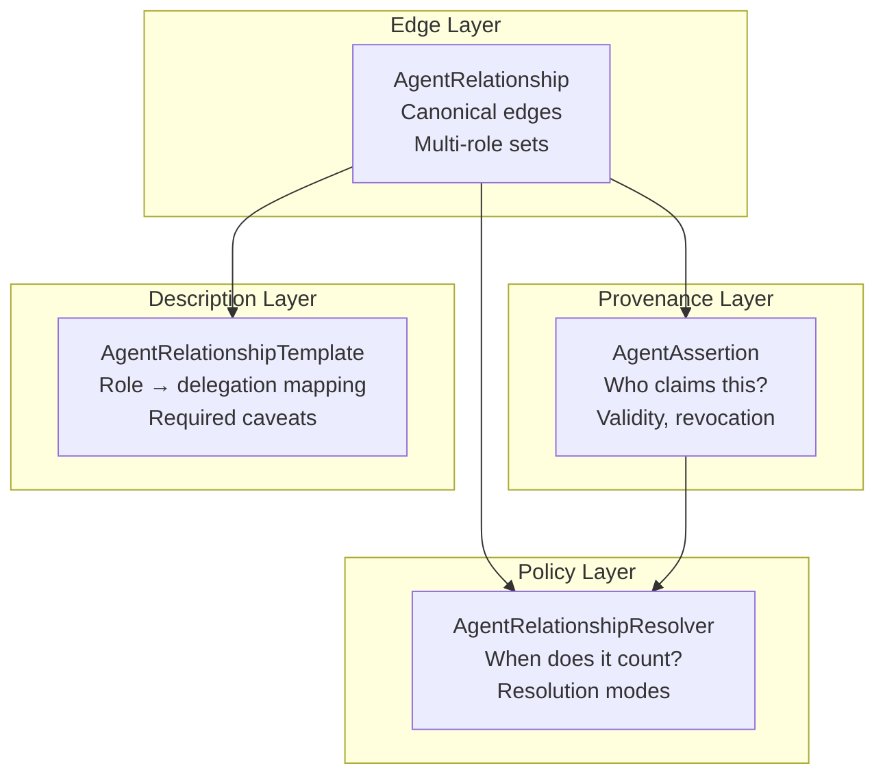
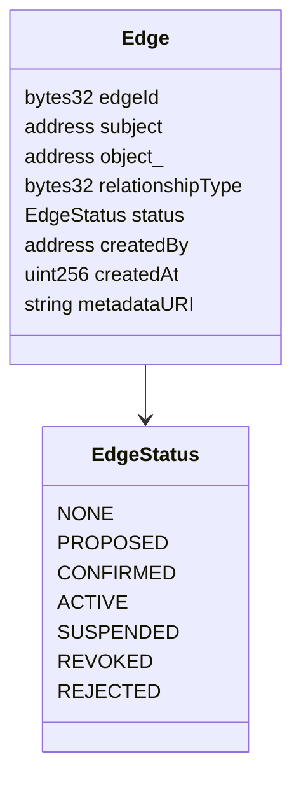
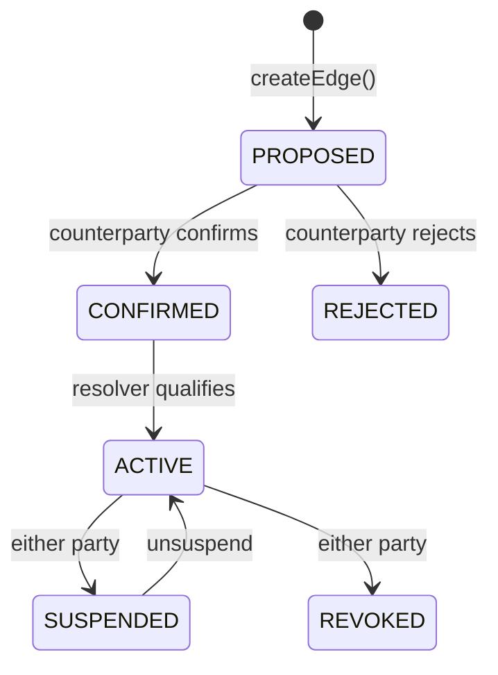
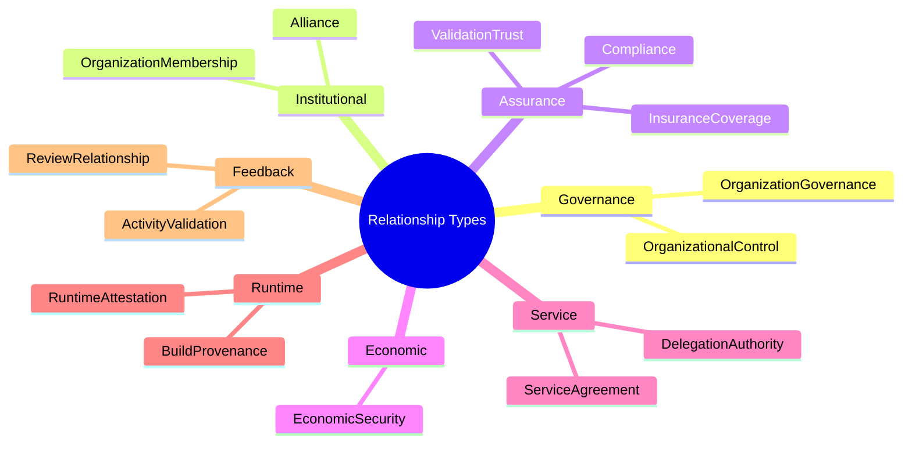
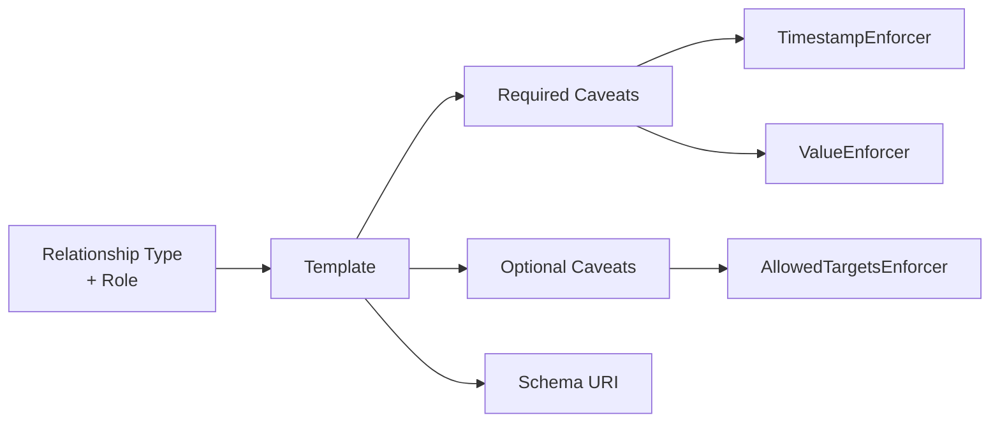
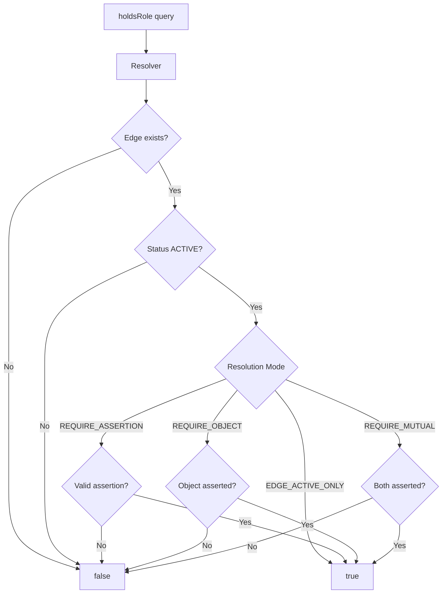
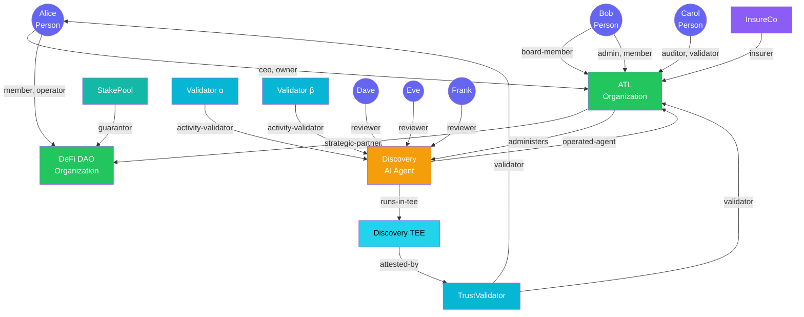
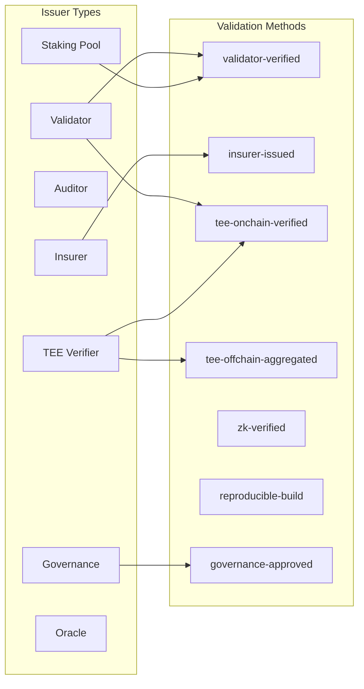

# Relationship Protocol — Agent Trust Graph

## Overview

The relationship protocol models trust between agents using four composable contracts. It follows DOLCE+DnS ontology: relationships are Situations, relationship types are Descriptions, roles are the parts agents play.

## Protocol Suite



## Relationship Edge

One edge per (subject, object, relationshipType) triple. Multiple roles on each edge.



### Edge Lifecycle



### Auto-Confirm Rule

When the same user owns both the subject and object agents, relationships are **auto-confirmed** on creation — no counterparty step needed.

## Relationship Types (12)



## Roles (47+)

| Category | Roles |
|----------|-------|
| **Governance** | owner, board-member, ceo, executive, treasurer, authorized-signer, officer, chair, advisor |
| **Control** | operated-agent, managed-agent, administers |
| **Membership** | admin, member, operator, employee, contractor |
| **Assurance** | auditor, validator, insurer, insured-party, underwriter, certified-by, licensed-by |
| **Economic** | staker, guarantor, backer, collateral-provider |
| **Alliance** | strategic-partner, affiliate, endorsed-by, subsidiary, parent-org |
| **Service** | vendor, service-provider, delegated-operator |
| **TEE/Runtime** | runs-in-tee, attested-by, verified-by, bound-to-kms, controls-runtime, built-from, deployed-from |
| **Validation** | activity-validator, validated-performer |
| **Review** | reviewer, reviewed-agent |

## Delegation Templates

Templates bridge roles to executable delegation patterns.



### Example: CEO Treasury Authority

```
Relationship Type: OrganizationGovernance
Role:              ceo
Template:          CEO Treasury Authority

Required Caveats:
  - TimestampEnforcer (time-bounded)
  - ValueEnforcer (spend cap)

Optional Caveats:
  - AllowedTargetsEnforcer (target contracts)

Activation:
  1. Relationship edge is ACTIVE
  2. Template exists for this role
  3. Governance policy satisfied
  → Delegation instantiated with caveats
```

## Trust Resolution



## Example Trust Graph



## Claim Issuers



## Reviews & Disputes

### Review Dimensions

| Dimension | What it measures |
|-----------|-----------------|
| accuracy | Correctness of outputs |
| reliability | Consistency over time |
| responsiveness | Speed of response |
| compliance | Adherence to policies |
| safety | Harm avoidance |
| transparency | Explainability |
| helpfulness | Usefulness of outputs |

### Dispute Types

| Type | Severity |
|------|----------|
| FLAG | Soft warning |
| DISPUTE | Formal dispute |
| SANCTION | Regulatory action |
| SUSPENSION | Temporary removal |
| REVOCATION | Permanent removal |
| BLACKLIST | Banned |

### Trust Profile

```
Trust Score = f(
  active relationship edges,
  average review score,
  open dispute count
)

Discovery Trust: edges(30) + reviews≥2(20) + avg≥60(30) + no disputes(20)
Execution Trust: edges≥2(30) + avg≥70(30) + no disputes(40)
```
