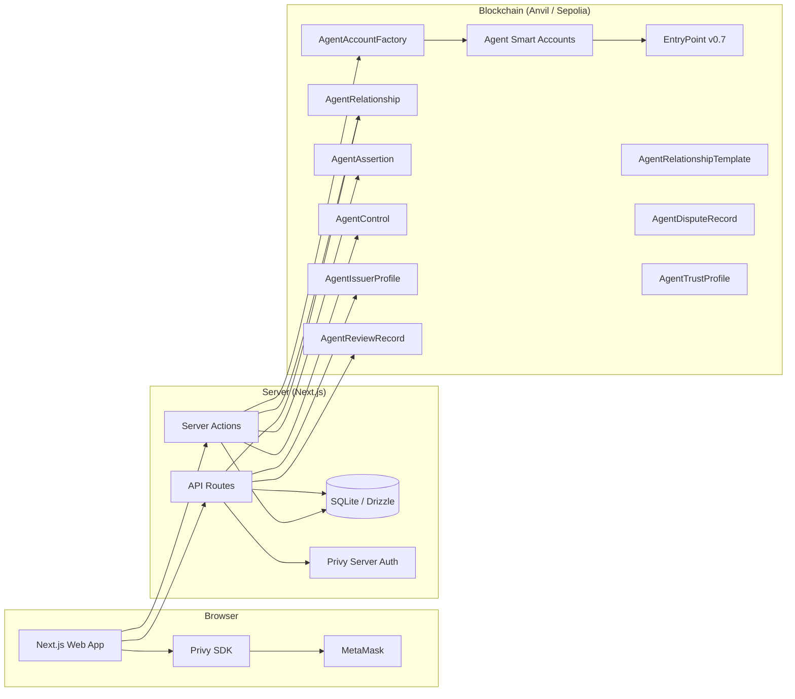
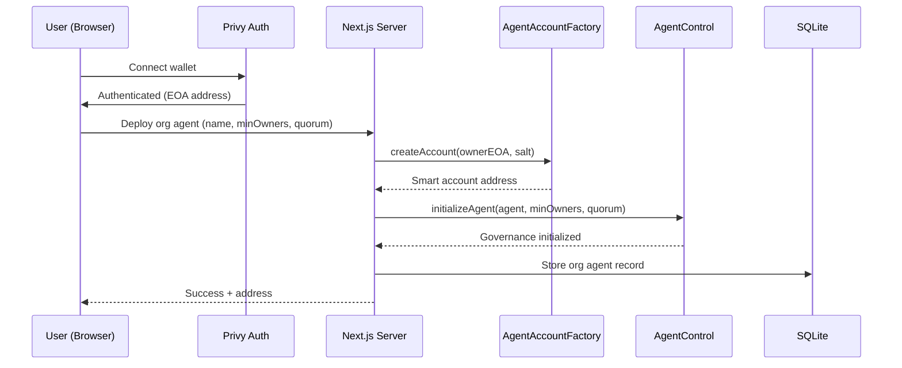
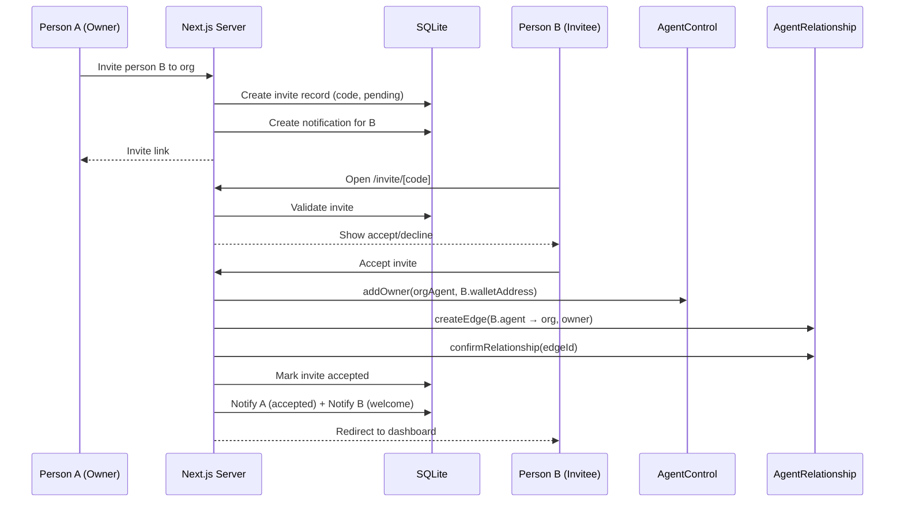
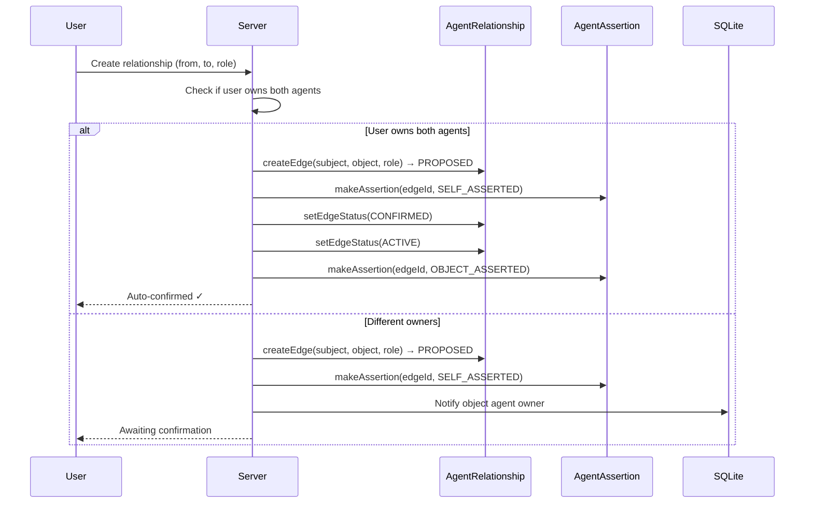

# System Architecture

## Runtime Architecture



## Data Flow: Deploy Agent



## Data Flow: Invite Co-Owner



## Data Flow: Create Relationship



## Deployment

### Local Development

```bash
# Terminal 1: Local blockchain
anvil

# Terminal 2: Deploy contracts + seed data
./scripts/deploy-local.sh    # 15 contracts
./scripts/seed-graph.sh      # 16 agents, 28 edges, 6 issuers, 3 reviews

# Terminal 3: Web app
pnpm dev                     # http://localhost:3000
```

### Environment Variables

| Variable | Purpose |
|----------|---------|
| `NEXT_PUBLIC_PRIVY_APP_ID` | Privy authentication |
| `PRIVY_APP_SECRET` | Privy server auth |
| `NEXT_PUBLIC_SKIP_AUTH` | Mock auth for testing |
| `NEXT_PUBLIC_CHAIN_ID` | Target chain |
| `RPC_URL` | Chain RPC endpoint |
| `DEPLOYER_PRIVATE_KEY` | Server-side deployer key |
| `AGENT_FACTORY_ADDRESS` | Factory contract |
| `AGENT_RELATIONSHIP_ADDRESS` | Relationship edges |
| `AGENT_ASSERTION_ADDRESS` | Provenance claims |
| `AGENT_RESOLVER_ADDRESS` | Trust resolution |
| `AGENT_TEMPLATE_ADDRESS` | Delegation templates |
| `AGENT_ISSUER_ADDRESS` | Claim issuers |
| `AGENT_VALIDATION_ADDRESS` | TEE validation |
| `AGENT_REVIEW_ADDRESS` | Structured reviews |
| `AGENT_DISPUTE_ADDRESS` | Disputes |
| `AGENT_TRUST_PROFILE_ADDRESS` | Trust scoring |
| `AGENT_CONTROL_ADDRESS` | Multi-sig governance |
