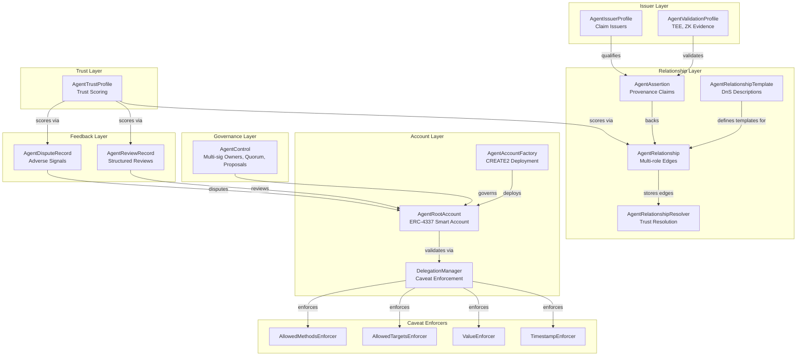
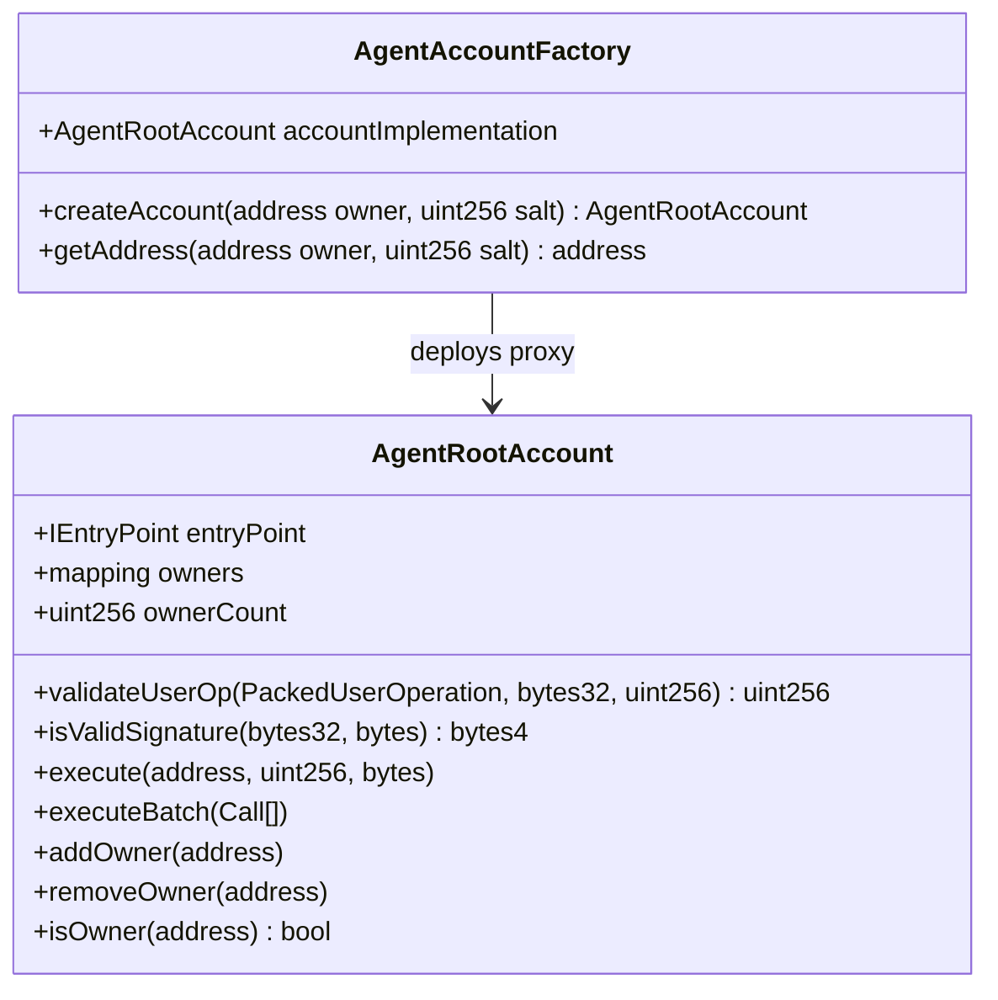

# Technical Architecture

## Monorepo Structure

```
smart-agent/
├── apps/web/                 Next.js 15 App Router (Privy auth, agent management UI)
├── packages/contracts/       Foundry smart contracts (Solidity ^0.8.28)
├── packages/sdk/             TypeScript SDK (viem-based, contract ABIs + clients)
├── packages/types/           Shared TypeScript types
├── docs/                     Architecture, specs, agent guides
├── scripts/                  Deploy and seed scripts
└── tests/                    E2E tests (planned)
```

## Contract Suite (15 contracts)



## AgentRootAccount (ERC-4337)

The core smart account — each agent's on-chain identity.



## Tech Stack

| Layer | Technology |
|-------|-----------|
| Smart Contracts | Solidity ^0.8.28, Foundry, OpenZeppelin |
| Account Model | ERC-4337 (EntryPoint v0.7) |
| Signatures | ERC-1271, EIP-712 |
| Chain | Local Anvil (31337), Sepolia (11155111) |
| SDK | TypeScript, viem |
| Web App | Next.js 15, React 19, App Router |
| Auth | Privy (wallet + email login) |
| Database | SQLite via Drizzle ORM |
| Styling | CSS data-attributes |

## SDK Package (`@smart-agent/sdk`)

```
sdk/src/
├── abi.ts              Contract ABIs (15 contracts)
├── account.ts          AgentAccountClient
├── delegation.ts       DelegationClient + caveat builders
├── session.ts          Session key management
├── relationship.ts     RelationshipProtocolClient + constants
└── index.ts            Public exports
```

## Web App Pages

| Route | Server/Client | Purpose |
|-------|--------------|---------|
| `/` | Server + Client | Landing page + Privy connect |
| `/onboarding` | Server + Client | Profile setup (name, email) |
| `/dashboard` | Server | Agent overview, relationships |
| `/deploy/person` | Server + Client | Deploy person 4337 agent |
| `/deploy/org` | Server + Client | Deploy org agent + governance |
| `/relationships` | Server + Client | Create, view, confirm/reject relationships |
| `/templates` | Server | View delegation templates |
| `/issuers` | Server | View registered claim issuers |
| `/reviews` | Server | Reviews and disputes |
| `/graph` | Client | Interactive SVG trust graph |
| `/agents/[address]` | Server + Client | Agent governance settings |
| `/invite/[code]` | Server + Client | Accept co-owner invite |

## API Routes

| Route | Method | Purpose |
|-------|--------|---------|
| `/api/auth/ensure-user` | POST | Create/link user on login |
| `/api/auth/profile` | GET/PUT | Read/update user profile |
| `/api/graph` | GET | Full trust graph (nodes, edges, templates) |
| `/api/agents/people` | GET | List all person agents |
| `/api/agents/governance` | POST | Initialize/addOwner/setQuorum |
| `/api/invites` | GET/POST | List/create invite codes |
| `/api/invites/[code]/accept` | POST | Accept invite + add owner + create relationship |
| `/api/messages` | GET/POST | Notifications |
| `/api/messages/[id]` | PUT | Mark read |
