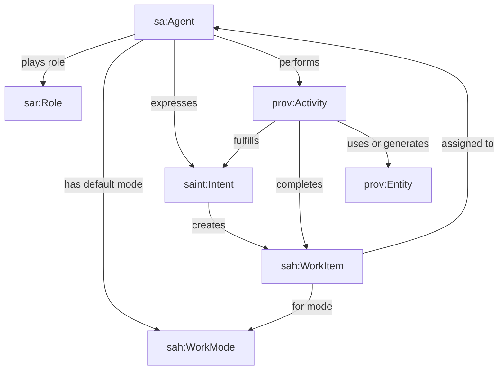
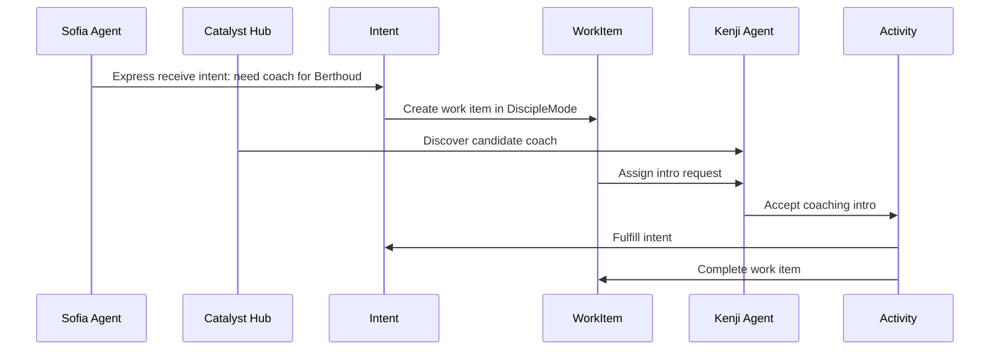
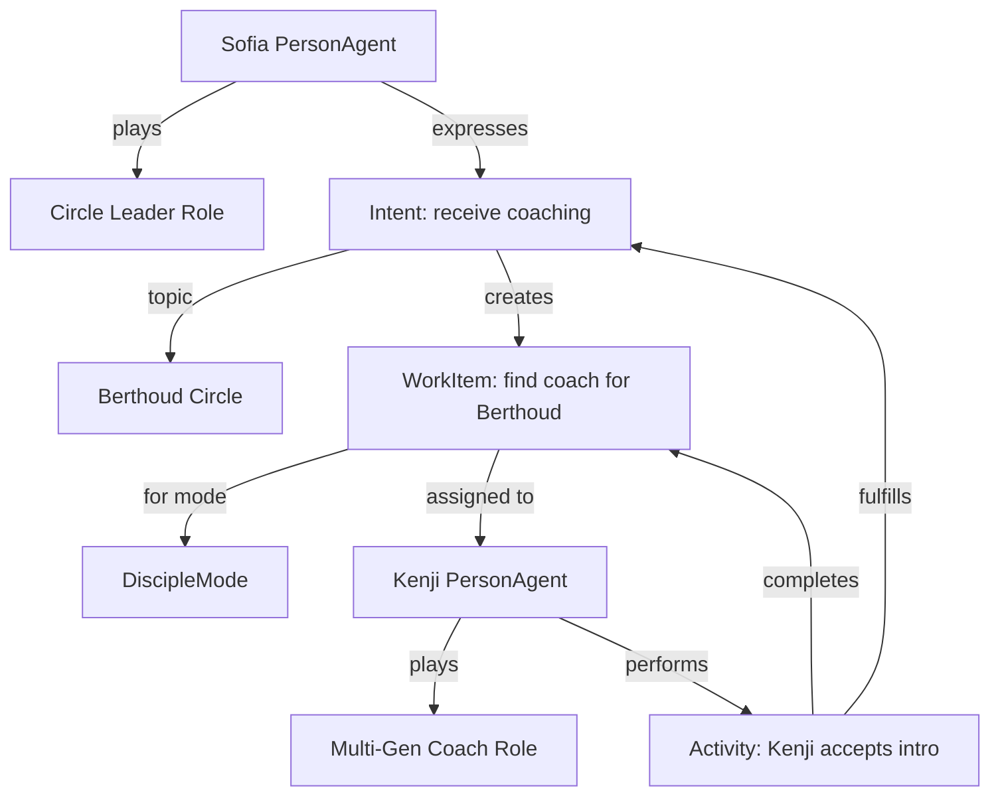

# Work Mode Ontology

## Purpose

Catalyst needs a shared ontology for how agents, roles, intents, work
items, activities, and UI work modes relate.

The core idea:

```text
Agent plays Role.
Agent expresses Intent.
Intent creates WorkItem.
WorkItem is shown inside a WorkMode.
Agent performs Activity to complete the WorkItem.
Activity fulfills Intent and may produce evidence/entities.
```

## Core Classes

| Class | Upper ontology | Meaning |
| --- | --- | --- |
| `sa:Agent` | `prov:Agent`, `dul:Agent` | Person, org, hub, service, or AI agent |
| `sar:Role` | `dul:Role` | Contextual role an agent plays |
| `sah:WorkMode` | `dul:Description`, `skos:Concept` | Recurring frame of work: Govern, Discover, Disciple, Walk |
| `sah:WorkItem` | `prov:Entity` | Actionable unit of work in the hub |
| `saint:Intent` | `dul:Plan`, `prov:Plan` | Expressed, committed desire with direction `give` or `receive` |
| `prov:Activity` | `prov:Activity`, `dul:Action` | Actual action performed |
| `prov:Entity` | `prov:Entity` | Evidence, note, credential, report, contact, claim |

## Concept Diagram



## Work Modes

`WorkMode` is the ontology class. "Track" can be the UI label.

```ttl
sah:WorkMode
    a owl:Class ;
    rdfs:subClassOf dul:Description, skos:Concept ;
    rdfs:label "Work Mode" ;
    rdfs:comment "A recurring frame of hub work that organizes intents, work items, activities, roles, and UI views." .
```

Recommended instances:

```ttl
sah:GovernMode   a sah:WorkMode, skos:Concept .
sah:DiscoverMode a sah:WorkMode, skos:Concept .
sah:DiscipleMode a sah:WorkMode, skos:Concept .
sah:WalkMode     a sah:WorkMode, skos:Concept .
sah:RouteMode    a sah:WorkMode, skos:Concept .
sah:StewardMode  a sah:WorkMode, skos:Concept .
```

## Key Properties

```ttl
sah:supportsWorkMode      rdfs:domain sah:HubProfile ; rdfs:range sah:WorkMode .
sah:defaultWorkMode       rdfs:domain sa:Agent ; rdfs:range sah:WorkMode .
sah:availableWorkMode     rdfs:domain sa:Agent ; rdfs:range sah:WorkMode .
sah:forWorkMode           rdfs:domain sah:WorkItem ; rdfs:range sah:WorkMode .
sah:expressedInWorkMode   rdfs:domain saint:Intent ; rdfs:range sah:WorkMode .
sah:assignedTo            rdfs:domain sah:WorkItem ; rdfs:range sa:Agent .
sah:triggeredByIntent     rdfs:domain sah:WorkItem ; rdfs:range saint:Intent .
sah:completedByActivity   rdfs:domain sah:WorkItem ; rdfs:range prov:Activity .
saint:fulfilledBy         rdfs:domain saint:Intent ; rdfs:range prov:Activity .
```

## Example: Find A Coach For Berthoud

Sofia is a Circle Leader. She needs a coach for Berthoud Circle.



Graph form:



## Turtle Example

```ttl
@prefix sa:    <https://smartagent.io/ontology/core#> .
@prefix sah:   <https://smartagent.io/ontology/hub#> .
@prefix saint: <https://smartagent.io/ontology/intent#> .
@prefix sar:   <https://smartagent.io/ontology/relationships#> .
@prefix prov:  <http://www.w3.org/ns/prov#> .

:catalystHub
    a sa:HubAgent ;
    sah:supportsWorkMode sah:DiscipleMode, sah:DiscoverMode, sah:GovernMode .

:sofia
    a sa:PersonAgent ;
    sar:hasRole sar:CircleLeader ;
    sah:defaultWorkMode sah:DiscipleMode .

:kenji
    a sa:PersonAgent ;
    sar:hasRole sar:Coach ;
    sah:availableWorkMode sah:DiscipleMode .

:intent123
    a saint:Intent ;
    saint:direction saint:Receive ;
    saint:object :Coaching ;
    saint:topic "Coach for Berthoud Circle" ;
    prov:wasAttributedTo :sofia ;
    sah:expressedInWorkMode sah:DiscipleMode .

:workItem456
    a sah:WorkItem ;
    sah:triggeredByIntent :intent123 ;
    sah:forWorkMode sah:DiscipleMode ;
    sah:assignedTo :kenji ;
    prov:value "Request coaching intro for Berthoud Circle" .

:activity789
    a prov:Activity ;
    prov:wasAssociatedWith :kenji ;
    saint:fulfillsIntent :intent123 ;
    sah:completesWorkItem :workItem456 ;
    prov:generated :coachIntroEvidence .
```

## Rule Of Thumb

```text
Role = who the agent is in a context
WorkMode = how the hub frames the work
Intent = what the agent wants to give or receive
WorkItem = what the system asks someone to do next
Activity = what actually happened
Entity = evidence or data produced/used
```
