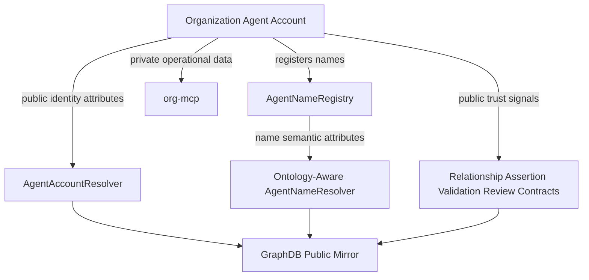

# 11 - Organization Data Management

## Purpose

This document defines where organization-agent data should live and how public
identity, name metadata, private org operations, trust signals, and ontology
shape validation fit together.

The goal is:

```text
public org identity and trust signals on-chain
private org operations in org-mcp
GraphDB as public read model only
no private org data in web SQL
```

## Example Organization

Example org agent:

```text
Front Range House Churches
Smart account: 0xOrgSmartAccount
Primary name: frontrange.agent
Org kind: Faith network / nonprofit
Operating area: Northern Colorado
```

## Storage Split

| Data | Storage | Why |
| --- | --- | --- |
| Public org identity | `AgentAccountResolver` on-chain | Discoverable, stable, graph-safe |
| Public org name records | `AgentNameRegistry` + ontology-aware `AgentNameResolver` on-chain | Name ownership and semantic name binding |
| Public trust claims | relationship/assertion/validation/review contracts | Trust graph input |
| Private org operations | `org-mcp` | Sensitive business, people, financial, and workflow data |
| Public graph read model | GraphDB | Mirrors only on-chain facts |
| Auth/bootstrap/reference cache | web SQL | No private org data |

## Agent Account On-Chain Attributes

Use `AgentAccountResolver` for public organization identity and discovery
fields.

Example attributes:

```text
sa:displayName       "Front Range House Churches"
sa:description       "Regional network of house churches in Northern Colorado"
sa:agentType         sa:OrganizationAgent
sa:companyType       sa:FaithNetwork
sa:primaryName       "frontrange.agent"
sa:city              "Fort Collins"
sa:region            "Colorado"
sa:country           "US"
sai:mcpServer        "https://mcp.frontrange.example"
sai:a2aEndpoint      "https://a2a.frontrange.example"
```

These fields are appropriate on-chain because they are public, useful for
discovery, and safe to mirror into GraphDB.

## Name On-Chain Attributes

The org registers names in `AgentNameRegistry`.

Example names:

```text
frontrange.agent
frontrange.catalyst.agent
frontrange.noco.geo
```

Target model for `AgentNameResolver`: replace generic text records with
ontology-governed attributes keyed by `OntologyTermRegistry`.

Example `frontrange.agent` name attributes:

```text
san:resourceRef      0xOrgSmartAccount
san:nameClass        sa:OrganizationAgentName
rdfs:label           "frontrange.agent"
san:displayLabel     "Front Range House Churches"
san:verified         true
san:verificationRef  assertionId
san:visibility       public
```

Example `frontrange.noco.geo` name attributes:

```text
san:resourceRef      geoFeatureId
san:nameClass        sageo:GeoFeatureName
sageo:relation       sageo:operatesIn
san:visibility       public-coarse
```

## Org MCP Private Storage

Use `org-mcp` for private organization data.

Examples:

```text
internalContactEmail
internalContactPhone
financialContacts
internalNotes
private member notes
revenue reports
grant proposal drafts
activity logs
private intents
private needs
private offerings
engagement sessions
tranche notes
policy drafts
```

Example private row:

```json
{
  "orgPrincipal": "0xOrgSmartAccount",
  "internalContactEmail": "ops@frontrange.example",
  "financialContacts": [
    { "name": "Treasurer", "email": "private@example.com" }
  ],
  "internalNotes": "Do not expose donor list publicly"
}
```

This must not be written to `AgentAccountResolver`, `AgentNameResolver`, or
GraphDB.

## Public Signaling

When private org facts should influence discovery or trust, publish bounded
public signals rather than raw private rows.

Private fact:

```text
Org has 42 members and active coaching capacity in Loveland.
```

Public signal:

```text
sa:memberCountBand       "25-50"
sa:hasPublicOffering     "multiplier-coaching"
sageo:operatesIn         Loveland
saskill:practicesSkill   church-planting
```

This allows discovery without exposing the member list, donor records, internal
notes, or detailed operations.

## Trust Layer

Trust should come from assertions and validations, not only self-entered
profile data.

Example public trust graph:

```text
FrontRange self-asserts:
  companyType = FaithNetwork
  operatesIn = Northern Colorado
  hasSkill = church-planting

Catalyst validates:
  FrontRange is an allied network

Reviewer records:
  4.7/5 service reliability over 8 engagements
```

Use:

| Need | Contract / layer |
| --- | --- |
| Org membership, alliance, coaching, governance | `AgentRelationship` |
| Public claims | `AgentAssertion` or class/assertion registry |
| Validation | `AgentValidationProfile` |
| Reviews | `AgentReviewRecord` |
| Disputes/adverse signals | `AgentDisputeRecord` |
| Public discovery mirror | GraphDB sync from on-chain only |

## Shape Enforcement

The desired validation model is SHACL-inspired, but implemented as a bounded
on-chain subset.

Example class shape:

```text
Class: sa:OrganizationAgent

Required:
  sa:displayName
  sa:agentType = sa:OrganizationAgent
  sa:companyType

Optional:
  sa:city
  sa:region
  sa:country
  sai:mcpServer
  sai:a2aEndpoint
  sa:publicWebsite
```

Example `companyType` term:

```text
predicate: sa:companyType
datatype: bytes32
range: sa:CompanyType
allowed values:
  sa:Nonprofit
  sa:FaithNetwork
  sa:Church
  sa:Foundation
  sa:DAO
  sa:LLC
```

If a caller attempts to set:

```text
sa:companyType = "random string"
```

the contract should reject it because `sa:companyType` expects a `bytes32`
ontology concept from the allowed set.

## Target Architecture



## Recommended Rule

Use this default split:

```text
AgentAccountResolver
  public identity and discovery attributes for the org agent

AgentNameRegistry / AgentNameResolver
  public semantic name records and resource binding

org-mcp
  private org operations, PII, financials, drafts, notes

trust contracts
  public claims, validation, reviews, disputes, trust signals

GraphDB
  public mirror only, derived from on-chain data
```

This gives public semantic discovery without leaking private org data.
