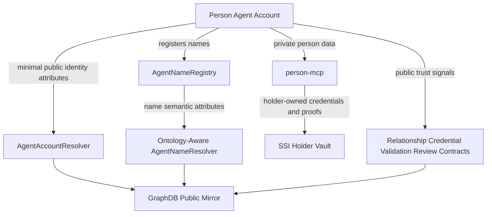

# 12 - Person Data Management

## Purpose

This document defines where person-agent data should live and how public
identity, name metadata, private person data, credentials, trust signals, and
ontology shape validation fit together.

The goal is:

```text
minimal public person identity on-chain
private person state in person-mcp
credentials and proofs in the SSI holder vault
GraphDB as public read model only
no private person data in web SQL
```

## Example Person

Example person agent:

```text
Person: Barb
Smart account: 0xPersonSmartAccount
Primary name: barb.agent
Agent kind: Person agent
Operating context: family, church, marketplace, local community
```

## Storage Split

| Data | Storage | Why |
| --- | --- | --- |
| Public person identity | `AgentAccountResolver` on-chain | Discoverable, stable, graph-safe |
| Public person name records | `AgentNameRegistry` + ontology-aware `AgentNameResolver` on-chain | Name ownership and semantic name binding |
| Private person profile | `person-mcp` | PII, preferences, notes, relationships, and local workflows |
| Credentials and proofs | `person-mcp` SSI vault | Holder-owned credential storage and selective disclosure |
| Public trust claims | relationship/assertion/validation/review contracts | Trust graph input |
| Public graph read model | GraphDB | Mirrors only on-chain facts |
| Auth/bootstrap/reference cache | web SQL | No private person data |

## Agent Account On-Chain Attributes

Use `AgentAccountResolver` for minimal public identity and discovery fields.

Example attributes:

```text
sa:displayName       "Barb"
sa:description       "Person agent for local community coordination"
sa:agentType         sa:PersonAgent
sa:primaryName       "barb.agent"
sa:region            "Colorado"
sa:country           "US"
sai:mcpServer        "https://person-mcp.example/users/barb"
sai:a2aEndpoint      "https://a2a.example/users/barb"
```

These fields are appropriate on-chain only if the person intentionally wants
them public. Person accounts should default to less public data than org or
service accounts.

## Name On-Chain Attributes

The person registers names in `AgentNameRegistry`.

Example names:

```text
barb.agent
barb.family.agent
barb.skills.agent
```

Target model for `AgentNameResolver`: replace generic text records with
ontology-governed attributes keyed by `OntologyTermRegistry`.

Example `barb.agent` name attributes:

```text
san:resourceRef      0xPersonSmartAccount
san:nameClass        sa:PersonAgentName
rdfs:label           "barb.agent"
san:displayLabel     "Barb"
san:verified         true
san:verificationRef  assertionId
san:visibility       public
```

Example `barb.skills.agent` name attributes:

```text
san:resourceRef      0xPersonSmartAccount
san:nameClass        saskill:SkillProfileName
saskill:relation     saskill:hasPublicSkillProfile
san:visibility       public-coarse
```

## Person MCP Private Storage

Use `person-mcp` for private person data.

Examples:

```text
legal name
private email
phone number
home address
family relationships
guardian/minor records
preferences
private notes
prayer requests
personal goals
credential wallet metadata
credential revocation state
proof requests
activity logs
private intents
private needs
private offerings
engagement holder state
```

Example private row:

```json
{
  "personPrincipal": "0xPersonSmartAccount",
  "legalName": "Private Legal Name",
  "email": "private@example.com",
  "familyRelationships": [
    { "relationship": "guardian", "subject": "did:example:minor" }
  ],
  "notes": "Do not expose family details publicly"
}
```

This must not be written to `AgentAccountResolver`, `AgentNameResolver`, or
GraphDB.

## Credentials and Selective Disclosure

Person credentials belong in the `person-mcp` SSI holder vault.

Examples:

```text
OrgMembershipCredential
GuardianOfMinorCredential
GeoLocationCredential
SkillsCredential
TrainingCompletionCredential
```

The public chain should not store raw credential claims. It may store public
credential definitions, issuer identities, revocation registries, proof
verification outcomes, or bounded commitments.

Private credential fact:

```text
Barb is guardian of a minor and completed a trauma-informed care module.
```

Public signal:

```text
sac:hasVerifiedCredentialType  "TrainingCompletionCredential"
saskill:hasVerifiedSkill       "trauma-informed-care"
sa:eligibilityBand             "family-support-volunteer"
```

The public signal should prove eligibility without exposing the minor,
household, legal name, or underlying credential payload.

## Public Signaling

When private person facts should influence discovery or trust, publish bounded
public signals rather than raw private rows.

Private fact:

```text
Person is available two evenings a week for childcare support near Loveland.
```

Public signal:

```text
sa:hasPublicOffering     "childcare-support"
sa:availabilityBand      "limited-weekly"
sageo:operatesIn         Loveland
saskill:practicesSkill   child-safety
```

This allows matching without exposing the person's schedule, address, family
composition, or private notes.

## Trust Layer

Trust should come from credentials, validations, relationships, and reviews,
not only self-entered profile data.

Example public trust graph:

```text
Barb self-asserts:
  hasSkill = childcare-support
  operatesIn = Northern Colorado

Skill issuer validates:
  Barb completed child safety training

Org validates:
  Barb is an active volunteer

Reviewer records:
  5/5 reliability over 3 completed engagements
```

Use:

| Need | Contract / layer |
| --- | --- |
| Household, membership, volunteer, governance links | `AgentRelationship` |
| Public claims | `AgentAssertion` or class/assertion registry |
| Credential schema and issuer metadata | `CredentialRegistry` |
| Proof verification outcomes | verifier contract or validation assertion |
| Reviews | `AgentReviewRecord` |
| Disputes/adverse signals | `AgentDisputeRecord` |
| Public discovery mirror | GraphDB sync from on-chain only |

## Shape Enforcement

The desired validation model is SHACL-inspired, but implemented as a bounded
on-chain subset.

Example class shape:

```text
Class: sa:PersonAgent

Required:
  sa:displayName
  sa:agentType = sa:PersonAgent

Optional:
  sa:primaryName
  sa:region
  sa:country
  sai:mcpServer
  sai:a2aEndpoint
  sa:publicWebsite
```

Example `agentType` term:

```text
predicate: sa:agentType
datatype: bytes32
range: sa:AgentType
allowed values:
  sa:PersonAgent
  sa:OrganizationAgent
  sa:ServiceAgent
  sa:SoftwareAgent
```

If a caller attempts to set:

```text
sa:agentType = "person"
```

the contract should reject it because `sa:agentType` expects a `bytes32`
ontology concept from the allowed set.

## Target Architecture



## Recommended Rule

Use this default split:

```text
AgentAccountResolver
  minimal public identity and discovery attributes for the person agent

AgentNameRegistry / AgentNameResolver
  public semantic name records and resource binding

person-mcp
  private person data, PII, preferences, relationships, workflows

SSI holder vault
  credentials, proof requests, selective disclosure state

trust contracts
  public claims, validations, reviews, disputes, trust signals

GraphDB
  public mirror only, derived from on-chain data
```

This gives person agents discoverability and trust without leaking private
identity, family, credential, or preference data.
