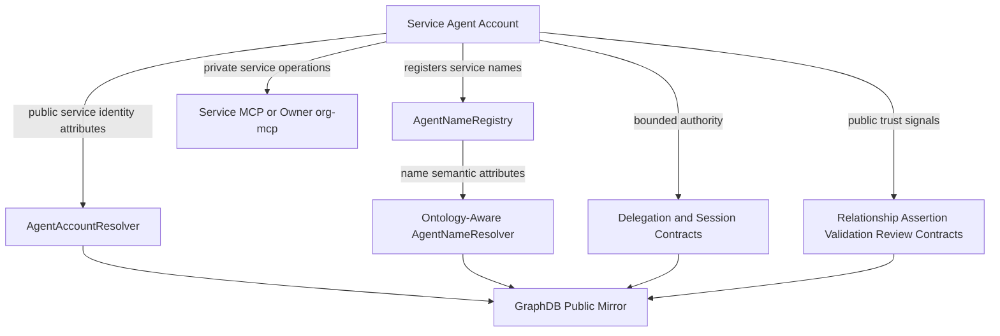

# 13 - Agent Service Data Management

## Purpose

This document defines where agent-service data should live and how public
service identity, name metadata, service capability records, private operations,
trust signals, and ontology shape validation fit together.

The goal is:

```text
public service identity and capabilities on-chain
private service operations in the owning service MCP or org-mcp
GraphDB as public read model only
no private service data in web SQL
```

## Example Agent Service

Example service agent:

```text
Service: Grant Proposal Assistant
Smart account: 0xServiceSmartAccount
Primary name: grants.frontrange.agent
Service kind: Proposal drafting and funding workflow support
Owner: Front Range House Churches
Operating area: nonprofit grants and local ministry funding
```

## Storage Split

| Data | Storage | Why |
| --- | --- | --- |
| Public service identity | `AgentAccountResolver` on-chain | Discoverable, stable, graph-safe |
| Public service name records | `AgentNameRegistry` + ontology-aware `AgentNameResolver` on-chain | Name ownership and semantic service binding |
| Public capability claims | on-chain ontology attributes and assertions | Service discovery and routing |
| Private service operations | service MCP or owner `org-mcp` | Prompts, drafts, logs, configs, and customer data |
| Delegation and authority | delegation/session contracts | Controls what the service can do |
| Public trust claims | relationship/assertion/validation/review contracts | Trust graph input |
| Public graph read model | GraphDB | Mirrors only on-chain facts |
| Auth/bootstrap/reference cache | web SQL | No private service data |

## Agent Account On-Chain Attributes

Use `AgentAccountResolver` for public service identity and capability discovery.

Example attributes:

```text
sa:displayName       "Grant Proposal Assistant"
sa:description       "Agent service for drafting grant proposals and funding workflows"
sa:agentType         sa:ServiceAgent
sa:serviceType       sa:GrantProposalService
sa:primaryName       "grants.frontrange.agent"
sa:ownedBy           0xOrgSmartAccount
saskill:hasSkill     grant-writing
saskill:hasSkill     budget-planning
sai:mcpServer        "https://mcp.frontrange.example/services/grants"
sai:a2aEndpoint      "https://a2a.frontrange.example/services/grants"
```

These fields are appropriate on-chain because they are public service claims
used for discovery, routing, delegation decisions, and trust evaluation.

## Name On-Chain Attributes

The service registers names in `AgentNameRegistry`.

Example names:

```text
grants.frontrange.agent
budgets.frontrange.agent
intake.frontrange.agent
```

Target model for `AgentNameResolver`: replace generic text records with
ontology-governed attributes keyed by `OntologyTermRegistry`.

Example `grants.frontrange.agent` name attributes:

```text
san:resourceRef      0xServiceSmartAccount
san:nameClass        sa:ServiceAgentName
rdfs:label           "grants.frontrange.agent"
san:displayLabel     "Grant Proposal Assistant"
san:verified         true
san:verificationRef  assertionId
san:visibility       public
```

Example service route name attributes:

```text
san:resourceRef      0xServiceSmartAccount
san:nameClass        sa:ServiceEndpointName
sa:serviceType       sa:GrantProposalService
san:visibility       public
```

## Service MCP Private Storage

Use a service MCP, or the owning org's `org-mcp`, for private service data.

Examples:

```text
private prompts
system instructions
draft proposals
customer inputs
intake forms
funding research notes
API credentials
tool configuration
execution logs
evaluation traces
human review notes
rate limits
policy exceptions
private work items
```

Example private row:

```json
{
  "servicePrincipal": "0xServiceSmartAccount",
  "ownerPrincipal": "0xOrgSmartAccount",
  "draftProposalId": "proposal-draft-123",
  "customerInputs": {
    "programBudget": "private",
    "beneficiaryDetails": "private"
  },
  "operatorNotes": "Needs human review before submission"
}
```

This must not be written to `AgentAccountResolver`, `AgentNameResolver`, or
GraphDB.

## Delegation and Authority

Service agents need explicit authority boundaries. Public identity says what
the service is. Delegation says what the service may do.

Examples:

```text
allowed target: ProposalRegistry
allowed method: submitDraftProposal
max value: 0 ETH
valid window: 2026-05-01 through 2026-06-01
required reviewer: 0xHumanOperator
```

Service authority belongs in delegation/session contracts, not in private MCP
configuration alone.

## Public Signaling

When private service performance or usage should influence discovery or trust,
publish bounded public signals rather than raw logs.

Private fact:

```text
Service processed 83 drafts, 11 of which included sensitive beneficiary data.
```

Public signal:

```text
sa:completedWorkCountBand   "50-100"
sa:hasPublicOffering        "grant-proposal-support"
saskill:practicesSkill      grant-writing
sa:requiresHumanReview      true
```

This allows service discovery without exposing customers, prompts, drafts,
beneficiary data, or execution traces.

## Trust Layer

Trust should come from owner assertions, validations, reviews, audits, and
runtime constraints.

Example public trust graph:

```text
Service self-asserts:
  serviceType = GrantProposalService
  hasSkill = grant-writing
  requiresHumanReview = true

Owner org asserts:
  Service is operated by Front Range House Churches

Reviewer validates:
  Service follows human-review policy

User reviews:
  4.8/5 helpfulness over 12 completed engagements
```

Use:

| Need | Contract / layer |
| --- | --- |
| Ownership, operator, provider, allowed customer links | `AgentRelationship` |
| Public service claims | `AgentAssertion` or class/assertion registry |
| Capability and policy validation | `AgentValidationProfile` |
| Service reviews | `AgentReviewRecord` |
| Disputes/adverse signals | `AgentDisputeRecord` |
| Delegated authority | delegation/session contracts |
| Public discovery mirror | GraphDB sync from on-chain only |

## Shape Enforcement

The desired validation model is SHACL-inspired, but implemented as a bounded
on-chain subset.

Example class shape:

```text
Class: sa:ServiceAgent

Required:
  sa:displayName
  sa:agentType = sa:ServiceAgent
  sa:serviceType
  sa:ownedBy

Optional:
  sa:primaryName
  sa:description
  saskill:hasSkill
  sai:mcpServer
  sai:a2aEndpoint
  sa:requiresHumanReview
```

Example `serviceType` term:

```text
predicate: sa:serviceType
datatype: bytes32
range: sa:ServiceType
allowed values:
  sa:GrantProposalService
  sa:BudgetPlanningService
  sa:MemberIntakeService
  sa:TrainingCoachService
  sa:VerifierService
```

If a caller attempts to set:

```text
sa:serviceType = "generic bot"
```

the contract should reject it because `sa:serviceType` expects a `bytes32`
ontology concept from the allowed set.

## Target Architecture



## Recommended Rule

Use this default split:

```text
AgentAccountResolver
  public service identity and capability attributes

AgentNameRegistry / AgentNameResolver
  public semantic service names and endpoint binding

service MCP or owner org-mcp
  private prompts, drafts, logs, configs, customer data, operational state

delegation/session contracts
  bounded service authority and execution permissions

trust contracts
  public claims, validations, reviews, disputes, trust signals

GraphDB
  public mirror only, derived from on-chain data
```

This gives service agents public discoverability and delegated authority without
leaking customer data, prompts, drafts, or operational internals.
