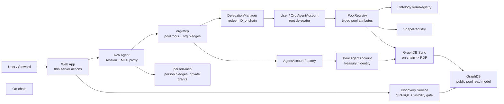
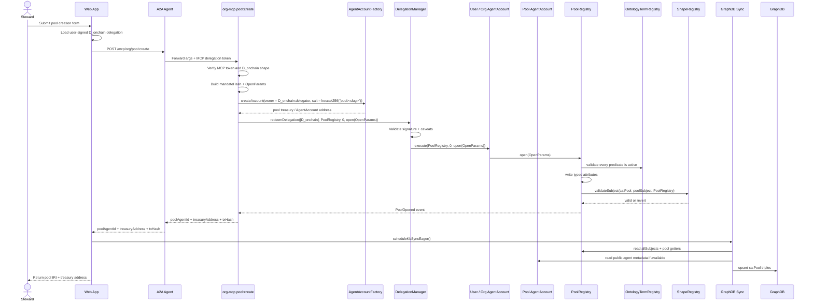
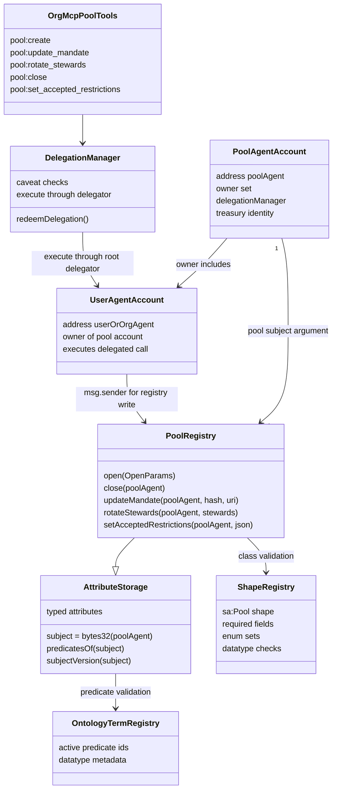
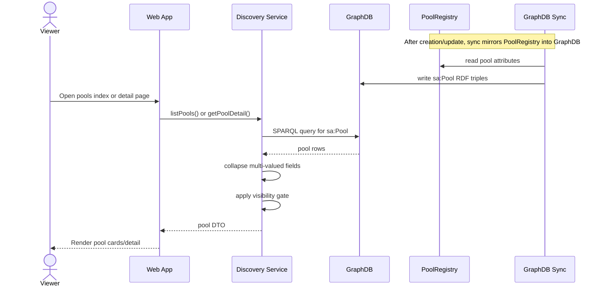
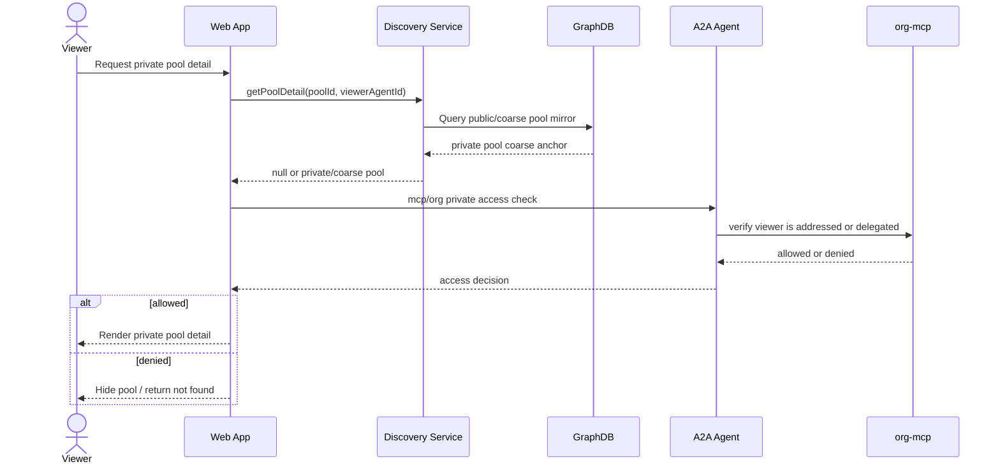
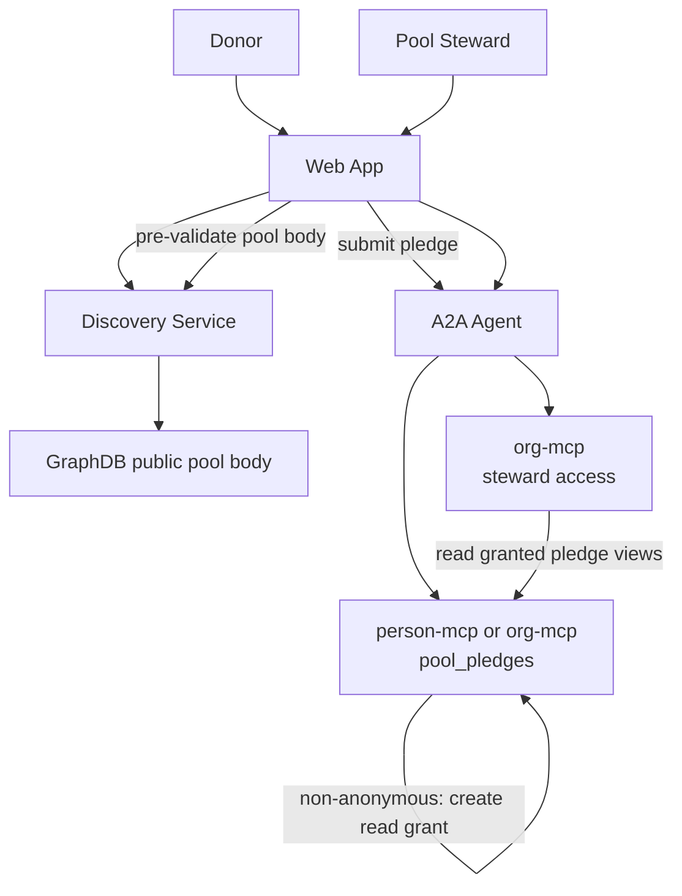

# 14 - Pool Creation and Access Architecture

## Purpose

This document shows the object interactions between the web app, A2A agent,
org-mcp, on-chain `PoolRegistry`, and GraphDB when a pool is created and later
accessed.

The current implementation rule:

```text
Web app is a thin proxy for pool writes.
org-mcp executes pool writes through the user's D_onchain delegation.
Pool body lives on-chain in PoolRegistry.
GraphDB mirrors on-chain public pool facts.
MCPs hold pledge/access state, not the canonical pool body.
The web app reads public pool data through Discovery/GraphDB.
```

## Component Picture



## Object Responsibilities

| Object | Responsibility |
| --- | --- |
| Web app | Collects form input, attaches `D_onchain`, calls A2A/MCP, triggers GraphDB sync, renders pool pages |
| A2A agent | Converts web session grants into MCP calls and routes to the right MCP |
| org-mcp | Owns Tier 2 pool tools, deploys pool accounts, redeems `D_onchain` for `PoolRegistry` writes, stores org-owned pledge rows |
| person-mcp | Stores person-owned pledge rows, cross-delegation grants, and private donor state |
| `DelegationManager` | Validates the user's signed on-chain delegation and executes through the user/org `AgentAccount` |
| User/org `AgentAccount` | Root delegator for pool writes; must be the owner of the pool account |
| `AgentAccountFactory` | Deploys deterministic pool smart accounts |
| Pool `AgentAccount` | Pool treasury/identity account; owner set controls pool authority |
| `PoolRegistry` | On-chain source of truth for pool body attributes |
| `OntologyTermRegistry` | Ensures pool predicates are registered ontology terms |
| `ShapeRegistry` | Enforces required pool fields, datatypes, and enum values |
| GraphDB sync | Reads on-chain pool attributes and emits RDF |
| GraphDB | Public mirror for pool discovery and detail reads |
| Discovery service | Queries GraphDB and applies viewer-side visibility/ranking logic |

## Create Pool Sequence



### Create-Time Data

| Field | Source | Stored in |
| --- | --- | --- |
| Pool slug | web form | `PoolRegistry` as `sa:poolSlug` |
| Pool display name | pool agent metadata if set; otherwise slug fallback | `AgentAccountResolver` / GraphDB mirror fallback |
| Pool agent address | org-mcp calls `AgentAccountFactory` | chain |
| Domain | web form | `PoolRegistry` |
| Governance model | web form, normalized by SDK | `PoolRegistry` |
| Mandate hash | org-mcp `pool:create` tool | `PoolRegistry` |
| Accepted units/kinds | web form | `PoolRegistry` |
| Ceiling policy/capacity | web form | `PoolRegistry` |
| Stewards | web form | `PoolRegistry` |
| Visibility | web form | `PoolRegistry` |
| `D_onchain` delegation | web auth/session layer | forwarded to org-mcp, redeemed on-chain |
| Addressed members for private pools | web form | reserved/private access input; not canonical pool body |

## On-Chain Pool Object



## Public Pool Access Sequence



## Private Pool / Addressed Access Sequence

Private pool access needs public coarse data plus a private authorization check.
GraphDB must not expose private membership or donor data as public facts.

Current code note: public page reads go through `DiscoveryService`. The intended
private-pool access check is A2A -> org-mcp. If addressed-member data is not in
the public mirror, private pool detail must be resolved through that MCP path.



## Pledge / Counter Access

Pool body data is on-chain. Pledge data is donor-owned MCP data.



Counter rule:

```text
pledgedTotal, allocatedTotal, availableTotal are derived from pool_pledges.
They are not the pool body source of truth.
GraphDB sync currently reads org-mcp pool_pledges directly in dev mode to
materialize public counters.
Public aggregate assertions may later replace this with coarse on-chain facts.
```

## Read Model Shape in GraphDB

GraphDB should contain only public mirror triples derived from on-chain data:

```text
<urn:smart-agent:pool:demo-trauma-care-pool> a sa:Pool ;
  sa:displayName "demo-trauma-care-pool" ;
  sa:treasuryAgent <https://agentictrust.io/ontology/sa#agent/0x...> ;
  sa:domain "faith-network" ;
  sa:governanceModel "giving-circle" ;
  sa:acceptedKind "trauma-care" ;
  sa:acceptsUnit "USD" ;
  sa:capacityCeiling 50000 ;
  sa:ceilingPolicy "block" ;
  sa:visibility "public" ;
  sa:steward <https://agentictrust.io/ontology/sa#agent/0x...> .
```

GraphDB should not contain:

```text
private addressed-member lists
private donor identity for anonymous pledges
private pledge body
private steward notes
internal allocation notes
org financial contacts
```

`sa:displayName` is currently read from the pool agent's
`AgentAccountResolver` core record when present. If that record is not set,
GraphDB sync falls back to the pool slug.

## Access Paths

| User action | Primary path | Source of truth |
| --- | --- | --- |
| Create pool | Web app -> A2A -> org-mcp `pool:create` -> `DelegationManager` -> `PoolRegistry` | chain |
| Deploy pool account | org-mcp -> `AgentAccountFactory.createAccount(owner = D_onchain.delegator)` | chain |
| Update pool mandate | Web app -> A2A -> org-mcp `pool:update_mandate` -> `DelegationManager` -> `PoolRegistry` | chain |
| Rotate stewards | Web app -> A2A -> org-mcp `pool:rotate_stewards` -> `DelegationManager` -> `PoolRegistry` | chain |
| Close pool | Web app -> A2A -> org-mcp `pool:close` -> `DelegationManager` -> `PoolRegistry` | chain |
| Browse public pools | Web app -> Discovery -> GraphDB | GraphDB mirror of chain |
| View public pool detail | Web app -> Discovery -> GraphDB | GraphDB mirror of chain |
| View private pool | Web app -> Discovery + A2A -> org-mcp access check | chain for body, MCP for access |
| Submit pledge | Web app -> A2A -> donor MCP | donor MCP |
| Read my pledges | Web app -> A2A -> donor MCP | donor MCP |
| Steward reads pledge | Web app -> A2A -> MCP with cross-delegation | donor MCP |
| Sync pool to graph | GraphDB sync -> `PoolRegistry` -> GraphDB | chain |

## Implementation Anchors

| Area | File |
| --- | --- |
| Web pool creation proxy | `apps/web/src/lib/actions/poolCreate.action.ts` |
| org-mcp pool write tools | `apps/org-mcp/src/tools/pools.ts` |
| Delegation redemption helper | `apps/org-mcp/src/lib/redeem.ts` |
| A2A MCP proxy | `apps/a2a-agent/src/routes/mcp-proxy.ts` |
| Pool page reads | `apps/web/src/lib/actions/pools.action.ts` |
| GraphDB pool emission | `apps/web/src/lib/ontology/graphdb-sync.ts` |
| Pool SPARQL builders | `packages/discovery/src/queries/pools.ts` |
| Pool discovery service | `packages/discovery/src/discovery-service.ts` |
| Pool registry contract | `packages/contracts/src/PoolRegistry.sol` |
| Typed attribute storage | `packages/contracts/src/AttributeStorage.sol` |
| Shape validation | `packages/contracts/src/ShapeRegistry.sol` |
| Person pledge storage | `apps/person-mcp/src/tools/poolPledges.ts` |
| Org pledge storage | `apps/org-mcp/src/tools/poolPledges.ts` |

## Design Invariants

- `PoolRegistry` is the canonical pool body store.
- Web actions do not perform privileged pool writes directly; they proxy to org-mcp.
- org-mcp redeems the user's `D_onchain` delegation for every pool mutation.
- org-mcp's EOA is the redeemer, not the authority; the user's `AgentAccount` is the root delegator.
- Pool accounts are deployed with `owner = D_onchain.delegator`.
- `org-mcp` and `person-mcp` store pledge rows and private access state, not canonical pool body.
- GraphDB is a read model, never a write authority.
- A2A is the session/delegation bridge from web to MCPs.
- Private pool access requires an MCP-side access check.
- Anonymous pledge identity must not be published on-chain or into GraphDB.
- Pool creation should be delegated through scoped authority when performed by an operator or service agent.
