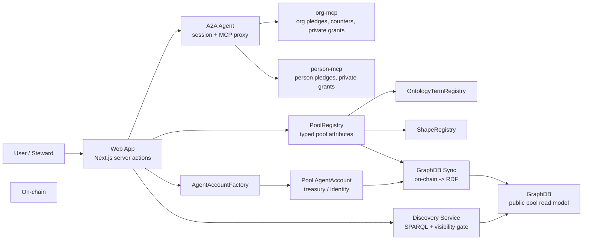
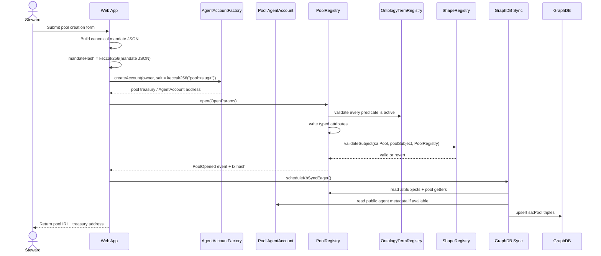
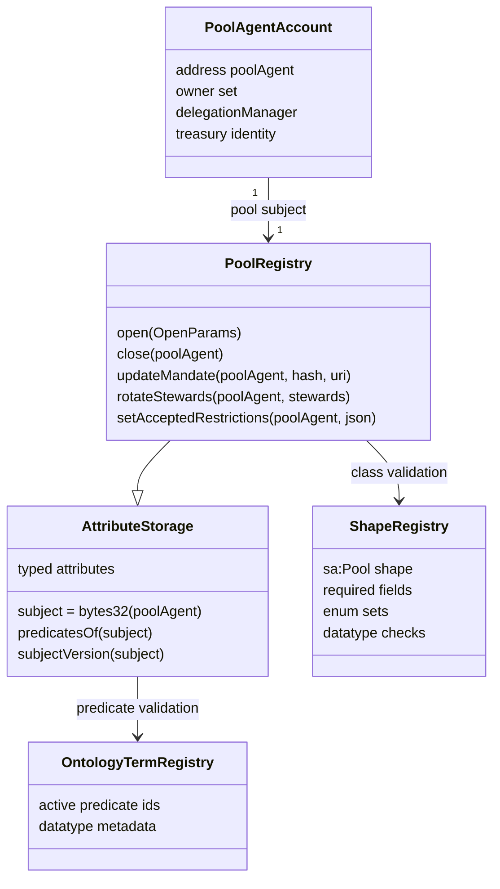
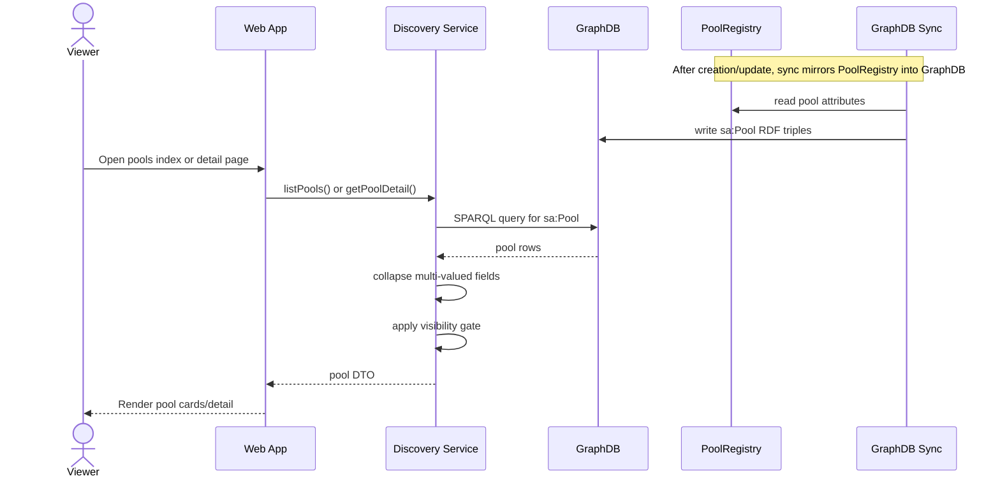
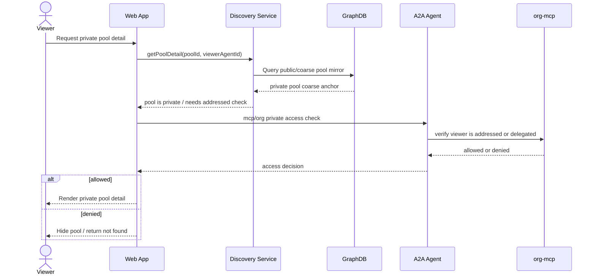
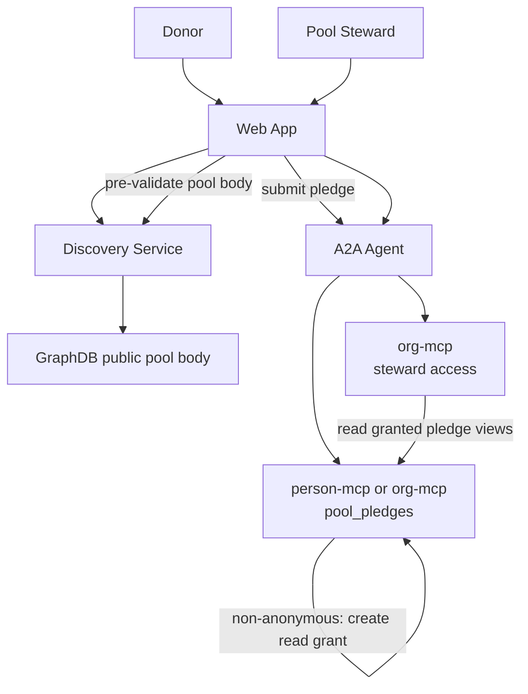

# 14 - Pool Creation and Access Architecture

## Purpose

This document shows the object interactions between the web app, A2A agent,
org-mcp, on-chain `PoolRegistry`, and GraphDB when a pool is created and later
accessed.

The key rule:

```text
Pool body lives on-chain in PoolRegistry.
GraphDB mirrors on-chain public pool facts.
MCPs hold private pledge/access state, not the pool body.
The web app reads public pool data through Discovery/GraphDB.
```

## Component Picture



## Object Responsibilities

| Object | Responsibility |
| --- | --- |
| Web app | Orchestrates user actions, calls chain, calls A2A/MCP, renders pool pages |
| A2A agent | Converts web session grants into MCP calls and routes to the right MCP |
| org-mcp | Stores org-owned pledge rows, cross-delegation grants, and derived pool counters for org donors |
| person-mcp | Stores person-owned pledge rows, cross-delegation grants, and private donor state |
| `AgentAccountFactory` | Deploys deterministic pool smart accounts |
| Pool `AgentAccount` | Pool treasury/identity account; owner set controls pool authority |
| `PoolRegistry` | On-chain source of truth for pool body attributes |
| `OntologyTermRegistry` | Ensures pool predicates are registered ontology terms |
| `ShapeRegistry` | Enforces required pool fields, datatypes, and enum values |
| GraphDB sync | Reads on-chain pool attributes and emits RDF |
| GraphDB | Public mirror for pool discovery and detail reads |
| Discovery service | Queries GraphDB and applies viewer-side visibility/ranking logic |

## Create Pool Sequence



### Create-Time Data

| Field | Source | Stored in |
| --- | --- | --- |
| Pool slug | web form | `PoolRegistry` as `sa:poolSlug` |
| Pool agent address | `AgentAccountFactory` | chain |
| Domain | web form | `PoolRegistry` |
| Governance model | web form, normalized by SDK | `PoolRegistry` |
| Mandate hash | web action | `PoolRegistry` |
| Accepted units/kinds | web form | `PoolRegistry` |
| Ceiling policy/capacity | web form | `PoolRegistry` |
| Stewards | web form | `PoolRegistry` |
| Visibility | web form | `PoolRegistry` |
| Addressed members for private pools | private/access layer | MCP-side access data, not public GraphDB |

## On-Chain Pool Object



## Public Pool Access Sequence



## Private Pool / Addressed Access Sequence

Private pool access needs public coarse data plus a private authorization check.
GraphDB must not expose the full addressed-member list as a public fact.



## Pledge / Counter Access

Pool body data is on-chain. Pledge data is donor-owned MCP data.



Counter rule:

```text
pledgedTotal, allocatedTotal, availableTotal are derived from pool_pledges.
They are not the pool body source of truth.
Public aggregate assertions may be published later as coarse on-chain facts.
```

## Read Model Shape in GraphDB

GraphDB should contain only public mirror triples derived from on-chain data:

```text
<urn:smart-agent:pool:demo-trauma-care-pool> a sa:Pool ;
  sa:displayName "Trauma Care Pool" ;
  sa:treasuryAgent <https://agentictrust.io/ontology/sa#agent/0x...> ;
  sa:domain "faith-network" ;
  sa:governanceModel "giving-circle" ;
  sa:acceptedKind "trauma-care" ;
  sa:acceptsUnit "USD" ;
  sa:capacityCeiling 50000 ;
  sa:ceilingPolicy "block" ;
  sa:visibility "public" ;
  sa:steward <https://agentictrust.io/ontology/sa#agent/0x...> .
```

GraphDB should not contain:

```text
private addressed-member lists
private donor identity for anonymous pledges
private pledge body
private steward notes
internal allocation notes
org financial contacts
```

## Access Paths

| User action | Primary path | Source of truth |
| --- | --- | --- |
| Create pool | Web app -> `AgentAccountFactory` -> `PoolRegistry` | chain |
| Browse public pools | Web app -> Discovery -> GraphDB | GraphDB mirror of chain |
| View public pool detail | Web app -> Discovery -> GraphDB | GraphDB mirror of chain |
| View private pool | Web app -> Discovery + A2A -> org-mcp access check | chain for body, MCP for access |
| Submit pledge | Web app -> A2A -> donor MCP | donor MCP |
| Read my pledges | Web app -> A2A -> donor MCP | donor MCP |
| Steward reads pledge | Web app -> A2A -> MCP with cross-delegation | donor MCP |
| Sync pool to graph | GraphDB sync -> `PoolRegistry` -> GraphDB | chain |

## Implementation Anchors

| Area | File |
| --- | --- |
| Pool creation action | `apps/web/src/lib/actions/poolCreate.action.ts` |
| Pool page reads | `apps/web/src/lib/actions/pools.action.ts` |
| GraphDB pool emission | `apps/web/src/lib/ontology/graphdb-sync.ts` |
| Pool SPARQL builders | `packages/discovery/src/queries/pools.ts` |
| Pool discovery service | `packages/discovery/src/discovery-service.ts` |
| Pool registry contract | `packages/contracts/src/PoolRegistry.sol` |
| Typed attribute storage | `packages/contracts/src/AttributeStorage.sol` |
| Shape validation | `packages/contracts/src/ShapeRegistry.sol` |
| Person pledge storage | `apps/person-mcp/src/tools/poolPledges.ts` |
| Org pledge storage | `apps/org-mcp/src/tools/poolPledges.ts` |
| A2A MCP proxy | `apps/a2a-agent/src/routes/mcp-proxy.ts` |

## Design Invariants

- `PoolRegistry` is the canonical pool body store.
- `org-mcp` and `person-mcp` store pledge rows and private access state, not canonical pool body.
- GraphDB is a read model, never a write authority.
- A2A is the session/delegation bridge from web to MCPs.
- Private pool access requires an MCP-side access check.
- Anonymous pledge identity must not be published on-chain or into GraphDB.
- Pool creation should be delegated through scoped authority when performed by an operator or service agent.
