# 15 - Delegation Design Architecture

## Purpose

This document defines the forward architecture for Smart Agent delegation.

The architecture is:

```text
one user-rooted delegation fabric
one policy registry for all MCP tools
stateless session delegation for routine work
per-call sub-delegation for sensitive work
ERC-7579-compatible Session AgentAccounts for stateful work
ERC-7715-shaped permission UX for user consent
```

The goal is not to deploy a modular smart account for every session. The goal
is to make every action traceable from user approval to session/task to MCP tool
to on-chain transaction.

## Core Decision

Smart Agent adopts a native, standards-shaped hybrid delegation model.

| Layer | Role |
| --- | --- |
| User `AgentAccount` | Root authority and ERC-1271 signer |
| A2A session principal | Short-lived session authority approved by the user |
| `DelegationManager` | Universal authority validator and redemption path |
| Policy registry | Maps each MCP tool to its allowed execution path |
| MCP tools | Coordinators and data owners, not broad authority holders |
| Tool executors | Leaf authority for sensitive task-bound actions |
| Session AgentAccounts | Stateful long-lived agents when budgets/policy state are required |

The delegation fabric aligns to:

```text
ERC-7710-style delegation chains
ERC-7579-style modular account boundaries
ERC-7715-style permission requests
ERC-4337-compatible smart-account execution
```

Draft ERCs are compatibility targets. Smart Agent keeps its typed-data schemas,
policy engine, caveats, modules, and MCP execution model first-party.

## System Architecture

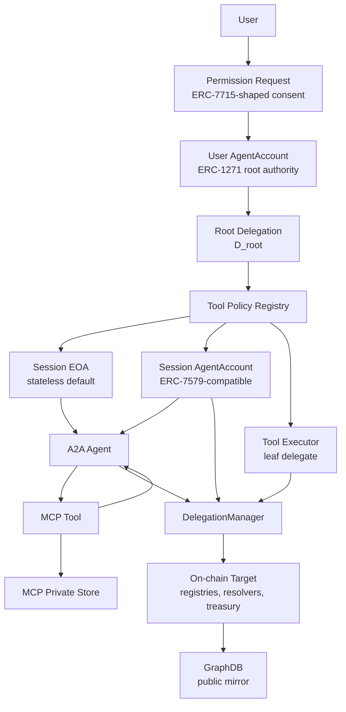

## User Consent and Session Grant

A user signs one session grant for a bounded set of capabilities. The consent
screen should be shaped like ERC-7715 even if the implementation uses Smart
Agent's native delegation schema.

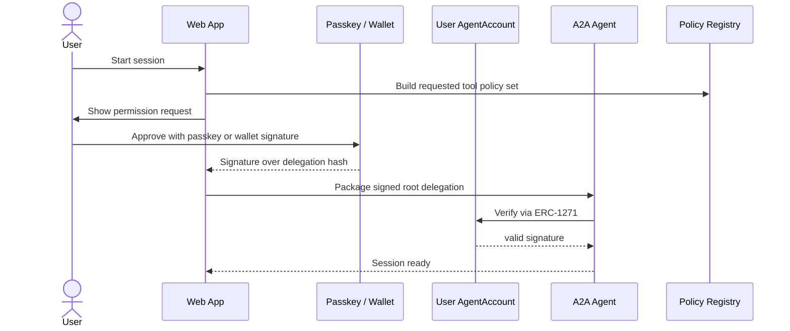

Session grants can include:

```text
validAfter / validUntil
allowed MCP tools
allowed targets
allowed function selectors
value caps
rate limits
data scopes
required confirmation flags
```

## Multi-MCP Session Lifecycle

One user-approved session can support many MCP tools across many MCP servers.
The session grant is not a bearer token. It is a signed delegation from the
user's `AgentAccount` to a session principal, with caveats that limit which
tools, targets, selectors, chains, values, and time windows are allowed.

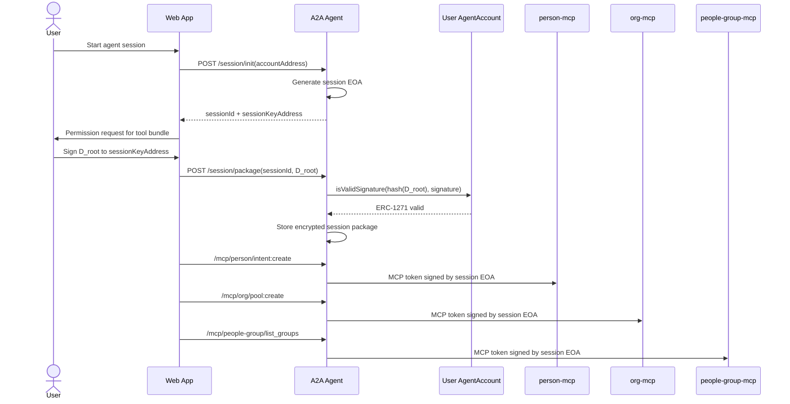

The A2A session package stores:

```text
sessionPrivateKey
sessionKeyAddress
D_root delegation
user AgentAccount address
expiresAt
optional Session AgentAccount address
optional installed module/policy summary
```

The same `D_root` supports multiple MCP tools because the user's signature
covers a policy bundle, not a single HTTP request. A2A mints a fresh MCP token
for each tool call. Each token has its own audience, `jti`, expiry, usage
limit, and tool request context, but it points back to the same root delegation.

## A2A Call Routing

A2A is the policy-aware router for all MCP calls. Web actions call A2A, not MCP
servers directly. A2A loads the active session package, looks up the tool
policy, and routes the call.

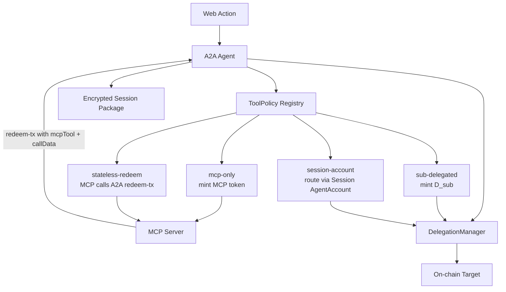

Routing behavior:

| Execution path | A2A behavior | MCP behavior |
| --- | --- | --- |
| `mcp-only` | Mints an MCP token signed by the session EOA | Verifies token and reads/writes private MCP data |
| `stateless-redeem` | Mints MCP token and exposes `redeem-tx` for the session | Builds call data and asks A2A to redeem `D_root` |
| `sub-delegated` | Creates a per-call `D_sub` bound to task, tool, target, selector, calldata hash, nonce, and expiry | Tool executor redeems `[D_sub, D_root]` |
| `session-account` | Creates or loads a Session AgentAccount and routes execution through installed modules | Coordinates tool context and records results |

MCP servers verify:

```text
token audience
session EOA signature
D_root delegator and delegate
ERC-1271 root signature
expiration
tool scope
revocation status
data scope
```

## Session EOA vs Session AgentAccount

Every session starts with a session EOA because it is cheap, fast, and enough
for most MCP work. A Session AgentAccount is created only when the requested
policy bundle needs persistent state.

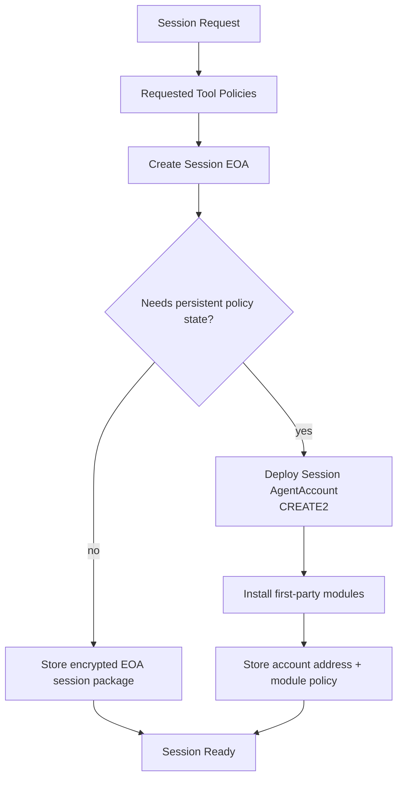

Create a Session AgentAccount when the session includes:

```text
durable spend caps
multi-call budgets
treasury movement
long-lived autonomy
runtime policy changes
multi-validator approval
persistent rate limits
stateful revocation hooks
```

Session AgentAccount creation flow:

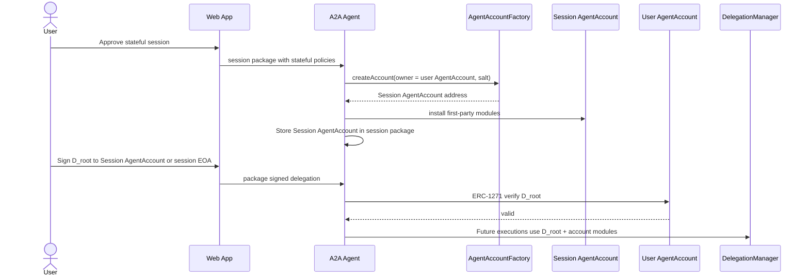

The Session AgentAccount is the active execution principal for stateful paths.
The session EOA still exists as an operational signer for A2A token minting and
module-authorized requests, but the stateful hooks on the Session AgentAccount
enforce budget, rate, recipient, target, and revocation policy.

## Execution Path Selection

Every tool is classified by policy before it runs.

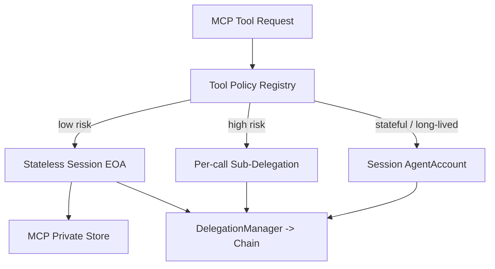

| Risk tier | Default path | Examples |
| --- | --- | --- |
| Low | Stateless session EOA | list intents, express private intent, read profile, draft proposal |
| Medium | Stateless redeem with caveats | create pool, open round, rotate stewards, publish public intent |
| High | Per-call sub-delegation | set awards root, close pool, cancel round, mark paid |
| Critical | Session AgentAccount or per-call sub-delegation plus confirmation | treasury transfer, custody change, large disbursement |

## Tool Policy Shape

Every MCP tool should have a policy record.

```text
ToolPolicy {
  toolId
  riskTier
  executionPath
  allowedTargets
  allowedSelectors
  maxValue
  requiresTaskBinding
  requiresCalldataHash
  requiresHumanConfirmation
  allowedChains
}
```

This registry is the guardrail that prevents each MCP from inventing a
different authority path.

## Scenario 1 - Private MCP Data

Use for private profile, detached members, revenue reports, notes, messages,
beliefs, activities, and other private data.

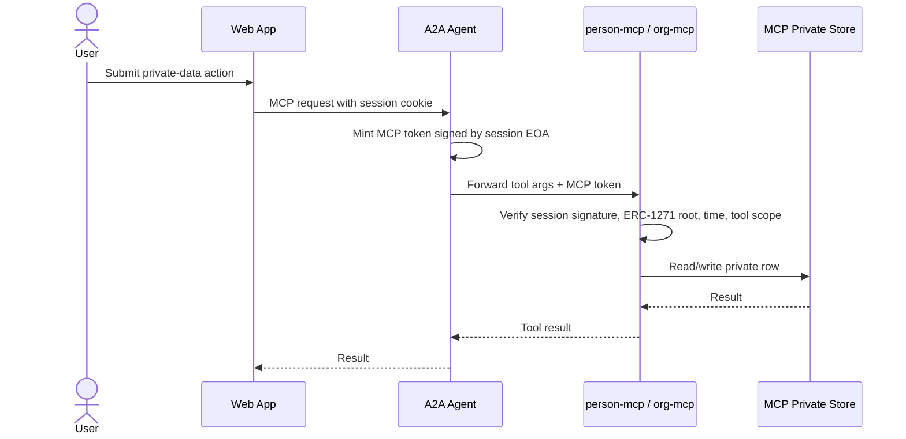

Examples:

```text
list_detached_members
add_detached_member
submit_revenue_report
list_revenue_reports
list_beliefs
log_activity
```

No on-chain transaction is needed unless the tool intentionally publishes a
public assertion.

## Scenario 2 - Express Intent

Private and public intents share the same session grant. Visibility determines
whether an on-chain public assertion is emitted.

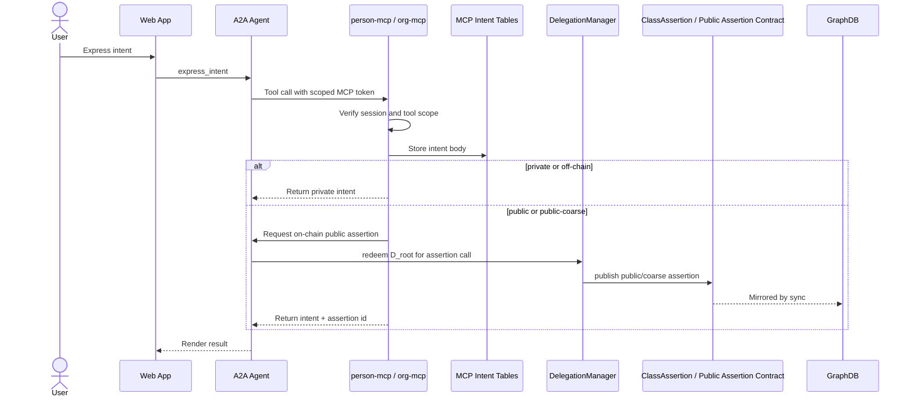

Policy:

| Tool | Risk | Path |
| --- | --- | --- |
| `express_intent` private | Low | MCP token only |
| `express_intent` public | Medium | MCP token + stateless on-chain redeem |
| `withdraw_intent` with public assertion | Medium | stateless on-chain revoke/update |
| `intent:bump_ack_count` | Low/medium | MCP token with system scope |

## Scenario 3 - Pool Pledge

Pool pledges are donor-owned private rows. Public signaling depends on
`storyPermissions`.

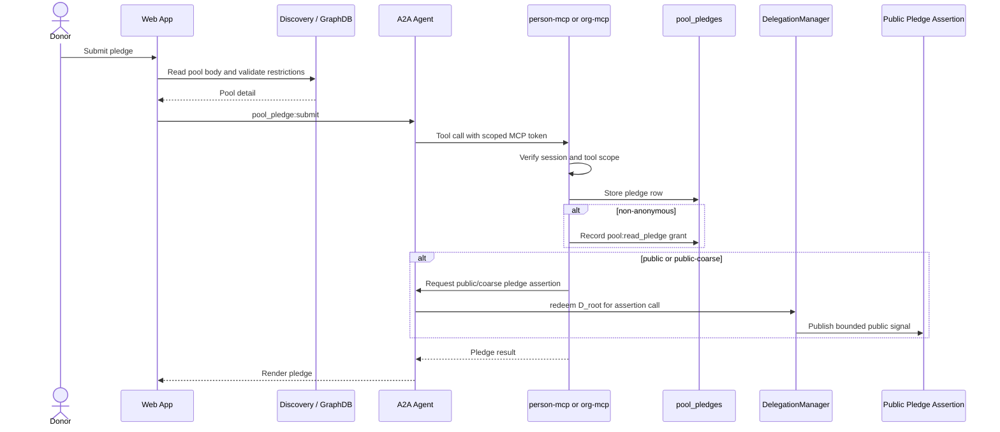

Policy:

| Tool | Risk | Path |
| --- | --- | --- |
| `pool_pledge:submit` anonymous/private | Low | MCP token only |
| `pool_pledge:submit` public/coarse | Medium | MCP token + stateless on-chain assertion |
| `pool_pledge:amend` | Low/medium | MCP token, assertion update if public |
| `pool_pledge:stop` | Low/medium | MCP token, assertion update if public |

Anonymous pledge identity must never be published on-chain or into GraphDB.

## Scenario 4 - Grant Proposal Submission

Grant proposals are private at submission time. Stewards read them through
cross-delegation, not GraphDB.

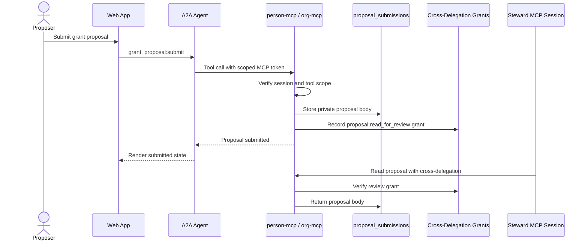

Policy:

| Tool | Risk | Path |
| --- | --- | --- |
| `grant_proposal:draft` | Low | MCP token only |
| `grant_proposal:submit` | Low/medium | MCP token + cross-delegation grant |
| `grant_proposal:withdraw` | Low/medium | MCP token |
| `grant_proposal:award` | High | per-call sub-delegation when paired with award root or public facet |

The proposal body stays private. Public award outcomes use a separate public
facet or assertion.

## Scenario 5 - Create Pool

Pool creation is a medium-risk on-chain action. The pool body is public,
on-chain, and mirrored to GraphDB.

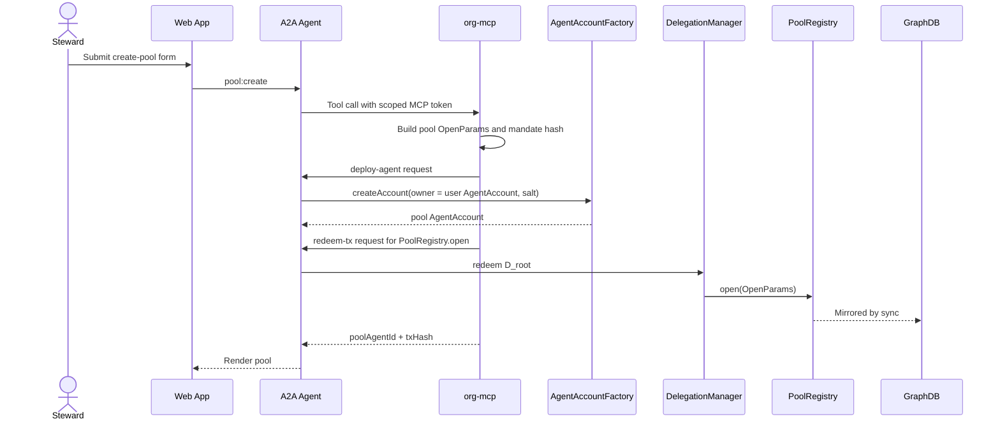

Policy:

| Tool | Risk | Path |
| --- | --- | --- |
| `pool:create` | Medium | stateless redeem with target/method caveats |
| `pool:update_mandate` | Medium | stateless redeem |
| `pool:rotate_stewards` | Medium/high | stateless or sub-delegated based on value/risk |
| `pool:close` | High | per-call sub-delegation |

## Scenario 6 - Open Round and Decide Awards

Opening a round is routine fund administration. Setting awards is high-risk
because it determines recipients and downstream disbursement authority.

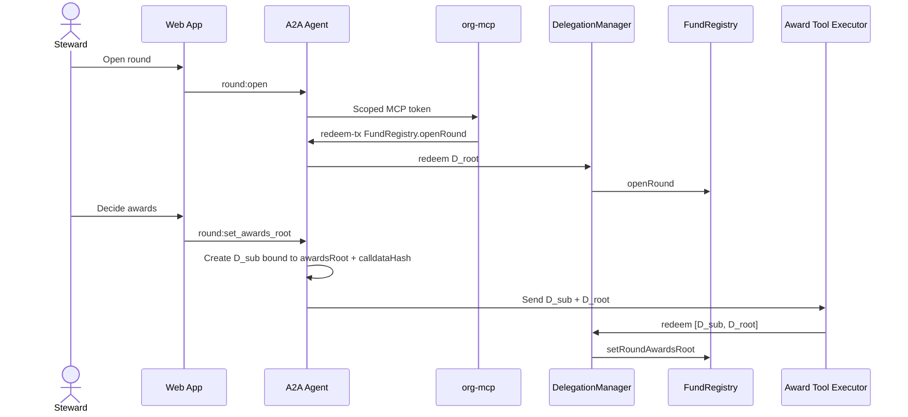

Policy:

| Tool | Risk | Path |
| --- | --- | --- |
| `round:open` | Medium | stateless redeem |
| `round:set_status` | Medium/high | stateless or sub-delegated by status |
| `round:cancel` | High | per-call sub-delegation |
| `round:set_awards_root` | High | per-call sub-delegation |
| `round:update_voting_config` | Low | MCP token only |

## Scenario 7 - Disbursement and Treasury Movement

Disbursement records can start as private/off-chain coordination. Real asset
movement is critical and requires stronger authority.

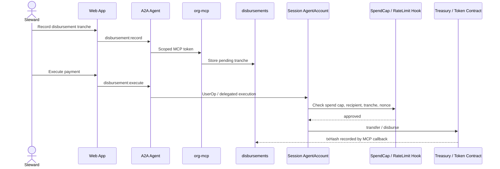

Policy:

| Tool | Risk | Path |
| --- | --- | --- |
| `disbursement:record` | Medium | MCP token only |
| `disbursement:claim` | High | per-call sub-delegation |
| `disbursement:mark_paid` | High | per-call sub-delegation |
| real token transfer | Critical | Session AgentAccount with stateful hooks |
| `attestation:cast` | Medium | MCP token + public assertion if needed |

## Scenario 8 - Organization Membership and Detached Members

On-chain memberships are public trust relationships. Detached members are
private org records.

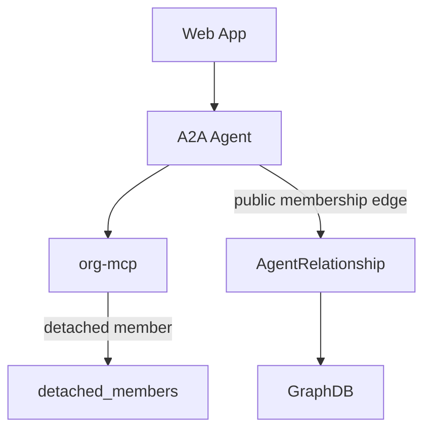

Policy:

| Tool/action | Risk | Path |
| --- | --- | --- |
| `list_detached_members` | Low | MCP token only |
| `add_detached_member` | Low/medium | MCP token only |
| public org membership edge | Medium | stateless redeem |
| governance-role membership | High | per-call sub-delegation |

## Scenario 9 - Public Graph Projection

GraphDB is a read model. It mirrors public on-chain facts; it does not receive
private MCP rows directly.

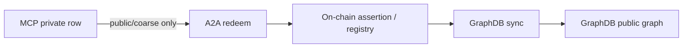

Rules:

```text
private rows stay in MCP
public/coarse signals anchor on-chain first
GraphDB mirrors chain only
anonymous identities never anchor
```

## ERC-7579 Session AgentAccounts

Use ERC-7579-compatible Session AgentAccounts for sessions that need state.

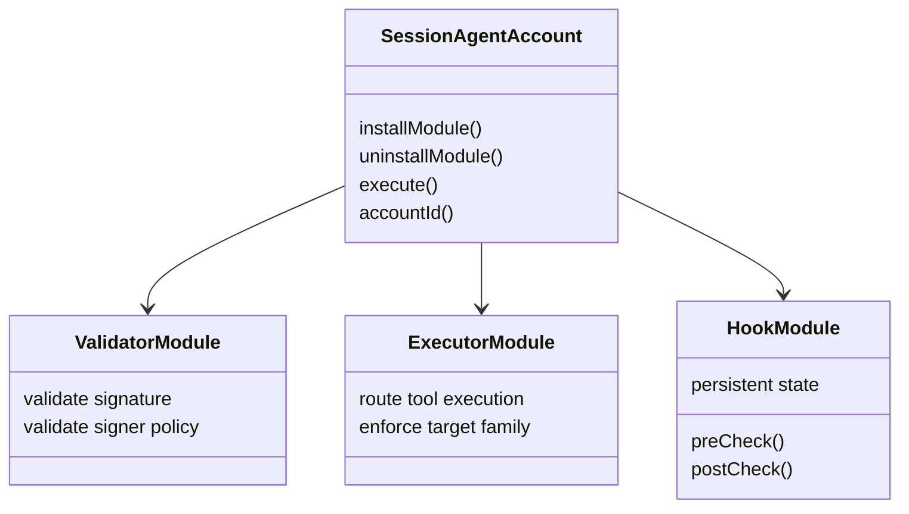

First-party modules:

```text
ECDSASessionValidator
ToolExecutorModule
SpendCapHook
RateLimitHook
TargetSelectorAllowlistHook
TaskBindingHook
SessionExpiryModule
RevocationModule
```

Third-party modules require registry/attestation approval before installation.

## Design Invariants

- User `AgentAccount` is the root of authority.
- One permission grant can authorize multiple scoped MCP tool calls.
- MCP tools coordinate execution but do not hold broad authority.
- Routine flows use stateless session EOA delegation.
- Sensitive flows use per-call task-bound sub-delegations.
- Stateful flows use ERC-7579-compatible Session AgentAccounts.
- Public graph writes anchor on-chain before GraphDB.
- Private MCP rows never write directly to GraphDB.
- Anonymous donor identity never anchors on-chain.
- Every on-chain action has a trace from user grant to task/tool to transaction.

## Implementation Phases

### Phase 1 - Unified Session Delegation

Use the session EOA as the default authority for MCP tools and routine on-chain
redeems.

Deliverables:

```text
policy registry for all MCP tools
A2A redeem endpoint for stateless on-chain calls
MCP tools request redeems from A2A rather than holding broad authority
execution audit rows for each redeem
```

### Phase 2 - Per-Call Sub-Delegations

Promote sensitive tools to task-bound leaf delegations.

Deliverables:

```text
TaskBindingEnforcer
single-use nonce tracking
calldata hash binding
tool executor identities
[D_sub, D_root] redemption path
```

### Phase 3 - Session AgentAccounts

Add ERC-7579-compatible Session AgentAccounts for long-lived, budgeted, or
treasury-capable sessions.

Deliverables:

```text
module lifecycle
first-party validators, executors, hooks
stateful spend and rate policy
runtime policy updates
```

### Phase 4 - Wallet Permission Interop

Shape consent around ERC-7715-style permission requests.

Deliverables:

```text
permission request schema
wallet/passkey adapter
human-readable consent screens
attenuation controls
```

## Implementation Anchors

| Area | File |
| --- | --- |
| A2A session bootstrap | `apps/a2a-agent/src/routes/session.ts` |
| A2A MCP proxy | `apps/a2a-agent/src/routes/mcp-proxy.ts` |
| A2A on-chain redeem path | `apps/a2a-agent/src/routes/onchain-redeem.ts` |
| MCP token minting | `packages/sdk/src/delegation-token.ts` |
| Tool policy registry | `packages/sdk/src/policy/tool-policies.ts` |
| person-mcp auth verification | `apps/person-mcp/src/auth/verify-delegation.ts` |
| org-mcp auth verification | `apps/org-mcp/src/auth/verify-delegation.ts` |
| Intent tools | `apps/person-mcp/src/tools/intents.ts`, `apps/org-mcp/src/tools/intents.ts` |
| Pledge tools | `apps/person-mcp/src/tools/poolPledges.ts`, `apps/org-mcp/src/tools/poolPledges.ts` |
| Grant proposal tools | `apps/person-mcp/src/tools/grantProposals.ts`, `apps/org-mcp/src/tools/grantProposals.ts` |
| Pool tools | `apps/org-mcp/src/tools/pools.ts` |
| Round tools | `apps/org-mcp/src/tools/rounds.ts` |
| Disbursement tools | `apps/org-mcp/src/tools/disbursements.ts` |
| Delegation manager contract | `packages/contracts/src/DelegationManager.sol` |
| Agent account contract | `packages/contracts/src/AgentAccount.sol` |
| Caveat enforcers | `packages/contracts/src/enforcers/` |

## Decision

Smart Agent will use one native delegation architecture:

```text
session EOA + caveats for default work
per-call sub-delegations for sensitive work
ERC-7579-compatible Session AgentAccounts for stateful work
ERC-7715-shaped permission UX for consent
```

This gives:

```text
one user-rooted authority model
one policy vocabulary across MCPs
least privilege by default
strong promotion path for high-risk actions
future modular-account compatibility
clear audit from user approval to transaction
```
