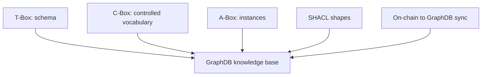

# 01 - Ontology Layering And Source Of Truth

## Purpose

This document explains where ontology concepts are defined, where concrete
data lives, and how the GraphDB knowledge base is populated.

## Layers

```text
T-Box = what kinds of things exist
C-Box = what controlled values are allowed
A-Box = concrete facts about real agents, edges, claims, and templates
```

| Layer | Location | Examples |
| --- | --- | --- |
| T-Box | `docs/ontology/tbox/*.ttl` | `sa:Agent`, `sar:RelationshipEdge`, `saint:Intent` |
| C-Box | `docs/ontology/cbox/*.ttl` | `sar:Member`, `sar:OrganizationMembership`, `saint:Receive` |
| A-Box | `docs/ontology/abox/*.ttl` and runtime GraphDB data | Catalyst hub template, synced agents, relationship edges |

## Visual Model



## Source Of Truth Rules

1. `docs/ontology/` is the ontology source of truth.
2. `docs/information-architecture/06-data-ontology.md` maps ontology classes
   to physical stores.
3. `docs/agents/ontologist.md` defines ontology authoring rules.
4. GraphDB is a read-only public mirror of on-chain facts plus uploaded schema.
5. MCPs never write directly to GraphDB.

## GraphDB Named Graphs

| Graph | Meaning |
| --- | --- |
| `https://smartagent.io/graph/schema/tbox` | Uploaded T-Box files |
| `https://smartagent.io/graph/schema/cbox` | Uploaded C-Box files |
| `https://smartagent.io/graph/data/abox` | Template and static instance data |
| `https://smartagent.io/graph/data/onchain` | Public on-chain mirror |
| `https://smartagent.io/graph/data/aggregates` | Derived summaries from public on-chain data |

## Example: T-Box Class

```ttl
sa:Agent
    a owl:Class ;
    rdfs:subClassOf prov:Agent, dul:Agent ;
    rdfs:label "Agent" .
```

This says what an agent is, but not which agents exist.

## Example: C-Box Concept

```ttl
sar:OrganizationMembership
    a sar:InstitutionalRelationship, skos:Concept ;
    skos:inScheme sar:RelationshipTypeScheme ;
    rdfs:label "Membership" ;
    skos:notation "organization-membership" .
```

This says membership is an allowed relationship type.

## Example: A-Box Runtime Fact

```ttl
:edge123
    a sar:RelationshipEdge ;
    sar:subject :sofia ;
    sar:object :berthoudCircle ;
    sar:relationshipType sar:OrganizationMembership ;
    sar:hasRole sar:Member .
```

This says Sofia is a member of the Berthoud Circle in a concrete graph fact.

## Domain Separation

T-Box stays domain-neutral. Hub-specific labels belong in C-Box vocabulary or
UI configuration.

Good T-Box term:

```text
sa:OikosContact as a generic close-contact/person-of-concern concept
```

Bad T-Box term:

```text
sa:PrayerWarriorForCatalyst
```

The domain label can still appear in Catalyst UI through hub vocabulary.
