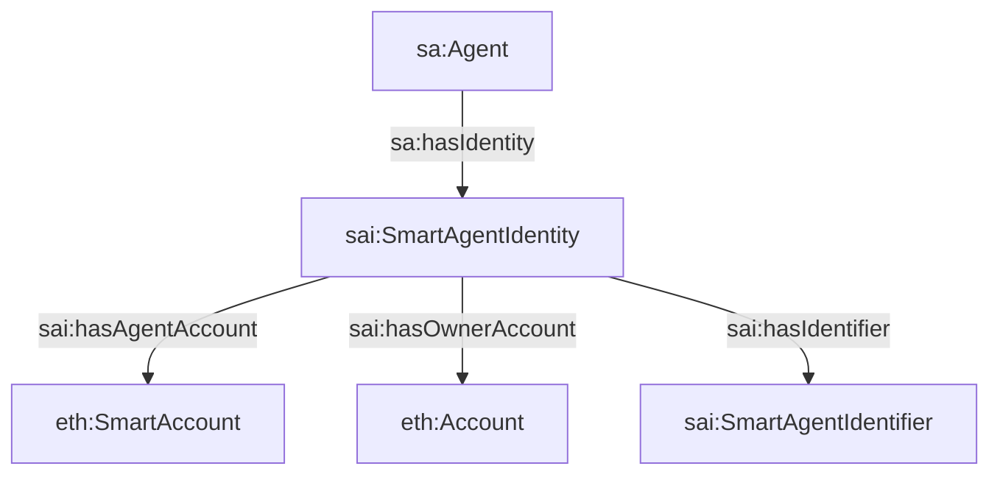

# 02 - Agents, Identities, And Profiles

## Purpose

This document explains how Smart Agent models agents, identities, smart
accounts, profiles, and private owner-routed data.

## Core Concepts

| Concept | Ontology class | Source of truth |
| --- | --- | --- |
| Agent | `sa:Agent` | On-chain |
| Person agent | `sa:PersonAgent` | On-chain + `person-mcp` private account |
| Organization agent | `sa:OrganizationAgent` | On-chain + `org-mcp` private account |
| Hub agent | `sa:HubAgent` | On-chain |
| Smart account identity | `sai:SmartAgentIdentity` | On-chain mirror in GraphDB |
| Person profile | `sa:PersonProfile` | `person-mcp` |
| Organization profile | `sa:OrgProfile` | `org-mcp`, with public fields anchored on-chain |

## Identity Decomposition

GraphDB does not flatten an agent into one node. It decomposes the public
identity into agent, identity, account, and identifier nodes.



## Public And Private Split

| Data | Where it lives |
| --- | --- |
| Agent address, type, name, active flag | On-chain + GraphDB |
| Owner/controller relationship | On-chain + GraphDB |
| Public endpoint metadata | On-chain resolver + GraphDB |
| Person PII, preferences, oikos, prayer | `person-mcp` only |
| Organization financials, private members, drafts | `org-mcp` only |

## Example A-Box: Public Person Agent

```ttl
:sofia
    a sa:PersonAgent ;
    sa:uaid "did:sa:31337:0x1111111111111111111111111111111111111111" ;
    sa:onChainAddress "0x1111111111111111111111111111111111111111" ;
    sa:displayName "Sofia Martinez" ;
    sa:primaryName "sofia.catalyst.agent" ;
    sa:isActive true ;
    sa:hasIdentity :sofiaIdentity .

:sofiaIdentity
    a sai:SmartAgentIdentity ;
    sai:identityOf :sofia ;
    sai:hasAgentAccount :sofiaSmartAccount ;
    sai:hasIdentifier :sofiaIdentifier .

:sofiaSmartAccount
    a eth:SmartAccount ;
    eth:address "0x1111111111111111111111111111111111111111" .
```

## Example Private Data Not In GraphDB

The following should stay in `person-mcp`:

```json
{
  "principal": "0x1111111111111111111111111111111111111111",
  "homeChurch": "Berthoud Circle",
  "language": "es",
  "oikosContacts": [
    {
      "name": "Ricardo",
      "proximity": 1,
      "notes": "Interested in apprenticeship"
    }
  ]
}
```

If a private fact needs public discoverability, the owner MCP emits an
on-chain assertion or commitment. GraphDB indexes that assertion, not the raw
private row.

## Why This Matters

This split lets the public graph answer questions like:

```text
Who is an active person agent in Catalyst?
Who controls this organization agent?
Which public relationships does this person have?
```

without exposing:

```text
private preferences
prayer details
oikos contacts
private membership credentials
unpublished needs or offerings
```
