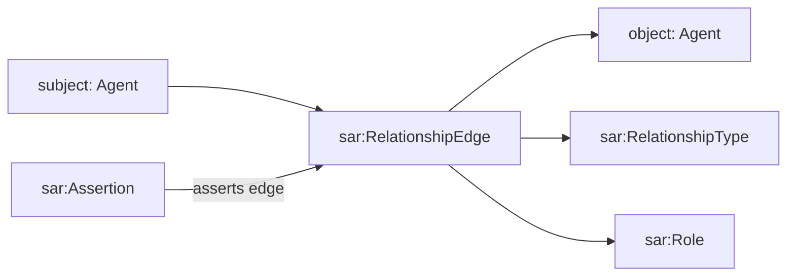
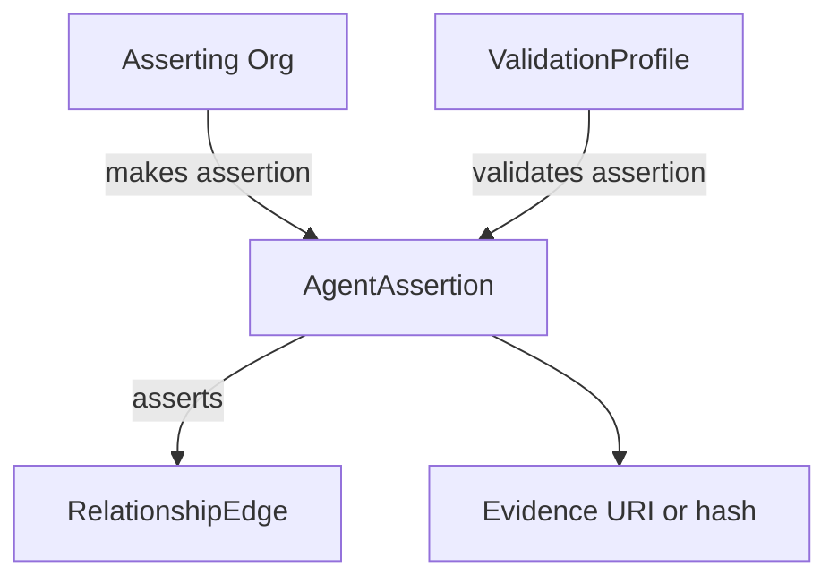

# 03 - Relationships, Roles, And Assertions

## Purpose

This document explains how agents relate to each other, how directionality is
represented, how roles attach to relationships, and how assertions/validation
make relationship facts trustworthy.

## Core Concepts

| Concept | Ontology class | Meaning |
| --- | --- | --- |
| Relationship edge | `sar:RelationshipEdge` | Directed graph edge between agents |
| Relationship type | `sar:RelationshipType` | Kind of edge, such as membership or coaching |
| Role | `sar:Role` | Role played by the subject in the edge |
| Edge status | `sar:EdgeStatus` | Proposed, confirmed, active, revoked, etc. |
| Assertion | `sar:Assertion` / `AgentAssertion` | Who asserted the edge and how |
| Validation | `AgentValidationProfile` | Who validated an assertion or agent trust fact |

## Directed Edge Model

Every relationship edge is directed:

```text
subject --relationshipType--> object
```

The subject plays one or more roles in that edge.



## Example: Organization Membership

```ttl
:edgeMembership1
    a sar:RelationshipEdge ;
    sar:subject :sofia ;
    sar:object :berthoudCircle ;
    sar:relationshipType sar:OrganizationMembership ;
    sar:hasRole sar:Member ;
    sar:edgeStatus sar:StatusActive .
```

Meaning:

```text
Sofia is a member of Berthoud Circle.
```

## Example: Circle-To-Circle Generation

For circle generation, the direction is parent/source to child/generated.

```ttl
:edgeGeneration1
    a sar:RelationshipEdge ;
    sar:subject :wellingtonCircle ;
    sar:object :berthoudCircle ;
    sar:relationshipType sar:GenerationalLineage ;
    sar:hasRole sar:Upstream ;
    sar:edgeStatus sar:StatusActive .
```

Meaning:

```text
Wellington Circle is upstream of Berthoud Circle.
Berthoud Circle is downstream of Wellington Circle.
```

The object-side role can be inferred from the relationship type:

```text
GenerationalLineage:
  subject role = Upstream
  object role = Downstream
```

## Example: Coaching

```ttl
:edgeCoaching1
    a sar:RelationshipEdge ;
    sar:subject :kenji ;
    sar:object :rachel ;
    sar:relationshipType sar:CoachingMentorship ;
    sar:hasRole sar:Coach ;
    sar:edgeStatus sar:StatusActive .
```

Meaning:

```text
Kenji coaches Rachel.
Rachel is the disciple/mentee in the relationship.
```

## Assertion And Validation

An edge is the relationship record. An assertion says who claims the edge is
true. A validation says why the assertion should be trusted.



Example:

```ttl
:assertion1
    a sar:Assertion ;
    sar:assertionType sar:OrgAsserted ;
    sar:assertsEdge :edgeMembership1 ;
    prov:wasAssociatedWith :berthoudCircle .
```

## Relationship Types

Concrete relationship types are controlled vocabulary concepts in
`docs/ontology/cbox/controlled-vocabularies.ttl`.

Important examples:

```text
sar:OrganizationGovernance
sar:OrganizationMembership
sar:Alliance
sar:HasMember
sar:GenerationalLineage
sar:CoachingMentorship
sar:DelegationAuthority
sar:DataAccessDelegation
```

## Design Rule

Use `sar:RelationshipEdge` for public, directed graph facts. Use private MCP
rows or AnonCreds for memberships/relationships that must not be publicly
visible. If a private fact needs discovery, publish a commitment or
zero-knowledge/verifier receipt, not the raw relationship.
