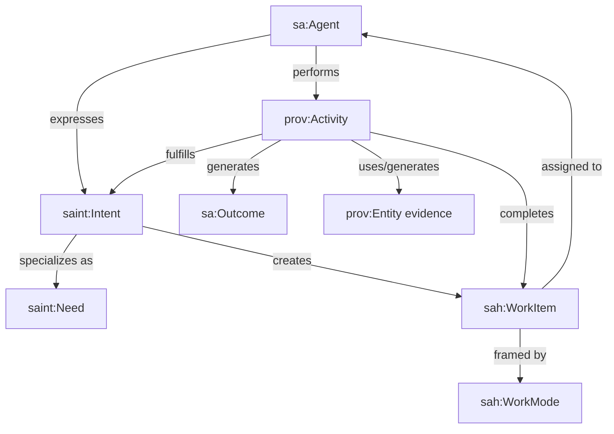
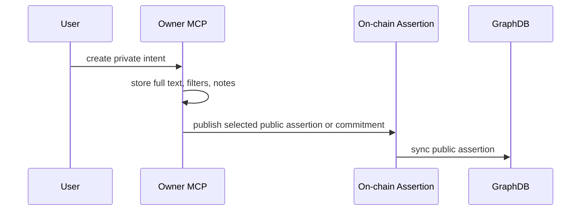

# 04 - Intents, Work Items, And Activities

## Purpose

This document explains how the ontology models user intent, work routing,
activity, outcomes, and work modes.

## Core Concepts

| Concept | Ontology class | Meaning |
| --- | --- | --- |
| Intent | `saint:Intent` | Expressed desire or goal |
| Need | `saint:Need` | Intent where the owner wants to receive help |
| Offering | `saint:Offering` | Intent where the owner wants to provide help |
| Work item | `sah:WorkItem` | Assignable unit of work created from intent |
| Work mode | `sah:WorkMode` | Framing mode such as Discover, Disciple, Govern |
| Activity | `prov:Activity` | Work actually performed |
| Outcome | `sa:Outcome` | Result produced by activity |

## Intent-To-Work Flow



## Work Mode

`sah:WorkMode` is the recurring frame of work. It is not a role and not an
activity.

Examples:

| Work mode | Meaning |
| --- | --- |
| `sah:DiscoverMode` | Finding people, agents, needs, offerings, or opportunities |
| `sah:DiscipleMode` | Personal formation and follow-up |
| `sah:GovernMode` | Decisions, approvals, proposals, and policy |
| `sah:RouteMode` | Dispatching leads or assigning work |
| `sah:StewardMode` | Financial and resource stewardship |

## Intent Vs Work Item Vs Activity

| Thing | What it answers |
| --- | --- |
| Intent | What does someone want? |
| Work item | What needs to be done and who owns it? |
| Activity | What actually happened? |
| Outcome | What changed because the activity happened? |

## Example A-Box: Discovery Need

```ttl
:intentFindCoach1
    a saint:Need ;
    saint:intentText "Find a Spanish-speaking multiplier coach near Loveland" ;
    saint:hasIntentOwner :maria ;
    saint:hasDirection saint:Receive ;
    saint:hasSkillConstraint :spanishSpeaking ;
    saint:hasGeoConstraint :lovelandMetro ;
    saint:hasStatus saint:Open .

:workItemFindCoach1
    a sah:WorkItem ;
    sah:createdFromIntent :intentFindCoach1 ;
    sah:hasWorkMode sah:DiscoverMode ;
    sah:assignedTo :maria ;
    sah:workItemStatus sah:Open .
```

## Example A-Box: Activity And Outcome

```ttl
:activityIntro1
    a prov:Activity ;
    prov:wasAssociatedWith :kenji ;
    prov:used :intentFindCoach1 ;
    prov:generated :outcomeIntro1 ;
    sah:completedWorkItem :workItemFindCoach1 .

:outcomeIntro1
    a sa:Outcome ;
    sa:outcomeText "Kenji introduced Maria to Rachel as a candidate multiplier coach" ;
    prov:wasGeneratedBy :activityIntro1 .
```

## Private And Public Intents

Most intents start private in the owner's MCP.



GraphDB sees only public assertions or commitments. It does not receive the
private intent row unless the owner explicitly anchors it publicly.

## Example Public Projection

```ttl
:assertionIntent1
    a saint:IntentAssertion ;
    saint:assertsIntentType saint:Need ;
    saint:publicSummary "Needs a multiplier coach near Loveland" ;
    saint:hasSkillConstraint :multiplierCoaching ;
    saint:hasGeoConstraint :lovelandMetro ;
    prov:wasAssociatedWith :maria .
```

This supports discovery without exposing private notes.
