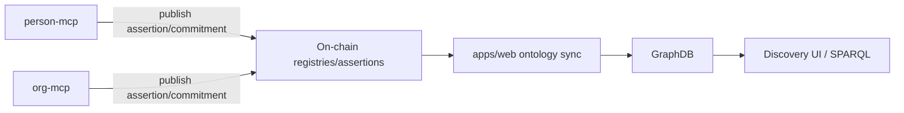
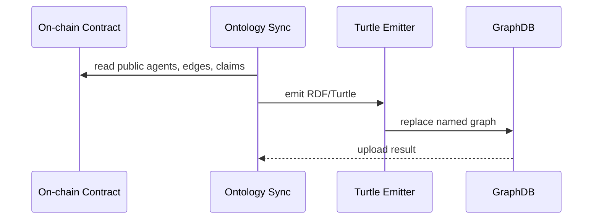
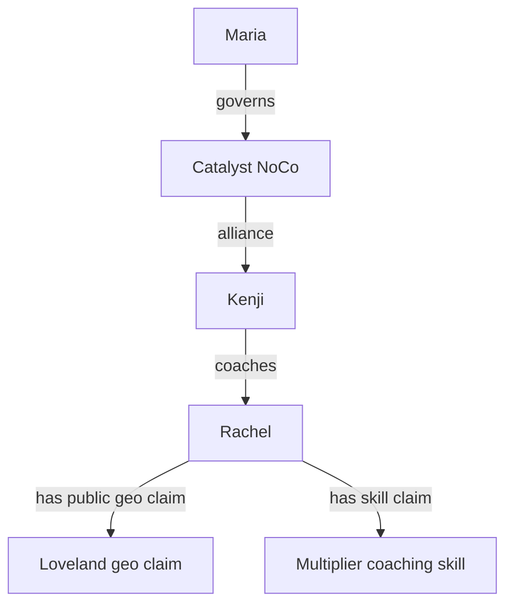

# 05 - GraphDB Public Projection

## Purpose

This document explains what GraphDB contains, how data gets there, and how to
write example A-Box data for public discovery use cases.

## Rule

GraphDB is a public knowledge base. It mirrors on-chain facts and uploaded
ontology files. MCPs do not write to GraphDB.



## What Belongs In GraphDB

| Data | Include? | Reason |
| --- | --- | --- |
| Public agent records | Yes | Discovery needs identity graph |
| Public relationship edges | Yes | Trust and path queries |
| Public skill, geo, validation, review assertions | Yes | Discovery/scoring inputs |
| Static ontology schema and vocabularies | Yes | Reasoning and labels |
| Private profile details | No | Owner-routed MCP data |
| Raw AnonCreds wallet contents | No | Holder privacy |
| Private intents, prayers, notes, oikos contacts | No | Person private data |
| Private org revenue and drafts | No | Org private data |

## Sync Path



The sync code lives in `apps/web/src/lib/ontology/graphdb-sync.ts`.

## Public Discovery Use Case

Question:

```text
Maria needs a multiplier coach near Loveland who is relationally close to Catalyst.
```

GraphDB can answer this from public facts:



## Example A-Box: Public Candidate Record

```ttl
:rachel
    a sa:PersonAgent ;
    sa:displayName "Rachel Park" ;
    sa:onChainAddress "0x2222222222222222222222222222222222222222" ;
    sa:isActive true .

:edgeKenjiRachel
    a sar:RelationshipEdge ;
    sar:subject :kenji ;
    sar:object :rachel ;
    sar:relationshipType sar:CoachingMentorship ;
    sar:hasRole sar:Coach ;
    sar:edgeStatus sar:StatusActive .

:skillClaimRachel1
    a sas:SkillClaim ;
    sas:subjectAgent :rachel ;
    sas:skill :multiplierCoaching ;
    sas:relation sas:PracticesSkill ;
    sas:proficiencyScore 5800 ;
    prov:wasAssociatedWith :rachel .

:geoClaimRachel1
    a sag:GeoClaim ;
    sag:subjectAgent :rachel ;
    sag:geoFeature :loveland ;
    sag:claimPrecision sag:MetroLevel ;
    prov:wasAssociatedWith :rachel .
```

## Example Query Shape

```sparql
SELECT ?candidate ?candidateName ?skillScore WHERE {
  ?candidate a sa:PersonAgent ;
      sa:displayName ?candidateName .

  ?skillClaim sas:subjectAgent ?candidate ;
      sas:skill :multiplierCoaching ;
      sas:proficiencyScore ?skillScore .

  ?geoClaim sag:subjectAgent ?candidate ;
      sag:geoFeature :loveland .

  ?edge sar:object ?candidate ;
      sar:relationshipType sar:CoachingMentorship .
}
ORDER BY DESC(?skillScore)
```

## Privacy Pattern

If a private fact must help discovery, publish a bounded public artifact:

| Private fact | Public artifact |
| --- | --- |
| Full location | City/metro-level geo claim or ZK proof receipt |
| Full credential | Schema/claim commitment or verified presentation receipt |
| Full intent text | Sanitized public summary |
| Private membership | Verifier-issued validation assertion |

The public graph should carry enough signal for discovery and trust without
becoming the private data store.
