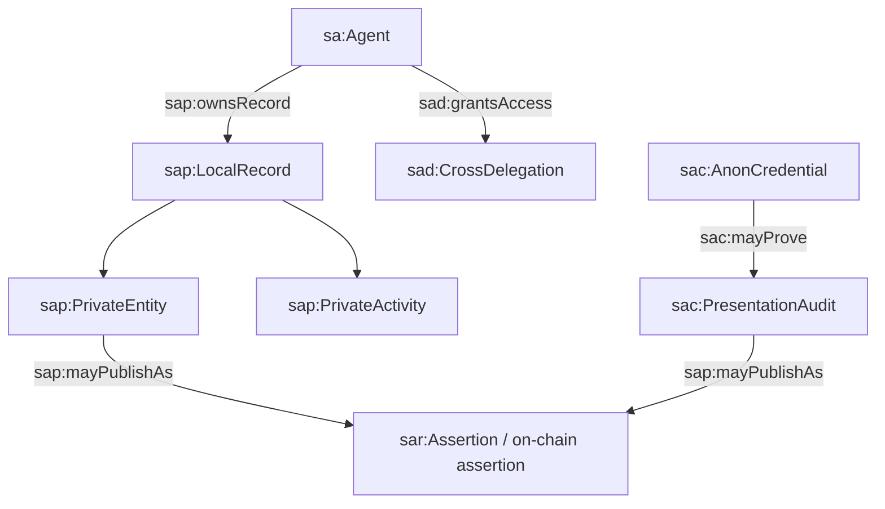
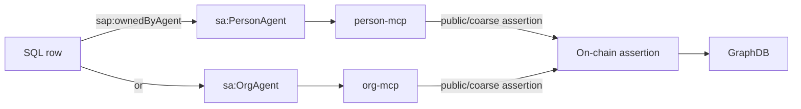

# 06 - Common Private MCP Ontology

## Purpose

This document defines a common ontology for local MCP data. It aligns private
SQLite rows, AnonCreds wallet records, and public on-chain assertions without
turning GraphDB into the private data store.

## Design Principles

1. Every local row maps to one primary T-Box class.
2. Every local row has an owner agent.
3. Visibility is explicit on owner-routed records.
4. Public discovery receives assertions or commitments, not private rows.
5. The same class can be implemented by `person-mcp` and `org-mcp` when the
   owner type differs but the concept is the same.

## Namespace Shape

| Prefix | Scope |
| --- | --- |
| `sa:` | Common Smart Agent domain classes |
| `sap:` | Private/local MCP classes and predicates |
| `sad:` | Delegation and authority |
| `sac:` | Credential and AnonCreds concepts |
| `saint:` | Intent, need, offering, outcome |
| `sah:` | Hub/work concepts |
| `sar:` | Relationships, roles, assertions |
| `prov:` | Provenance activities and entities |
| `p-plan:` | Plans, steps, variables, roles |
| `skos:` | Controlled vocabularies |
| `odrl:` | Permission/prohibition policy concepts |

## Top-Level Model



## Common Classes

| Class | Parent alignment | Meaning |
| --- | --- | --- |
| `sap:LocalRecord` | `prov:Entity` | Any local MCP/SQL row with owner, id, and storage boundary |
| `sap:PrivateEntity` | `prov:Entity` | Private durable thing, such as profile, preference, credential metadata, note |
| `sap:PrivateActivity` | `prov:Activity` | Private action log, proof presentation, audit action |
| `sap:OwnerRoutedRecord` | `sap:LocalRecord` | Row whose owning agent determines the storage location |
| `sap:PublicProjection` | `prov:Entity` | Narrow public representation of a private record |
| `sap:VisibilityTier` | `skos:Concept` | Visibility value used by private rows |
| `sac:HolderWallet` | `sap:PrivateEntity` | Local SSI wallet controlled by a person principal |
| `sac:AnonCredentialMetadata` | `sap:PrivateEntity` | SQL metadata for a held AnonCred |
| `sac:AnonCredentialPayload` | `sap:PrivateEntity` | Encrypted/Askar credential body, not exposed to SQL |
| `sac:CredentialSchema` | `prov:Entity` | Credential schema identifier |
| `sac:CredentialDefinition` | `prov:Entity` | AnonCreds cred def identifier |
| `sac:PresentationAudit` | `sap:PrivateActivity` | Local audit of proof creation/presentation |
| `sac:TrustOverlapAudit` | `sap:PrivateActivity` | Score-only private trust-overlap computation |

## Core Predicates

| Predicate | Domain -> Range | Meaning |
| --- | --- | --- |
| `sap:ownedByAgent` | `sap:LocalRecord -> sa:Agent` | Agent whose MCP owns the row |
| `sap:storedIn` | `sap:LocalRecord -> sap:Store` | Physical store, such as `person-mcp` |
| `sap:sourceTable` | `sap:LocalRecord -> xsd:string` | SQL table name |
| `sap:visibilityTier` | `sap:OwnerRoutedRecord -> sap:VisibilityTier` | Private/public/public-coarse/off-chain |
| `sap:publicAssertionId` | `sap:OwnerRoutedRecord -> xsd:string` | On-chain assertion id if projected |
| `sap:referencesOnChainId` | `sap:LocalRecord -> xsd:string` | Edge, entitlement, proposal, or assertion id |
| `sap:hasPrivatePayload` | `sap:LocalRecord -> sap:PrivatePayload` | JSON/encrypted payload held locally |
| `sac:storedInWallet` | `sac:AnonCredentialMetadata -> sac:HolderWallet` | Credential metadata to wallet |
| `sac:hasCredentialPayload` | `sac:AnonCredentialMetadata -> sac:AnonCredentialPayload` | Metadata to encrypted credential body |
| `sac:usesLinkSecret` | `sac:AnonCredentialMetadata -> xsd:string` | Link secret id, not the secret |
| `sac:usesSchema` | `sac:AnonCredentialMetadata -> sac:CredentialSchema` | AnonCreds schema id |
| `sac:usesCredentialDefinition` | `sac:AnonCredentialMetadata -> sac:CredentialDefinition` | Cred def id |

## Visibility Vocabulary

| Concept | Meaning |
| --- | --- |
| `sap:Private` | Only visible inside the owning MCP and authorized delegations |
| `sap:PublicCoarse` | Public assertion contains redacted/coarse fields only |
| `sap:Public` | Public assertion contains the intended discoverable fields |
| `sap:OffChain` | Never anchors publicly; local-only |
| `sap:CommitmentOnly` | Public chain contains only a hash/commitment/proof receipt |

## Owner-Routing Model



## A-Box Example: Private Row With Public Projection

```ttl
:need123
    a saint:Need, sap:OwnerRoutedRecord ;
    sap:ownedByAgent :maria ;
    sap:storedIn :personMcp ;
    sap:sourceTable "needs" ;
    sap:visibilityTier sap:PublicCoarse ;
    saint:summary "Needs a multiplier coach near Loveland" ;
    sap:publicAssertionId "42" .

:assertion42
    a sar:Assertion, sap:PublicProjection ;
    sar:assertionType sar:SelfAsserted ;
    prov:wasAssociatedWith :maria ;
    sap:derivedFromPrivateRecord :need123 .
```

The private row contains full requirements and context JSON. The public
assertion contains only the coarse searchable summary.
