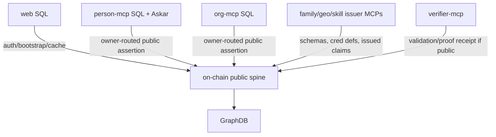

# 07 - MCP SQL Table Mapping

## Purpose

This document maps local SQL tables to the common ontology in
[06-common-private-mcp-ontology.md](06-common-private-mcp-ontology.md).

## Store Categories



## Web SQL Mapping

Web SQL should not become the private domain store. It holds auth/bootstrap,
references, and cache data.

| Table | Ontology class | Owner | Visibility | Notes |
| --- | --- | --- | --- | --- |
| `users` | `sa:SessionSubject`, `sa:ExternalIdentityLink` | web auth boundary | private/cache | Maps login DID, wallet, person agent address; on-chain resolver remains canonical for agent metadata |
| `recovery_delegations` | `sad:RecoveryDelegation` | smart account | private/bootstrap | Delegation blob for passkey recovery |
| `recovery_intents` | `sad:RecoveryIntent` | smart account | private/bootstrap | New passkey credential proposal |
| `invites` | `sa:Invite` | creating user/org | private/bootstrap | One-shot org membership or ownership capability |
| `training_modules` | `sa:TrainingModule` | web catalog | public reference | Shared catalog, not user progress |
| `messages` | `sa:Notification` | user | private/transitional | Should move to owner MCP for durable inbox |
| `activity_logs` | `sa:ActivityLogEntry` / `prov:Activity` | org/person by row context | private/transitional | Target home is `person-mcp` or `org-mcp` |
| `detached_members` | `sa:DetachedMember` | org | private/transitional | Target home is `org-mcp` |
| `needs`, `resources`, `matches` | `saint:Need`, `saint:Offering`, `sa:NeedResourceMatch` | owner agent | private/transitional | Target home is owner MCP unless public assertion is minted |

## person-mcp Mapping

| Table / store | Ontology class | Owner predicate | Important predicates |
| --- | --- | --- | --- |
| `accounts` | `sa:PersonAgentAccountRegistration` | `sap:ownedByAgent` | `sa:onChainAddress`, `sa:chainId`, `rdfs:label` |
| `external_identities` | `sa:ExternalIdentity` | `sap:ownedByAgent` | `sa:provider`, `sa:identifier`, `sa:verified` |
| `profiles` | `sa:PersonProfile` | `sap:ownedByAgent` | `foaf:name`, `schema:email`, `schema:telephone`, `schema:address`, `sap:hasPrivatePayload` |
| `chat_threads` | `sa:ChatThread` | `sap:ownedByAgent` | `sa:title`, `sap:hasPrivatePayload` |
| `chat_messages` | `sa:ChatMessage` | `sap:ownedByAgent` | `sa:inThread`, `prov:wasGeneratedBy`, `sa:messageRole` |
| `token_usage` | `sad:DelegationTokenUsage` | `sap:ownedByAgent` | `sad:jti`, `sad:usageCount`, `sad:usageLimit` |
| `sessions` | `sa:PasskeySession` | smart account | `sa:sessionSigner`, `sad:grantHash`, `sad:revocationEpoch` |
| `revocation_epochs` | `sad:RevocationEpoch` | smart account | `sad:epoch` |
| `action_nonces_v2` | `sad:ActionNonce` | smart account | `sad:actionId`, `sad:actionType`, `sad:usedAt` |
| `audit_log` | `sa:AuditEntry` | smart account | `prov:wasAssociatedWith`, `sa:decision`, `sa:entryHash` |
| `holder_wallets` | `sac:HolderWallet` | `sap:ownedByAgent` | `sac:walletContext`, `sac:signerEoa`, `sac:askarProfile`, `sac:linkSecretId` |
| `action_nonces` | `sac:WalletActionNonce` | wallet owner | `sac:actionType`, `sac:holderWalletId`, `sac:expiresAt`, `sac:usedAt` |
| `credential_metadata` | `sac:AnonCredentialMetadata` | wallet owner | `sac:issuerId`, `sac:schemaId`, `sac:credDefId`, `sac:credentialType`, `sac:targetOrgAddress` |
| `trust_overlap_audit` | `sac:TrustOverlapAudit` | wallet owner | `sac:publicSetCommit`, `sac:evidenceCommit`, `sac:score`, `sac:sharedCount` |
| `ssi_proof_audit` | `sac:PresentationAudit` | wallet owner | `sac:verifierId`, `sac:revealedAttrs`, `sac:predicates`, `sac:pairwiseHandle` |
| `vault_kv`, Askar `profiles` | `sac:AnonCredentialPayload` / `sap:EncryptedVaultEntry` | wallet owner | encrypted payload; never GraphDB |
| `user_preferences` | `sa:UserPreferences` | `sap:ownedByAgent` | `schema:language`, `sa:homeCommunity`, `sa:notificationPrefs` |
| `oikos_contacts` | `sa:OikosContact` | `sap:ownedByAgent` | `sa:personName`, `sa:proximity`, `sa:responseState`, `sa:lastContactAt` |
| `prayers` | `sa:Prayer` | `sap:ownedByAgent` | `sa:linkedOikosContact`, `sa:schedule`, `sa:responseState` |
| `training_progress` | `sa:TrainingProgress` | `sap:ownedByAgent` | `sa:moduleKey`, `sa:programKey`, `sa:trainingStatus`, `sa:hoursLogged` |
| `pinned_items` | `sa:PinnedItem` | `sap:ownedByAgent` | `sa:itemType`, `sa:itemRef`, `sa:displayOrder` |
| `notifications` | `sa:Notification` | `sap:ownedByAgent` | `sa:notificationKind`, `sa:payload`, `sa:readAt` |
| `beliefs` | `atl:Belief` | `sap:ownedByAgent` | `atl:statement`, `atl:informsIntent`, `sap:visibilityTier` |
| `coaching_notes` | `sa:CoachingNote` | coach agent | `sa:subjectAgent`, `sa:sharedWithSubject` |
| `cross_delegation_grants` | `sad:CrossDelegation` | grantor agent | `sad:granteeAgent`, `sad:scope`, `sad:caveatTerms` |
| `intents` | `saint:Intent` | `sap:ownedByAgent` | `saint:direction`, `saint:kind`, `saint:summary`, `sap:publicAssertionId` |
| `needs` | `saint:Need` | `sap:ownedByAgent` | `saint:projectsFromIntent`, `saint:requirements`, `saint:geo`, `saint:capacityNeeded` |
| `offerings` | `saint:Offering` | `sap:ownedByAgent` | `saint:capabilities`, `saint:capacity`, `saint:timeWindow` |
| `outcomes` | `sa:Outcome` | `sap:ownedByAgent` | `sa:metric`, `sa:target`, `sa:achievedAt` |
| `activity_log_entries` | `sa:ActivityLogEntry`, `prov:Activity` | `sap:ownedByAgent` | `sa:fulfillsEntitlement`, `sa:fulfillsNeed`, `sa:fulfillsIntent`, `prov:generated` |
| `work_items` | `sah:WorkItem` | assignee agent | `sah:entitlementId`, `sah:status`, `sah:resolvedByActivity` |
| `engagement_holder_state` | `sa:EngagementHolderState` | holder agent | `sa:entitlementId`, `sa:capacityConsumed`, `sa:lastActivity` |

## org-mcp Mapping

| Table | Ontology class | Owner predicate | Important predicates |
| --- | --- | --- | --- |
| `org_accounts` | `sa:OrgAgentAccountRegistration` | `sap:ownedByAgent` | `sa:onChainAddress`, `sa:chainId`, `rdfs:label` |
| `org_token_usage` | `sad:DelegationTokenUsage` | org agent | `sad:jti`, `sad:usageCount`, `sad:usageLimit` |
| `org_profiles_private` | `sa:OrgProfile` | org agent | private contact, financial contacts, internal notes |
| `org_members` | `sa:OrgMember` | org agent | `sa:memberAgent`, `sar:hasRole`, `sap:referencesOnChainId` |
| `detached_members` | `sa:DetachedMember` | org agent | display name, encrypted contact, assigned node, role |
| `revenue_reports` | `sa:RevenueReport` | org agent | period, gross/net/share payment, evidence URI, verification state |
| `proposals` | `sa:Proposal`, `prov:Plan` | org agent | proposal kind, target, quorum, vote counts, on-chain proposal id |
| `org_activity_log_entries` | `sa:ActivityLogEntry`, `prov:Activity` | org agent | performed by, participants, geo, fulfillment links, evidence URI |
| `org_intents` | `saint:Intent` | org agent | same common intent shape as person-mcp |
| `org_needs` | `saint:Need` | org agent | same common need shape as person-mcp |
| `org_offerings` | `saint:Offering` | org agent | same common offering shape as person-mcp |
| `org_outcomes` | `sa:Outcome` | org agent | same common outcome shape as person-mcp |
| `orchestration_plans` | `sa:OrchestrationPlan`, `p-plan:Plan` | org agent | parent intent, sub-intents, dependencies |
| `org_work_items` | `sah:WorkItem` | org assignee | entitlement id, title, status, resolved activity |
| `org_notifications` | `sa:Notification` | org agent | notification kind, payload, read timestamp |
| `org_beliefs` | `atl:Belief` | org agent | statement, tags, informed intent, visibility |
| `org_cross_delegation_grants` | `sad:CrossDelegation` | org grantor | grantee, scope, caveats, validity |
| `engagement_provider_state` | `sa:EngagementProviderState` | provider org | capacity remaining, provider notes, internal assignee |
| `engagement_sessions` | `sa:EngagementSession`, `prov:Activity` | provider org | scheduled/occurred timestamps, status, notes |
| `engagement_tranches` | `sa:EngagementTranche` | provider org | amount, currency, scheduled/released timestamps |
| `engagement_policies` | `sa:EngagementPolicy`, `prov:Plan` | provider org | policy type, document URI, version, signatures required |
| `policy_signers` | `sa:PolicySigner` | provider org | signer agent, role, signed timestamp |

## Specialized MCP Mapping

| MCP | Local data | Ontology class | Public bridge |
| --- | --- | --- | --- |
| `family-mcp` | Guardian credential issuer/verifier state | `sac:CredentialIssuerState`, `sac:PresentationVerification` | Credential schema/def and verifier receipt if published |
| `geo-mcp` | Geo credential issuer state, verifier checks | `sag:GeoCredentialIssuerState`, `sac:PresentationVerification` | `GeoClaimRegistry`, `GeoH3InclusionVerifier`, or verifier receipt |
| `skill-mcp` | Skill credential issuer state | `sas:SkillCredentialIssuerState` | `AgentSkillRegistry` claim or credential verification receipt |
| `verifier-mcp` | Verifier nonces, proof requests, verification logs | `sac:ProofRequest`, `sac:PresentationVerification` | `AgentValidationProfile` or on-chain assertion |

For the detailed ontology of these specialized sources, see
[09-specialized-mcp-source-mapping.md](09-specialized-mcp-source-mapping.md).

## A-Box Example: SQL Row Mapping

```ttl
:orgMemberRow77
    a sa:OrgMember, sap:OwnerRoutedRecord ;
    sap:storedIn :orgMcp ;
    sap:sourceTable "org_members" ;
    sap:ownedByAgent :berthoudCircle ;
    sa:memberAgent :sofia ;
    sar:hasRole sar:Member ;
    sap:referencesOnChainId "0xedge123" ;
    sap:visibilityTier sap:Private .

:edge123
    a sar:RelationshipEdge ;
    sar:subject :sofia ;
    sar:object :berthoudCircle ;
    sar:relationshipType sar:OrganizationMembership .
```

The SQL row stores private org notes and lifecycle detail. The relationship
edge is the public anchor.
