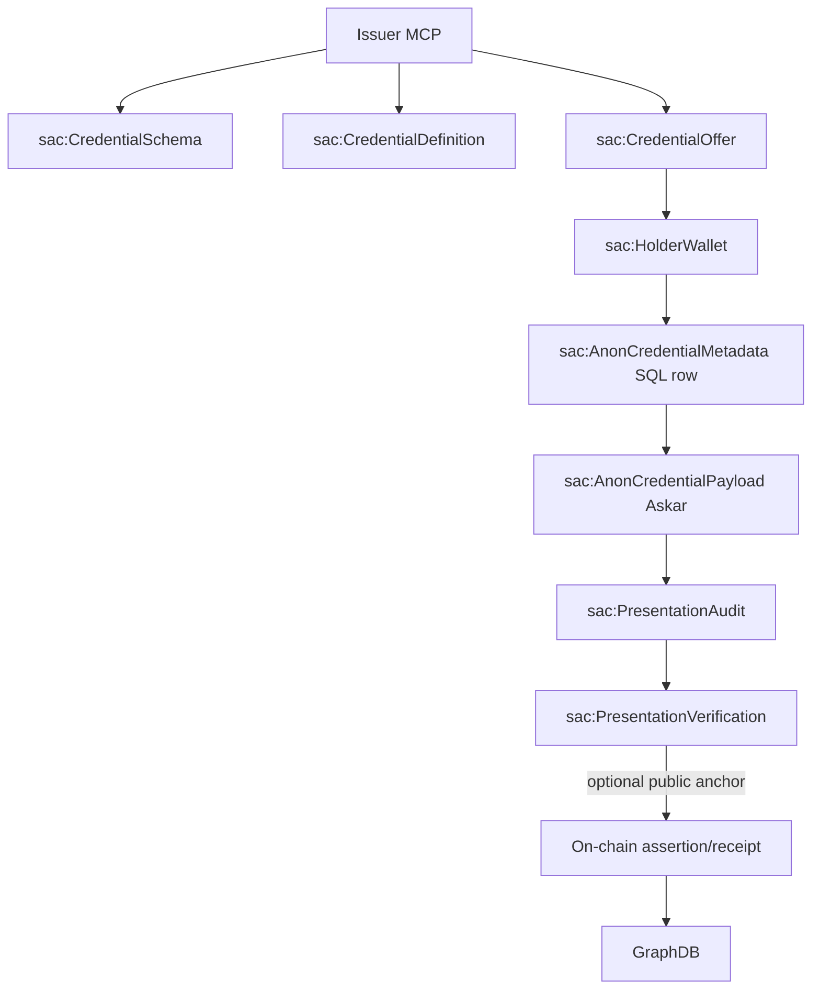
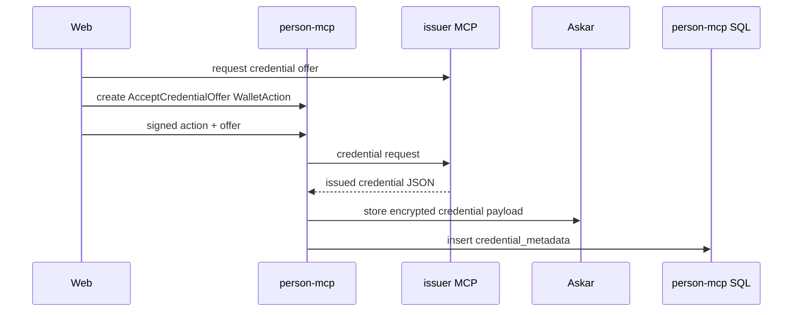
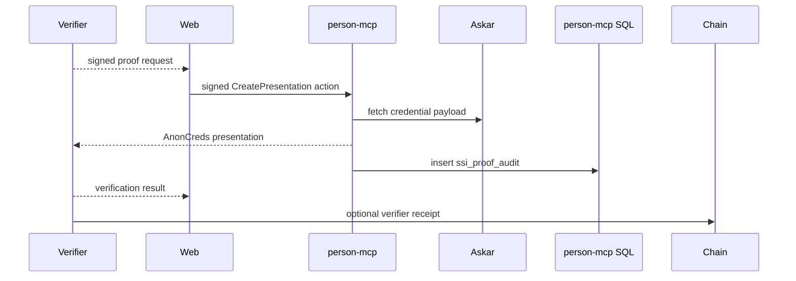

# 08 - AnonCreds SQL Ontology Mapping

## Purpose

This document maps AnonCreds wallet data, SQL metadata, credential kinds,
proof audits, and public graph assertions into one ontology model.

## Key Distinction

AnonCreds data is private by default. SQL stores metadata and audit records.
Askar stores encrypted credential payloads. GraphDB sees only public
assertions, commitments, or verifier receipts that were anchored on-chain.



## SQL Tables To Ontology

| SQL table / field | Ontology mapping | Notes |
| --- | --- | --- |
| `holder_wallets.id` | `sac:HolderWallet` IRI/local id | Local wallet id used by actions |
| `holder_wallets.person_principal` | `sap:ownedByAgent` | Person principal that owns the wallet |
| `holder_wallets.wallet_context` | `sac:walletContext` | Usually `default`; supports multiple contexts |
| `holder_wallets.signer_eoa` | `sac:signerEoa` | Wallet action signer address |
| `holder_wallets.askar_profile` | `sac:askarProfile` | Local encrypted wallet profile |
| `holder_wallets.link_secret_id` | `sac:linkSecretId` | Identifier only, not the secret |
| `credential_metadata.id` | `sac:AnonCredentialMetadata` | SQL metadata row |
| `credential_metadata.holder_wallet_id` | `sac:storedInWallet` | FK-like link to `sac:HolderWallet` |
| `credential_metadata.issuer_id` | `sac:issuerId` | Issuer DID/id |
| `credential_metadata.schema_id` | `sac:usesSchema` | AnonCreds schema id |
| `credential_metadata.cred_def_id` | `sac:usesCredentialDefinition` | AnonCreds credential definition id |
| `credential_metadata.credential_type` | `sac:credentialType` | Stable descriptor key |
| `credential_metadata.received_at` | `prov:generatedAtTime` | Receipt timestamp |
| `credential_metadata.status` | `sac:credentialStatus` | Active/revoked/local status |
| `credential_metadata.link_secret_id` | `sac:usesLinkSecret` | Holder binding identifier |
| `credential_metadata.target_org_address` | `sac:targetOrgAgent` | Org membership target, separate from issuer |
| Askar credential body | `sac:AnonCredentialPayload` | Encrypted private payload |
| `ssi_proof_audit` | `sac:PresentationAudit` | Local proof presentation log |
| `trust_overlap_audit` | `sac:TrustOverlapAudit` | Score-only overlap computation log |
| `action_nonces` | `sac:WalletActionNonce` | Wallet action replay guard |

## Credential Kinds

Credential kind descriptors live in `packages/sdk/src/credential-types.ts`.
Issuer/verifier source mappings for each kind are detailed in
[09-specialized-mcp-source-mapping.md](09-specialized-mcp-source-mapping.md).

| Credential type | Ontology class | Attributes | Public equivalent |
| --- | --- | --- | --- |
| `OrgMembershipCredential` | `sac:OrgMembershipCredential` | `membershipStatus`, `role`, `joinedYear`, `circleId` | `sar:RelationshipEdge` + `sar:Assertion` when public |
| `GuardianOfMinorCredential` | `sac:GuardianOfMinorCredential` | `relationship`, `minorBirthYear`, `issuedYear` | Usually no public equivalent; verifier receipt only if needed |
| `GeoLocationCredential` | `sac:GeoLocationCredential` | `featureId`, `featureName`, `city`, `region`, `country`, `relation`, `confidence`, validity timestamps | `sag:GeoClaim` or verifier receipt |
| `SkillsCredential` | `sac:SkillsCredential` | `skillId`, `skillName`, `relation`, `proficiencyScore`, `confidence`, issuer fields, validity timestamps | `sas:SkillClaim` or verifier receipt |

## AnonCreds Vs SQL Vs Public Assertion

| Layer | What it stores | Example | Visibility |
| --- | --- | --- | --- |
| AnonCreds payload | Signed credential attributes and cryptographic material | `minorBirthYear = 2012` | Private encrypted vault |
| SQL metadata | Search/display metadata, issuer ids, schema ids, status | `credential_type = GuardianOfMinorCredential` | Private local DB |
| Proof audit | What was revealed or predicate-checked | `minorBirthYear >= 2006`, no raw birth year | Private audit log |
| Public assertion | Coarse claim, commitment, or verifier receipt | "Verifier confirmed guardian predicate" | On-chain + GraphDB if published |

## Flow: Issuance



## Flow: Presentation



## Example A-Box: Held Org Membership Credential

```ttl
:walletSofiaDefault
    a sac:HolderWallet ;
    sap:ownedByAgent :sofia ;
    sac:walletContext "default" ;
    sac:signerEoa "0xabc0000000000000000000000000000000000000" ;
    sac:askarProfile "sofia-default" ;
    sac:linkSecretId "link-secret-sofia-1" .

:credMetaOrgMembership1
    a sac:AnonCredentialMetadata, sac:OrgMembershipCredential ;
    sac:storedInWallet :walletSofiaDefault ;
    sac:issuerId "did:web:catalyst.noco.org" ;
    sac:usesSchema <https://catalyst.noco.org/schemas/OrgMembership/1.0> ;
    sac:usesCredentialDefinition <https://catalyst.noco.org/creddefs/OrgMembership/1.0/v1> ;
    sac:credentialType "OrgMembershipCredential" ;
    sac:targetOrgAgent :berthoudCircle ;
    sac:credentialStatus "active" ;
    prov:generatedAtTime "2026-04-12T10:00:00Z"^^xsd:dateTime .

:credPayloadOrgMembership1
    a sac:AnonCredentialPayload ;
    sac:payloadFor :credMetaOrgMembership1 ;
    sap:storedIn :askarVault ;
    sap:visibilityTier sap:Private .
```

## Example A-Box: Proof Audit With Selective Disclosure

```ttl
:proofAuditGuardian1
    a sac:PresentationAudit ;
    sap:ownedByAgent :sofia ;
    sac:holderWalletRef :walletSofiaDefault ;
    sac:verifierId "did:web:family.smartagent.io" ;
    sac:purpose "prove_guardianship" ;
    sac:revealedAttrs "[]" ;
    sac:predicates "[{\"attribute\":\"minorBirthYear\",\"operator\":\">=\",\"value\":2006}]" ;
    sac:pairwiseHandle "pairwise:coach:7b4a" ;
    sac:holderBindingIncluded false ;
    sac:verificationResult "ok" ;
    prov:generatedAtTime "2026-04-12T10:05:00Z"^^xsd:dateTime .
```

The verifier learned the predicate result, not the raw relationship label or
birth year.

## Mapping Held Credentials To Public Graph Claims

| Credential | Private ontology object | Public graph object when published |
| --- | --- | --- |
| Org membership credential | `sac:OrgMembershipCredential` | `sar:RelationshipEdge` plus `sar:Assertion` |
| Geo location credential | `sac:GeoLocationCredential` | `sag:GeoClaim` or `sac:PresentationVerification` |
| Skill credential | `sac:SkillsCredential` | `sas:SkillClaim` or `sac:PresentationVerification` |
| Guardian credential | `sac:GuardianOfMinorCredential` | Usually only `sac:PresentationVerification`, no raw relationship |

## Example: Credential And Relationship Coexist

```ttl
:credMetaOrgMembership1
    a sac:OrgMembershipCredential ;
    sac:targetOrgAgent :berthoudCircle ;
    sap:visibilityTier sap:Private .

:edgeMembership1
    a sar:RelationshipEdge ;
    sar:subject :sofia ;
    sar:object :berthoudCircle ;
    sar:relationshipType sar:OrganizationMembership ;
    sar:edgeStatus sar:StatusActive .
```

The credential proves privately. The edge advertises publicly. They can refer
to the same real-world membership, but neither replaces the other.

## Ontology Terms To Add To T-Box

```text
sac:HolderWallet                 subClassOf sap:PrivateEntity
sac:WalletActionNonce            subClassOf sap:PrivateEntity
sac:AnonCredentialMetadata       subClassOf sap:PrivateEntity
sac:AnonCredentialPayload        subClassOf sap:PrivateEntity
sac:CredentialSchema             subClassOf prov:Entity
sac:CredentialDefinition         subClassOf prov:Entity
sac:CredentialOffer              subClassOf prov:Entity
sac:PresentationAudit            subClassOf sap:PrivateActivity
sac:PresentationVerification     subClassOf prov:Activity
sac:TrustOverlapAudit            subClassOf sap:PrivateActivity
sac:OrgMembershipCredential      subClassOf sac:AnonCredentialMetadata
sac:GuardianOfMinorCredential    subClassOf sac:AnonCredentialMetadata
sac:GeoLocationCredential        subClassOf sac:AnonCredentialMetadata
sac:SkillsCredential             subClassOf sac:AnonCredentialMetadata
```

## C-Box Terms To Add

```text
sac:CredentialStatus = active | revoked | expired | archived
sac:WalletActionType = ProvisionHolderWallet | AcceptCredentialOffer | CreatePresentation | MatchAgainstPublicSet
sac:VerificationResult = ok | denied | failed | expired
sac:PresentationOutputKind = proof | score-only | verifier-receipt
```
