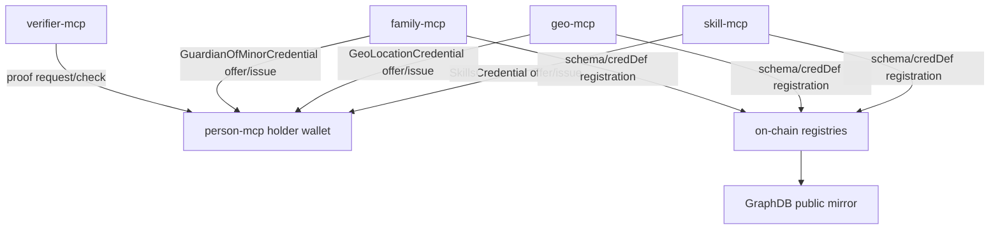
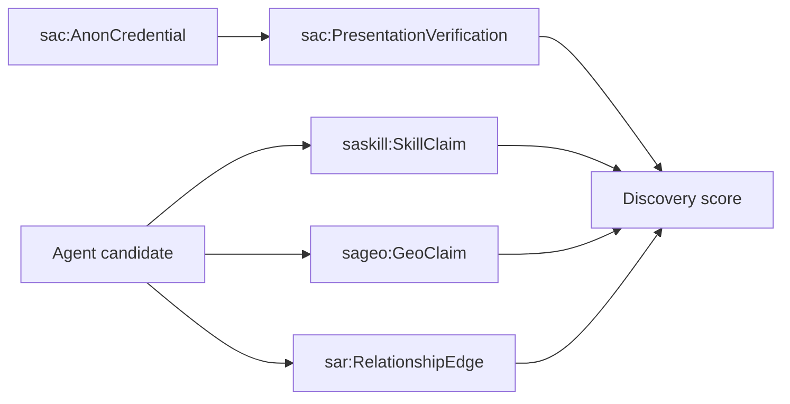

# 09 - Specialized MCP Source Mapping

## Purpose

This document maps specialized MCPs into the common ontology: skills, geo
features/claims, family credentials, verifier proof sources, and future domain
MCPs.

These MCPs are not general owner-routed data stores like `person-mcp` or
`org-mcp`. They are source-specific issuer, verifier, registry, or resolver
services.

## Source Model



## Common Specialized MCP Classes

| Class | Parent alignment | Meaning |
| --- | --- | --- |
| `sap:SpecializedMcpSource` | `prov:Agent` | MCP service acting as issuer/verifier/source |
| `sac:CredentialIssuerState` | `sap:PrivateEntity` | Issuer-private schema/credDef/master-secret state |
| `sac:CredentialIssuanceActivity` | `prov:Activity` | Offer/request/issue flow |
| `sac:ProofRequest` | `prov:Entity` | Verifier's AnonCreds presentation request |
| `sac:PresentationVerification` | `prov:Activity` | Verification of a holder presentation |
| `sag:GeoCredentialIssuerState` | `sac:CredentialIssuerState` | Geo credential issuer state |
| `sas:SkillCredentialIssuerState` | `sac:CredentialIssuerState` | Skill credential issuer state |
| `saf:FamilyCredentialIssuerState` | `sac:CredentialIssuerState` | Family/guardian credential issuer state |

## Skill Sources

### Existing Sources

| Source | Code / ontology | Role |
| --- | --- | --- |
| `skill-mcp` | `apps/skill-mcp/src/*` | Issues `SkillsCredential` |
| Skill T-Box | `docs/ontology/tbox/skills.ttl` | Defines `saskill:Skill` and `saskill:SkillClaim` |
| Skill vocabulary | `docs/ontology/cbox/skill-vocabulary*.ttl` | SKOS/OASF skill concepts |
| Skill contracts | `SkillDefinitionRegistry`, `SkillIssuerRegistry`, `AgentSkillRegistry` | Public definitions, approved issuers, public claims |

### Skill Ontology Mapping

| Data | Ontology class | Public/private |
| --- | --- | --- |
| Skill definition | `saskill:Skill` | Public |
| Skill taxonomy node | `skos:Concept`, `saskill:Skill` | Public |
| OASF mapping | `saskill:oasfMapping` | Public |
| Issuer authorization | `saskill:SkillIssuer` / `AgentIssuerProfile` | Public |
| Public skill claim | `saskill:SkillClaim` | Public on-chain + GraphDB |
| Held skill credential | `sac:SkillsCredential` | Private holder wallet |
| Skill credential issuer state | `sas:SkillCredentialIssuerState` | Private issuer MCP |
| Skill proof request | `sac:ProofRequest` | Verifier/private unless receipt published |
| Skill proof verification | `sac:PresentationVerification` | Private or public receipt |

### Skill A-Box Example

```ttl
:grantWritingSkill
    a saskill:Skill, skos:Concept ;
    skos:prefLabel "Grant writing" ;
    saskill:skillId "0xskillGrantWriting" ;
    saskill:oasfMapping oasf:communication.write.grant_writing .

:rachelSkillClaim1
    a saskill:SkillClaim ;
    saskill:subjectAgent :rachel ;
    saskill:issuer :frontRangeHub ;
    saskill:targetSkill :grantWritingSkill ;
    saskill:relation saskill:PracticesSkill ;
    saskill:proficiencyScore 5800 ;
    saskill:confidence 80 .

:rachelHeldSkillCredential1
    a sac:SkillsCredential ;
    sac:credentialType "SkillsCredential" ;
    sac:storedInWallet :rachelWallet ;
    sac:usesSchema <https://smartagent.io/schemas/Skills/1.0> ;
    sac:usesCredentialDefinition <https://smartagent.io/creddefs/Skills/1.0/v1> ;
    sap:visibilityTier sap:Private .
```

The public claim and the private credential may describe the same capability,
but they are separate artifacts with different privacy behavior.

## Geo Sources

### Existing Sources

| Source | Code / ontology | Role |
| --- | --- | --- |
| `geo-mcp` | `apps/geo-mcp/src/*` | Issues `GeoLocationCredential` |
| Geo T-Box | `docs/ontology/tbox/geo.ttl` | Defines `sageo:GeoFeature` and `sageo:GeoClaim` |
| Geo contracts | `GeoFeatureRegistry`, `GeoClaimRegistry`, `GeoH3InclusionVerifier` | Public features, public claims, ZK inclusion receipts |

### Geo Ontology Mapping

| Data | Ontology class | Public/private |
| --- | --- | --- |
| Canonical geo feature | `sageo:GeoFeature`, `geo:Feature` | Public |
| Geometry | `geo:Geometry` / WKT | Public or external referenced data |
| Geometry hash | `sageo:geometryHash` | Public |
| H3 coverage root | `sageo:h3CoverageRoot` | Public commitment |
| Public geo claim | `sageo:GeoClaim` | Public on-chain + GraphDB |
| Held geo credential | `sac:GeoLocationCredential` | Private holder wallet |
| H3 inclusion proof receipt | `sag:H3InclusionVerification` / `sac:PresentationVerification` | Public if anchored |
| Geo credential issuer state | `sag:GeoCredentialIssuerState` | Private issuer MCP |

### Geo A-Box Example

```ttl
:loveland
    a sageo:Municipality ;
    rdfs:label "Loveland, Colorado" ;
    sageo:featureId "0xgeoLoveland" ;
    sageo:geometryHash "0xhashGeometry" ;
    sageo:h3CoverageRoot "0xh3RootLoveland" ;
    sageo:active true .

:rachelGeoClaim1
    a sageo:GeoClaim ;
    sageo:subjectAgent :rachel ;
    sageo:issuer :rachel ;
    sageo:targetFeature :loveland ;
    sageo:relation sageo:operatesIn ;
    sageo:confidence 85 ;
    sageo:visibility "public-coarse" .

:rachelHeldGeoCredential1
    a sac:GeoLocationCredential ;
    sac:credentialType "GeoLocationCredential" ;
    sac:storedInWallet :rachelWallet ;
    sac:usesSchema <https://smartagent.io/schemas/GeoLocation/1.0> ;
    sac:usesCredentialDefinition <https://smartagent.io/creddefs/GeoLocation/1.0/v1> ;
    sac:credentialAttribute "featureId=0xgeoLoveland" ;
    sac:credentialAttribute "relation=operatesIn" ;
    sap:visibilityTier sap:Private .
```

## Family Sources

### Existing Sources

| Source | Code | Role |
| --- | --- | --- |
| `family-mcp` | `apps/family-mcp/src/*` | Issues and verifies `GuardianOfMinorCredential` |
| Guardian issuer | `apps/family-mcp/src/issuers/guardian.ts` | Registers schema/credDef |
| Guardian verifier | `apps/family-mcp/src/verifiers/guardian.ts` | Builds/checks guardian proof requests |

### Family Ontology Mapping

| Data | Ontology class | Public/private |
| --- | --- | --- |
| Guardian credential schema | `sac:CredentialSchema` | Public registry |
| Guardian credential definition | `sac:CredentialDefinition` | Public registry |
| Held guardian credential | `sac:GuardianOfMinorCredential` | Private holder wallet |
| Family issuer private state | `saf:FamilyCredentialIssuerState` | Private issuer MCP |
| Guardian proof request | `sac:ProofRequest` | Verifier/private |
| Guardian verification result | `sac:PresentationVerification` | Private unless receipt published |

### Family A-Box Example

```ttl
:sofiaGuardianCredential1
    a sac:GuardianOfMinorCredential ;
    sac:credentialType "GuardianOfMinorCredential" ;
    sac:storedInWallet :sofiaWallet ;
    sac:usesSchema <https://family.smartagent.io/schemas/GuardianOfMinor/1.0> ;
    sac:usesCredentialDefinition <https://family.smartagent.io/creddefs/GuardianOfMinor/1.0/v1> ;
    sap:visibilityTier sap:Private .

:guardianVerification1
    a sac:PresentationVerification ;
    prov:used :sofiaGuardianCredential1 ;
    sac:proofPredicate "minorBirthYear >= 2006" ;
    sac:verificationResult "ok" ;
    prov:wasAssociatedWith :familyMcp .
```

The graph should never publish the minor's identity, raw birth year, or
relationship attribute. A public artifact should be only a bounded verifier
receipt or commitment.

## Verifier Sources

`verifier-mcp` defines common presentation policies for all credential kinds.
Its specs include:

| Credential type | Revealed attributes | Predicate proof |
| --- | --- | --- |
| `OrgMembershipCredential` | holder, membership status | `joinedYear >= 2000` |
| `GuardianOfMinorCredential` | holder | `minorBirthYear >= 2006` |
| `GeoLocationCredential` | holder, country, region, relation | `confidence >= 50` |
| `SkillsCredential` | holder, skill name, relation, issuer DID | `proficiencyScore >= 4000` |

Ontology mapping:

```ttl
:skillsAuditRequest
    a sac:ProofRequest ;
    sac:credentialType "SkillsCredential" ;
    sac:revealsAttribute "skillName" ;
    sac:revealsAttribute "relation" ;
    sac:revealsAttribute "issuerDid" ;
    sac:requiresPredicate "proficiencyScore >= 4000" ;
    prov:wasAttributedTo :verifierMcp .
```

## Other MCP Data Sources

| Source | Data | Ontology class | Rule |
| --- | --- | --- | --- |
| `a2a-agent` | A2A sessions, delegated profiles, MCP proxy activity | `sad:DelegationSession`, `sa:A2AInteraction` | Public only through explicit assertion/audit receipt |
| Future `service-mcp` | Service endpoints, service terms, availability | `sa:ServiceEndpoint`, `sa:ServiceOffering` | Public endpoint metadata can mirror to GraphDB |
| Future `data-mcp` | Data access grants, datasets, proofs of access | `sad:DataAccessDelegation`, `sa:Dataset`, `sa:AccessAuditEntry` | Data content remains private |
| Future `payment-mcp` | Invoices, disbursement receipts, revenue evidence | `sa:PaymentRecord`, `sa:RevenueReport`, `sa:EngagementTranche` | Amount details private unless intentionally asserted |

## Cross-Source Discovery Pattern



Discovery should prefer public graph facts for ranking. Private credentials can
contribute only through holder-approved proof results or score-only audits.

## Terms To Add Or Confirm

```text
sap:SpecializedMcpSource
sac:CredentialIssuerState
sac:CredentialIssuanceActivity
sac:ProofRequest
sac:PresentationVerification
sag:GeoCredentialIssuerState
sag:H3InclusionVerification
sas:SkillCredentialIssuerState
saf:FamilyCredentialIssuerState
sa:A2AInteraction
sad:DelegationSession
```
