# 10 - Domain T-Box Diagram Index

## Purpose

This section breaks the ontology into domain areas. Each domain doc shows:

1. T-Box inheritance.
2. Core relationships between classes.
3. Public knowledge-base classes and private MCP classes in the same diagram.
4. Where concrete SQL tables, AnonCreds payloads, or on-chain records map.

## Diagram Legend

```text
[KB]   Public ontology / GraphDB / on-chain mirror class
[MCP]  Private local MCP class or proposed private T-Box class
[SQL]  Concrete SQLite table mapped to an ontology class
[VC]   AnonCreds credential/proof class
```

## Domain Areas

| Domain | Primary T-Box files | Public classes | MCP/private classes |
| --- | --- | --- | --- |
| Identity and access | `core.ttl`, `identity.ttl`, `delegation.ttl` | `sa:Agent`, `sai:SmartAgentIdentity`, `eth:SmartAccount`, `sad:Delegation` | `sa:PasskeySession`, `sad:ActionNonce`, `sa:AuditEntry` |
| Private MCP data | proposed `sap:*` private layer | Public projection only | `sap:LocalRecord`, `sap:PrivateEntity`, `sa:PersonProfile`, `sa:OrgProfile` |
| Credentials and proofs | proposed `sac:*`, `CredentialRegistry` | `sac:CredentialSchema`, `sac:CredentialDefinition`, verifier receipts | `sac:HolderWallet`, `sac:AnonCredentialMetadata`, `sac:AnonCredentialPayload` |
| Relationships and trust | `relationships.ttl`, `trust.ttl`, validation contracts | `sar:RelationshipEdge`, `sar:Assertion`, `sat:TrustAssertion` | private notes, private validation evidence, local review/dispute prep |
| Skills | `skills.ttl`, skill vocabulary | `saskill:Skill`, `saskill:SkillClaim` | `sac:SkillsCredential`, `sas:SkillCredentialIssuerState` |
| Geo | `geo.ttl` | `sageo:GeoFeature`, `sageo:GeoClaim` | `sac:GeoLocationCredential`, `sag:GeoCredentialIssuerState` |
| Intent, marketplace, work | `intents.ttl`, `needs.ttl`, `resources.ttl`, `matches.ttl`, `entitlements.ttl` | public intent assertions, matches, entitlements | private intents, needs, offerings, work items, activity logs |

## Whole-System T-Box View

```mermaid
flowchart TD
    ProvAgent["prov:Agent"]
    ProvEntity["prov:Entity"]
    ProvActivity["prov:Activity"]
    SkosConcept["skos:Concept"]
    DulSituation["dul:Situation"]
    DulDescription["dul:Description"]
    PPlan["p-plan:Plan / p-plan:Step"]

    Agent["[KB] sa:Agent"]
    Identity["[KB] sai:AgentIdentity"]
    Edge["[KB] sar:RelationshipEdge"]
    Trust["[KB] sat:TrustAssertion"]
    Skill["[KB] saskill:Skill"]
    Geo["[KB] sageo:GeoFeature"]
    Intent["[KB/MCP] saint:Intent"]
    Need["[KB/MCP] saneed:NeedOccurrence"]
    Offering["[KB/MCP] saoffer:ResourceOffering"]
    Match["[KB] samatch:NeedResourceMatch"]
    Entitlement["[KB] saent:Entitlement"]
    Local["[MCP] sap:LocalRecord"]
    Credential["[MCP/VC] sac:AnonCredentialMetadata"]

    Agent -->|"subClassOf"| ProvAgent
    Identity -->|"subClassOf"| ProvEntity
    Edge -->|"subClassOf"| ProvEntity
    Trust -->|"subClassOf"| ProvEntity
    Skill -->|"subClassOf"| SkosConcept
    Geo -->|"subClassOf"| ProvEntity
    Intent -->|"closeMatch/subClass axes"| ProvEntity
    Need -->|"subClassOf"| DulSituation
    Offering -->|"subClassOf"| DulSituation
    Match -->|"subClassOf"| DulSituation
    Entitlement -->|"subClassOf"| ProvEntity
    Local -->|"subClassOf"| ProvEntity
    Credential -->|"subClassOf"| Local
    PPlan --> Entitlement
```



## Public And Private Classes In One Ontology

The T-Box may define both public and private classes. The publication rule is
not "class exists in the ontology means it appears in GraphDB." The rule is:

```text
GraphDB receives public schema plus public A-Box facts.
MCPs may use the same T-Box privately without publishing private A-Box rows.
```

Example:

```ttl
sac:AnonCredentialMetadata
    rdfs:subClassOf sap:PrivateEntity .
```

The class may be documented in the shared ontology, while actual credential
rows remain inside `person-mcp`.
