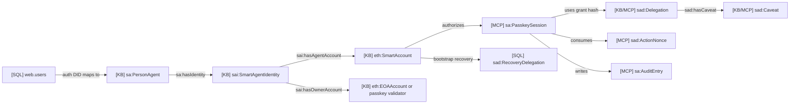

# 11 - Identity And Access Domain Ontology

## Scope

This domain covers agents, identity facets, Ethereum accounts, passkey-rooted
sessions, recovery, and delegated access.

Primary sources:

- `docs/ontology/tbox/core.ttl`
- `docs/ontology/tbox/identity.ttl`
- `docs/ontology/tbox/delegation.ttl`
- `apps/web/src/db/schema.ts`
- `apps/person-mcp/src/session-store/index.ts`

## T-Box Inheritance

```mermaid
flowchart TD
    ProvAgent["prov:Agent"]
    ProvEntity["prov:Entity"]
    ProvActivity["prov:Activity"]
    SoftwareAgent["prov:SoftwareAgent"]
    PPlan["p-plan:Plan"]
    SkosConcept["skos:Concept"]

    Agent["[KB] sa:Agent"]
    Person["[KB] sa:PersonAgent"]
    Org["[KB] sa:OrganizationAgent"]
    AI["[KB] sa:AIAgentAccount"]
    Hub["[KB] sa:HubAgent"]

    Identity["[KB] sai:Identity"]
    AgentIdentity["[KB] sai:AgentIdentity"]
    SmartIdentity["[KB] sai:SmartAgentIdentity"]
    Registry["[KB] sai:AgentRegistry"]
    SmartRegistry["[KB] sai:SmartAgentRegistry"]
    Identifier["[KB] sai:Identifier"]
    SmartIdentifier["[KB] sai:SmartAgentIdentifier"]
    Descriptor["[KB] sai:Descriptor"]
    SmartDescriptor["[KB] sai:SmartAgentDescriptor"]

    EthAccount["[KB] eth:Account"]
    SmartAccount["[KB] eth:SmartAccount"]
    EOA["[KB] eth:EOAAccount"]

    Delegation["[KB/MCP] sad:Delegation"]
    Caveat["[KB/MCP] sad:Caveat"]
    Policy["[KB] sad:DelegationPolicy"]
    Session["[MCP] sa:PasskeySession"]
    RecoveryDelegation["[SQL] sad:RecoveryDelegation"]
    RecoveryIntent["[SQL] sad:RecoveryIntent"]
    AuditEntry["[MCP] sa:AuditEntry"]

    Agent -->|"subClassOf"| ProvAgent
    Person --> Agent
    Org --> Agent
    AI --> Agent
    Hub --> Agent

    Identity --> ProvEntity
    AgentIdentity --> Identity
    SmartIdentity --> AgentIdentity
    Registry --> ProvEntity
    SmartRegistry --> Registry
    Identifier --> ProvEntity
    SmartIdentifier --> Identifier
    Descriptor --> ProvEntity
    SmartDescriptor --> Descriptor

    EthAccount --> SoftwareAgent
    SmartAccount --> EthAccount
    EOA --> EthAccount

    Delegation --> ProvActivity
    Caveat --> ProvEntity
    Policy --> PPlan
    Session --> ProvEntity
    RecoveryDelegation --> Delegation
    RecoveryIntent --> ProvEntity
    AuditEntry --> ProvEntity
    Policy --> SkosConcept
```

## Relationship Diagram

## Store Mapping

| Store/table | Ontology class | Public? |
| --- | --- | --- |
| `web.users` | `sa:SessionSubject`, `sa:ExternalIdentityLink` | No, auth/cache only |
| `web.recovery_delegations` | `sad:RecoveryDelegation` | No |
| `web.recovery_intents` | `sad:RecoveryIntent` | No |
| `person-mcp.sessions` | `sa:PasskeySession` | No |
| `person-mcp.audit_log` | `sa:AuditEntry` | No by default |
| On-chain resolver | `sai:SmartAgentIdentity`, `eth:SmartAccount` | Yes |
| GraphDB on-chain mirror | `sa:Agent`, `sai:*`, `eth:*` | Yes |

## Design Notes

- `sa:Agent` is the discoverable identity root.
- `sai:SmartAgentIdentity` is the on-chain identity facet.
- `eth:SmartAccount` is the account object, not the social agent.
- Passkey sessions and recovery rows are private access-control records.
- Delegations can be public trust facts or private MCP authorization records,
  depending on whether they are anchored as public assertions.
