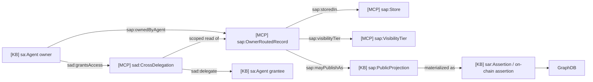
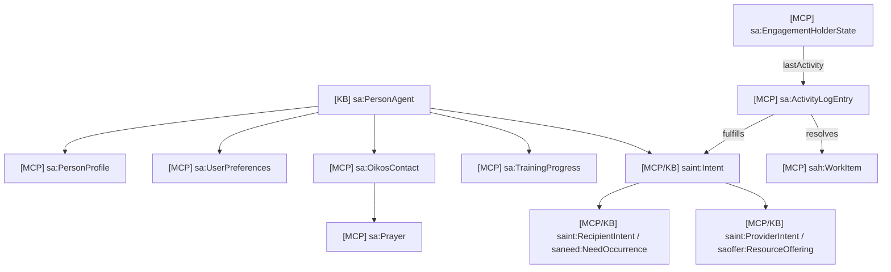
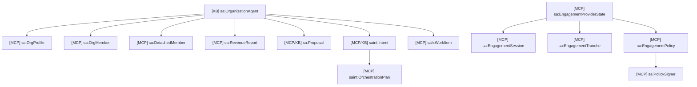

# 12 - Private MCP Data Domain Ontology

## Scope

This domain covers owner-routed private records stored in `person-mcp`,
`org-mcp`, and future MCPs. These classes are shared T-Box concepts, but their
A-Box rows stay private unless projected through an on-chain assertion.

Primary sources:

- `apps/person-mcp/src/db/schema.ts`
- `apps/org-mcp/src/db/schema.ts`
- `docs/information-architecture/06-data-ontology.md`
- [06-common-private-mcp-ontology.md](06-common-private-mcp-ontology.md)

## T-Box Inheritance

```mermaid
flowchart TD
    ProvEntity["prov:Entity"]
    ProvActivity["prov:Activity"]
    ProvPlan["prov:Plan"]
    PPlan["p-plan:Plan"]
    Agent["[KB] sa:Agent"]

    LocalRecord["[MCP] sap:LocalRecord"]
    OwnerRouted["[MCP] sap:OwnerRoutedRecord"]
    PrivateEntity["[MCP] sap:PrivateEntity"]
    PrivateActivity["[MCP] sap:PrivateActivity"]
    PublicProjection["[KB] sap:PublicProjection"]
    Visibility["[MCP] sap:VisibilityTier"]

    PersonProfile["[MCP] sa:PersonProfile"]
    OrgProfile["[MCP] sa:OrgProfile"]
    Preferences["[MCP] sa:UserPreferences"]
    Oikos["[MCP] sa:OikosContact"]
    Prayer["[MCP] sa:Prayer"]
    Training["[MCP] sa:TrainingProgress"]
    Notification["[MCP] sa:Notification"]
    Belief["[MCP] saint:Belief / atl:Belief"]
    CoachingNote["[MCP] sa:CoachingNote"]
    Revenue["[MCP] sa:RevenueReport"]
    Proposal["[MCP/KB] sa:Proposal"]
    ActivityLog["[MCP] sa:ActivityLogEntry"]
    Orchestration["[MCP] saint:OrchestrationPlan"]

    LocalRecord --> ProvEntity
    OwnerRouted --> LocalRecord
    PrivateEntity --> LocalRecord
    PrivateActivity --> ProvActivity
    PublicProjection --> ProvEntity
    Visibility --> ProvEntity

    PersonProfile --> PrivateEntity
    OrgProfile --> PrivateEntity
    Preferences --> PrivateEntity
    Oikos --> PrivateEntity
    Prayer --> PrivateEntity
    Training --> PrivateEntity
    Notification --> PrivateEntity
    Belief --> PrivateEntity
    CoachingNote --> PrivateEntity
    Revenue --> PrivateEntity
    Proposal --> ProvPlan
    ActivityLog --> PrivateActivity
    Orchestration --> PPlan
    PrivateEntity --> Agent
```

## Relationship Diagram

## Person MCP Domain Diagram

## Org MCP Domain Diagram

## Description

The private MCP ontology is intentionally generic. "Prayer", "oikos", or
"revenue report" can remain private domain data while still mapping to common
upper ontology classes:

- durable private objects are `sap:PrivateEntity`.
- private actions are `sap:PrivateActivity`.
- scoped access is `sad:CrossDelegation`.
- public discovery happens through `sap:PublicProjection` and on-chain
  assertion, not direct GraphDB writes.
