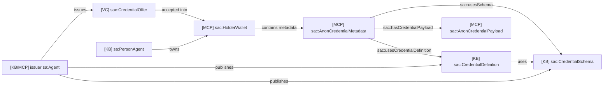
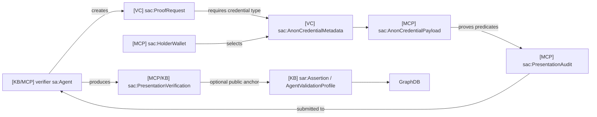
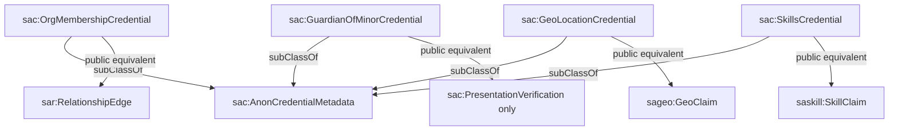

# 13 - Credentials And Proof Domain Ontology

## Scope

This domain covers AnonCreds schemas, credential definitions, holder wallets,
credential metadata, encrypted payloads, proof requests, proof audits, and
verification receipts.

Primary sources:

- `packages/sdk/src/credential-types.ts`
- `apps/person-mcp/src/ssi/*`
- `apps/verifier-mcp/src/verifiers/specs.ts`
- `apps/family-mcp`, `apps/geo-mcp`, `apps/skill-mcp`
- [08-anoncreds-sql-ontology-mapping.md](08-anoncreds-sql-ontology-mapping.md)

## T-Box Inheritance

```mermaid
flowchart TD
    ProvEntity["prov:Entity"]
    ProvActivity["prov:Activity"]
    PrivateEntity["[MCP] sap:PrivateEntity"]
    PrivateActivity["[MCP] sap:PrivateActivity"]
    Agent["[KB] sa:Agent"]

    Schema["[KB] sac:CredentialSchema"]
    CredDef["[KB] sac:CredentialDefinition"]
    Offer["[MCP/VC] sac:CredentialOffer"]
    IssuerState["[MCP] sac:CredentialIssuerState"]
    Issuance["[MCP] sac:CredentialIssuanceActivity"]

    Wallet["[MCP] sac:HolderWallet"]
    Metadata["[MCP/VC] sac:AnonCredentialMetadata"]
    Payload["[MCP/VC] sac:AnonCredentialPayload"]
    Nonce["[MCP] sac:WalletActionNonce"]
    ProofRequest["[MCP/VC] sac:ProofRequest"]
    ProofAudit["[MCP] sac:PresentationAudit"]
    Verification["[MCP/KB] sac:PresentationVerification"]
    TrustOverlap["[MCP] sac:TrustOverlapAudit"]

    OrgCred["[VC] sac:OrgMembershipCredential"]
    GuardianCred["[VC] sac:GuardianOfMinorCredential"]
    GeoCred["[VC] sac:GeoLocationCredential"]
    SkillCred["[VC] sac:SkillsCredential"]

    Schema --> ProvEntity
    CredDef --> ProvEntity
    Offer --> ProvEntity
    IssuerState --> PrivateEntity
    Issuance --> ProvActivity
    Wallet --> PrivateEntity
    Metadata --> PrivateEntity
    Payload --> PrivateEntity
    Nonce --> PrivateEntity
    ProofRequest --> ProvEntity
    ProofAudit --> PrivateActivity
    Verification --> ProvActivity
    TrustOverlap --> PrivateActivity

    OrgCred --> Metadata
    GuardianCred --> Metadata
    GeoCred --> Metadata
    SkillCred --> Metadata
    IssuerState --> Agent
```

## Credential Relationship Diagram

## Proof Relationship Diagram

## Credential Kind Diagram

## Store Mapping

| Store/source | Class |
| --- | --- |
| `person-mcp.holder_wallets` | `sac:HolderWallet` |
| `person-mcp.credential_metadata` | `sac:AnonCredentialMetadata` |
| `person-mcp` Askar vault | `sac:AnonCredentialPayload` |
| `person-mcp.ssi_proof_audit` | `sac:PresentationAudit` |
| `person-mcp.trust_overlap_audit` | `sac:TrustOverlapAudit` |
| issuer MCP private store | `sac:CredentialIssuerState` |
| `CredentialRegistry.sol` | `sac:CredentialSchema`, `sac:CredentialDefinition` |
| `AgentValidationProfile.sol` | public `sac:PresentationVerification` receipt |

## Description

The credential ontology has three privacy layers:

1. Public issuer metadata: schemas and credential definitions.
2. Private holder data: wallet, metadata, encrypted payload, link secret id.
3. Optional public receipt: verifier assertion that a proof satisfied a policy.

The credential payload itself should never appear in GraphDB.
