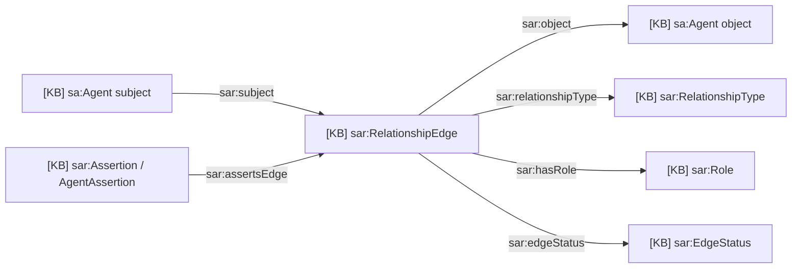
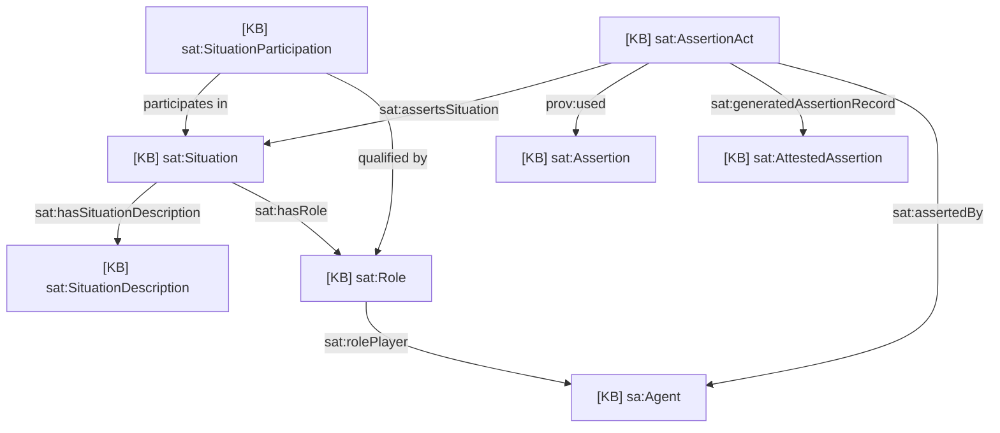
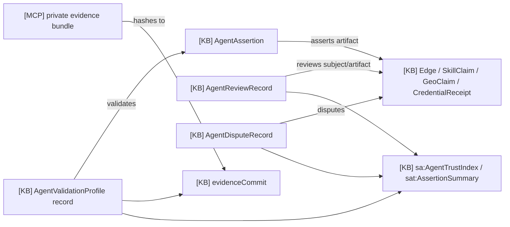

# 14 - Relationships And Trust Domain Ontology

## Scope

This domain covers relationship edges, roles, assertions, DnS trust situations,
validation profiles, reviews, disputes, and trust summaries.

Primary sources:

- `docs/ontology/tbox/relationships.ttl`
- `docs/ontology/tbox/roles.ttl`
- `docs/ontology/tbox/trust.ttl`
- `packages/contracts/src/AgentAssertion.sol`
- `packages/contracts/src/AgentValidationProfile.sol`
- `packages/contracts/src/AgentReviewRecord.sol`
- `packages/contracts/src/AgentDisputeRecord.sol`

## T-Box Inheritance

```mermaid
flowchart TD
    ProvEntity["prov:Entity"]
    ProvActivity["prov:Activity"]
    ProvPlan["prov:Plan"]
    PPlan["p-plan:Plan"]
    DulRole["dul:Role"]
    SkosConcept["skos:Concept"]

    Edge["[KB] sar:RelationshipEdge"]
    RelType["[KB] sar:RelationshipType"]
    Institutional["[KB] sar:InstitutionalRelationship"]
    Network["[KB] sar:NetworkRelationship"]
    Assurance["[KB] sar:AssuranceRelationship"]
    Capital["[KB] sar:CapitalRelationship"]
    Execution["[KB] sar:ExecutionRelationship"]
    Infrastructure["[KB] sar:InfrastructureRelationship"]
    Role["[KB] sar:Role"]
    EdgeStatus["[KB] sar:EdgeStatus"]
    SarAssertion["[KB] sar:Assertion"]

    Situation["[KB] sat:Situation"]
    SituationDesc["[KB] sat:SituationDescription"]
    SatAssertion["[KB] sat:Assertion"]
    Attested["[KB] sat:AttestedAssertion"]
    AssertionAct["[KB] sat:AssertionAct"]
    Attestation["[KB] sat:Attestation"]
    TrustSituation["[KB] sat:TrustSituation"]
    TrustAssertion["[KB] sat:TrustAssertion"]
    TrustAct["[KB] sat:TrustAssertionAct"]
    Summary["[KB] sat:AssertionSummary"]

    Validation["[KB] sa:ValidationRecord"]
    Review["[KB] sa:ReviewRecord"]
    Dispute["[KB] sa:DisputeRecord"]
    PrivateEvidence["[MCP] sap:PrivateEvidence"]

    Edge --> ProvEntity
    RelType --> DulRole
    Institutional --> RelType
    Network --> RelType
    Assurance --> RelType
    Capital --> RelType
    Execution --> RelType
    Infrastructure --> RelType
    Role --> DulRole
    EdgeStatus --> SkosConcept
    SarAssertion --> ProvActivity

    Situation --> ProvEntity
    SituationDesc --> ProvPlan
    SituationDesc --> PPlan
    SatAssertion --> ProvEntity
    Attested --> ProvEntity
    AssertionAct --> ProvActivity
    Attestation --> AssertionAct
    TrustSituation --> Situation
    TrustAssertion --> Attested
    TrustAct --> Attestation
    Summary --> ProvEntity

    Validation --> ProvEntity
    Review --> ProvEntity
    Dispute --> ProvEntity
    PrivateEvidence --> ProvEntity
```

## Relationship Edge Diagram

## DnS Trust Diagram

## Validation And Feedback Diagram

## Public And Private Mapping

| Artifact | Public class | Private/MCP companion |
| --- | --- | --- |
| Relationship membership | `sar:RelationshipEdge` | `org_members`, private org notes |
| Coaching relationship | `sar:RelationshipEdge` | `coaching_notes`, cross-delegation grants |
| Validation | `AgentValidationProfile`, `sat:VerificationTrustAssertion` | private evidence bundle |
| Review | `AgentReviewRecord`, `sat:ReputationTrustAssertion` | encrypted/private comments if needed |
| Dispute | `AgentDisputeRecord` | confidential investigation notes |
| Trust summary | `sat:AssertionSummary`, `sa:AgentTrustIndex` | none; computed from public facts |

## Description

Use relationship edges for directed public graph facts. Use DnS trust classes
when the system needs explicit context, provenance, and trust interpretation.
Private evidence and notes stay in MCPs; public records carry commitments,
scores, status, and provenance links.
