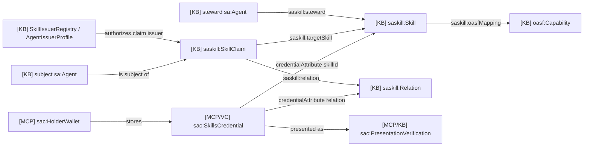
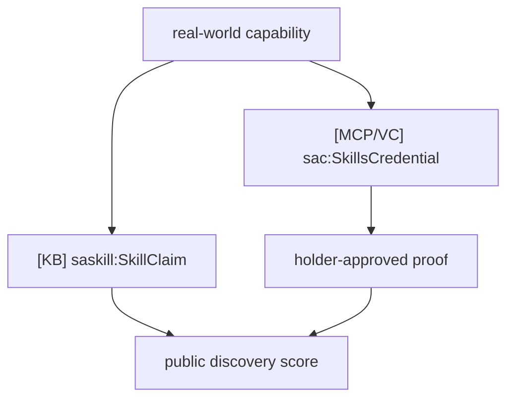

# 15 - Skills Domain Ontology

## Scope

This domain covers skill definitions, SKOS/OASF vocabulary, public skill
claims, skill issuers, held skill credentials, and skill verification.

Primary sources:

- `docs/ontology/tbox/skills.ttl`
- `docs/ontology/cbox/skill-vocabulary*.ttl`
- `packages/contracts/src/SkillDefinitionRegistry.sol`
- `packages/contracts/src/SkillIssuerRegistry.sol`
- `packages/contracts/src/AgentSkillRegistry.sol`
- `apps/skill-mcp/src/*`

## T-Box Inheritance

```mermaid
flowchart TD
    SkosConcept["skos:Concept"]
    Scheme["skos:ConceptScheme"]
    ProvEntity["prov:Entity"]
    Agent["[KB] sa:Agent"]
    Claim["[KB] sa:Claim"]
    PrivateEntity["[MCP] sap:PrivateEntity"]

    Skill["[KB] saskill:Skill"]
    OasfLeaf["[KB] saskill:OasfLeaf"]
    Domain["[KB] saskill:Domain"]
    Custom["[KB] saskill:Custom"]
    SkillScheme["[KB] saskill:SkillScheme"]
    Relation["[KB] saskill:Relation"]
    HasSkill["[KB] saskill:HasSkill"]
    Practices["[KB] saskill:PracticesSkill"]
    Certified["[KB] saskill:CertifiedIn"]
    Endorses["[KB] saskill:EndorsesSkill"]
    Mentors["[KB] saskill:MentorsIn"]
    CanTrain["[KB] saskill:CanTrainOthersIn"]
    SkillClaim["[KB] saskill:SkillClaim"]
    SkillCred["[VC/MCP] sac:SkillsCredential"]
    IssuerState["[MCP] sas:SkillCredentialIssuerState"]
    Verification["[MCP/KB] sac:PresentationVerification"]

    Skill --> SkosConcept
    OasfLeaf --> Skill
    Domain --> Skill
    Custom --> Skill
    SkillScheme --> Scheme
    Relation --> ProvEntity
    HasSkill --> Relation
    Practices --> Relation
    Certified --> Relation
    Endorses --> Relation
    Mentors --> Relation
    CanTrain --> Relation
    SkillClaim --> Claim
    SkillCred --> PrivateEntity
    IssuerState --> PrivateEntity
    Verification --> ProvEntity
    Agent --> ProvEntity
```

## Domain Relationship Diagram

## Public Claim Vs Private Credential

## Store Mapping

| Source | Ontology class |
| --- | --- |
| `SkillDefinitionRegistry` | `saskill:Skill` |
| `SkillIssuerRegistry` | issuer authorization for `saskill:SkillClaim` |
| `AgentSkillRegistry` | `saskill:SkillClaim` |
| `docs/ontology/cbox/skill-vocabulary*.ttl` | SKOS concept instances |
| `skill-mcp` private store | `sas:SkillCredentialIssuerState` |
| `person-mcp.credential_metadata` with `SkillsCredential` | `sac:SkillsCredential` |
| `verifier-mcp` skills request | `sac:ProofRequest` |

## Description

The skill domain has two parallel trust paths:

1. Public registry path: an agent publishes or receives a public
   `saskill:SkillClaim`.
2. Private credential path: an issuer gives the holder a `sac:SkillsCredential`
   that can later be selectively presented.

Discovery should rank from public claims first, then holder-approved private
proof receipts when available.
