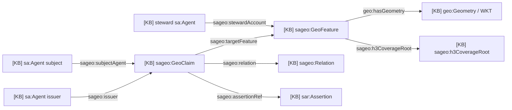
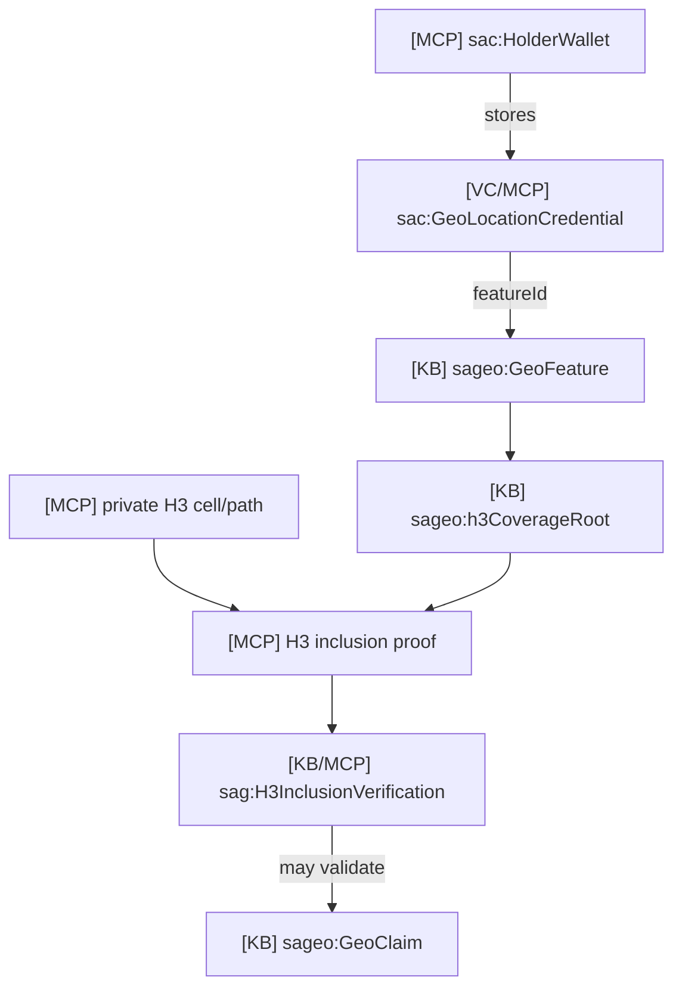

# 16 - Geo Domain Ontology

## Scope

This domain covers geographic features, public geo claims, H3 coverage roots,
H3 inclusion proofs, private location credentials, and geo verification.

Primary sources:

- `docs/ontology/tbox/geo.ttl`
- `packages/contracts/src/GeoFeatureRegistry.sol`
- `packages/contracts/src/GeoClaimRegistry.sol`
- `packages/contracts/src/zk/GeoH3InclusionVerifier.sol`
- `apps/geo-mcp/src/*`

## T-Box Inheritance

```mermaid
flowchart TD
    GeoFeatureBase["geo:Feature"]
    ProvEntity["prov:Entity"]
    PrivateEntity["[MCP] sap:PrivateEntity"]
    VerificationBase["[MCP/KB] sac:PresentationVerification"]

    Feature["[KB] sageo:GeoFeature"]
    Planet["[KB] sageo:Planet"]
    Country["[KB] sageo:Country"]
    State["[KB] sageo:State"]
    County["[KB] sageo:County"]
    City["[KB] sageo:Municipality"]
    Neighborhood["[KB] sageo:Neighborhood"]
    Zip["[KB] sageo:ZipCode"]
    Claim["[KB] sageo:GeoClaim"]
    Relation["[KB] sageo:Relation"]
    Visibility["[KB] sageo:Visibility"]
    Credential["[VC/MCP] sac:GeoLocationCredential"]
    IssuerState["[MCP] sag:GeoCredentialIssuerState"]
    H3Verification["[KB/MCP] sag:H3InclusionVerification"]

    Feature --> GeoFeatureBase
    Planet --> Feature
    Country --> Feature
    State --> Feature
    County --> Feature
    City --> Feature
    Neighborhood --> Feature
    Zip --> Feature
    Claim --> ProvEntity
    Relation --> ProvEntity
    Visibility --> ProvEntity
    Credential --> PrivateEntity
    IssuerState --> PrivateEntity
    H3Verification --> VerificationBase
```

## Geo Feature And Claim Diagram

## Private Credential And H3 Proof Diagram

## Relation Vocabulary

| Relation | Meaning |
| --- | --- |
| `sageo:residentOf` | Subject resides in the feature |
| `sageo:operatesIn` | Subject operates in the feature |
| `sageo:servesWithin` | Subject delivers service inside the feature |
| `sageo:licensedIn` | Subject has a license valid in the feature |
| `sageo:validatedPresenceIn` | Validator attested presence |
| `sageo:stewardOf` | Subject maintains the feature |
| `sageo:originIn` | Subject originated in the feature |
| `sageo:completedTaskIn` | Subject completed task in the feature |

## Store Mapping

| Source | Ontology class |
| --- | --- |
| `GeoFeatureRegistry` | `sageo:GeoFeature` |
| `GeoClaimRegistry` | `sageo:GeoClaim` |
| `GeoH3InclusionVerifier` | `sag:H3InclusionVerification` |
| `geo-mcp` issuer state | `sag:GeoCredentialIssuerState` |
| `person-mcp.credential_metadata` with `GeoLocationCredential` | `sac:GeoLocationCredential` |
| `verifier-mcp` geo request | `sac:ProofRequest` |

## Description

The geo domain has three tiers:

1. Public feature graph: stable feature IDs, geometry hash, H3 coverage root.
2. Public or coarse claims: agent-to-feature assertions such as `operatesIn`.
3. Private location proof: AnonCreds or H3 proof used only when the holder
   approves a verifier request.

The private credential and H3 witness data stay outside GraphDB.
