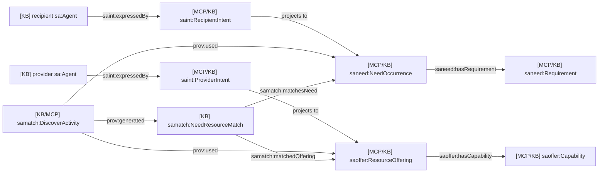
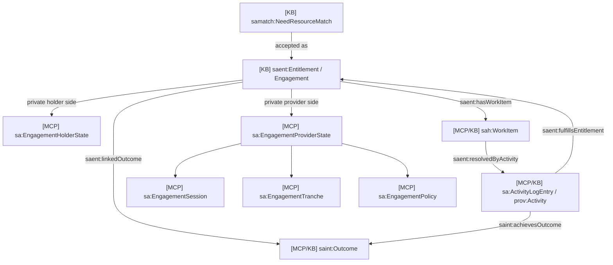
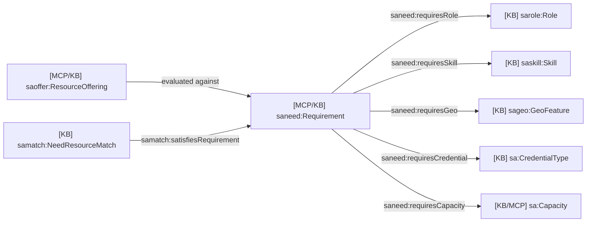

# 17 - Intent, Marketplace, And Work Domain Ontology

## Scope

This domain covers BDI intent, needs, offerings, resources, matches,
entitlements/engagements, work items, activities, and outcomes.

Primary sources:

- `docs/ontology/tbox/intents.ttl`
- `docs/ontology/tbox/needs.ttl`
- `docs/ontology/tbox/resources.ttl`
- `docs/ontology/tbox/matches.ttl`
- `docs/ontology/tbox/entitlements.ttl`
- `docs/ontology/tbox/marketplace-lifecycle.ttl`
- `apps/person-mcp/src/db/schema.ts`
- `apps/org-mcp/src/db/schema.ts`

## T-Box Inheritance

```mermaid
flowchart TD
    ProvEntity["prov:Entity"]
    ProvActivity["prov:Activity"]
    ProvPlan["prov:Plan"]
    SkosConcept["skos:Concept"]
    DulSituation["dul:Situation"]
    DulDescription["dul:Description"]
    UfoIntent["ufo:Intention"]
    UfoDesire["ufo:Desire"]
    UfoGoal["ufo:Goal"]

    Intent["[MCP/KB] saint:Intent"]
    Recipient["[MCP/KB] saint:RecipientIntent"]
    Provider["[MCP/KB] saint:ProviderIntent"]
    Direction["[KB] saint:Direction"]
    Belief["[MCP/KB] saint:Belief"]
    Desire["[MCP] saint:Desire"]
    Goal["[MCP] saint:Goal"]
    Outcome["[MCP/KB] saint:Outcome"]
    Orchestration["[MCP] saint:OrchestrationPlan"]
    IntentMatch["[KB] saint:IntentMatch"]

    NeedType["[KB] saneed:NeedType"]
    Need["[MCP/KB] saneed:Need"]
    NeedOccurrence["[MCP/KB] saneed:NeedOccurrence"]
    Requirement["[MCP/KB] saneed:Requirement"]

    ResourceType["[KB] saoffer:ResourceType"]
    Resource["[MCP/KB] saoffer:Resource"]
    Offering["[MCP/KB] saoffer:ResourceOffering"]
    Capability["[MCP/KB] saoffer:Capability"]

    Match["[KB] samatch:NeedResourceMatch"]
    Discover["[KB/MCP] samatch:DiscoverActivity"]
    Fulfill["[MCP/KB] samatch:FulfillmentActivity"]
    RoleAssignment["[MCP/KB] samatch:RoleAssignment"]

    Entitlement["[KB] saent:Entitlement"]
    WorkItem["[MCP/KB] saent:FulfillmentWorkItem / sah:WorkItem"]
    FulfillmentActivity["[MCP/KB] saent:FulfillmentActivity"]
    HolderState["[MCP] sa:EngagementHolderState"]
    ProviderState["[MCP] sa:EngagementProviderState"]
    Session["[MCP] sa:EngagementSession"]
    Tranche["[MCP] sa:EngagementTranche"]
    Policy["[MCP] sa:EngagementPolicy"]

    Intent --> UfoIntent
    Recipient --> Intent
    Provider --> Intent
    Direction --> SkosConcept
    Belief --> ProvEntity
    Belief --> DulDescription
    Desire --> UfoDesire
    Goal --> UfoGoal
    Outcome --> ProvEntity
    Outcome --> DulSituation
    Orchestration --> ProvPlan
    IntentMatch --> DulSituation

    NeedType --> SkosConcept
    Need --> DulDescription
    Need --> ProvEntity
    NeedOccurrence --> DulSituation
    NeedOccurrence --> ProvEntity
    Requirement --> DulDescription
    Requirement --> ProvEntity

    ResourceType --> SkosConcept
    Resource --> ProvEntity
    Offering --> DulSituation
    Offering --> ProvEntity
    Capability --> ProvEntity

    Match --> DulSituation
    Match --> ProvEntity
    Discover --> ProvActivity
    Fulfill --> ProvActivity
    RoleAssignment --> DulSituation
    RoleAssignment --> ProvEntity

    Entitlement --> ProvEntity
    WorkItem --> ProvEntity
    FulfillmentActivity --> ProvActivity
    HolderState --> ProvEntity
    ProviderState --> ProvEntity
    Session --> ProvActivity
    Tranche --> ProvEntity
    Policy --> ProvPlan
```

## Intent-To-Match Relationship Diagram

## Match-To-Work Relationship Diagram

## Requirement Fit Diagram

## MCP And KB Mapping

| Concept | KB/public class | MCP/private row |
| --- | --- | --- |
| Intent | `saint:Intent`, `saint:RecipientIntent`, `saint:ProviderIntent` | `person-mcp.intents`, `org-mcp.org_intents` |
| Need | `saneed:NeedOccurrence` | `person-mcp.needs`, `org-mcp.org_needs` |
| Offering | `saoffer:ResourceOffering` | `person-mcp.offerings`, `org-mcp.org_offerings` |
| Outcome | `saint:Outcome` | `person-mcp.outcomes`, `org-mcp.org_outcomes` |
| Match | `samatch:NeedResourceMatch` | web transitional match rows, future public/on-chain record |
| Engagement | `saent:Entitlement` | per-side MCP state rows |
| Work item | `saent:FulfillmentWorkItem`, `sah:WorkItem` | `work_items`, `org_work_items` |
| Activity | `prov:Activity`, `saent:FulfillmentActivity` | `activity_log_entries`, `org_activity_log_entries` |

## Description

This domain connects private work management to public discovery:

1. MCPs own full private intent/need/offering/work rows.
2. Public or coarse rows can be anchored as on-chain assertions.
3. GraphDB mirrors the public assertions and computes discovery candidates.
4. Accepted matches become entitlements/engagements with per-side private MCP
   state.
