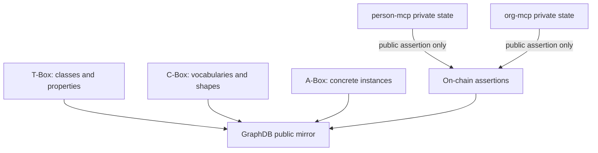

# Ontology Documentation

This folder explains the Smart Agent ontology in human terms. The Turtle
source of truth remains `docs/ontology/`; these documents explain the
concepts, diagrams, and example A-Box data that make the ontology easier to
use.

## Reading Order

| # | Document | Purpose |
| --- | --- | --- |
| 1 | [01-layering-and-source-of-truth.md](01-layering-and-source-of-truth.md) | T-Box, C-Box, A-Box, GraphDB named graphs, and source-of-truth rules |
| 2 | [02-agents-identities-and-profiles.md](02-agents-identities-and-profiles.md) | Agent, identity, smart account, profile, and owner routing |
| 3 | [03-relationships-roles-and-assertions.md](03-relationships-roles-and-assertions.md) | Directed relationship edges, roles, assertions, and validation |
| 4 | [04-intents-work-items-and-activities.md](04-intents-work-items-and-activities.md) | Intent, need, offering, work item, activity, outcome, and work mode |
| 5 | [05-graphdb-public-projection.md](05-graphdb-public-projection.md) | How public facts reach GraphDB and what never appears there |

## Source Files

| Layer | Location | Meaning |
| --- | --- | --- |
| T-Box | `docs/ontology/tbox/*.ttl` | Domain-neutral classes and properties |
| C-Box | `docs/ontology/cbox/*.ttl` | Controlled vocabularies, enumerations, SHACL shapes |
| A-Box | `docs/ontology/abox/*.ttl` and GraphDB runtime data | Concrete instances |

## One-Sentence Model

Smart Agent uses on-chain assertions as the public trust spine, MCPs as the
private owner-routed data stores, and GraphDB as a read-only knowledge base
mirroring only public on-chain facts.

